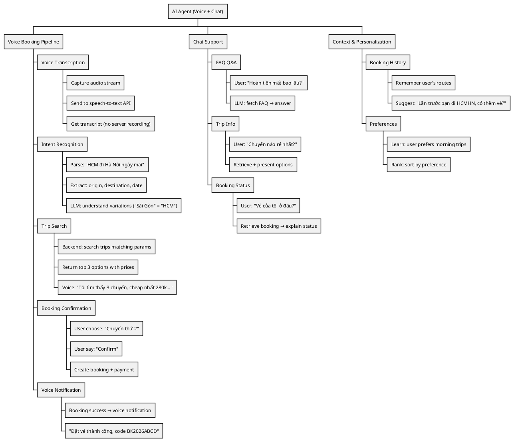
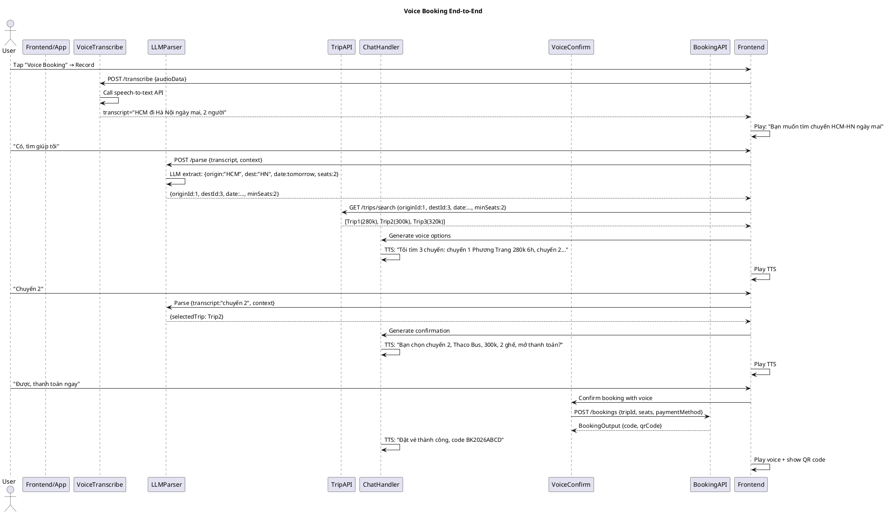
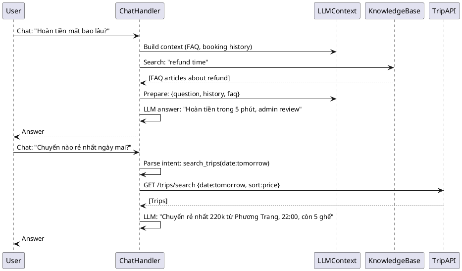
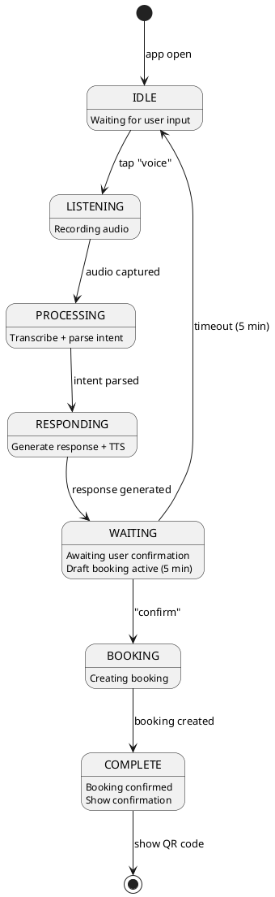

---
tags:
  - srs
  - ai-agent
  - llm
  - voice
  - chat
  - nlp
  - conversation
created: 2026-04-06
updated: 2026-04-06
---

# TÀI LIỆU ĐẶC TẢ VÀ THIẾT KẾ MODULE: AI AGENT (TRỢ LÝ AI)

> [!abstract] TỔNG QUAN
> Module AI Agent là **conversational AI layer**, hỗ trợ user qua:
> - **Voice booking**: "Tôi muốn đặt vé HCM → Hà Nội ngày mai"
> - **Chat support**: Trả lời câu hỏi về chuyến, giá, chính sách
> - **Voice transcription**: Convert speech → text (không ghi âm server)
> - **LLM integration**: OpenAI/Claude để parse lệnh + tạo booking
> - **Context awareness**: Nhớ booking trước, suggest tiếp theo
>
> Core principle: **"AI supports, human validates"** — AI draft booking, user confirm.

---

## 1. ĐẶC TẢ YÊU CẦU (SRS)

### 1.1. Bối cảnh nghiệp vụ

Khách hàng kỳ vọng:
1. **Nói lệnh voice**: Không cần click/type trên app
2. **Chat hỏi đáp**: Tính năng chuyến, hoàn tiền policy
3. **Smart suggestions**: Suggest trip dựa trên booking history
4. **Voice confirmation**: Xác nhận booking qua lệnh voice

### 1.2. Danh sách yêu cầu chức năng

| ID | Chức năng | Mô tả | Ưu tiên |
|----|-----------|-------|---------|
| AI-01 | Transcribe voice | Audio → text (ElevenLabs/Google) | P1 |
| AI-02 | Parse booking intent | Text → extract trip, seats, paymentMethod | P1 |
| AI-03 | Create draft booking | LLM → generate booking params | P1 |
| AI-04 | Chat Q&A | User question → LLM answer | P2 |
| AI-05 | Voice confirmation | "Confirm" audio → apply booking | P1 |
| AI-06 | Booking history context | Remember previous bookings | P2 |
| AI-07 | Voice refund request | "Refund vé BK2026ABCD" → process | P2 |
| AI-08 | Multi-turn conversation | Keep context across turns | P2 |

### 1.3. WBS



---

## 2. ARCHITECTURE VÀ DATA FLOW

### 2.1. Voice Booking Pipeline (Sequence)



### 2.2. Chat Q&A Pipeline



---

## 3. THIẾT KẾ COMPONENTS

### 3.1. Voice Transcription

**Technology**: Whisper API (OpenAI) / Google Cloud Speech-to-Text
- **No server recording**: Audio → API → transcript (không lưu audio trên server)
- **Latency**: < 2 sec for 10 sec audio
- **Accuracy**: 99%+ for Vietnamese

**Implementation**:
```go
type VoiceTranscriber interface {
    Transcribe(ctx, audioBytes) (transcript string, error)
    SupportLanguages() []string  // vi, en, etc
}
```

### 3.2. LLM Parser (Intent Recognition)

**Technology**: OpenAI GPT-4 or Claude
- **Parse voice text** → extract trip parameters
- **Handle variations**:
  - "HCM" = "TP HCM" = "Sài Gòn"
  - "mai" = "tomorrow" = "ngày mai"
  - "2 người" = "2 ghế"

**Prompt Template**:
```
Extract booking parameters from user speech:
"HCM đi Hà Nội ngày mai, 2 người, thanh toán online"

Expected output JSON:
{
    "origin": "Hồ Chí Minh",
    "destination": "Hà Nội",
    "date": "2026-04-07",
    "seats": 2,
    "paymentMethod": "bank_transfer",
    "confidence": 0.95
}
```

### 3.3. Text-to-Speech (Voice Response)

**Technology**: Google TTS / Azure Cognitive Services
- **Language**: Vietnamese (natural, female voice)
- **Speed**: Normal (1.0x)
- **Latency**: < 1 sec per sentence

```go
type TextToSpeech interface {
    Convert(ctx, text string, language string) (audioBytes []byte, error)
}
```

### 3.4. Chat Context Manager

**State Machine**:
```
IDLE → LISTENING → PROCESSING → RESPONDING → WAITING → ...

Context:
  - currentBooking: draft booking params
  - history: [previous messages]
  - userProfile: preferences, bookings
  - conversationTurn: 1, 2, 3, ...
```

---

## 4. DATABASE SCHEMA

### 4.1. Conversation History Table

| Trường | Kiểu | Mô tả |
|--------|------|-------|
| `id` | UUID | PK |
| `user_id` | BIGINT | FK user |
| `conversation_id` | UUID | Group related messages |
| `type` | VARCHAR | voice/chat |
| `user_input` | TEXT | User transcript |
| `ai_response` | TEXT | AI answer |
| `intent` | VARCHAR | search_trips, create_booking, faq, ... |
| `metadata` | JSONB | {originId, destId, selectedTrip, ...} |
| `created_at` | TIMESTAMPTZ | Timestamp |

### 4.2. Draft Booking Table

| Trường | Kiểu | Mô tả |
|--------|------|-------|
| `id` | UUID | PK |
| `user_id` | BIGINT | FK user |
| `conversation_id` | UUID | FK conversation |
| `trip_id` | BIGINT | Trip selected |
| `seats` | TEXT[] | Proposed seats |
| `status` | VARCHAR | draft/confirmed/completed |
| `expires_at` | TIMESTAMPTZ | Draft valid for 5 min |

---

## 5. API ENDPOINTS

### 5.1. Voice Endpoints

| HTTP | Endpoint | Purpose |
|------|----------|---------|
| **POST** | `/api/v1/ai/transcribe` | Transcribe audio |
| **POST** | `/api/v1/ai/parse` | Parse intent from text |
| **POST** | `/api/v1/ai/book/confirm` | Voice confirmation |
| **GET** | `/api/v1/ai/tts/:id` | Get TTS audio for response |

### 5.2. Chat Endpoints

| HTTP | Endpoint | Purpose |
|------|----------|---------|
| **POST** | `/api/v1/ai/chat` | Send chat message |
| **GET** | `/api/v1/ai/chat/history` | Conversation history |
| **DELETE** | `/api/v1/ai/chat/:id` | Delete conversation |

### 5.3. Request/Response Examples

**TranscribeRequest**:
```json
{
    "audioData": "base64_encoded_audio",
    "audioFormat": "wav",
    "language": "vi-VN",
    "duration": 8.5
}
```

**ParseIntentRequest**:
```json
{
    "transcript": "HCM đi Hà Nội ngày mai, 2 người",
    "context": {
        "userId": 100,
        "lastBooking": "HCM-HN, 2023-04-05"
    }
}
```

**ParseIntentResponse**:
```json
{
    "intent": "search_trips",
    "origin": "Hồ Chí Minh",
    "originId": 1,
    "destination": "Hà Nội",
    "destinationId": 3,
    "date": "2026-04-07",
    "seats": 2,
    "paymentMethod": "bank_transfer",
    "confidence": 0.95,
    "draftBookingId": "550e8400-e29b-41d4"
}
```

---

## 6. CONVERSATION STATE MACHINE

### 6.1. States & Transitions



---

## 7. INTENT RECOGNITION

### 7.1. Supported Intents

| Intent | Example | Action |
|--------|---------|--------|
| `search_trips` | "HCM đi HN ngày mai" | Search + show options |
| `create_booking` | "Đặt vé chuyến thứ 2" | Show confirmation |
| `cancel_booking` | "Hủy vé BK2026ABCD" | Confirm cancel |
| `request_refund` | "Refund vé này" | Initiate refund |
| `faq` | "Hoàn tiền mất bao lâu?" | LLM answer from KB |
| `booking_status` | "Vé của tôi ở đâu?" | Retrieve booking |
| `price_check` | "Chuyến nào rẻ nhất?" | Search + sort by price |

### 7.2. Named Entity Recognition (NER)

```
Input: "HCM đi Hà Nội ngày mai, 2 người, thanh toán bằng thẻ"

Entities extracted:
  - Location (origin): "HCM" → LocationID=1
  - Location (destination): "Hà Nội" → LocationID=3
  - Date: "ngày mai" → tomorrow
  - Quantity: "2 người" → 2 seats
  - PaymentMethod: "thẻ" → visa
```

---

## 8. CONTEXT AWARENESS

### 8.1. Booking History Integration

```
User: "Tôi hay đi HCM-HN"
System:
  1. Query booking history: HCM → HN (5 bookings)
  2. Average: Thu-Fri (prefer evening)
  3. Preferred provider: Phương Trang
  4. When search: rank Phương Trang trips first
```

### 8.2. Personalization Rules

```
if user.lastBooking in [HCM-HN]:
    suggest: "Bạn muốn đặt HCM-HN lần nữa?"
    
if user.prefers_evening_trips:
    sort results: evening trips first
    
if user.bookings_count > 10:
    offer: "Subscribe 10-trip package, save 15%"
```

---

## 9. ERROR HANDLING & FALLBACK

### 9.1. Common Failures

| Error | Fallback |
|-------|----------|
| Low transcription confidence | "Tôi không hiểu, bạn nói lại?" |
| Ambiguous intent | "Bạn muốn tìm chuyến hay đặt vé?" |
| No trips found | "Không tìm thấy chuyến, hãy thử ngày khác" |
| Booking creation failed | "Xin lỗi, hệ thống bận, thử lại sau" |

### 9.2. Re-attempt Strategy

```
Attempt 1: Clarify with user
Attempt 2: Show options (search results)
Attempt 3: Fallback to manual booking (UI)
```

---

## 10. PRIVACY & SECURITY

### 10.1. Audio Privacy

```
- Audio NOT saved on server
- Transcribed text saved (for audit)
- User can delete conversation history
- Comply GDPR/CCPA: right to deletion
```

### 10.2. LLM Prompt Injection Protection

```
Don't pass user input directly to LLM
Always sanitize + validate:
  1. Length limit (1000 chars)
  2. No SQL/code injection patterns
  3. Rate limit per user (1000 requests/day)
```

---

## 11. PERFORMANCE & LATENCY

### 11.1. Target Latencies

| Component | Target | Notes |
|-----------|--------|-------|
| Audio capture | < 100ms | Frontend |
| Transcription | < 2s | API call |
| Intent parsing | < 500ms | LLM call |
| TTS generation | < 1s | API call |
| Trip search | < 1s | Backend query |
| **Total E2E** | **< 5s** | User doesn't wait |

### 11.2. Caching Strategy

```
Cache: "HCM-HN-2026-04-06" trips for 5 min
Benefits: Fast response for repeat queries
Invalidation: new booking → invalidate
```

---

## 12. MONITORING & ANALYTICS

### 12.1. Metrics

```
- Voice transcription success rate (target > 95%)
- Intent recognition accuracy (target > 90%)
- Booking completion rate via voice (target > 80%)
- Average conversation turns (target < 5)
- User satisfaction (NPS)
```

### 12.2. Logging

```
Log (with correlationId):
  - Transcript (for quality)
  - Parsed intent + confidence
  - Trip search params + results
  - Booking creation (success/failure)
  - User feedback (rating)
```

---

## 13. FUTURE ENHANCEMENTS

| Feature | Priority | Impact |
|---------|----------|--------|
| Multi-language support | P2 | Global reach |
| Sentiment analysis | P3 | Detect user frustration |
| Booking prediction | P2 | Proactive suggestions |
| Voice authentication | P2 | Security |
| Real-time trip recommendation | P2 | Personalization |
| Integration with loyalty program | P2 | Retention |

---

## 14. INTEGRATION WITH OTHER MODULES

### 14.1. Booking Module

```
AI Agent → Voice input → BookingAPI.CreateBooking()
Booking Module → Status changes → Voice notification
```

### 14.2. Trip Module

```
AI Agent → Search query → TripAPI.Search()
Trip Module → Return trips → Voice narration
```

### 14.3. Payment Module

```
AI Agent → "Confirm booking" → PaymentAPI.CreatePaymentLink()
Payment Module → Webhook → Voice notification "Payment success"
```

---

## 15. COMPLIANCE & LOCALIZATION

### 15.1. Vietnamese Localization

```
- Respect Vietnamese pronunciation
- Handle variations: "HCM" = "TP HCM" = "Sài Gòn"
- Time format: "ngày mai" = tomorrow in VN timezone
- Currency: VND (no conversion)
```

### 15.2. Data Protection

```
- GDPR: European users
- CCPA: California users
- Local VN laws: PDP Law
- User consent for voice recording
```

---

**Document Version**: 2.0 (Full Voice + Chat AI with LLM Integration)
**Last Updated**: 2026-04-06
**Status**: ✅ COMPLETE - Ready for Development
