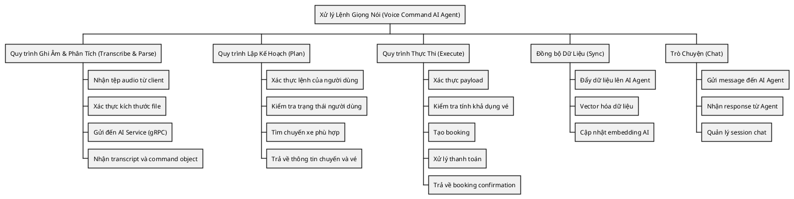
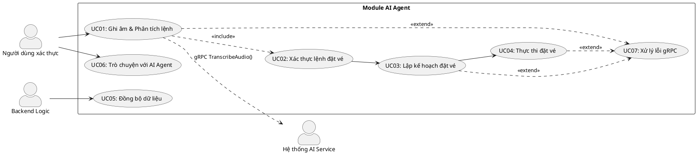
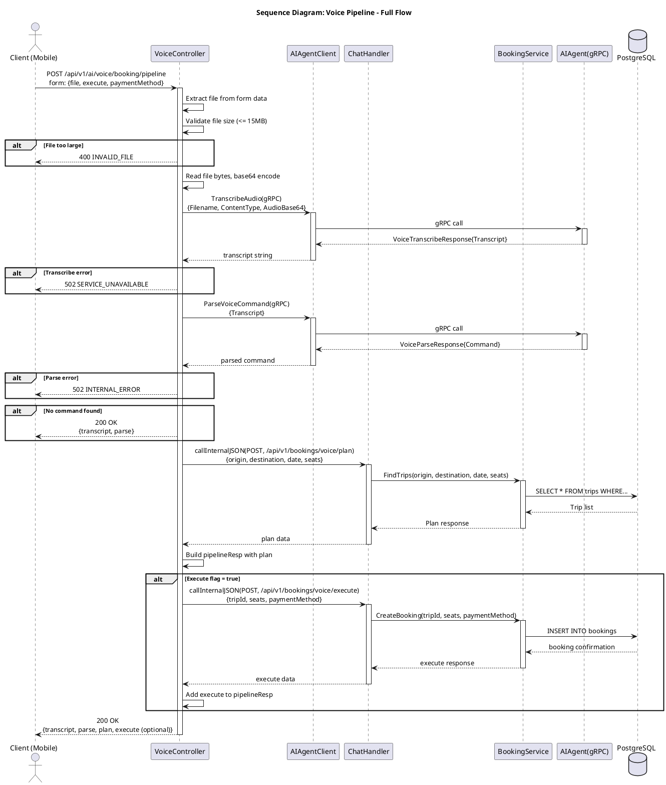
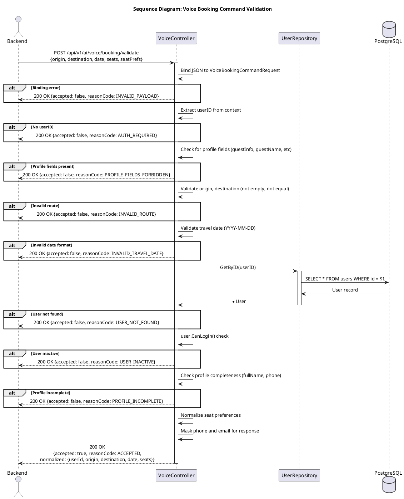
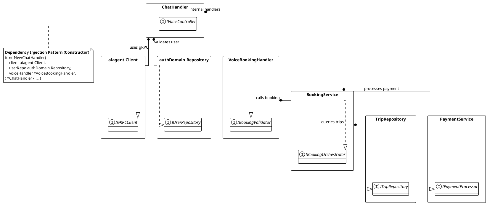
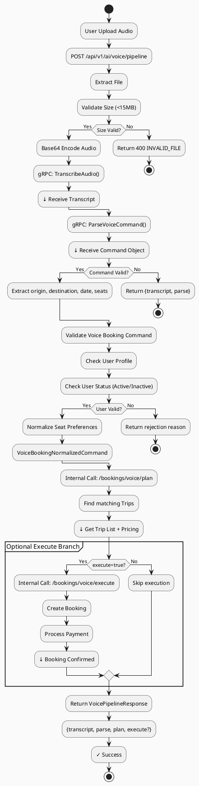

---
tags:
  - srs
  - system-design
  - ai-agent
  - voice-booking
  - grpc
created: 2026-03-29
updated: 2026-03-29
---

# TÀI LIỆU ĐẶC TẢ VÀ THIẾT KẾ MODULE: AI AGENT (XỬ LÝ LỆNH BẰNG GIỌNG NÓI)

> [!abstract] TỔNG QUAN
> Module AI Agent đảm nhận chức năng tích hợp trí tuệ nhân tạo vào hệ thống đặt vé xe buýt. Module này cung cấp dịch vụ xử lý đặt vé thông qua lệnh bằng giọng nói, bao gồm: ghi âm (transcribe), phân tích lệnh (parse), lập kế hoạch (plan), và thực thi (execute). Hệ thống sử dụng gRPC để giao tiếp với dịch vụ AI độc lập, đảm bảo tính khả dụng cao và độc lập về module.

---

## 1. ĐẶC TẢ YÊU CẦU (SOFTWARE REQUIREMENT SPECIFICATION)

### 1.1. Danh sách yêu cầu chức năng (Functional Requirements)

| ID | Tên chức năng | Mức độ ưu tiên | Độ phức tạp | Tác nhân (Actor) |
|-----|---------------|----------------|-------------|------------------|
| AIAGENT-01 | Ghi âm lệnh bằng giọng nói | P1 | M | Authenticated User |
| AIAGENT-02 | Phân tích lệnh giọng nói | P1 | H | System (AI Service) |
| AIAGENT-03 | Lập kế hoạch đặt vé từ lệnh | P1 | H | System (Backend Logic) |
| AIAGENT-04 | Thực thi đặt vé tự động | P2 | H | System (Backend Logic) |
| AIAGENT-05 | Xác thực lệnh đặt vé | P1 | M | System (Validation Engine) |
| AIAGENT-06 | Đồng bộ dữ liệu với AI Agent | P2 | M | System |
| AIAGENT-07 | Trò chuyện với AI Agent | P3 | M | Authenticated User |

### 1.2. Biểu đồ phân cấp chức năng (Functional Hierarchy)



---

## 2. BIỂU ĐỒ USE CASE VÀ ĐẶC TẢ (USE CASE SPECIFICATIONS)

### 2.1. Biểu đồ Use Case



### 2.2. Đặc tả Use Case chi tiết: Ghi âm & Phân tích lệnh (Transcribe & Parse)

> [!info] Thông tin Use Case
> **Use Case ID:** UC-AIAGENT-01
> **Use Case Name:** Ghi âm & Phân tích lệnh bằng giọng nói (Transcribe & Parse)
> **Actor:** Authenticated User
> **Trigger:** Người dùng tải lên tệp audio và gửi yêu cầu xử lý

> [!note] Điều kiện tiên quyết (Pre-conditions)
> 1. Người dùng đã xác thực (có Access Token hợp lệ)
> 2. Tệp audio có định dạng hợp lệ (webm, mp3, wav, etc.)
> 3. Kích thước tệp <= 15MB
> 4. AI Service có sẵn (gRPC connection hoạt động)

> [!success] Điều kiện hậu kỳ (Post-conditions)
> 1. Transcript được trích xuất từ audio
> 2. Lệnh được phân tích thành Command object
> 3. Kết quả được trả về cho client

**Luồng xử lý chính (Normal Flow):**

| Bước | Tác nhân | Hành động |
|------|----------|-----------|
| 1 | Client | Gửi POST request `/api/v1/ai/voice/booking/transcribe` với file audio |
| 2 | Controller | Trích xuất file từ form data |
| 3 | Controller | Xác thực: kích thước file, content-type |
| 4 | Controller | Đọc file bytes, mã hóa base64 |
| 5 | Controller | Gọi `client.TranscribeAudio(gRPC)` với VoiceTranscribeRequest |
| 6 | AI Service | Xử lý audio, trả về Transcript |
| 7 | Controller | Nhận transcript, gửi POST đến `ParseVoiceCommand(gRPC)` |
| 8 | AI Service | Phân tích lệnh, trả về Command object |
| 9 | Controller | Trả về VoiceTranscribeResponse JSON |

**Luồng thay thế (Alternative Flow):**

| Flow ID | Điều kiện | Xử lý |
|---------|-----------|-------|
| AF-1 | Tệp không được cung cấp | Bước 2: Trả về 400 `REQUIRED_FIELD` |
| AF-2 | Kích thước tệp quá lớn | Bước 3: Trả về 400 `INVALID_FILE` |
| AF-3 | Content-type không xác định | Bước 4: Mặc định sử dụng `audio/webm` |
| AF-4 | AI Service không sẵn có | Bước 5: Trả về 503 `SERVICE_UNAVAILABLE` |

**Ngoại lệ (Exceptions):**

| Exception | Điều kiện | gRPC Code | HTTP Status | Error Code |
|-----------|-----------|-----------|-------------|------------|
| ErrVoiceTranscribeUnavailable | AI Speech-to-Text không hỗ trợ | UNIMPLEMENTED | 503 | TRANSCRIBE_UNAVAILABLE |
| ErrVoiceAudioInvalid | Audio không hợp lệ hoặc bị hỏng | INVALID_ARGUMENT | 400 | INVALID_AUDIO |
| ErrAIServiceUnavailable | AI Service không sẵn có | UNAVAILABLE | 503 | SERVICE_UNAVAILABLE |

### 2.3. Đặc tả Use Case chi tiết: Xác thực lệnh đặt vé (Validate Voice Booking)

> [!info] Thông tin Use Case
> **Use Case ID:** UC-AIAGENT-02
> **Use Case Name:** Xác thực lệnh đặt vé từ AI
> **Actor:** Authenticated User (và Backend)
> **Trigger:** Sau khi parse xong, cần xác thực tính hợp lệ của lệnh

> [!note] Điều kiện tiên quyết (Pre-conditions)
> 1. Có transcript hợp lệ từ bước transcribe
> 2. Có Command object từ bước parse
> 3. Người dùng đã xác thực
> 4. User repository khả dụng

> [!success] Điều kiện hậu kỳ (Post-conditions)
> 1. Lệnh được xác thực hợp lệ HOẶC bị từ chối
> 2. Nếu hợp lệ: Normalized command được tạo
> 3. Thông tin người dùng được kiểm tra (profile completeness)

**Luồng xử lý chính (Normal Flow):**

| Bước | Tác nhân | Hành động |
|------|----------|-----------|
| 1 | Client/Backend | Gửi POST request `/api/v1/ai/voice/booking/validate` với VoiceBookingCommandRequest |
| 2 | Controller | Bind JSON vào VoiceBookingCommandRequest |
| 3 | Controller | Kiểm tra User ID từ context |
| 4 | Controller | Xác thực: Các trường bắt buộc (origin, destination, date) |
| 5 | Controller | Xác thực: Origin ≠ Destination |
| 6 | Controller | Xác thực: Travel Date có định dạng YYYY-MM-DD |
| 7 | Controller | Gọi `userRepo.GetByID(userID)` để lấy thông tin người dùng |
| 8 | Controller | Xác thực: user.CanLogin() (tài khoản hoạt động) |
| 9 | Controller | Xác thực: Profile đầy đủ (full_name, phone) |
| 10 | Controller | Normalize seat preferences (uppercase, loại bỏ copy) |
| 11 | Controller | Trả về VoiceBookingValidationResponse (accepted=true) |

**Luồng từ chối (Rejection Flow):**

| Rejection Reason | Điều kiện | Response Code | Message |
|------------------|-----------|---------------|---------|
| VOICE_BOOKING_INVALID_PAYLOAD | JSON binding lỗi | 200 | "Invalid voice booking payload" |
| VOICE_BOOKING_AUTH_REQUIRED | Không có userID | 200 | "Authentication is required" |
| VOICE_BOOKING_PROFILE_FIELDS_FORBIDDEN | Có guestInfo, guestName, etc. | 200 | "Profile fields are not allowed" |
| VOICE_BOOKING_INVALID_ROUTE | Origin == Destination hoặc trống | 200 | "Origin and destination must be different" |
| VOICE_BOOKING_INVALID_TRAVEL_DATE | Date format sai | 200 | "Travel date must use YYYY-MM-DD" |
| VOICE_BOOKING_USER_NOT_FOUND | User không tồn tại | 200 | "Registered user not found" |
| VOICE_BOOKING_USER_INACTIVE | user.CanLogin() thất bại | 200 | "User account is inactive" |
| VOICE_BOOKING_PROFILE_INCOMPLETE | Missing full_name hoặc phone | 200 | "User profile is incomplete" |
| VOICE_BOOKING_ACCEPTED | Tất cả xác thực pass | 200 | "Voice command accepted" |

### 2.4. Đặc tả Use Case chi tiết: Lập kế hoạch đặt vé (Plan)

> [!info] Thông tin Use Case
> **Use Case ID:** UC-AIAGENT-03
> **Use Case Name:** Lập kế hoạch đặt vé (Plan)
> **Actor:** Backend (AI Agent orchestration)
> **Trigger:** Sau khi validate pass, tìm chuyến xe phù hợp

> [!note] Điều kiện tiên quyết (Pre-conditions)
> 1. Lệnh đã được xác thực (accepted=true)
> 2. Booking repository khả dụng
> 3. Trip/Vehicle repository khả dụng

> [!success] Điều kiện hậu kỳ (Post-conditions)
> 1. Danh sách chuyến xe phù hợp được trả về
> 2. Thông tin vé được hiển thị
> 3. Giá cước được tính toán

**Luồng xử lý chính (Normal Flow):**

| Bước | Tác nhân | Hành động |
|------|----------|-----------|
| 1 | Voice Pipeline | Gọi `callInternalJSON(POST, /api/v1/bookings/voice/plan)` |
| 2 | Controller | Bind JSON vào voicePlanRequest |
| 3 | Controller | Xác thực: origin, destination, travelDate, seatCount |
| 4 | Controller | Gọi booking logic để search trips |
| 5 | Booking Service | Tìm chuyến xe từ origin -> destination vào ngày travelDate |
| 6 | Booking Service | Filter chuyến có >= seatCount vé trống |
| 7 | Booking Service | Sắp xếp theo thời gian khởi hành |
| 8 | Controller | Trả về danh sách chuyến, giá, vé trống |

### 2.5. Đặc tả Use Case chi tiết: Thực thi đặt vé (Execute)

> [!info] Thông tin Use Case
> **Use Case ID:** UC-AIAGENT-04
> **Use Case Name:** Thực thi đặt vé (Execute)
> **Actor:** Backend (AI Agent orchestration)
> **Trigger:** User chọn chuyến hoặc AI tự động chọn

> [!note] Điều kiện tiên quyết (Pre-conditions)
> 1. Plan đã được thực hiện và có chuyến hợp lệ
> 2. User muốn book ngay (req.Execute = true)
> 3. Người dùng đã xác thực

> [!success] Điều kiện hậu kỳ (Post-conditions)
> 1. Booking được tạo thành công
> 2. Vé được ghi nhập
> 3. Thanh toán được xử lý
> 4. Confirmation được trả về

**Luồng xử lý chính (Normal Flow):**

| Bước | Tác nhân | Hành động |
|------|----------|-----------|
| 1 | Voice Pipeline | Kiểm tra `req.Execute == true` |
| 2 | Voice Pipeline | Tạo voiceExecuteRequest từ plan response |
| 3 | Voice Pipeline | Gọi `callInternalJSON(POST, /api/v1/bookings/voice/execute)` |
| 4 | Controller | Bind JSON vào voiceExecuteRequest |
| 5 | Controller | Xác thực: origin, destination, date, seatCount, paymentMethod |
| 6 | Booking Service | Tìm chuyến và kiểm tra vé trống |
| 7 | Booking Service | Tạo booking record |
| 8 | Payment Service | Xử lý thanh toán (theo paymentMethod) |
| 9 | Controller | Trả về VoicePipelineResponse với Execute data |

---

## 3. KIẾN TRÚC HỆ THỐNG VÀ LUỒNG XỬ LÝ (SYSTEM ARCHITECTURE)

### 3.1. Kiến trúc mã nguồn

> [!info] Layered Architecture with gRPC Integration
> Module AI Agent được triển khai với các lớp rõ ràng, tích hợp gRPC để giao tiếp với dịch vụ AI độc lập:

| Lớp (Layer) | Thư mục | File | Trách nhiệm |
|-------------|---------|------|-------------|
| **Controller** | `controller/http/` | `handler.go` | Điểm vào HTTP, bind request, gọi usecase |
| **Controller** | `controller/http/` | `voice_transcribe.go` | Xử lý upload audio, gRPC transcribe |
| **Controller** | `controller/http/` | `voice_booking.go` | Xác thực lệnh đặt vé, kiểm tra user profile |
| **Controller** | `controller/http/` | `voice_pipeline.go` | Điều hòa quy trình: transcribe -> parse -> plan -> execute |
| **gRPC Client** | `pkg/` | `aiagent/client.go` | Kết nối gRPC đến AI Service, định nghĩa client interface |
| **Error Handler** | `controller/http/` | `error_mapping.go` | Chuyển đổi gRPC errors thành HTTP errors |

### 3.2. Danh sách API Endpoints

| HTTP Method | Endpoint | Yêu cầu quyền | Mô tả chức năng |
|-------------|----------|---------------|-----------------|
| POST | `/api/v1/ai/voice/booking/transcribe` | Bearer Token | Ghi âm & transcribe audio |
| POST | `/api/v1/ai/voice/booking/validate` | Bearer Token | Xác thực lệnh đặt vé |
| POST | `/api/v1/ai/voice/booking/pipeline` | Bearer Token | Quy trình đầy đủ: transcribe -> parse -> plan -> execute (tùy chọn) |
| POST | `/api/v1/ai/chat` | Bearer Token | Trò chuyện với AI Agent |
| POST | `/api/v1/ai/sync` | Bearer Token | Đồng bộ dữ liệu lên AI Agent |

### 3.3. gRPC Services Integration

| gRPC Service | Endpoint | Method | Mô tả |
|--------------|----------|--------|-------|
| AIAgent Service | localhost:50051 | TranscribeAudio | Chuyển đổi audio thành text |
| AIAgent Service | localhost:50051 | ParseVoiceCommand | Phân tích text thành booking command |
| AIAgent Service | localhost:50051 | Chat | Trò chuyện tự do với AI |
| AIAgent Service | localhost:50051 | SyncData | Đẩy dữ liệu (embedding) |

---

## 4. BIỂU ĐỒ TUẦN TỰ (SEQUENCE DIAGRAMS)

### 4.1. Biểu đồ tuần tự: Voice Pipeline (Transcribe → Parse → Plan → Execute)



### 4.2. Biểu đồ tuần tự: Voice Booking Validation



---

## 5. CÁC QUY TẮC NGHIỆP VỤ (BUSINESS RULES)

### 5.1. Quy tắc xác thực dữ liệu Voice Booking

| Trường | Quy tắc | Điều kiện | Hành động từ chối |
|--------|---------|-----------|-------------------|
| origin | Không được để trống | `len(trim(origin)) > 0` | `INVALID_ROUTE` |
| destination | Khác biệt với origin | `origin ≠ destination` | `INVALID_ROUTE` |
| travelDate | Định dạng YYYY-MM-DD | `time.Parse("2006-01-02")` | `INVALID_TRAVEL_DATE` |
| seatCount | 1-4 ghế | `1 <= seatCount <= 4` | `INVALID_PAYLOAD` |
| seatPreferenceOrder | Không trùng lặp | `unique(seats)` | Normalized (xóa copy) |
| guestInfo | Cấm từ voice command | `guestInfo == nil` | `PROFILE_FIELDS_FORBIDDEN` |
| guestName | Cấm từ voice command | `guestName == nil` | `PROFILE_FIELDS_FORBIDDEN` |
| guestPhone | Cấm từ voice command | `guestPhone == nil` | `PROFILE_FIELDS_FORBIDDEN` |

### 5.2. Quy tắc xác thực người dùng

| Điều kiện | Yêu cầu | Hành động |
|-----------|---------|----------|
| User tồn tại | `repository.GetByID()` thành công | Tiếp tục xác thực |
| User hoạt động | `user.CanLogin()` = true | Kiểm tra profile |
| Profile đầy đủ | `full_name != ""` AND `phone != ""` | Chấp nhận lệnh |

### 5.3. Cấu hình File Upload

| Thông số | Giá trị | Mô tả |
|---------|--------|-------|
| maxVoiceUploadSize | 15 MB | Kích thước file tối đa |
| defaultContentType | audio/webm | Content-Type mặc định nếu không xác định |
| supportedFormats | webm, mp3, wav, ogg | Định dạng audio được hỗ trợ |

### 5.4. Chiến lược Safety & Validation

> [!warning] Strict Profile Field Isolation
> Voice commands ONLY có thể chứa booking parameters (origin, destination, date, seats). Mọi profile-related fields (guestInfo, guestName, etc.) bị REJECT tại validation phase để ngăn chặn AI injection attacks.

> [!warning] User Profile Masking
> Phone và email phải được mask trong response để bảo vệ quyền riêng tư người dùng:
> - Phone mask: `****5678` (chỉ hiện 4 ký tự cuối)
> - Email mask: `u***l@example.com` (chỉ hiện ký tự đầu cuối của local part)

> [!warning] Seat Preference Normalization
> Các ghế trùng lặp được loại bỏ, uppercase tất cả, xóa whitespace:
> ```go
> Input: ["window", "WINDOW", "  aisle  "]
> Output: ["WINDOW", "AISLE"]
> ```

---

## 6. XỬ LÝ LỖI (ERROR HANDLING)

### 6.1. Error Mapping: gRPC → HTTP

| gRPC Code | gRPC Description | HTTP Status | Error Code | Message |
|-----------|------------------|-------------|------------|---------|
| UNIMPLEMENTED | Transcribe service not available | 503 | TRANSCRIBE_UNAVAILABLE | "Voice transcription not available" |
| INVALID_ARGUMENT | Audio format/encoding invalid | 400 | INVALID_AUDIO | "Audio file is invalid or corrupted" |
| UNAVAILABLE | AI Service unreachable | 503 | SERVICE_UNAVAILABLE | "AI service temporarily unavailable" |
| UNKNOWN | Unexpected gRPC error | 502 | INTERNAL_ERROR | "Internal server error" |

### 6.2. Voice Command Validation Errors

| Rejection Code | HTTP Status | Nghĩa | Xử lý |
|----------------|-------------|-------|-------|
| VOICE_BOOKING_INVALID_PAYLOAD | 200 ✓ | Request JSON không hợp lệ | Client gửi lại với format đúng |
| VOICE_BOOKING_AUTH_REQUIRED | 200 ✓ | Thiếu userID trong context | Yêu cầu user đăng nhập |
| VOICE_BOOKING_PROFILE_FIELDS_FORBIDDEN | 200 ✓ | Chứa profile fields | Loại bỏ profile fields |
| VOICE_BOOKING_INVALID_ROUTE | 200 ✓ | Origin/destination không hợp lệ | Xác nhận lại route từ user |
| VOICE_BOOKING_INVALID_TRAVEL_DATE | 200 ✓ | Date format sai | Sử dụng format YYYY-MM-DD |
| VOICE_BOOKING_USER_NOT_FOUND | 200 ✓ | User không tồn tại | Đăng ký/đăng nhập |
| VOICE_BOOKING_USER_INACTIVE | 200 ✓ | User bị vô hiệu hóa | Liên hệ support |
| VOICE_BOOKING_PROFILE_INCOMPLETE | 200 ✓ | Missing name hoặc phone | Hoàn thành profile |
| VOICE_BOOKING_ACCEPTED | 200 ✓ | Lệnh được chấp nhận | Tiếp tục quy trình |

> [!note] Design Pattern: Validation Response Success
> Tất cả voice booking validation errors đều trả về HTTP 200 OK với `accepted: false`. Điều này cho phép client xử lý lỗi validation gracefully và hiển thị specific guidance mà không cần retry sau Network timeout.

---

## 7. LUỒNG XỬ LÝ TÍCH HỢP (INTEGRATION FLOWS)

### 7.1. Luồng tích hợp với Backend Booking Service

```
┌─────────────────────────────────────────────────────────┐
│         Voice Pipeline Full Flow                        │
└─────────────────────────────────────────────────────────┘

1. CLIENT UPLOAD AUDIO
   ├─ POST /api/v1/ai/voice/booking/pipeline
   └─ Form: {file, execute, paymentMethod}

2. TRANSCRIBE (gRPC to AIAgent)
   ├─ TranscribeAudio(audioBase64)
   └─ Response: Transcript

3. PARSE (gRPC to AIAgent)
   ├─ ParseVoiceCommand(transcript)
   └─ Response: Command{origin, destination, date, seats}

4. VALIDATE (Local validation)
   ├─ Check user auth & profile
   └─ Response: VoiceBookingValidationResponse

5. PLAN (Call internal booking service)
   ├─ POST /api/v1/bookings/voice/plan
   ├─ Search trips: origin → destination on date
   └─ Response: List of available trips with prices

6. EXECUTE (Optional, if execute=true)
   ├─ POST /api/v1/bookings/voice/execute
   ├─ Create booking, process payment
   └─ Response: Booking confirmation

7. RETURN RESULT
   └─ Response: VoicePipelineResponse {transcript, parse, plan, execute}
```

### 7.2. Dependency Injection Structure

```go
// ChatHandler has dependencies:
type ChatHandler struct {
    client       aiagent.Client          // gRPC client to AI Service
    userRepo     authDomain.Repository   // User repository from Auth module
    voiceHandler *VoiceBookingHandler    // Booking handler (internal call)
}

// Constructor pattern - SOLID (Dependency Injection)
func NewChatHandler(
    client aiagent.Client,
    userRepo authDomain.Repository,
    voiceHandler *VoiceBookingHandler,
) *ChatHandler {
    return &ChatHandler{client, userRepo, voiceHandler}
}
```

---

## 8. PHỤ LỤC

### 8.1. Cấu trúc Request/Response JSON

#### Voice Pipeline Request
```json
{
    "execute": false,                    // bool: nếu true sẽ thực thi booking ngay
    "paymentMethod": "cod",              // string: phương thức thanh toán ("cod", "card", etc)
    "file": "<audio_file_binary>"        // multipart/form-data
}
```

#### Voice Transcribe Response
```json
{
    "success": true,
    "data": {
        "transcript": "Tôi muốn đặt vé từ Thành Phố Hồ Chí Minh đến Hà Nội ngày mai cho 2 ghế",
        "filename": "voice_001.webm",
        "duration": 3.5
    }
}
```

#### Voice Booking Validation Request
```json
{
    "origin": "Hồ Chí Minh",
    "destination": "Hà Nội",
    "travelDate": "2026-04-15",
    "seatCount": 2,
    "seatPreferenceOrder": ["window", "middle"]
}
```

#### Voice Booking Validation Response (Accepted)
```json
{
    "success": true,
    "data": {
        "accepted": true,
        "reasonCode": "VOICE_BOOKING_ACCEPTED",
        "reason": "Voice command accepted",
        "normalizedCommand": {
            "userId": 12345,
            "origin": "Hồ Chí Minh",
            "destination": "Hà Nội",
            "travelDate": "2026-04-15",
            "seatCount": 2,
            "seatPreferenceOrder": ["WINDOW", "MIDDLE"]
        },
        "profileSource": "user_profile",
        "maskedPhone": "****5678",
        "maskedEmail": "u***l@example.com"
    }
}
```

#### Voice Booking Validation Response (Rejected)
```json
{
    "success": true,
    "data": {
        "accepted": false,
        "reasonCode": "VOICE_BOOKING_PROFILE_INCOMPLETE",
        "reason": "User profile is incomplete"
    }
}
```

#### Voice Pipeline Response (Full Flow)
```json
{
    "success": true,
    "data": {
        "transcript": "Đặt vé từ thành phố Hồ Chí Minh...",
        "parse": {
            "command": {
                "origin": "Hồ Chí Minh",
                "destination": "Hà Nội",
                "travelDate": "2026-04-15",
                "seatCount": 2,
                "seatPreferenceOrder": ["window"]
            }
        },
        "plan": {
            "trips": [
                {
                    "tripId": 1001,
                    "departureTime": "08:00",
                    "arrivalTime": "16:30",
                    "availableSeats": 5,
                    "price": 350000,
                    "seats": ["A1", "A2", "A3", "B1", "B2"]
                }
            ]
        },
        "execute": {
            "bookingId": "BK001",
            "status": "confirmed",
            "totalPrice": 700000,
            "paymentMethod": "cod"
        }
    }
}
```

### 8.2. gRPC Proto Definitions (Reference)

```proto
// AI Agent Service - Voice Operations
service AIAgentService {
    rpc TranscribeAudio(VoiceTranscribeRequest) returns (VoiceTranscribeResponse);
    rpc ParseVoiceCommand(VoiceParseRequest) returns (VoiceParseResponse);
    rpc Chat(ChatRequest) returns (ChatResponse);
    rpc SyncData(SyncDataRequest) returns (SyncDataResponse);
}

message VoiceTranscribeRequest {
    string filename = 1;
    string contentType = 2;
    string audioBase64 = 3;  // Base64 encoded audio bytes
}

message VoiceTranscribeResponse {
    string transcript = 1;
    double confidence = 2;
    string language = 3;
}

message VoiceParseRequest {
    string transcript = 1;
}

message VoiceParseResponse {
    VoiceCommand command = 1;
    string intent = 2;
    double confidence = 3;
}

message VoiceCommand {
    string origin = 1;
    string destination = 2;
    string travelDate = 3;
    int32 seatCount = 4;
    repeated string seatPreferenceOrder = 5;
}
```

### 8.3. Constants & Configuration

```go
const (
    // File upload constraints
    maxVoiceUploadSize = 15 * 1024 * 1024  // 15MB max

    // Seat preference limits
    maxSeatsPerBooking = 4
    minSeatsPerBooking = 1

    // Validation reason codes
    voiceReasonAccepted               = "VOICE_BOOKING_ACCEPTED"
    voiceReasonAuthRequired           = "VOICE_BOOKING_AUTH_REQUIRED"
    voiceReasonInvalidPayload         = "VOICE_BOOKING_INVALID_PAYLOAD"
    voiceReasonProfileFieldsForbidden = "VOICE_BOOKING_PROFILE_FIELDS_FORBIDDEN"
    voiceReasonInvalidTravelDate      = "VOICE_BOOKING_INVALID_TRAVEL_DATE"
    voiceReasonInvalidRoute           = "VOICE_BOOKING_INVALID_ROUTE"
    voiceReasonUserNotFound           = "VOICE_BOOKING_USER_NOT_FOUND"
    voiceReasonUserInactive           = "VOICE_BOOKING_USER_INACTIVE"
    voiceReasonProfileIncomplete      = "VOICE_BOOKING_PROFILE_INCOMPLETE"
)
```

### 8.4. SOLID Principles Applied

| Nguyên lý | Áp dụng |
|-----------|--------|
| **Single Responsibility** | Mỗi handler chịu trách nhiệm 1 chức năng: transcribe, validate, plan, execute |
| **Open/Closed** | gRPC client abstractly defined, dễ thay thế implementation |
| **Liskov Substitution** | `aiagent.Client` interface cho phép multiple implementations (mock, real, etc.) |
| **Interface Segregation** | Các interface nhỏ: `aiagent.Client`, `authDomain.Repository`, `BookingRepository` |
| **Dependency Inversion** | Constructor injection, các service không biết implementation detail |

### 8.5. AGILE Principles Applied

| Nguyên lý AGILE | Áp dụng | Lợi ích |
|----------------|--------|---------|
| **Iterative Development** | Voice features phát triển từng bước: transcribe → validate → plan → execute | Thử nghiệm nhanh, feedback sớm |
| **Customer Focus** | Validation response (HTTP 200 for all) gracefully xử lý lỗi | UX tốt, không retry loop |
| **Adaptive Design** | gRPC cho phép thay đổi AI Service mà không ảnh hưởng backend | Flexibility cao |
| **Test-Driven** | Unit test dễ vì dependency injection | Code quality, regression prevention |

---

## 9. PHỐI HỢP GIỮA CÁC MODULE

### 9.1. Module Integration Map

```plantuml
@startuml
!define BOUNDARY_STYLE fill:#E1F5FF, stroke:#0277BD, stroke-width:2

skinparam componentStyle rectangle
skinparam linetype ortho
skinparam background #FAFAFA

' Frontend Layer
rectangle "🖥️ Frontend Layer" as FrontendLayer #E8F5E9 {
    component "Mobile App\n(React Native)" as Mobile
    component "Web App\n(React/TypeScript)" as Web
}

' Backend Layer
rectangle "⚙️ Backend Layer (Go)" as BackendLayer #E1F5FF {
    rectangle "AI Agent Module" as AIModule #BBDEFB {
        component "ChatHandler" as ChatHandler
        component "VoiceTranscribe\nController" as VoiceTranscribe
        component "VoiceBooking\nValidator" as VoiceValidator
        component "VoicePipeline\nOrchestrator" as VoicePipeline
    }

    rectangle "Auth Module" as AuthModule #C8E6C9 {
        component "AuthController" as AuthCtrl
        component "User\nRepository" as UserRepo
    }

    rectangle "Booking Module" as BookingModule #FFF9C4 {
        component "BookingController" as BookingCtrl
        component "Booking\nService" as BookingService
        component "Trip\nRepository" as TripRepo
        component "Payment\nService" as PaymentService
    }

    database "PostgreSQL" as DB {
        folder "users" as Users
        folder "bookings" as Bookings
        folder "trips" as Trips
    }

    database "Redis" as Redis {
        folder "sessions" as Sessions
        folder "locks" as Locks
        folder "cache" as Cache
    }
}

' External Services
rectangle "🌐 External Services" as ExternalLayer #FFCCBC {
    component "AI Agent Service\n(Python/Node)" as AIService {
        component "TranscribeAudio()" as TranscribeAudio
        component "ParseVoiceCommand()" as ParseCommand
        component "Chat()" as ChatMethod
        component "SyncData()" as SyncMethod
    }

    component "Payment Gateway\n(Stripe/Momo)" as PaymentGW
}

' Relationships
Mobile --> ChatHandler
Web --> ChatHandler

ChatHandler --> VoiceTranscribe
ChatHandler --> VoicePipeline
VoiceTranscribe --> UserRepo
VoicePipeline --> VoiceValidator
VoicePipeline --> BookingService

VoiceValidator --> UserRepo
VoiceValidator --> BookingService

BookingService --> TripRepo
BookingService --> PaymentService
BookingService --> DB
BookingService --> Redis

VoiceTranscribe -.->|gRPC| TranscribeAudio
ParseCommand -.->|gRPC| ParseCommand

UserRepo --> DB
TripRepo --> DB
PaymentService --> PaymentGW
PaymentService --> DB

' Legend
note right of AIModule
    **AI Agent Module responsibilities:**
    - Transcribe audio files
    - Parse voice commands
    - Validate booking commands
    - Orchestrate full pipeline
end note

@enduml
```

### 9.2. Component Dependency Diagram



### 9.3. Data Flow Architecture



---

## 10. LỘ TRÌNH PHÁT TRIỂN (ROADMAP)

### Phase 1: MVP (Current)
- [x] Voice Transcribe (gRPC integration)
- [x] Voice Parse (gRPC integration)
- [x] Voice Booking Command Validation
- [x] Voice Pipeline (Transcribe → Parse → Plan → Execute)

### Phase 2: Enhancements
- [ ] Multi-language support (EN, VI, other)
- [ ] Advanced voice features (speaker identification, noise filtering)
- [ ] Conversation context (remember previous bookings)
- [ ] Voice feedback (text-to-speech responses)

### Phase 3: Intelligence
- [ ] Recommendation engine (based on user history)
- [ ] Natural language understanding improvements
- [ ] Predictive booking (suggest next trips)
- [ ] Voice-based customer support

---

## 11. TESTING STRATEGY

### 11.1. Unit Test Coverage

| Component | Test Cases | Mục tiêu |
|-----------|-----------|---------|
| Voice Validation | normalizeSeatPreference, maskPhone, maskEmail | Util functions |
| Error Mapping | gRPC status → HTTP codes | All gRPC error types |
| Voice Handler | Integration test với mock gRPC | End-to-end flow |

### 11.2. Integration Test

- Mock gRPC AI Service
- Test pipeline: audio → transcript → parse → validate
- Test error scenarios (network failure, invalid audio, etc.)

### 11.3. E2E Test

- Real audio file upload
- Test with real gRPC connection (staging)
- Verify booking creation workflow

---

**Document Version:** 1.0
**Last Updated:** 2026-03-29
**Author:** AI Agent Module Design
**Status:** Published
