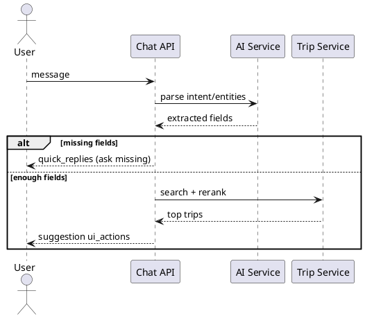
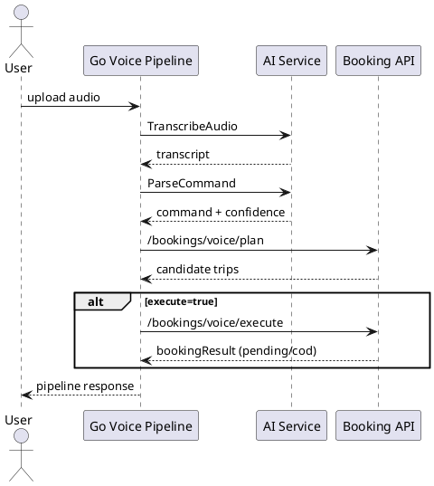

---
tags:
  - module
  - ai-agent
  - chat
  - voice
  - grpc
created: 2026-04-01
updated: 2026-04-01
---

# MODULE AI AGENT

> [!abstract] Mục tiêu
> Tài liệu phân tích chuyên sâu module AI Agent trong kiến trúc đặt vé liên tỉnh, tập trung vào vai trò hỗ trợ ngôn ngữ tự nhiên (chat/voice), ranh giới với nghiệp vụ deterministic của backend và các tiêu chí kỹ thuật để vận hành an toàn.

> [!info] Nguyên lý nền tảng
> AI Agent có nhiệm vụ **hiểu và chuẩn hóa ý định**; Backend Booking có nhiệm vụ **ra quyết định giao dịch**. Sự phân vai này là ràng buộc kiến trúc bắt buộc nhằm giữ ổn định nghiệp vụ.

---

## 1. Bối cảnh và bài toán nghiệp vụ

Người dùng đặt vé liên tỉnh thường nhập dữ liệu thiếu hoặc diễn đạt không cấu trúc, đặc biệt trên thiết bị di động và trong ngữ cảnh giọng nói. Nếu hệ thống chỉ hỗ trợ form cứng, tỷ lệ bỏ dở thao tác cao. Nếu hệ thống dùng AI tự do không ràng buộc, nguy cơ “hội thoại hay nhưng hành động sai” sẽ tăng.

Do đó module AI Agent được thiết kế theo định hướng:

- Tăng khả năng hiểu yêu cầu tự nhiên.
- Giảm sai sót nhập liệu bằng cơ chế hỏi thiếu thông tin có kiểm soát.
- Không để AI trực tiếp thao tác trạng thái booking ngoài quy trình deterministic.

---

## 2. Cơ sở lý thuyết

### 2.1 NLP Pipeline trong hệ thống giao dịch

Pipeline AI trong đề tài gồm ba lớp chức năng:

1. **Nhận dạng** (transcribe/parse): biến audio/text tự nhiên thành dữ liệu có cấu trúc.
2. **Làm rõ** (clarification): hỏi bổ sung trường thiếu theo policy.
3. **Điều phối** (orchestration): chuyển dữ liệu đã chuẩn hóa về backend để thực thi nghiệp vụ.

### 2.2 Human-in-the-loop và giới hạn tự động hóa

Khác với các hệ conversational thuần trả lời, bài toán đặt vé là giao dịch có hệ quả tài chính. Vì vậy cần giới hạn phạm vi tự động hóa của AI ở lớp hiểu ngôn ngữ; quyết định cuối cùng phải thuộc backend có transaction control.

### 2.3 Prompt Governance

Prompt governance là tập quy tắc kiểm soát đầu vào/đầu ra của AI để tránh drift. Trong tài liệu này, quy tắc trọng yếu là **missing-field policy cố định** cho booking scope.

### 2.4 Graceful Degradation

AI service có thể timeout/unavailable. Hệ thống phải suy giảm chức năng một cách có kiểm soát: trả hướng dẫn nhập tay hoặc fallback flow, thay vì lỗi cứng toàn tuyến.

---

## 3. Mục tiêu module

### 3.1 Mục tiêu chức năng

| ID | Yêu cầu |
|---|---|
| AI-01 | Chat nhận message và trả response có cấu trúc |
| AI-02 | Chat hỏi thiếu field theo scope cố định |
| AI-03 | Voice transcribe audio thành text |
| AI-04 | Voice parse text thành command |
| AI-05 | Voice pipeline hỗ trợ plan-only và execute |
| AI-06 | Đồng bộ dữ liệu nghiệp vụ lên AI service khi cần |

### 3.2 Mục tiêu phi chức năng

- Độ trễ AI nằm trong ngưỡng vận hành chấp nhận.
- Khả năng degrade-friendly khi AI gián đoạn.
- Truy vết được vòng đời phiên hội thoại/voice.
- Kiểm soát đầu ra AI theo schema nghiêm ngặt.

---

## 4. Ranh giới trách nhiệm và tích hợp hệ thống

### 4.1 Trách nhiệm AI Agent

- Parse intent/entities.
- Trả đề xuất câu hỏi clarification.
- Trả command chuẩn hóa cho pipeline voice.

### 4.2 Trách nhiệm Backend

- Validate business rule.
- Thực thi search/booking/payment theo transaction.
- Quyết định thành bại giao dịch và cập nhật trạng thái.

### 4.3 Nguyên tắc không vi phạm ranh giới

- AI không tự cập nhật booking status.
- AI không tự ghi đè dữ liệu ghế/trip.
- Mọi thao tác mutation phải qua API/usecase backend.

---

## 5. Missing-Field Policy (Chat) - Quy tắc bắt buộc

Chat clarification chỉ được hỏi trong booking scope, theo thứ tự:

1. `origin`
2. `destination`
3. `date`
4. `time`
5. `budget`

Lý do áp dụng thứ tự này:

- `origin`/`destination` là định danh hành trình nền tảng.
- `date`/`time` định vị cung vận tải theo lịch.
- `budget` là điều kiện tối ưu lựa chọn, không phải điều kiện tồn tại.

> [!warning] Chính sách cấm
> Không hỏi ngoài scope booking trong cùng use case, tránh trôi hội thoại sang nội dung không phục vụ mục tiêu đặt vé.

---

## 6. Kiến trúc giao tiếp Go <-> Python qua gRPC

### 6.1 gRPC contracts

- `AIAgentService/Chat`
- `VoiceBookingService/TranscribeAudio`
- `VoiceBookingService/ParseCommand`
- `AIAgentService/SyncData`

### 6.2 Lý do chọn gRPC

- Schema contract rõ ràng.
- Hiệu năng tốt cho liên lạc service nội bộ.
- Dễ kiểm soát timeout/deadline và mã lỗi.

### 6.3 Chính sách timeout

- Mỗi call có context deadline.
- Quá hạn phải trả mã lỗi tương ứng để backend degrade có kiểm soát.

---

## 7. Đặc tả API endpoints

| Method | Endpoint | Mô tả |
|---|---|---|
| POST | `/api/v1/ai/chat` | Trao đổi hội thoại với AI |
| POST | `/api/v1/ai/voice/booking/transcribe` | Chuyển audio thành văn bản |
| POST | `/api/v1/ai/voice/booking/validate` | Kiểm tra command parse |
| POST | `/api/v1/ai/voice/booking/pipeline` | Thực thi pipeline voice |
| POST | `/api/v1/ai/sync` | Đồng bộ dữ liệu phục vụ AI |

---

## 8. Luồng xử lý chat

### 8.1 Sequence

### 8.2 Quy tắc chất lượng phản hồi

- Câu hỏi follow-up phải ngắn, rõ, chỉ chứa một mục tiêu.
- Khi đủ field, phản hồi chuyển trọng tâm sang đề xuất chuyến có thể đặt.
- Không trả nội dung mơ hồ làm người dùng khó hoàn tất hành động.

---

## 9. Luồng xử lý voice pipeline

### 9.1 Sequence

### 9.2 Quy tắc nghiệp vụ voice

- Voice execute bắt buộc `payment_method=cod`.
- Booking thành công ở trạng thái `pending`.
- Nếu candidate đầu tiên không còn ghế, được fallback candidate phù hợp kế tiếp.

### 9.3 Quản lý độ tin cậy speech-to-structure

- Trả transcript để người dùng đối chiếu.
- Trả confidence để backend có thể quyết định yêu cầu xác nhận lại.

---

## 10. Ánh xạ lỗi và xử lý suy giảm

| gRPC/AI Error | HTTP Status | Error Code |
|---|---|---|
| UNAVAILABLE | 503 | SERVICE_UNAVAILABLE |
| DEADLINE_EXCEEDED | 504 | AI_TIMEOUT |
| INVALID_ARGUMENT | 400 | INVALID_PAYLOAD |
| Internal parse failure | 502 | AI_PROCESSING_FAILED |

### 10.1 Nguyên tắc degrade-friendly

- Thông báo rõ nguyên nhân ở mức người dùng có thể hiểu.
- Đưa ra hướng thao tác thay thế (nhập form hoặc cung cấp trường thiếu).
- Không làm hỏng các luồng backend không phụ thuộc AI.

---

## 11. Yêu cầu phi chức năng chi tiết

### 11.1 Performance

- Theo dõi p95/p99 latency cho `Chat`, `Transcribe`, `ParseCommand`.
- Áp dụng timeout phù hợp từng loại request.

### 11.2 Reliability

- Retry có kiểm soát cho call AI khi phù hợp.
- Chặn retry mù trên request không idempotent.

### 11.3 Security

- Che giấu dữ liệu nhạy cảm trong log.
- Kiểm soát truy cập endpoint AI theo vai trò và token hợp lệ.
- Sanitize input text/audio metadata trước khi xử lý.

### 11.4 Observability

- Log có `trace_id`, `session_id`, `user_id`.
- Metric theo dõi tỷ lệ parse thành công, tỷ lệ fallback, tỷ lệ hoàn tất booking từ AI flow.

---

## 12. Đánh giá rủi ro và biện pháp giảm thiểu

### 12.1 Rủi ro drift hội thoại

- **Mô tả:** AI trả lời lan man ngoài mục tiêu đặt vé.
- **Giảm thiểu:** hard policy missing-field scope + schema output.

### 12.2 Rủi ro sai parse do tiếng nói nhiễu

- **Mô tả:** transcript sai làm command lệch intent.
- **Giảm thiểu:** confidence threshold + yêu cầu xác nhận khi dưới ngưỡng.

### 12.3 Rủi ro phụ thuộc nhà cung cấp AI

- **Mô tả:** outage hoặc thay đổi hành vi model.
- **Giảm thiểu:** fallback flow, versioned prompt, giám sát chất lượng định kỳ.

---

## 13. Kịch bản kiểm thử và xác nhận

### 13.1 Test case chức năng

| Mã | Kịch bản | Kỳ vọng |
|---|---|---|
| AI-TC-01 | Chat thiếu `date` | Hệ thống hỏi `date` |
| AI-TC-02 | Chat đủ field | Trả gợi ý chuyến |
| AI-TC-03 | Voice execute đầy đủ | Tạo booking `pending/cod` |
| AI-TC-04 | AI timeout | Trả fallback hợp lệ |

### 13.2 Test case phi chức năng

- Kiểm thử tải cho endpoint chat/voice.
- Kiểm thử độ trễ mạng giữa Go và Python service.
- Kiểm thử chaos tắt AI service tạm thời để đo khả năng degrade.

### 13.3 Tiêu chí nghiệm thu

- Không vi phạm policy hỏi thiếu field.
- Voice execute thành công luôn tạo booking đúng quy tắc nghiệp vụ.
- Lỗi AI không làm hỏng các chức năng lõi form-based.

---

## 14. Hướng mở rộng

- Bổ sung cơ chế semantic cache cho các intent phổ biến.
- Hỗ trợ đa ngôn ngữ vùng miền trong voice parse.
- Nâng cấp orchestration để cá nhân hóa đề xuất theo lịch sử người dùng.

---

## 15. Tiêu chí chấp nhận tổng hợp

- AI Agent hoạt động như lớp hỗ trợ, không xâm phạm deterministic core.
- Chat/voice tăng khả năng hoàn tất use case đặt vé.
- Hệ thống có khả năng suy giảm có kiểm soát và quan sát đầy đủ.
