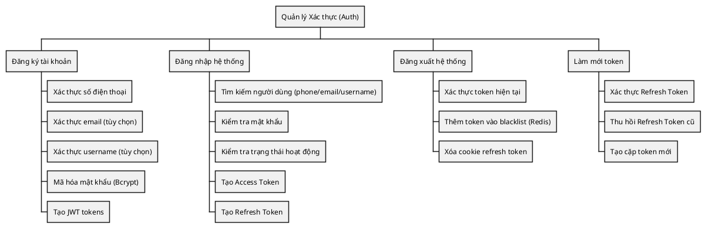
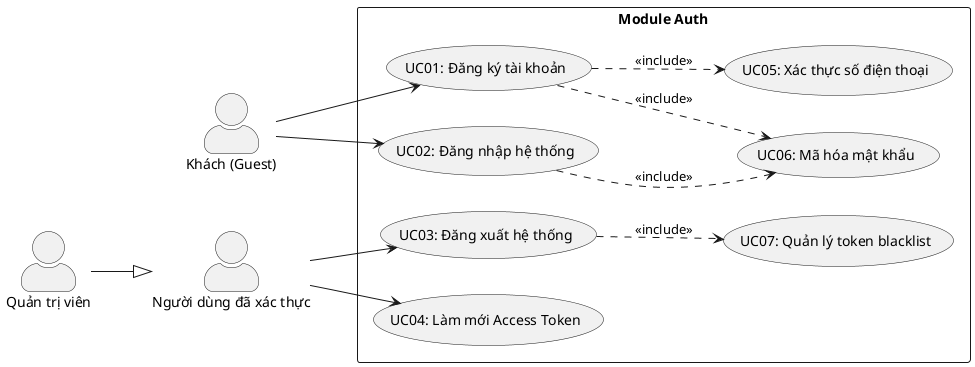
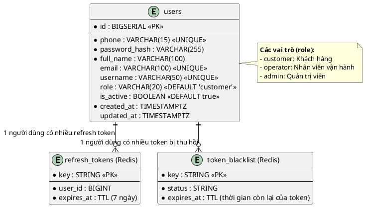
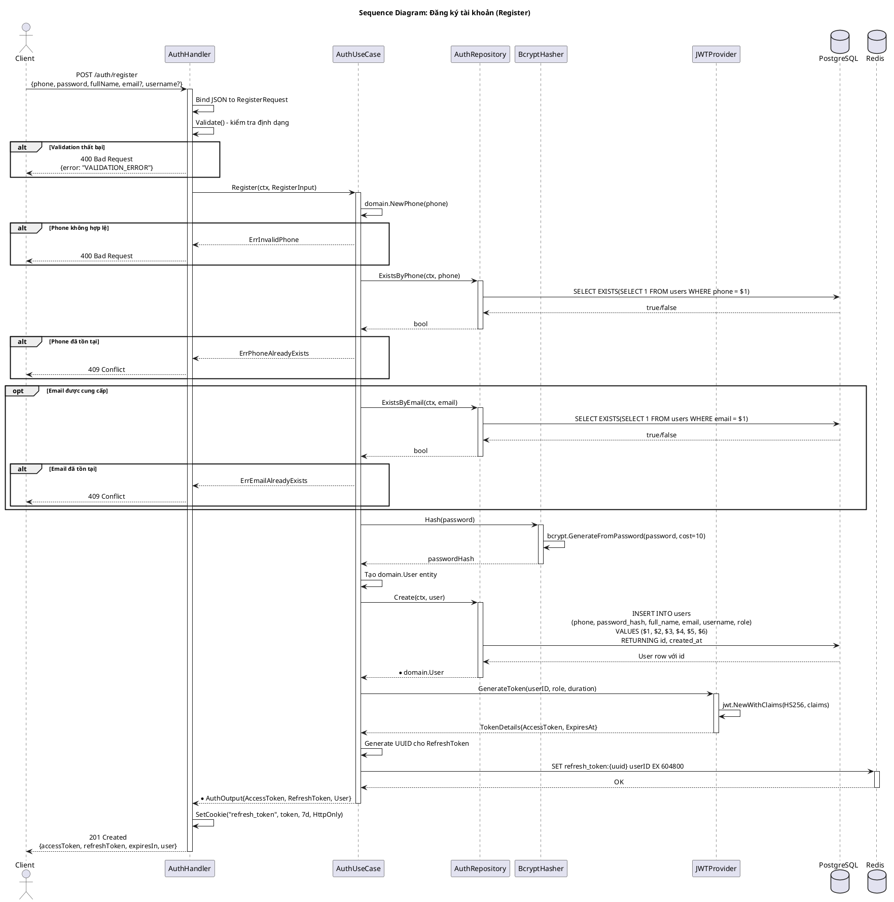
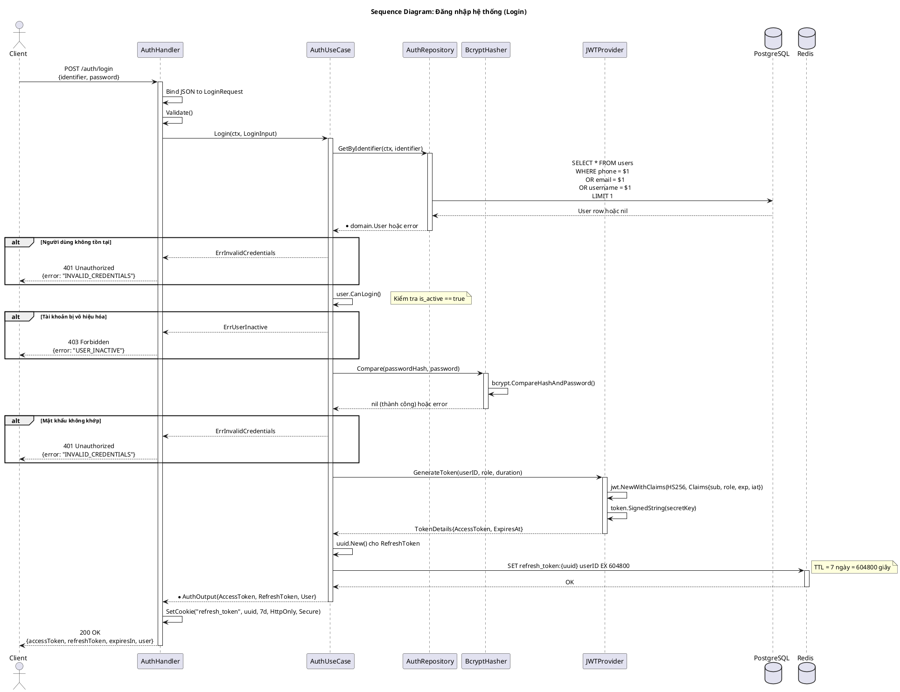
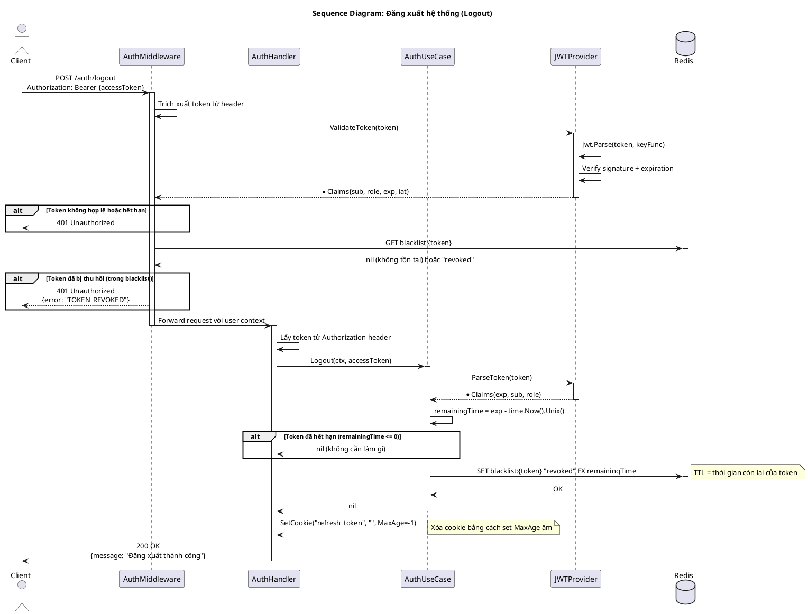
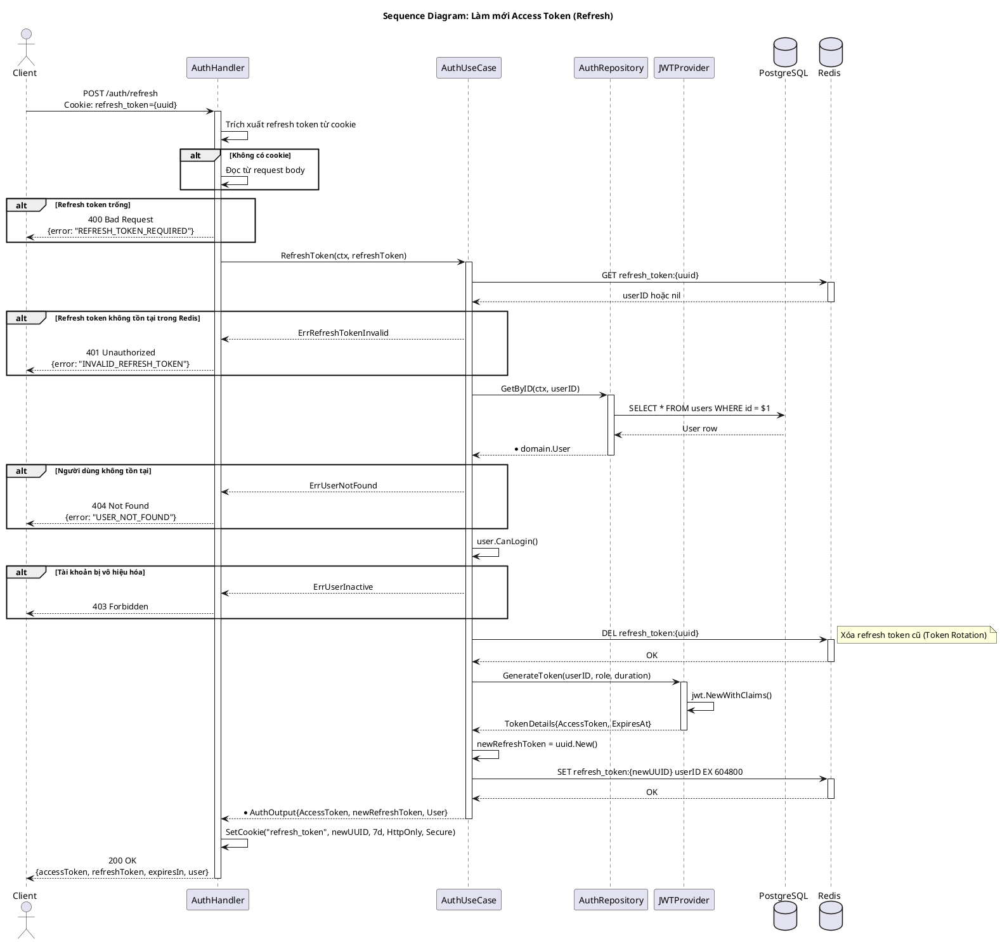
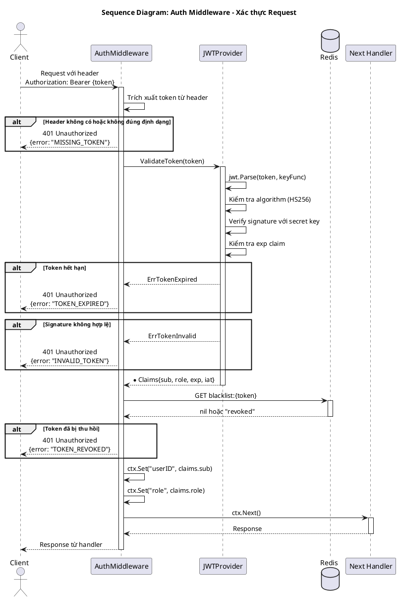
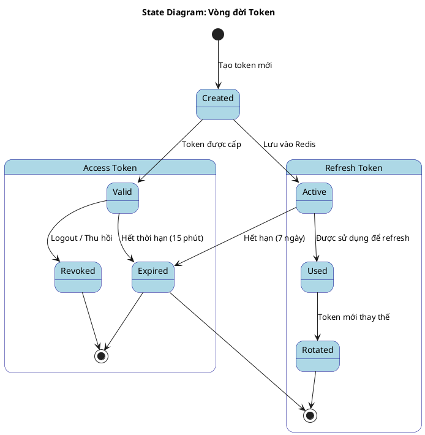

---
tags:
  - srs
  - system-design
  - auth
  - authentication
created: 2026-02-25
updated: 2026-02-25
---
d
# TÀI LIỆU ĐẶC TẢ VÀ THIẾT KẾ MODULE: AUTH (XÁC THỰC)

> [!abstract] TỔNG QUAN
> Module Auth (Authentication) đảm nhận chức năng xác thực và quản lý phiên đăng nhập của người dùng trong hệ thống đặt vé xe buýt. Module này cung cấp các dịch vụ đăng ký tài khoản, đăng nhập, đăng xuất và làm mới token. Hệ thống sử dụng cơ chế JWT (JSON Web Token) kết hợp với Redis để quản lý phiên và blacklist token, đảm bảo tính bảo mật cao. Module hỗ trợ ba vai trò người dùng: Customer (khách hàng), Operator (nhân viên vận hành), và Admin (quản trị viên).

---

## 1. ĐẶC TẢ YÊU CẦU (SOFTWARE REQUIREMENT SPECIFICATION)

### 1.1. Danh sách yêu cầu chức năng (Functional Requirements)

| ID | Tên chức năng | Mức độ ưu tiên | Độ phức tạp | Tác nhân (Actor) |
|-----|---------------|----------------|-------------|------------------|
| AUTH-01 | Đăng ký tài khoản | P1 | M | Guest |
| AUTH-02 | Đăng nhập hệ thống | P1 | M | Guest |
| AUTH-03 | Đăng xuất hệ thống | P1 | L | Authenticated User |
| AUTH-04 | Làm mới Access Token | P1 | M | Authenticated User |
| AUTH-05 | Xác thực số điện thoại | P2 | L | Guest |
| AUTH-06 | Quản lý vai trò người dùng (RBAC) | P2 | M | System |

### 1.2. Biểu đồ phân cấp chức năng (Functional Hierarchy)



---

## 2. BIỂU ĐỒ USE CASE VÀ ĐẶC TẢ (USE CASE SPECIFICATIONS)

### 2.1. Biểu đồ Use Case



### 2.2. Đặc tả Use Case chi tiết: Đăng ký tài khoản (Register)

> [!info] Thông tin Use Case
> **Use Case ID:** UC-AUTH-01
> **Use Case Name:** Đăng ký tài khoản (Register)
> **Actor:** Guest (Khách chưa xác thực)
> **Trigger:** Người dùng gửi yêu cầu đăng ký với thông tin cá nhân

> [!note] Điều kiện tiên quyết (Pre-conditions)
> 1. Số điện thoại chưa tồn tại trong hệ thống
> 2. Email (nếu có) chưa được sử dụng
> 3. Username (nếu có) chưa được sử dụng

> [!success] Điều kiện hậu kỳ (Post-conditions)
> 1. Tài khoản mới được tạo trong database
> 2. Mật khẩu được mã hóa bằng bcrypt
> 3. Hệ thống trả về Access Token và Refresh Token

**Luồng xử lý chính (Normal Flow):**

| Bước | Tác nhân | Hành động |
|------|----------|-----------|
| 1 | Client | Gửi POST request đến `/api/v1/auth/register` với body `{phone, password, fullName, email?, username?}` |
| 2 | Controller | Nhận request, bind JSON vào `RegisterRequest` DTO, gọi `Validate()` |
| 3 | Controller | Chuyển đổi DTO sang `RegisterInput` domain, gọi `useCase.Register()` |
| 4 | UseCase | Gọi `domain.NewPhone(phone)` để validate và tạo value object |
| 5 | UseCase | Gọi `repository.ExistsByPhone(phone)` kiểm tra trùng lặp |
| 6 | UseCase | Gọi `hasher.Hash(password)` để mã hóa mật khẩu |
| 7 | UseCase | Tạo entity User mới với các thông tin đã validate |
| 8 | Repository | Thực thi SQL INSERT INTO users |
| 9 | UseCase | Tạo Access Token và Refresh Token |
| 10 | Controller | Thiết lập cookie `refresh_token`, trả về `AuthResponse` JSON |

**Luồng thay thế (Alternative Flow):**

| Flow ID | Điều kiện | Xử lý |
|---------|-----------|-------|
| AF-1 | Số điện thoại đã tồn tại | Bước 5: Repository trả về true, UseCase trả về `ErrPhoneAlreadyExists` |
| AF-2 | Email đã tồn tại | Bước 5: Repository trả về true, UseCase trả về `ErrEmailAlreadyExists` |
| AF-3 | Định dạng phone không hợp lệ | Bước 4: NewPhone trả về `ErrInvalidPhone` |

**Ngoại lệ (Exceptions):**

| Exception | Điều kiện | HTTP Status | Error Code |
|-----------|-----------|-------------|------------|
| ErrInvalidPhone | Số điện thoại không đúng định dạng | 400 | INVALID_PHONE |
| ErrPhoneAlreadyExists | Số điện thoại đã được đăng ký | 409 | PHONE_EXISTS |
| ErrEmailAlreadyExists | Email đã được sử dụng | 409 | EMAIL_EXISTS |
| ErrValidation | Request body không hợp lệ | 400 | VALIDATION_ERROR |

### 2.3. Đặc tả Use Case chi tiết: Đăng nhập hệ thống (Login)

> [!info] Thông tin Use Case
> **Use Case ID:** UC-AUTH-02
> **Use Case Name:** Đăng nhập hệ thống (Login)
> **Actor:** Guest (Khách chưa xác thực)
> **Trigger:** Người dùng gửi yêu cầu đăng nhập với thông tin xác thực

> [!note] Điều kiện tiên quyết (Pre-conditions)
> 1. Người dùng đã có tài khoản trong hệ thống
> 2. Tài khoản đang trong trạng thái hoạt động (IsActive = true)

> [!success] Điều kiện hậu kỳ (Post-conditions)
> 1. Hệ thống trả về Access Token và Refresh Token
> 2. Refresh Token được lưu vào Redis với TTL
> 3. Cookie refresh_token được thiết lập

**Luồng xử lý chính (Normal Flow):**

| Bước | Tác nhân | Hành động |
|------|----------|-----------|
| 1 | Client | Gửi POST request đến `/api/v1/auth/login` với body `{identifier, password}` |
| 2 | Controller | Nhận request, bind JSON vào `LoginRequest` DTO, gọi `Validate()` |
| 3 | Controller | Chuyển đổi DTO sang `LoginInput` domain, gọi `useCase.Login()` |
| 4 | UseCase | Gọi `repository.GetByIdentifier(identifier)` để tìm người dùng |
| 5 | Repository | Thực thi SQL query tìm kiếm theo phone/email/username |
| 6 | UseCase | Gọi `user.CanLogin()` kiểm tra trạng thái hoạt động |
| 7 | UseCase | Gọi `hasher.Compare(passwordHash, password)` so sánh mật khẩu |
| 8 | UseCase | Gọi `jwtProvider.GenerateToken(userID, role, duration)` tạo Access Token |
| 9 | UseCase | Tạo Refresh Token (UUID), lưu vào Redis với key `refresh_token:{uuid}` |
| 10 | Controller | Thiết lập cookie `refresh_token`, trả về `AuthResponse` JSON |

**Luồng thay thế (Alternative Flow):**

| Flow ID | Điều kiện | Xử lý |
|---------|-----------|-------|
| AF-1 | Người dùng không tồn tại | Bước 4: Repository trả về error, UseCase trả về `ErrInvalidCredentials` |
| AF-2 | Mật khẩu không khớp | Bước 7: Hasher trả về error, UseCase trả về `ErrInvalidCredentials` |
| AF-3 | Identifier là email | Bước 5: Query tìm kiếm theo trường email thay vì phone |

**Ngoại lệ (Exceptions):**

| Exception | Điều kiện | HTTP Status | Error Code |
|-----------|-----------|-------------|------------|
| ErrInvalidCredentials | Sai thông tin đăng nhập | 401 | INVALID_CREDENTIALS |
| ErrUserInactive | Tài khoản bị vô hiệu hóa | 403 | USER_INACTIVE |
| ErrValidation | Request body không hợp lệ | 400 | VALIDATION_ERROR |
| ErrInternal | Lỗi hệ thống (DB, Redis) | 500 | INTERNAL_ERROR |

### 2.4. Đặc tả Use Case chi tiết: Đăng xuất hệ thống (Logout)

> [!info] Thông tin Use Case
> **Use Case ID:** UC-AUTH-03
> **Use Case Name:** Đăng xuất hệ thống (Logout)
> **Actor:** Authenticated User (Người dùng đã xác thực)
> **Trigger:** Người dùng gửi yêu cầu đăng xuất

> [!note] Điều kiện tiên quyết (Pre-conditions)
> 1. Người dùng đã đăng nhập và có Access Token hợp lệ

> [!success] Điều kiện hậu kỳ (Post-conditions)
> 1. Access Token hiện tại được thêm vào blacklist trong Redis
> 2. Cookie refresh_token bị xóa

**Luồng xử lý chính (Normal Flow):**

| Bước | Tác nhân | Hành động |
|------|----------|-----------|
| 1 | Client | Gửi POST request đến `/api/v1/auth/logout` với header `Authorization: Bearer {token}` |
| 2 | Controller | Trích xuất token từ header |
| 3 | Controller | Gọi `useCase.Logout(ctx, token)` |
| 4 | UseCase | Gọi `jwtProvider.ValidateToken(token)` để lấy claims |
| 5 | UseCase | Tính toán thời gian còn lại của token: `remainingTime = exp - now` |
| 6 | UseCase | Gọi Redis `SET blacklist:{token} "revoked" EX remainingTime` |
| 7 | Controller | Xóa cookie `refresh_token` bằng cách set MaxAge = -1 |
| 8 | Controller | Trả về response thành công |

### 2.5. Đặc tả Use Case chi tiết: Làm mới Access Token (Refresh)

> [!info] Thông tin Use Case
> **Use Case ID:** UC-AUTH-04
> **Use Case Name:** Làm mới Access Token (Refresh)
> **Actor:** Authenticated User (Người dùng đã xác thực)
> **Trigger:** Access Token hết hạn, client gửi yêu cầu refresh

> [!note] Điều kiện tiên quyết (Pre-conditions)
> 1. Refresh Token còn hạn và tồn tại trong Redis
> 2. Refresh Token chưa bị thu hồi

> [!success] Điều kiện hậu kỳ (Post-conditions)
> 1. Refresh Token cũ bị xóa khỏi Redis
> 2. Cặp Access Token và Refresh Token mới được tạo
> 3. Refresh Token mới được lưu vào Redis

**Luồng xử lý chính (Normal Flow):**

| Bước | Tác nhân | Hành động |
|------|----------|-----------|
| 1 | Client | Gửi POST request đến `/api/v1/auth/refresh` với cookie hoặc body chứa refresh token |
| 2 | Controller | Trích xuất refresh token từ cookie hoặc body |
| 3 | Controller | Gọi `useCase.RefreshToken(ctx, refreshToken)` |
| 4 | UseCase | Gọi Redis `GET refresh_token:{uuid}` để lấy user_id |
| 5 | UseCase | Gọi `repository.GetByID(userID)` để lấy thông tin user |
| 6 | UseCase | Xóa refresh token cũ: Redis `DEL refresh_token:{uuid}` |
| 7 | UseCase | Tạo Access Token mới và Refresh Token mới |
| 8 | UseCase | Lưu Refresh Token mới vào Redis |
| 9 | Controller | Thiết lập cookie mới, trả về `AuthResponse` JSON |

**Ngoại lệ (Exceptions):**

| Exception | Điều kiện | HTTP Status | Error Code |
|-----------|-----------|-------------|------------|
| ErrRefreshTokenInvalid | Token không tồn tại trong Redis | 401 | INVALID_REFRESH_TOKEN |
| ErrRefreshTokenExpired | Token đã hết hạn | 401 | REFRESH_TOKEN_EXPIRED |
| ErrUserNotFound | User không tồn tại | 404 | USER_NOT_FOUND |

---

## 3. THIẾT KẾ CƠ SỞ DỮ LIỆU (DATABASE DESIGN)

### 3.1. Sơ đồ thực thể liên kết (Entity Relationship Diagram - ERD)



### 3.2. Từ điển dữ liệu (Data Dictionary)

> [!abstract] Bảng: users

| Tên trường | Kiểu dữ liệu | Ràng buộc | Mô tả |
|------------|--------------|-----------|-------|
| id | BIGSERIAL | PK, NOT NULL | Khóa chính, tự động tăng |
| phone | VARCHAR(15) | UNIQUE, NOT NULL | Số điện thoại (định dạng VN: 0xxxxxxxxx hoặc +84xxxxxxxxx) |
| password_hash | VARCHAR(255) | NOT NULL | Mật khẩu đã mã hóa bcrypt |
| full_name | VARCHAR(100) | NOT NULL | Họ và tên đầy đủ (tối thiểu 2 ký tự) |
| email | VARCHAR(100) | UNIQUE, NULL | Địa chỉ email (tùy chọn) |
| username | VARCHAR(50) | UNIQUE, NULL | Tên đăng nhập (3-30 ký tự, a-z0-9_) |
| role | VARCHAR(20) | DEFAULT 'customer' | Vai trò: customer, operator, admin |
| is_active | BOOLEAN | DEFAULT true | Trạng thái hoạt động của tài khoản |
| created_at | TIMESTAMPTZ | DEFAULT NOW() | Thời điểm tạo tài khoản |
| updated_at | TIMESTAMPTZ | NULL | Thời điểm cập nhật gần nhất |

> [!abstract] Redis Keys

| Key Pattern | Kiểu | TTL | Mô tả |
|-------------|------|-----|-------|
| `refresh_token:{uuid}` | STRING | 7 ngày | Lưu user_id để xác thực refresh token |
| `blacklist:{jwt_token}` | STRING | Còn lại của token | Đánh dấu token đã thu hồi |

---

## 4. KIẾN TRÚC HỆ THỐNG VÀ LUỒNG XỬ LÝ (SYSTEM ARCHITECTURE)

### 4.1. Kiến trúc mã nguồn

> [!info] Clean Architecture (Hexagonal Architecture)
> Module Auth được triển khai theo mô hình Clean Architecture với các lớp rõ ràng:

| Lớp (Layer) | Thư mục | File | Trách nhiệm |
|-------------|---------|------|-------------|
| **Domain** | `domain/` | `entity.go` | Định nghĩa entity User, value objects (Phone, Email, Username, Role), validation rules |
| **Domain** | `domain/` | `dto.go` | Định nghĩa DTOs: RegisterInput, LoginInput, RefreshInput, AuthOutput |
| **Domain** | `domain/` | `ports.go` | Định nghĩa interfaces: Repository, PasswordHasher |
| **Repository** | `repository/` | `repository.go` | Implement Repository interface, tương tác PostgreSQL qua SQLC |
| **UseCase** | `usecase/` | `usecase.go` | Implement IAuthUseCase, xử lý logic nghiệp vụ |
| **Infrastructure** | `infrastructure/` | `bcrypt.go` | Implement PasswordHasher với bcrypt |
| **Controller** | `controller/http/` | `handler.go` | Xử lý HTTP request/response, error mapping |
| **Controller** | `controller/http/` | `routes.go` | Đăng ký routes với Gin router |
| **Controller** | `controller/dto/` | `auth.go` | DTOs cho HTTP layer: RegisterRequest, LoginRequest, AuthResponse |

### 4.2. Danh sách API Endpoints

| HTTP Method | Endpoint | Yêu cầu quyền | Mô tả chức năng |
|-------------|----------|---------------|-----------------|
| POST | `/api/v1/auth/register` | Public | Đăng ký tài khoản mới |
| POST | `/api/v1/auth/login` | Public | Đăng nhập, nhận JWT tokens |
| POST | `/api/v1/auth/logout` | Bearer Token | Đăng xuất, thu hồi token |
| POST | `/api/v1/auth/refresh` | Cookie/Body | Làm mới Access Token |

---

## 5. BIỂU ĐỒ TUẦN TỰ (SEQUENCE DIAGRAMS)

### 5.1. Biểu đồ tuần tự: Quá trình Đăng ký (Register)



### 5.2. Biểu đồ tuần tự: Quá trình Đăng nhập (Login)



### 5.3. Biểu đồ tuần tự: Quá trình Đăng xuất (Logout)



### 5.4. Biểu đồ tuần tự: Quá trình Làm mới Token (Refresh)



### 5.5. Biểu đồ tuần tự: Middleware xác thực (Auth Middleware)



---

## 6. CÁC QUY TẮC NGHIỆP VỤ (BUSINESS RULES)

### 6.1. Quy tắc xác thực dữ liệu

| Trường | Quy tắc | Regex/Điều kiện |
|--------|---------|-----------------|
| phone | Số điện thoại Việt Nam | `^(0\|\+84)[0-9]{9,10}$` |
| email | Định dạng email hợp lệ (tùy chọn) | `^[a-zA-Z0-9._%+-]+@[a-zA-Z0-9.-]+\.[a-zA-Z]{2,}$` |
| username | 3-30 ký tự, chỉ chứa a-z, 0-9, _ (tùy chọn) | `^[a-zA-Z0-9_]{3,30}$` |
| password | Tối thiểu 6 ký tự | `len >= 6` |
| full_name | Tối thiểu 2 ký tự (sau khi trim) | `len(trim(name)) >= 2` |

### 6.2. Quy tắc phân quyền (RBAC)

| Vai trò | Quyền hạn |
|---------|-----------|
| customer | Đặt vé, xem lịch sử đặt vé, cập nhật thông tin cá nhân |
| operator | Tất cả quyền customer + Quản lý chuyến xe, xe buýt |
| admin | Tất cả quyền operator + Quản lý người dùng, nhà xe, cấu hình hệ thống |

### 6.3. Cấu hình token

| Loại Token | Thời hạn | Lưu trữ |
|------------|----------|---------|
| Access Token (JWT) | Cấu hình (mặc định: 15 phút) | Client memory/localStorage |
| Refresh Token (UUID) | 7 ngày | Redis + HttpOnly Cookie |

### 6.4. Chiến lược bảo mật

> [!warning] Token Rotation
> Khi refresh token được sử dụng, token cũ sẽ bị xóa và token mới được tạo. Điều này giúp phát hiện token bị đánh cắp.

> [!warning] Token Blacklist
> Access token bị thu hồi sẽ được lưu trong Redis với TTL bằng thời gian còn lại của token.

---

## 7. XỬ LÝ LỖI (ERROR HANDLING)

| Domain Error | HTTP Status | Error Code | Message (i18n key) |
|--------------|-------------|------------|-------------------|
| ErrInvalidPhone | 400 | INVALID_PHONE | error.invalid_phone |
| ErrInvalidEmail | 400 | INVALID_EMAIL | error.invalid_email |
| ErrInvalidPassword | 400 | INVALID_PASSWORD | error.invalid_password |
| ErrPhoneAlreadyExists | 409 | PHONE_EXISTS | error.phone_exists |
| ErrEmailAlreadyExists | 409 | EMAIL_EXISTS | error.email_exists |
| ErrUsernameAlreadyExists | 409 | USERNAME_EXISTS | error.username_exists |
| ErrInvalidCredentials | 401 | INVALID_CREDENTIALS | error.invalid_credentials |
| ErrTokenInvalid | 401 | INVALID_TOKEN | error.invalid_token |
| ErrTokenExpired | 401 | TOKEN_EXPIRED | error.token_expired |
| ErrTokenRevoked | 401 | TOKEN_REVOKED | error.token_revoked |
| ErrRefreshTokenInvalid | 401 | INVALID_REFRESH_TOKEN | error.invalid_refresh_token |
| ErrUserInactive | 403 | USER_INACTIVE | error.user_inactive |
| ErrUserNotFound | 404 | USER_NOT_FOUND | error.user_not_found |

---

## 8. PHỤ LỤC

### 8.1. Cấu trúc Response JSON

```json
// Success Response - Register/Login
{
    "success": true,
    "data": {
        "accessToken": "eyJhbGciOiJIUzI1NiIsInR5cCI6IkpXVCJ9...",
        "refreshToken": "550e8400-e29b-41d4-a716-446655440000",
        "expiresIn": 900,
        "user": {
            "id": 1,
            "phone": "0912345678",
            "fullName": "Nguyễn Văn A",
            "email": "a@example.com",
            "role": "customer"
        }
    }
}

// Error Response
{
    "success": false,
    "error": {
        "code": "INVALID_CREDENTIALS",
        "message": "Thông tin đăng nhập không chính xác"
    }
}
```

### 8.2. Biểu đồ trạng thái Token


