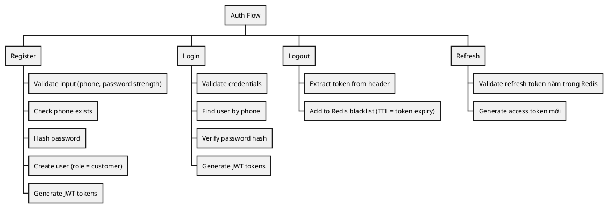
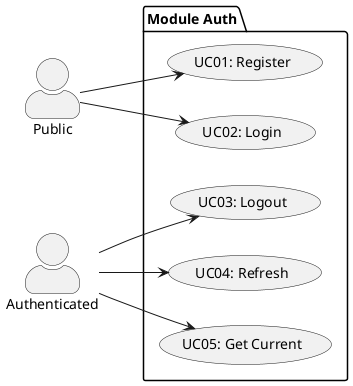
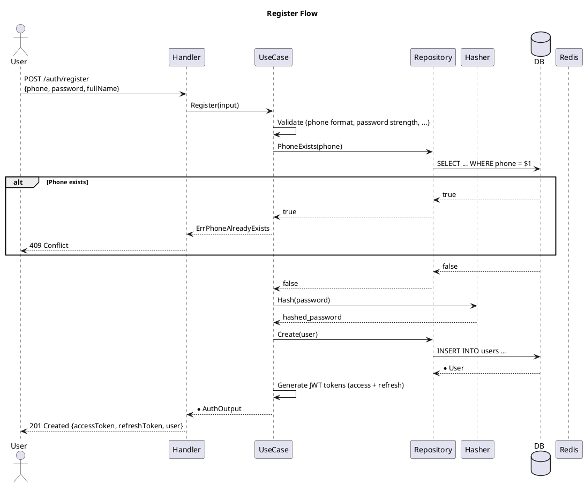
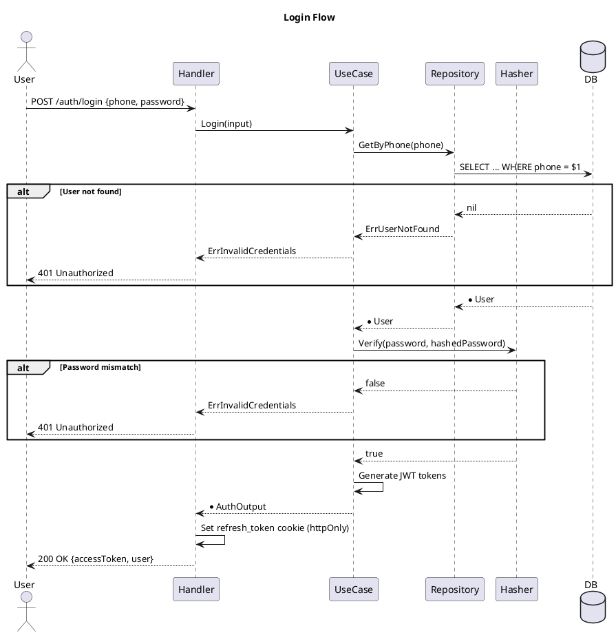
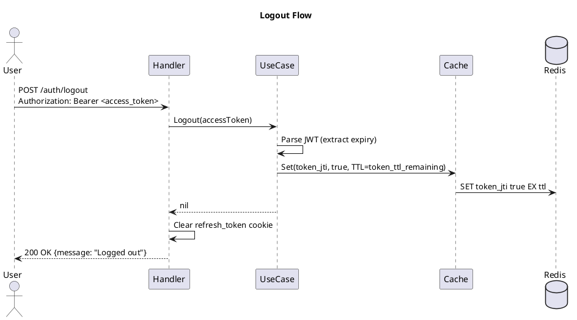
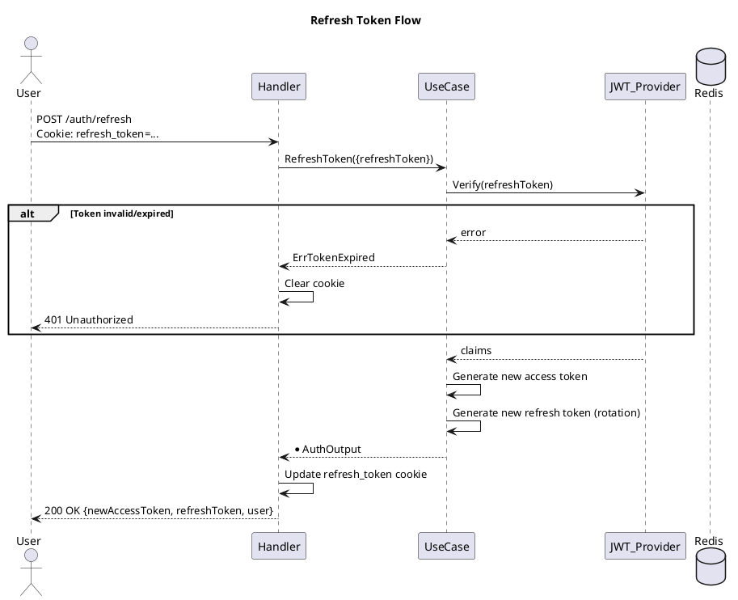

---
tags:
  - srs
  - system-design
  - auth
  - security
created: 2026-04-06
updated: 2026-04-06
---

# TÀI LIỆU ĐẶC TẢ VÀ THIẾT KẾ MODULE: AUTH (XÁC THỰC)

> [!abstract] TỔNG QUAN
> Module Auth quản lý toàn bộ quy trình xác thực người dùng:
> - **Register**: Tạo tài khoản mới (phone + password + full name)
> - **Login**: Đăng nhập với phone/password, trả JWT access + refresh token
> - **Logout**: Vô hiệu hóa token qua blacklist (Redis)
> - **Refresh**: Cấp access token mới từ refresh token
> - **Roles**: customer, operator, admin
>
> Sử dụng **JWT không trạng thái** + **Redis blacklist** cho logout. Phone là primary key (unique, bắt buộc).

---

## 1. ĐẶC TẢ YÊU CẦU

### 1.1. Danh sách yêu cầu chức năng

| ID | Tên chức năng | Mô tả | Ưu tiên | Độ phức tạp | Tác nhân |
|-----|---------------|-------|---------|-------------|----------|
| AUTH-01 | Register | Người dùng tạo tài khoản: phone, password, full_name, email, username | P1 | M | Public |
| AUTH-02 | Login | Đăng nhập phone + password, trả JWT access + refresh token | P1 | M | Public |
| AUTH-03 | Logout | Vô hiệu token qua blacklist Redis | P1 | L | Authenticated |
| AUTH-04 | Refresh Token | Cấp access token mới từ refresh token | P1 | L | Authenticated |
| AUTH-05 | Get Current User | Lấy thông tin user hiện tại từ access token | P2 | L | Authenticated |

### 1.2. Biểu đồ sự kiện



---

## 2. BIỂU ĐỒ USE CASE



---

## 3. THIẾT KẾ CƠ SỞ DỮ LIỆU

### 3.1. Bảng users

| Tên trường | Kiểu | Ràng buộc | Mô tả |
|------------|------|-----------|-------|
| id | BIGSERIAL | PK | Khóa chính (UUID) |
| phone | VARCHAR(20) | UNIQUE, NOT NULL | Số điện thoại (main identifier) |
| password_hash | VARCHAR(255) | NOT NULL | Hashed password (bcrypt) |
| full_name | VARCHAR(100) | NOT NULL | Tên đầy đủ |
| email | VARCHAR(100) | NULL, UNIQUE | Email (optional) |
| username | VARCHAR(50) | NULL, UNIQUE | Username (optional) |
| role | VARCHAR(20) | DEFAULT 'customer' | customer / operator / admin |
| created_at | TIMESTAMPTZ | DEFAULT NOW() | Timestamp tạo |

### 3.2. Ví dụ

| id | phone | full_name | email | role | created_at |
|----|-------|-----------|-------|------|-----------|
| 1 | 09087654321 | Nguyễn Văn A | a@example.com | customer | 2026-04-06 |
| 2 | 09012345678 | Trần Thị B | b@example.com | admin | 2026-04-06 |

---

## 4. JWT TOKEN STRUCTURE

### 4.1. Access Token (JWT)

```json
{
    "sub": "09087654321",        // phone (unique identifier)
    "id": "uuid",                // user ID
    "phone": "09087654321",
    "role": "customer",
    "iat": 1712401605,           // issued at
    "exp": 1712405205,           // expires in (1 hour default)
    "iss": "bus-ticketing-system"
}
```

**Duration**: 1 hour (configurable)

### 4.2. Refresh Token (JWT)

```json
{
    "sub": "09087654321",
    "id": "uuid",
    "type": "refresh",
    "iat": 1712401605,
    "exp": 1712488005,           // expires in (7 days default)
    "iss": "bus-ticketing-system"
}
```

**Duration**: 7 days (configurable)

---

## 5. KIẾN TRÚC HỆ THỐNG

### 5.1. API Endpoints

| HTTP | Endpoint | Auth | Mô tả |
|------|----------|------|-------|
| POST | `/api/v1/auth/register` | Public | Tạo tài khoản |
| POST | `/api/v1/auth/login` | Public | Đăng nhập |
| POST | `/api/v1/auth/logout` | Bearer | Đăng xuất |
| POST | `/api/v1/auth/refresh` | Refresh Cookie | Refresh token |
| GET | `/api/v1/auth/me` | Bearer | Lấy thông tin user hiện tại |

### 5.2. Response

**RegisterResponse / LoginResponse:**
```json
{
    "success": true,
    "data": {
        "accessToken": "eyJhbGciOiJIUzI1NiIs...",
        "refreshToken": "eyJhbGciOiJIUzI1NiIs...",
        "user": {
            "id": "uuid",
            "phone": "09087654321",
            "fullName": "Nguyễn Văn A",
            "email": "a@example.com",
            "role": "customer"
        }
    }
}
```

---

## 6. BIỂU ĐỒ TUẦN TỰ

### 6.1. Register



### 6.2. Login



### 6.3. Logout



### 6.4. Refresh Token



---

## 7. QUY TẮC NGHIỆP VỤ

### 7.1. Validation Rules

| Trường | Quy tắc | Error |
|--------|---------|-------|
| phone | Format VN (09xx, 08xx, 01xx), duy nhất | ErrInvalidPhone, ErrPhoneAlreadyExists |
| password | Min 8 ký tự, có số + chữ | ErrInvalidPassword |
| full_name | Bắt buộc, >= 2 ký tự | ErrInvalidFullName |
| email | Optional, valid format nếu có | ErrInvalidEmail |
| username | Optional, alphanumeric + underscore | ErrInvalidUsername |
| role | customer / operator / admin | ErrInvalidRole |

### 7.2. Quy tắc register

| BR-REG-01 | Phone phải duy nhất (UNIQUE constraint) |
|---|---|
| BR-REG-02 | Role mặc định = 'customer' |
| BR-REG-03 | Password phải hash qua bcrypt (không lưu plain text) |

### 7.3. Quy tắc logout

| BR-LOGOUT-01 | Token phải add vào blacklist Redis với TTL = token remaining time |
|---|---|
| BR-LOGOUT-02 | Refresh token cookie phải clear |

### 7.4. Quy tắc refresh token

| BR-REFRESH-01 | Chỉ accept refresh token hợp lệ (type=refresh) |
|---|---|
| BR-REFRESH-02 | Cấp access token mới, rotate refresh token |
|  | Token rotation: nếu refresh token được dùng -> cấp pair mới |

---

## 8. XỬ LÝ LỖI

| Error | HTTP | Code |
|-------|------|------|
| ErrInvalidPhone | 400 | INVALID_PHONE |
| ErrInvalidPassword | 400 | INVALID_PASSWORD |
| ErrPhoneAlreadyExists | 409 | PHONE_EXISTS |
| ErrUserNotFound | 404 | USER_NOT_FOUND |
| ErrInvalidCredentials | 401 | INVALID_CREDENTIALS |
| ErrTokenExpired | 401 | TOKEN_EXPIRED |
| ErrTokenInvalid | 401 | TOKEN_INVALID |
| ErrUserInactive | 403 | USER_INACTIVE |

---

## 9. SECURITY MEASURES

- ✅ Password hashing (bcrypt, not plaintext)
- ✅ JWT tokens (stateless, secure)
- ✅ Refresh token rotation (prevent token theft)
- ✅ Token blacklist (logout enforcement)
- ✅ HttpOnly cookies (prevent XSS)
- ✅ HTTPS only (production)
- ✅ Rate limiting (prevent brute force attacks)

---

## 10. CACHING & PERFORMANCE

- **Token blacklist**: Redis, TTL = token expiry time
- **User cache**: Optional, TTL = 5 minutes (reduce DB queries)
- **Phone uniqueness**: Index on phone column

---

