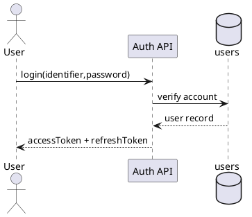

---
tags:
  - module
  - auth
  - security
created: 2026-04-01
updated: 2026-04-01
---

# MODULE AUTH

> [!abstract] Mục tiêu
> Cung cấp lớp xác thực và phân quyền chuẩn hóa cho toàn hệ thống, bảo đảm chỉ chủ thể hợp lệ mới được thực hiện hành vi nghiệp vụ tương ứng.

## 1. Bối cảnh nghiệp vụ

Trong nền tảng đặt vé, dữ liệu booking và giao dịch thanh toán có tính nhạy cảm cao. Nếu lớp Auth không chặt chẽ, mọi ưu thế về tính đúng đắn nghiệp vụ ở module khác đều có thể bị triệt tiêu do truy cập trái phép hoặc giả mạo danh tính.

## 2. Yêu cầu chức năng

| ID | Yêu cầu |
|---|---|
| AUTH-01 | Đăng ký tài khoản bằng phone/password |
| AUTH-02 | Đăng nhập và phát hành access/refresh token |
| AUTH-03 | Đăng xuất và thu hồi refresh token |
| AUTH-04 | Lấy profile người dùng hiện tại |
| AUTH-05 | Middleware kiểm tra quyền theo role |

## 3. Cơ sở lý thuyết bảo mật áp dụng

### 3.1 Authentication vs Authorization

- **Authentication** trả lời câu hỏi “Bạn là ai?”.
- **Authorization** trả lời câu hỏi “Bạn được làm gì?”.

Tách biệt hai bước giúp hệ thống minh bạch quyền hạn và dễ kiểm soát audit.

### 3.2 Token-based Security

Module sử dụng JWT để đại diện danh tính phiên truy cập. Access token dùng cho request thường xuyên; refresh token dùng tái cấp access token theo chính sách hạn dùng.

### 3.3 Principle of Least Privilege

Mỗi role chỉ được cấp quyền tối thiểu đủ để hoàn thành nhiệm vụ. Ví dụ: khách hàng không có quyền thao tác endpoint admin.

## 4. Tác nhân và vai trò

- Guest
- Authenticated User
- Admin

## 5. Use Case trọng yếu - Login

- **Tiền điều kiện:** Tài khoản tồn tại, active, mật khẩu hợp lệ.
- **Hậu điều kiện:** Client nhận token hợp lệ để truy cập endpoint phù hợp role.

## 6. API Endpoints

| Method | Endpoint | Mô tả |
|---|---|---|
| POST | `/api/v1/auth/register` | Đăng ký |
| POST | `/api/v1/auth/login` | Đăng nhập |
| POST | `/api/v1/auth/refresh` | Cấp lại access token |
| POST | `/api/v1/auth/logout` | Đăng xuất |
| GET | `/api/v1/auth/profile` | Lấy profile |

## 7. Quy tắc nghiệp vụ

- Số điện thoại là duy nhất.
- Mật khẩu lưu dưới dạng hash an toàn.
- Role mặc định khi đăng ký là `customer`.
- Endpoint admin bắt buộc role `admin`.

## 8. Yêu cầu phi chức năng

### 8.1 Security

- Không log mật khẩu/token thô.
- Xác thực chữ ký token và thời hạn sử dụng.
- Thu hồi refresh token khi logout.

### 8.2 Reliability

- Luồng refresh token phải idempotent theo policy.
- Trạng thái thu hồi token phải phản ánh nhanh ở middleware.

### 8.3 Observability

- Ghi log truy cập với `user_id`, `role`, `trace_id`.
- Có thống kê tỷ lệ login thất bại theo thời gian.

## 9. Kịch bản kiểm thử

| Mã | Kịch bản | Kỳ vọng |
|---|---|---|
| AUTH-TC-01 | Login sai mật khẩu | `401` |
| AUTH-TC-02 | Token hết hạn gọi endpoint protected | `401` |
| AUTH-TC-03 | Refresh token đã thu hồi | Từ chối cấp token mới |
| AUTH-TC-04 | User role gọi endpoint admin | `403` |

## 10. Tiêu chí chấp nhận

- Chỉ user hợp lệ mới truy cập được tài nguyên bảo vệ.
- Cơ chế token đáp ứng đúng vòng đời bảo mật.
- Phân quyền role hoạt động chính xác trên toàn bộ endpoint.
