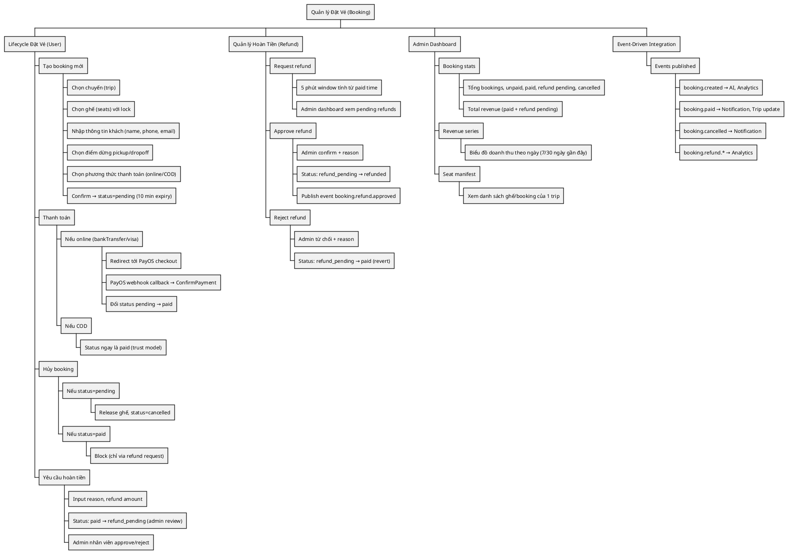
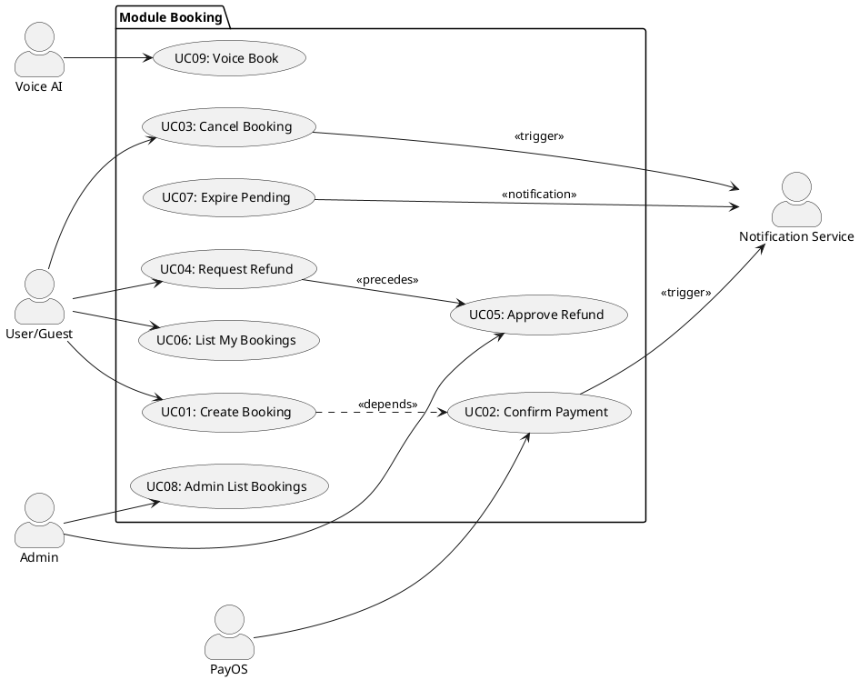
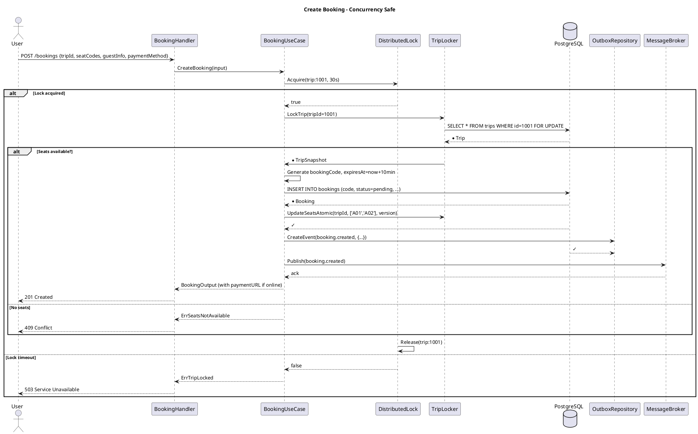
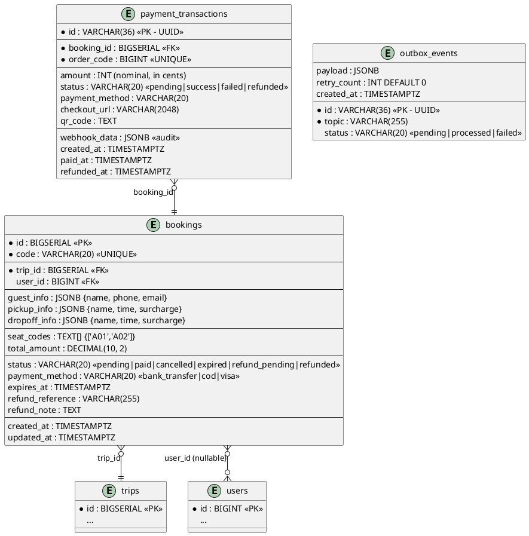
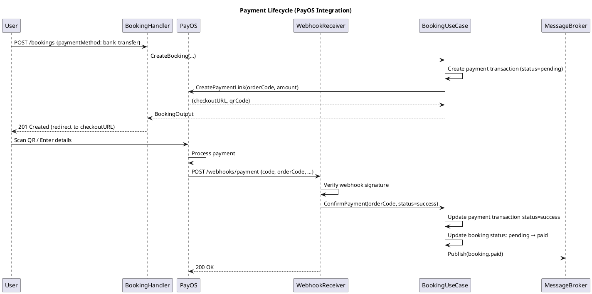
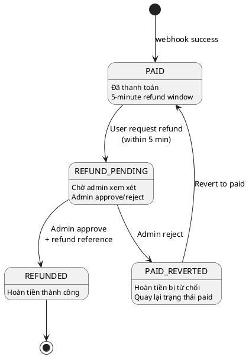
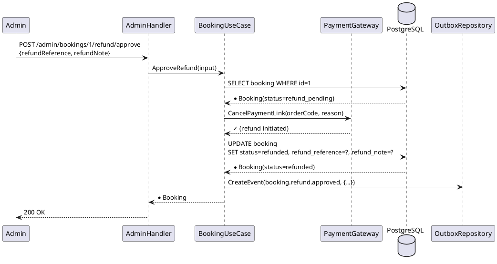
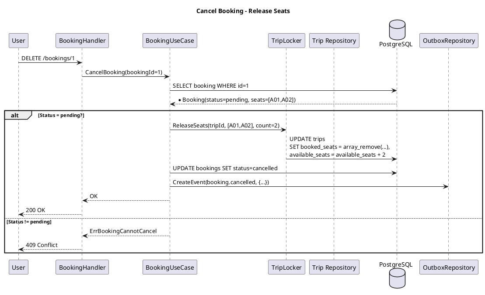
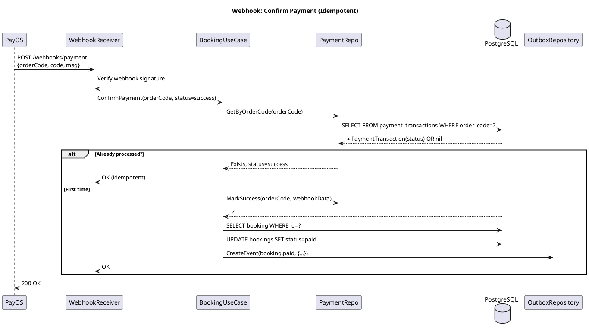

---
tags:
  - srs
  - system-design
  - booking
  - transaction
  - concurrency
  - payment-integration
  - event-driven
created: 2026-04-06
updated: 2026-04-06
---

# TÀI LIỆU ĐẶC TẢ VÀ THIẾT KẾ MODULE: BOOKING (ĐẶT VÉ)

> [!abstract] TỔNG QUAN
> Module Booking là **miền nghiệp vụ trung tâm**, quản lý toàn bộ quy trình đặt vé từ chọn chuyến → chọn ghế → thanh toán → hoàn tiền. Tập trung vào:
> - **An toàn giao dịch**: ACID transactions, không overbooking
> - **Kiểm soát đồng thời**: Distributed lock + row-level DB lock
> - **Tích hợp thanh toán**: Webhook idempotent, state machine 6 trạng thái
> - **Quản lý hoàn tiền**: 5-minute refund window, approval flow
> - **Outbox pattern**: Event-driven integration với Notification/Analytics/Trip
>
> Là **nguồn gốc doanh thu** của platform — nên độ tin cậy là tối cao.

---

## 1. ĐẶC TẢ YÊU CẦU (SOFTWARE REQUIREMENT SPECIFICATION - SRS)

### 1.1. Bối cảnh nghiệp vụ

Bài toán cốt lõi: **Concurrency + Correctness**
- Nhiều người dùng cùng lúc chọn ghế trên cùng 1 chuyến
- Nếu không có lock, hai booking có thể claim cùng 1 ghế (overbooking)
- Overbooking → refund cưỡng bức → tổn thất nặng nề
- Thanh toán diễn ra bất đồng bộ: webhook từ PayOS có thể đến trể, lặp, hay sai thứ tự
- Refund phải có approve flow (admin phải xem trước, chứng minh bồi thường)

### 1.2. Danh sách yêu cầu chức năng

| ID | Tên chức năng | Mô tả | Ưu tiên | Độ phức tạp | Tác nhân |
|-----|---------------|-------|---------|-------------|----------|
| BK-01 | Tạo booking an toàn | Chọn ghế + tạo booking (với lock) | P1 | H | User/Voice |
| BK-02 | Confirm thanh toán | Webhook từ PayOS cập nhật status → paid | P1 | H | PayOS webhook |
| BK-03 | Cancel booking | Hủy booking pending, giải phóng ghế | P1 | M | User |
| BK-04 | Xem bookings của tôi | List bookings user hiện tại (paginated) | P1 | M | User |
| BK-05 | Yêu cầu hoàn tiền | User request refund (admin phải approve) | P1 | H | User |
| BK-06 | Admin approve/reject refund | Admin xem, approve/reject refund requests | P2 | M | Admin |
| BK-07 | Expire pending bookings | Cron job: booking pending > 10 min → expired | P1 | L | System |
| BK-08 | Xem thống kê booking | Admin dashboard: tổng booking, doanh thu, stats | P2 | M | Admin |
| BK-09 | Xem danh sách ghế chuyến | Show seated manifest (admin) | P2 | L | Admin |
| BK-10 | Voice booking | Voice AI tạo booking qua lệnh nói | P1 | H | Voice Agent |

### 1.3. Biểu đồ phân cấp chức năng (Functional Hierarchy - WBS)



---

## 2. BIỂU ĐỒ USE CASE & LUỒNG DỮ LIỆU

### 2.1. Use Case Diagram



### 2.2. Create Booking Sequence (Detailed)



---

## 3. THIẾT KẾ CƠ SỞ DỮ LIỆU (DATABASE DESIGN)

### 3.1. ERD - Entity Relationship Diagram



### 3.2. Booking Status State Machine

| Status | Meaning | Transitions | Lifetime |
|--------|---------|-------------|----------|
| **pending** | Booking tạo, chờ thanh toán | → paid (via webhook) <br/> → cancelled (user action) <br/> → expired (10min timeout) | 0-10 min |
| **paid** | Thanh toán thành công | → refund_pending (user request) <br/> → cancelled (admin action) | ∞ (until refund request) |
| **cancelled** | Hủy booking (ghế trả) | [Terminal] | ∞ |
| **expired** | Pending > 10 min (auto) | [Terminal] | ∞ |
| **refund_pending** | Yêu cầu hoàn tiền (chờ admin) | → refunded (approve) <br/> → paid (reject) | 0-? (admin time) |
| **refunded** | Hoàn tiền thực hiện | [Terminal] | ∞ |

### 3.3. Từ điển dữ liệu (Data Dictionary)

| Trường | Kiểu | Ràng buộc | Mô tả |
|-------|------|-----------|-------|
| `id` | BIGSERIAL | PK | Khóa chính booking |
| `code` | VARCHAR(20) | UNIQUE, NOT NULL | Mã booking (8 ký tự hex) cho user view |
| `trip_id` | BIGSERIAL | FK, NOT NULL | Tham chiếu chuyến |
| `user_id` | BIGINT | FK, NULL | Tham chiếu user (nullable cho guest) |
| `guest_info` | JSONB | NOT NULL | {name, phone, email} |
| `seat_codes` | TEXT[] | NOT NULL, min 1, max 4 | Mảng ghế đã chọn |
| `total_amount` | DECIMAL(10,2) | NOT NULL, > 0 | Giá final (base × modifier ± surcharge) |
| `status` | VARCHAR(20) | DEFAULT 'pending' | Trạng thái (enum) |
| `payment_method` | VARCHAR(20) | NOT NULL | 'bank_transfer', 'cod', 'visa' |
| `expires_at` | TIMESTAMPTZ | NOT NULL | now() + 10 min |
| `refund_reference` | VARCHAR(255) | NULL | ID của transaction refund (từ bank) |
| `refund_note` | TEXT | NULL | Ghi chú hoàn tiền |
| `created_at` | TIMESTAMPTZ | DEFAULT NOW() | Audit |
| `updated_at` | TIMESTAMPTZ | DEFAULT NOW() | Audit |

### 3.4. Guest Info JSON Example

```json
{
    "name": "Nguyễn Văn A",
    "phone": "0312345678",
    "email": "user@example.com"
}
```

### 3.5. Payment Transaction JSON Example

```json
{
    "id": "550e8400-e29b-41d4-a716-446655440000",
    "bookingId": 1001,
    "orderCode": 2026040600001,
    "amount": 36000000,  // 360,000 VND in cents
    "status": "success",
    "paymentMethod": "bank_transfer",
    "checkoutURL": "https://payos.vn/web/...",
    "qrCode": "data:image/png;base64,...",
    "webhookData": { "code": "00", "msg": "Success", "data": {...} },
    "createdAt": "2026-04-06T10:30:00Z",
    "paidAt": "2026-04-06T10:35:15Z"
}
```

---

## 4. KIẾN TRÚC HỆ THỐNG (SYSTEM ARCHITECTURE)

### 4.1. Hexagonal Architecture (Booking)

```
HTTP HANDLERS (Create, GetByCode, ListUserBookings, CancelBooking, RequestRefund, ...)
    ↓
USE CASE LAYER (CreateBooking, ConfirmPayment, CancelBooking, ApproveRefund, ...)
    ↓ DOMAIN LAYER (Booking Entity, Status Machine, Validation)
    ↓ REPOSITORY INTERFACE (BookingRepository, TripLocker, OutboxRepository, PaymentRepository)
    ↓
REPOSITORY IMPLEMENTATION (sqlc queries, distributed lock, outbox writer)
    ↓
DATA LAYER (PostgreSQL, Redis, Message Broker, PayOS API)
```

### 4.2. API Endpoints - Full Reference

| HTTP | Endpoint | Auth | Input | Output | Status | Mô tả |
|------|----------|------|-------|--------|--------|------|
| **POST** | `/api/v1/bookings` | Auth | CreateBookingRequest | BookingOutput | 201/409 | Tạo booking |
| **GET** | `/api/v1/bookings/code/:code` | Public | code (path) | BookingResponse | 200/404 | Get by code |
| **GET** | `/api/v1/bookings` | Auth | query: page, limit | BookingListOutput | 200 | List my bookings |
| **DELETE** | `/api/v1/bookings/:id` | Auth | id (path) | {} | 200/409 | Cancel booking |
| **POST** | `/api/v1/bookings/:id/refund` | Auth | RefundRequestInput | Booking | 200/409 | Request refund |
| **GET** | `/api/v1/admin/bookings` | Admin | filters | BookingListOutput | 200 | Admin list |
| **POST** | `/api/v1/admin/bookings/:id/refund/approve` | Admin | ApproveInput | Booking | 200/409 | Approve refund |
| **POST** | `/api/v1/admin/bookings/:id/refund/reject` | Admin | RejectInput | Booking | 200/409 | Reject refund |
| **GET** | `/api/v1/admin/bookings/stats` | Admin | - | AdminBookingStatsOutput | 200 | Stats |
| **GET** | `/api/v1/admin/bookings/revenue/series` | Admin | query: days | AdminRevenueSeriesOutput | 200 | Revenue chart |
| **GET** | `/api/v1/admin/trips/:tripId/manifest` | Admin | tripId | TripSeatManifestOutput | 200 | Seat manifest |
| **POST** | `/api/v1/payments/confirm` | Public | ConfirmPaymentInput | BookingOutput | 200/409 | Confirm payment (webhook) |

### 4.3. Repository Interface (18 Methods)

```go
type Repository interface {
    // CRUD
    Create(ctx, booking) (*Booking, error)
    GetByID(ctx, id) (*Booking, error)
    GetByCode(ctx, code) (*Booking, error)
    
    // List
    ListByUser(ctx, userId, limit, offset) ([]*Booking, total, error)
    ListAdminBookings(ctx, filter) ([]*Booking, total, error)
    ListActiveByTrip(ctx, tripId) ([]*Booking, error)
    ListRefundPending(ctx, limit, offset) ([]*Booking, total, error)
    
    // Status update
    UpdateStatus(ctx, id, status) (*Booking, error)
    MarkPaid(ctx, id) (*Booking, error)
    MarkExpired(ctx, id) (*Booking, error)
    MarkRefundPending(ctx, id) (*Booking, error)
    MarkRefunded(ctx, id) (*Booking, error)
    MarkRefundedWithMeta(ctx, id, refundRef, refundNote) (*Booking, error)
    RevertToPaid(ctx, id) (*Booking, error)
    
    // Queries
    GetExpiredPending(ctx, limit) ([]*Booking, error)
    ListActiveSeatCodesByUserTrip(ctx, userId, tripId) ([]string, error)
    
    // Admin
    GetAdminStats(ctx) (*AdminBookingStatsOutput, error)
    GetAdminRevenueSeries(ctx, days) ([]*AdminRevenueSeriesPoint, error)
}
```

### 4.4. Request/Response DTOs

**CreateBookingRequest**:
```json
{
    "tripId": 1001,
    "seatCodes": ["A01", "A02"],
    "guestInfo": {"name": "Nguyễn Văn A", "phone": "0312345678"},
    "pickupInfo": {"name": "Bến xe Miền Đông Mới", "time": "06:00", "surcharge": 0},
    "dropoffInfo": {"name": "Bến xe Nước Ngầm", "time": "09:00", "surcharge": 0},
    "paymentMethod": "bank_transfer"
}
```

**BookingOutput** (Create response):
```json
{
    "booking": {
        "id": 1,
        "code": "BK2026ABCD",
        "tripId": 1001,
        "seatCodes": ["A01", "A02"],
        "totalAmount": 720000,
        "status": "pending",
        "expiresAt": "2026-04-06T10:40:00Z"
    },
    "tripInfo": {...},
    "orderCode": 2026040600001,
    "paymentURL": "https://payos.vn/web/...",
    "qrCode": "data:image/png;base64,..."
}
```

**BookingResponse** (Other operations):
```json
{
    "id": 1,
    "code": "BK2026ABCD",
    "tripId": 1001,
    "status": "paid",
    "totalAmount": 720000,
    "seatCodes": ["A01", "A02"],
    "guestInfo": {...},
    "pickupInfo": {...},
    "dropoffInfo": {...},
    "paymentMethod": "bank_transfer",
    "refundReference": null,
    "createdAt": "2026-04-06T10:30:00Z",
    "updatedAt": "2026-04-06T10:35:00Z"
}
```

---

## 5. KIỂM SOÁT ĐỒNG THỜI (CONCURRENCY CONTROL)

### 5.1. Hai-lớp Lock Strategy

**Lớp 1: Distributed Lock (Application Level)**
```
Purpose: Prevent thundering herd on same trip
Implementation: Redis key = "trip:lock:{tripId}" with TTL=30s
Granularity: Per trip
Benefit: Reduce contention, faster lock acquisition
```

**Lớp 2: Row-level Lock (Database Level)**
```
SQL: SELECT * FROM trips WHERE id=? FOR UPDATE
Purpose: Final consistency check before UpdateSeatsAtomic
Benefit: Atomic + isolated from other transactions
```

### 5.2. Race Condition Example & Resolution

**Race Condition Scenario**:
```
Trip A01 available: 1 seat
User 1: Read available=1 ✓
User 2: Read available=1 ✓
User 1: Book A01 → available=0
User 2: Book A01 → ERROR (duplicate)

Without lock: OVERBOOKING BUG
```

**With Distributed Lock + DB Lock**:
```
User 1: Acquire distributed lock ✓
User 2: Acquire distributed lock → WAIT (blocked)
User 1: SELECT * FROM trips FOR UPDATE → lock trip row
User 1: Check seats: available ✓
User 1: UpdateSeatsAtomic → [A01] added
User 1: Release lock
User 2: Acquire lock ✓
User 2: SELECT * FROM trips FOR UPDATE
User 2: Check seats: available=0 → ERROR ErrSeatsNotAvailable
User 2: Release lock
```

### 5.3. TripLocker Interface

```go
type TripLocker interface {
    // Lock trip for atomic seat update
    LockTrip(ctx, tripID) (*TripSnapshot, error)
    
    // Atomic: check version, add seats, update available_seats
    UpdateSeatsAtomic(ctx, tripID, seatCodes, seatCount, version) error
    
    // Release seats (on booking cancel or timeout)
    ReleaseSeats(ctx, tripID, seatCodes, seatCount) error
}
```

---

## 6. TÁCH RIÊNG VỀ OUTBOX & EVENT-DRIVEN

### 6.1. Outbox Pattern (Transactional Outbox)

```
Problem: CreateBooking inserts booking + publishes event
         If broker down, event lost
         
Solution: Outbox pattern
         - Within same transaction: INSERT booking + INSERT outbox_event
         - Background worker: poll outbox, publish, mark processed
         - Guaranteed delivery (at-least-once) with idempotency
```

### 6.2. Events Published

| Event | When | Payload | Consumer |
|-------|------|---------|----------|
| `booking.created` | After booking created | {bookingId, code, tripId, total} | AI, Analytics, Notification |
| `booking.paid` | After webhook success | {bookingId, code, amount, orderId} | Notification, Trip (update seats), Analytics |
| `booking.cancelled` | After user cancel | {bookingId, code, reason} | Notification, Trip (release seats) |
| `booking.expired` | After 10min timeout | {bookingId, code} | Notification, Trip (release seats) |
| `booking.refund.requested` | After refund request | {bookingId, reason} | Notification, Analytics |
| `booking.refund.approved` | After admin approve | {bookingId, refundAmount, reference} | Notification, Accounting |
| `booking.refund.rejected` | After admin reject | {bookingId, reason} | Notification |

### 6.3. Outbox Event Structure

```json
{
    "id": "550e8400-e29b-41d4-a716-446655440000",
    "topic": "booking.created",
    "payload": {
        "bookingId": 1,
        "code": "BK2026ABCD",
        "tripId": 1001,
        "totalAmount": 720000,
        "paymentMethod": "bank_transfer",
        "createdAt": "2026-04-06T10:30:00Z"
    },
    "status": "pending",
    "retryCount": 0,
    "createdAt": "2026-04-06T10:30:00Z"
}
```

### 6.4. Outbox Publisher Background Job

```go
// Pseudo-code: OutboxPublisherWorker
func PublishOutboxEvents(ctx context.Context) {
    for {
        // Get pending events (batch 50)
        events, _ := outboxRepo.GetPendingEvents(ctx, 50)
        
        for _, event := range events {
            // Publish to Kafka
            err := messageBroker.Publish(event.Topic, event.Payload)
            
            if err == nil {
                // Mark processed
                outboxRepo.MarkProcessed(ctx, event.ID)
            } else {
                // Retry logic
                outboxRepo.MarkFailed(ctx, event.ID)
            }
        }
        
        time.Sleep(100 * time.Millisecond)
    }
}
```

---

## 7. TÍCH HỢP THANH TOÁN (PAYMENT GATEWAY INTEGRATION)

### 7.1. Payment Lifecycle (PayOS)



### 7.2. Idempotent Webhook Handling

```go
// Problem: Webhook liệu đến 2 lần, 2 requests có cùng orderCode
// Solution: Check idempotency key before processing

func ConfirmPayment(ctx context.Context, input *ConfirmPaymentInput) error {
    // 1. Get existing payment transaction by orderCode
    existing, _ := paymentRepo.GetByOrderCode(input.OrderCode)
    
    if existing != nil && existing.Status == "success" {
        // Already processed → return success (idempotent)
        return nil
    }
    
    // 2. First time → process
    tx := &PaymentTransaction{
        OrderCode: input.OrderCode,
        Status: input.Status,
        WebhookData: input.WebhookData,
    }
    paymentRepo.MarkSuccess(ctx, input.OrderCode, input.WebhookData)
    
    // 3. Update booking
    booking.Status = StatusPaid
    bookingRepo.UpdateStatus(ctx, booking.ID, StatusPaid)
    
    return nil
}
```

### 7.3. Payment Methods Support

| Method | Implementation | User Flow | System Flow |
|--------|-----------------|-----------|-------------|
| **bank_transfer** | PayOS integration | QR scan → confirm payment | Webhook → status=paid |
| **visa** | PayOS integration | Card checkout → confirm | Webhook → status=paid |
| **cod** | Trust-based, no gateway | No checkout needed | status=paid immediately |

---

## 8. HOÀN TIỀN (REFUND MANAGEMENT)

### 8.1. Refund State Machine



### 8.2. Refund Request Input & Admin Dashboard

**RefundRequestInput**:
```json
{
    "bookingId": 1,
    "reason": "Thay đổi lịch để",
    "refundReference": "REF001" [optional - admin chỉ định],
    "refundNote": "Approve vì X" [admin fill],
    "confirmCode": "CONFIRM123"
}
```

**Admin Refund Dashboard**:
- List pending refunds (paginated, sortable by date)
- Show booking details: passenger name, amount, trip info
- One-click approve/reject with comment

### 8.3. Refund Processing Flow (Admin)



---

## 9. QUY TẮC NGHIỆP VỤ (BUSINESS RULES)

### 9.1. Validation Rules

| Rule | Condition | Error |
|------|-----------|--------|
| Seat codes valid | 1-4 seats, format A01-Z99 | ErrInvalidSeatCode |
| Seats consecutive | Same row (A01, A02, ...) | ErrSeatsNotConsecutive |
| Guest info complete | name, phone required | ErrInvalidGuestInfo |
| Seats available | Trip has booked_seats check | ErrSeatsNotAvailable |
| Payment method valid | IN (bank_transfer, cod, visa) | ErrInvalidPaymentMethod |
| Booking not expired | Status ≠ pending OR now < expiresAt | ErrBookingExpired |

### 9.2. Status Transition Rules

| From | To | Condition | Action |
|-----|----|-----------|----|
| pending | paid | Webhook success OR admin action | Update payment + publish event |
| pending | expired | 10 min timeout via cron | Release seats + notify |
| pending | cancelled | User cancel request | Release seats + refund if any |
| paid | refund_pending | User request within 5 min | Create refund request |
| refund_pending | refunded | Admin approve | Process refund via PayOS |
| refund_pending | paid | Admin reject | Revert status |

### 9.3. Concurrency Rules

| Rule | Enforcement |
|------|------------|
| One booking per (user, trip, seatCode) | DB constraint UNIQUE(booking) |
| Seat lock during CreateBooking | Distributed lock + FOR UPDATE |
| Atomic seat update with version check | Optimistic locking via version |
| Event published within transaction | Outbox pattern |

### 9.4. Refund Rules

| Rule | Condition |
|------|-----------|
| Refund window | 5 minutes after booking paid |
| Max refund per booking | 1 refund request at a time |
| Auto-approve pending amount | If admin confirms reference |
| Notification required | User + admin notified |

---

## 10. XỬ LÝ LỖI (ERROR HANDLING)

### 10.1. Domain Errors → HTTP Status Mapping

| Domain Error | HTTP Status | Error Code | Message |
|--------------|-------------|------------|---------|
| ErrSeatsNotAvailable | 409 | SEATS_NA | Ghế đã được đặt |
| ErrSeatsNotConsecutive | 400 | INVALID_SEATS | Ghế phải cùng hàng |
| ErrInvalidGuestInfo | 400 | INVALID_INPUT | Thông tin khách không đủ |
| ErrTripLocked | 503 | SYSTEM_BUSY | Hệ thống đang xử lý, thử lại |
| ErrConcurrentModification | 409 | CONFLICT | Booking đã bị sửa, reload |
| ErrBookingNotFound | 404 | NOT_FOUND | Không tìm thấy booking |
| ErrBookingExpired | 410 | EXPIRED | Booking hết hạn |
| ErrBookingCannotCancel | 409 | CANNOT_CANCEL | Booking không thể hủy |
| ErrRefundWindowExpired | 400 | REFUND_EXPIRED | Quá 5 phút, không hoàn tiền |
| ErrPaymentNotFound | 404 | PAYMENT_NA | Thanh toán không tìm thấy |
| ErrPaymentAlreadyDone | 409 | PAYMENT_DONE | Thanh toán đã xử lý |
| ErrPaymentLinkUnavailable | 503 | GATEWAY_ERROR | Lỗi cổng thanh toán |

### 10.2. Error Response Example

```json
{
    "success": false,
    "error": {
        "code": "SEATS_NA",
        "message": "Ghế A01 đã được đặt, vui lòng chọn ghế khác",
        "timestamp": "2026-04-06T10:30:45Z",
        "details": {
            "tripId": 1001,
            "requestedSeats": ["A01"],
            "availableSeats": ["A03", "A04", "B01"]
        }
    }
}
```

---

## 11. BIỂU ĐỒ TUẦN TỰ CHI TIẾT (SEQUENCE DIAGRAMS)

### 11.1. Cancel Booking Flow



### 11.2. Confirm Payment (Webhook) Flow



---

## 12. TỐI ƯU QUERY & PERFORMANCE

### 12.1. Index Strategy

```sql
-- List bookings by user
CREATE INDEX idx_bookings_user_created 
    ON bookings (user_id, created_at DESC);

-- Find expired pending bookings (cron job)
CREATE INDEX idx_bookings_status_expires 
    ON bookings (status, expires_at)
    WHERE status = 'pending';

-- Payment transaction lookup by order code
CREATE INDEX idx_payment_transactions_order_code 
    ON payment_transactions (order_code);

-- Booking lookup by code (user search)
CREATE INDEX idx_bookings_code 
    ON bookings (code) 
    WHERE status != 'cancelled';

-- Refund pending bookings (admin review)
CREATE INDEX idx_bookings_refund_pending 
    ON bookings (status, updated_at DESC)
    WHERE status = 'refund_pending';

-- Seat tracking by trip
CREATE INDEX idx_bookings_trip_active 
    ON bookings (trip_id, status)
    WHERE status IN ('pending', 'paid');
```

### 12.2. Query Examples

**List user bookings (paginated)**:
```sql
SELECT b.* FROM bookings b
WHERE b.user_id = $1
  AND b.status NOT IN ('cancelled', 'expired')
ORDER BY b.created_at DESC
LIMIT $2 OFFSET $3;
```

**Find expired pending bookings (cron)**:
```sql
SELECT b.* FROM bookings b
WHERE b.status = 'pending'
  AND b.expires_at < NOW()
LIMIT 100;
```

### 12.3. Performance Targets

| Query | Expected Time | Cache | Notes |
|-------|---|---|---|
| CreateBooking (with lock) | 200-500ms | - | Includes lock wait + DB write |
| GetBookingByCode | 5ms | - | PK/UNIQUE lookup |
| ListUserBookings (20) | 20ms | 30sec | Paginated, recent first |
| ConfirmPayment (webhook) | 50ms | - | Idempotent check |
| ListExpiredPending (cron) | 100ms | - | Batch 100 |

---

## 13. DEPLOYMENT & OPERATIONS

### 13.1. Requirements Checklist

- [ ] PostgreSQL with distributed lock table (Redis ready)
- [ ] Message Broker (Kafka/RabbitMQ) with topics created
- [ ] Outbox Publisher background worker running
- [ ] Pending booking expiry cron job (every 1 min)
- [ ] PayOS API credentials configured (if online payment enabled)
- [ ] Webhook receiver endpoint public + verified
- [ ] JWT middleware protecting /bookings endpoints
- [ ] Structured logging with correlationId

### 13.2. Monitoring Metrics

```
- Booking creation rate (per minute)
- Payment webhook latency (p99 < 500ms)
- Lock contention (% timeouts)
- Pending booking count (alert if > 1000)
- Expired bookings per hour
- Refund request count (metric)
- Payment success rate (target > 99%)
- Overbooking incidents (target = 0)
```

### 13.3. Disaster Recovery

```
Backup:
- Daily PostgreSQL snapshots
- Redis data replication (master-slave)
- Kafka message retention: 7 days

Recovery:
- If DB down: restore snapshot, replay events from Kafka
- If Redis down: lock temporarily slower (no distributed lock)
- If Kafka down: buffer events locally, retry after recovery
```

---

## 14. FUTURE ENHANCEMENTS

| #  | Feature | Priority | Effort | Impact |
|----|---------|----------|--------|--------|
| F-01 | Group booking discount | P2 | M | Revenue +5% |
| F-02 | Seat selection UI improvements | P2 | M | UX |
| F-03 | Partial refund support | P2 | H | Flexibility |
| F-04 | Booking insurance add-on | P3 | H | Revenue |
| F-05 | Multi-step payment (installments) | P3 | H | Conversion |
| F-06 | Real-time seat WebSocket | P2 | M | UX |
| F-07 | Automatic refund (no admin) | P2 | L | Operational |

---

**Document Version**: 2.0 (Full Professional SRS + Concurrency Design + Payment Integration)
**Last Updated**: 2026-04-06
**Status**: ✅ COMPLETE - Ready for Development
