---
tags:
  - srs
  - system-design
  - booking
  - payment
  - distributed-lock
created: 2026-02-25
updated: 2026-02-25
---

# TÀI LIỆU ĐẶC TẢ VÀ THIẾT KẾ MODULE: BOOKING (ĐẶT VÉ)

> [!abstract] TỔNG QUAN
> Module Booking là module nghiệp vụ cốt lõi của hệ thống đặt vé xe buýt, xử lý toàn bộ quy trình đặt vé từ khi khách hàng chọn ghế đến khi thanh toán thành công. Module này áp dụng các kỹ thuật xử lý đồng thời tiên tiến bao gồm: **Distributed Lock** (Redis) để ngăn chặn thundering herd, **Optimistic Locking** (PostgreSQL version column) để xử lý race condition, và **Transactional Outbox Pattern** để đảm bảo tính nhất quán dữ liệu khi tích hợp với message broker. Module cũng bao gồm **Expiry Worker** chạy nền để tự động hủy các booking quá hạn thanh toán.

---

## 1. ĐẶC TẢ YÊU CẦU (SOFTWARE REQUIREMENT SPECIFICATION)

### 1.1. Danh sách yêu cầu chức năng (Functional Requirements)

| ID | Tên chức năng | Mức độ ưu tiên | Độ phức tạp | Tác nhân (Actor) |
|-----|---------------|----------------|-------------|------------------|
| BK-01 | Tạo booking mới | P1 | H | Guest/Customer |
| BK-02 | Xem chi tiết booking theo ID | P1 | L | Customer |
| BK-03 | Xem chi tiết booking theo Code | P1 | L | Guest/Customer |
| BK-04 | Xem danh sách booking của tôi | P1 | M | Customer |
| BK-05 | Hủy booking | P1 | M | Customer |
| BK-06 | Xử lý webhook thanh toán | P1 | H | Payment Gateway |
| BK-07 | Tự động hủy booking hết hạn | P1 | H | System (Worker) |
| BK-08 | Giữ chỗ ghế tạm thời | P2 | H | System |
| BK-09 | Giải phóng ghế khi hủy/hết hạn | P2 | M | System |

### 1.2. Biểu đồ phân cấp chức năng (Functional Hierarchy)

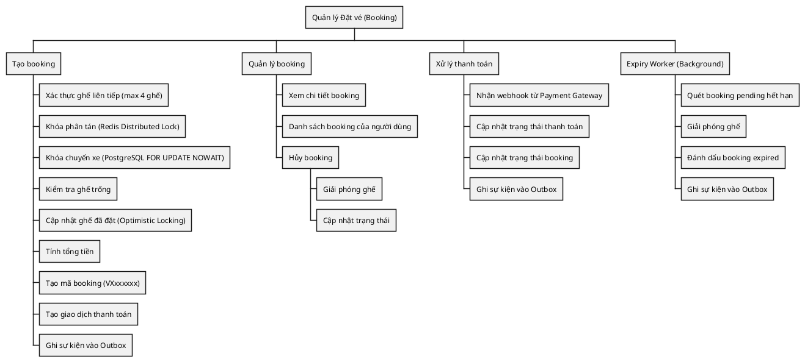

---

## 2. BIỂU ĐỒ USE CASE VÀ ĐẶC TẢ (USE CASE SPECIFICATIONS)

### 2.1. Biểu đồ Use Case

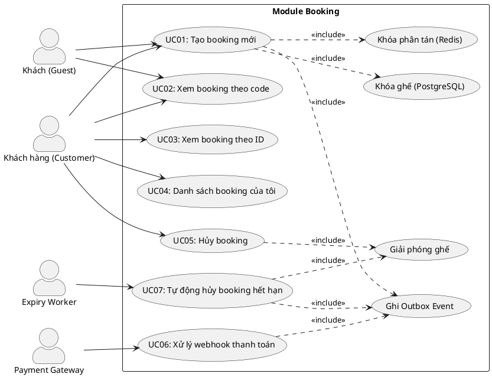

### 2.2. Đặc tả Use Case chi tiết: Tạo booking mới (CreateBooking)

> [!info] Thông tin Use Case
> **Use Case ID:** UC-BK-01
> **Use Case Name:** Tạo booking mới (CreateBooking)
> **Actor:** Guest hoặc Customer
> **Trigger:** Người dùng gửi yêu cầu đặt vé với thông tin ghế, điểm đón/trả, thông tin khách

> [!note] Điều kiện tiên quyết (Pre-conditions)
> 1. Chuyến xe (Trip) đang trong trạng thái "scheduled"
> 2. Các ghế được chọn chưa được đặt
> 3. Số ghế chọn <= 4 và liên tiếp cùng hàng

> [!success] Điều kiện hậu kỳ (Post-conditions)
> 1. Booking được tạo với trạng thái "pending"
> 2. Ghế được đánh dấu đã đặt trong trip
> 3. Giao dịch thanh toán được tạo
> 4. Sự kiện "booking.created" được ghi vào outbox
> 5. Booking có thời gian hết hạn (15 phút)

**Luồng xử lý chính (Normal Flow):**

| Bước | Tác nhân | Hành động |
|------|----------|-----------|
| 1 | Client | Gửi POST request đến `/api/v1/bookings` với body `{tripId, seatCodes, guestInfo, pickupInfo, dropoffInfo, paymentMethod}` |
| 2 | Controller | Bind JSON, validate input, chuyển đổi sang `CreateBookingInput` |
| 3 | UseCase | Gọi `ValidateConsecutiveSeats(seatCodes)` - kiểm tra max 4 ghế, cùng hàng, liên tiếp |
| 4 | UseCase | Gọi `lock.Acquire(ctx, "booking:trip:{tripId}:seats:{seats}", 30s)` - Redis distributed lock |
| 5 | UseCase | Nếu không lấy được lock, trả về `ErrSeatsBeingBooked` |
| 6 | UseCase | Gọi `tripLocker.LockTrip(ctx, tripId)` - PostgreSQL FOR UPDATE NOWAIT |
| 7 | Repository | Thực thi `SELECT * FROM trips WHERE id=$1 FOR UPDATE NOWAIT` |
| 8 | UseCase | Gọi `SeatsAvailable(trip.BookedSeats, seatCodes)` - kiểm tra ghế trống |
| 9 | UseCase | Gọi `tripLocker.UpdateSeatsAtomic(ctx, tripId, seatCodes, count, version)` - optimistic lock |
| 10 | Repository | Thực thi `UPDATE trips SET booked_seats=array_cat(...) WHERE version=$4` |
| 11 | UseCase | Tính `totalAmount = CalculatePrice(basePrice, priceModifier, seatCount)` |
| 12 | UseCase | Tạo BookingCode (VXxxxxxx) và OrderCode (PAYxxxxxxxx) |
| 13 | UseCase | Tạo entity Booking với `ExpiresAt = now + 15 minutes` |
| 14 | UseCase | Gọi `repo.Create(ctx, booking)` - lưu vào database |
| 15 | UseCase | Gọi `paymentRepo.CreateTransaction(ctx, payment)` - tạo giao dịch thanh toán |
| 16 | UseCase | Gọi `outboxRepo.CreateEvent(ctx, "booking.created", payload)` - transactional outbox |
| 17 | UseCase | Giải phóng Redis lock (defer) |
| 18 | Controller | Trả về 201 Created với `BookingOutput{booking, tripInfo, orderCode}` |

**Luồng thay thế (Alternative Flow):**

| Flow ID | Điều kiện | Xử lý |
|---------|-----------|-------|
| AF-1 | Người dùng đã đăng nhập | Bước 2: Lấy userID từ context, gán vào booking |
| AF-2 | Ghế không liên tiếp | Bước 3: Trả về `ErrSeatsNotConsecutive` |
| AF-3 | Quá 4 ghế | Bước 3: Trả về `ErrTooManySeats` |
| AF-4 | Redis lock không khả dụng | Bước 4: Tiếp tục xử lý (degraded mode), chỉ dựa vào PostgreSQL lock |

**Ngoại lệ (Exceptions):**

| Exception | Điều kiện | Rollback Action | HTTP Status |
|-----------|-----------|-----------------|-------------|
| ErrSeatsBeingBooked | Đã có người khác đang đặt ghế này | Không cần (chưa cập nhật DB) | 409 |
| ErrTripLocked | Trip bị lock bởi giao dịch khác | Không cần (NOWAIT fail nhanh) | 409 |
| ErrSeatsNotAvailable | Ghế đã được đặt | Không cần (kiểm tra trước update) | 409 |
| ErrConcurrentModification | Version mismatch | Giải phóng Redis lock | 409 |
| ErrTooManySeats | Quá 4 ghế | Không cần | 400 |
| ErrSeatsNotConsecutive | Ghế không cùng hàng/liên tiếp | Không cần | 400 |
| ErrInvalidGuestInfo | Thiếu tên hoặc SĐT khách | `tripLocker.ReleaseSeats()` | 400 |

### 2.3. Đặc tả Use Case: Hủy booking (CancelBooking)

> [!info] Thông tin Use Case
> **Use Case ID:** UC-BK-05
> **Use Case Name:** Hủy booking (Cancel Booking)
> **Actor:** Customer
> **Trigger:** Khách hàng muốn hủy đặt vé

> [!note] Điều kiện tiên quyết (Pre-conditions)
> 1. Booking tồn tại và thuộc về người dùng hiện tại
> 2. Booking đang trong trạng thái "pending"

> [!success] Điều kiện hậu kỳ (Post-conditions)
> 1. Ghế được giải phóng trở lại trip
> 2. Booking chuyển sang trạng thái "cancelled"
> 3. Sự kiện "booking.cancelled" được ghi vào outbox

**Luồng xử lý chính:**

| Bước | Tác nhân | Hành động |
|------|----------|-----------|
| 1 | Client | Gửi POST request đến `/api/v1/bookings/:id/cancel` |
| 2 | UseCase | Lấy booking từ database theo ID |
| 3 | UseCase | Kiểm tra booking thuộc về user hiện tại |
| 4 | UseCase | Kiểm tra booking đang ở trạng thái "pending" |
| 5 | UseCase | Gọi `tripLocker.ReleaseSeats(tripId, seatCodes, count)` |
| 6 | UseCase | Cập nhật booking status = "cancelled" |
| 7 | UseCase | Ghi event vào outbox |
| 8 | Controller | Trả về 200 OK |

### 2.4. Đặc tả Use Case: Xử lý webhook thanh toán (ConfirmPayment)

> [!info] Thông tin Use Case
> **Use Case ID:** UC-BK-06
> **Use Case Name:** Xử lý webhook thanh toán
> **Actor:** Payment Gateway
> **Trigger:** Payment Gateway gọi webhook thông báo kết quả thanh toán

**Luồng xử lý khi thanh toán thành công:**

| Bước | Tác nhân | Hành động |
|------|----------|-----------|
| 1 | Payment Gateway | POST `/api/v1/bookings/payments/webhook` với body có orderCode, status="success" |
| 2 | Handler | Xác thực chữ ký webhook |
| 3 | UseCase | Tìm payment transaction theo orderCode |
| 4 | UseCase | Cập nhật payment status = "success", paid_at = now |
| 5 | UseCase | Cập nhật booking status = "paid", expires_at = null |
| 6 | UseCase | Ghi event "booking.paid" vào outbox |
| 7 | Handler | Trả về 200 OK |

**Luồng xử lý khi thanh toán thất bại:**

| Bước | Tác nhân | Hành động |
|------|----------|-----------|
| 1 | Payment Gateway | POST webhook với status="failed" hoặc "cancelled" |
| 2 | Handler | Xác thực chữ ký webhook |
| 3 | UseCase | Tìm payment transaction theo orderCode |
| 4 | UseCase | Cập nhật payment status = "failed" |
| 5 | UseCase | Giải phóng ghế: `tripLocker.ReleaseSeats()` |
| 6 | UseCase | Cập nhật booking status = "expired" |
| 7 | Handler | Trả về 200 OK |

---

## 3. THIẾT KẾ CƠ SỞ DỮ LIỆU (DATABASE DESIGN)

### 3.1. Sơ đồ thực thể liên kết (Entity Relationship Diagram - ERD)

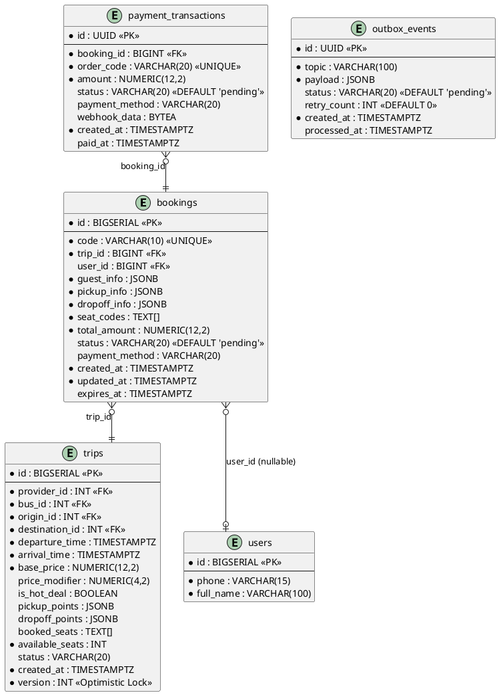

### 3.2. Từ điển dữ liệu (Data Dictionary)

> [!abstract] Bảng: bookings

| Tên trường | Kiểu dữ liệu | Ràng buộc | Mô tả |
|------------|--------------|-----------|-------|
| id | BIGSERIAL | PK, NOT NULL | Khóa chính, tự động tăng |
| code | VARCHAR(10) | UNIQUE, NOT NULL | Mã booking (VXxxxxxxxx) |
| trip_id | BIGINT | FK -> trips.id, NOT NULL | ID chuyến xe |
| user_id | BIGINT | FK -> users.id, NULL | ID người dùng (null nếu là khách vãng lai) |
| guest_info | JSONB | NOT NULL | `{name, phone, email?}` - thông tin khách |
| pickup_info | JSONB | NOT NULL | `{name, time?, surcharge?}` - điểm đón |
| dropoff_info | JSONB | NOT NULL | `{name, time?, surcharge?}` - điểm trả |
| seat_codes | TEXT[] | NOT NULL | Mảng mã ghế (vd: ["A01", "A02"]) |
| total_amount | NUMERIC(12,2) | NOT NULL | Tổng tiền (VND) |
| status | VARCHAR(20) | DEFAULT 'pending' | pending, paid, cancelled, expired |
| payment_method | VARCHAR(20) | NULL | Phương thức thanh toán |
| created_at | TIMESTAMPTZ | DEFAULT NOW() | Thời điểm tạo |
| updated_at | TIMESTAMPTZ | DEFAULT NOW() | Thời điểm cập nhật |
| expires_at | TIMESTAMPTZ | NULL | Thời điểm hết hạn (pending + 15 phút) |

> [!abstract] Bảng: payment_transactions

| Tên trường | Kiểu dữ liệu | Ràng buộc | Mô tả |
|------------|--------------|-----------|-------|
| id | UUID | PK, DEFAULT gen_random_uuid() | Khóa chính |
| booking_id | BIGINT | FK -> bookings.id, NOT NULL | ID booking |
| order_code | VARCHAR(20) | UNIQUE, NOT NULL | Mã đơn hàng (PAYxxxxxxxx) |
| amount | NUMERIC(12,2) | NOT NULL | Số tiền (VND) |
| status | VARCHAR(20) | DEFAULT 'pending' | pending, success, failed |
| payment_method | VARCHAR(20) | NULL | Phương thức thanh toán |
| webhook_data | BYTEA | NULL | Dữ liệu webhook từ payment gateway |
| created_at | TIMESTAMPTZ | DEFAULT NOW() | Thời điểm tạo |
| paid_at | TIMESTAMPTZ | NULL | Thời điểm thanh toán thành công |

> [!abstract] Bảng: outbox_events

| Tên trường | Kiểu dữ liệu | Ràng buộc | Mô tả |
|------------|--------------|-----------|-------|
| id | UUID | PK, DEFAULT gen_random_uuid() | Khóa chính |
| topic | VARCHAR(100) | NOT NULL | Topic sự kiện (booking.created, booking.paid, booking.expired) |
| payload | JSONB | NOT NULL | Nội dung sự kiện |
| status | VARCHAR(20) | DEFAULT 'pending' | pending, processed, failed |
| retry_count | INT | DEFAULT 0 | Số lần thử lại |
| created_at | TIMESTAMPTZ | DEFAULT NOW() | Thời điểm tạo |
| processed_at | TIMESTAMPTZ | NULL | Thời điểm xử lý |

---

## 4. KIẾN TRÚC HỆ THỐNG VÀ LUỒNG XỬ LÝ (SYSTEM ARCHITECTURE)

### 4.1. Kiến trúc mã nguồn

| Lớp (Layer) | Thư mục | File | Trách nhiệm |
|-------------|---------|------|-------------|
| **Domain** | `domain/` | `entity.go` | Entity Booking, PaymentTransaction, TripSnapshot; Value objects: BookingCode, BookingStatus, GuestInfo, PointInfo; Validation: ValidateConsecutiveSeats, SeatsAvailable |
| **Domain** | `domain/` | `dto.go` | DTOs: CreateBookingInput, CancelBookingInput, ListBookingsInput, ConfirmPaymentInput, BookingOutput |
| **Domain** | `domain/` | `ports.go` | Interfaces: Repository, TripLocker, OutboxRepository, PaymentRepository, BookingEventPublisher, DistributedLock |
| **Repository** | `repository/` | `repository.go` | Implement Booking Repository |
| **Repository** | `repository/` | `trip_locker.go` | Implement TripLocker (FOR UPDATE, optimistic lock) |
| **Repository** | `repository/` | `outbox_repository.go` | Implement OutboxRepository |
| **Repository** | `repository/` | `payment_repository.go` | Implement PaymentRepository |
| **Infrastructure** | `infrastructure/` | `distributed_lock.go` | Implement DistributedLock với Redis |
| **UseCase** | `usecase/` | `usecase.go` | Implement IBookingUseCase |
| **UseCase** | `usecase/` | `expiry_worker.go` | Background worker xử lý booking hết hạn |
| **Controller** | `controller/http/` | `handler.go` | HTTP handlers cho booking |
| **Controller** | `controller/http/` | `payment_handler.go` | HTTP handler cho payment webhook |
| **Controller** | `controller/http/` | `routes.go` | Đăng ký routes |

### 4.2. Danh sách API Endpoints

| HTTP Method | Endpoint | Yêu cầu quyền | Mô tả chức năng |
|-------------|----------|---------------|-----------------|
| POST | `/api/v1/bookings` | Public | Tạo booking mới |
| GET | `/api/v1/bookings/code/:code` | Public | Xem booking theo mã code |
| POST | `/api/v1/bookings/payments/webhook` | Public (Signature verify) | Nhận webhook thanh toán |
| GET | `/api/v1/bookings/my` | Bearer Token | Danh sách booking của người dùng |
| GET | `/api/v1/bookings/:id` | Bearer Token | Xem chi tiết booking theo ID |
| POST | `/api/v1/bookings/:id/cancel` | Bearer Token | Hủy booking |

---

## 5. BIỂU ĐỒ TUẦN TỰ (SEQUENCE DIAGRAMS)

### 5.1. Biểu đồ tuần tự: Tạo Booking (Luồng phức tạp nhất)

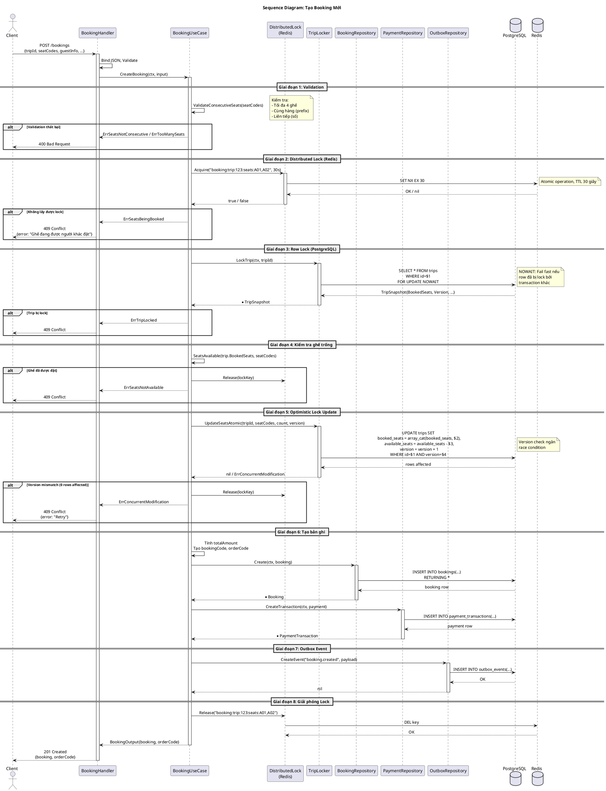

### 5.2. Biểu đồ tuần tự: Expiry Worker (Background Process)

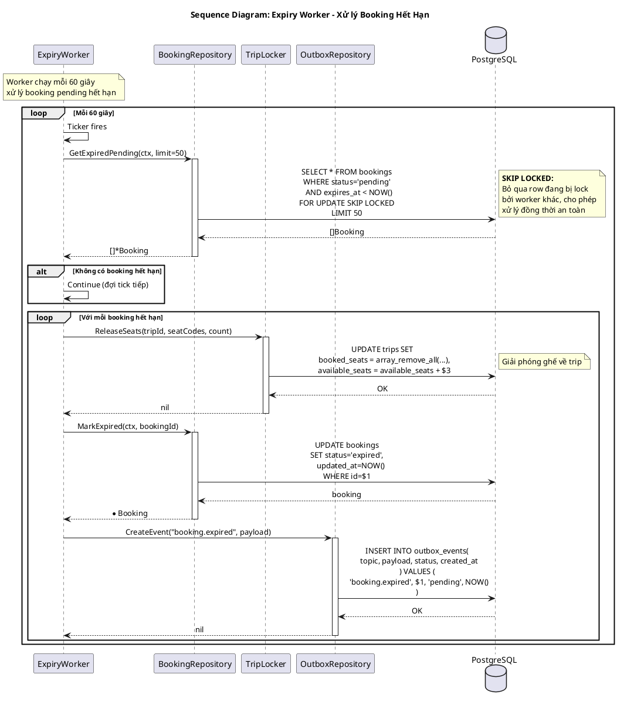

### 5.3. Biểu đồ tuần tự: Xử lý Payment Webhook (Thành công)

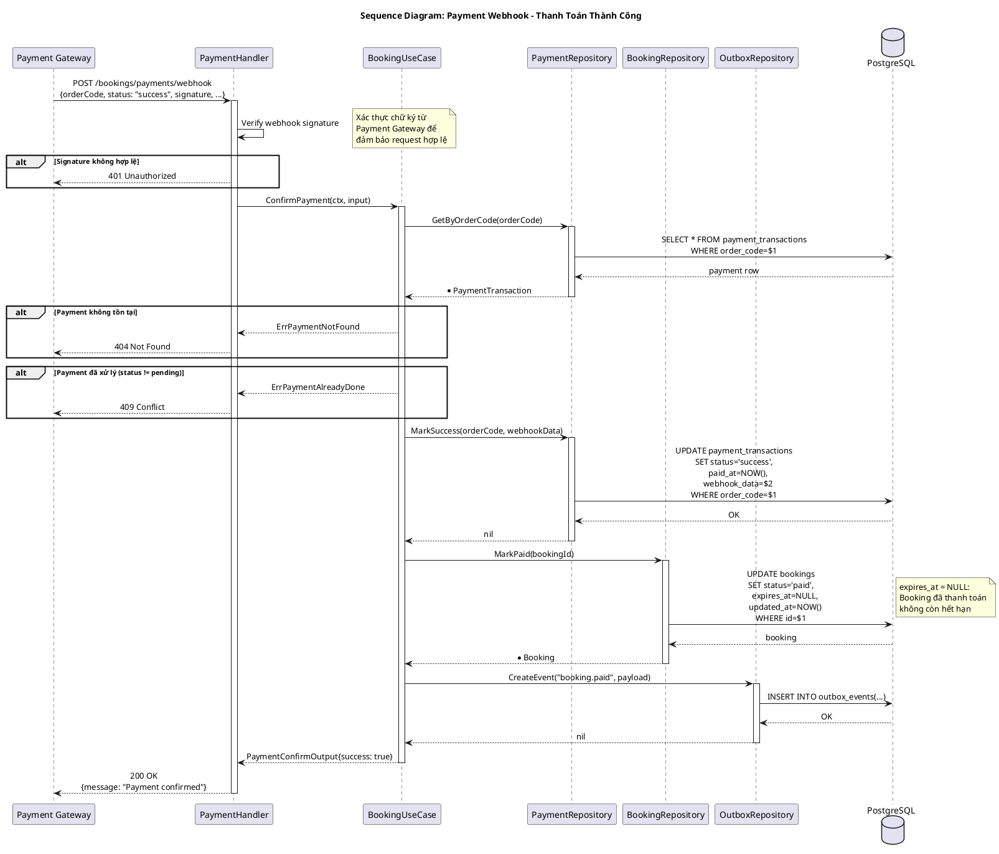

### 5.4. Biểu đồ tuần tự: Xử lý Payment Webhook (Thất bại)

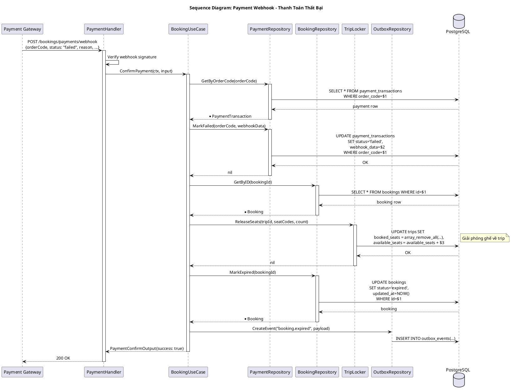

### 5.5. Biểu đồ tuần tự: Hủy Booking

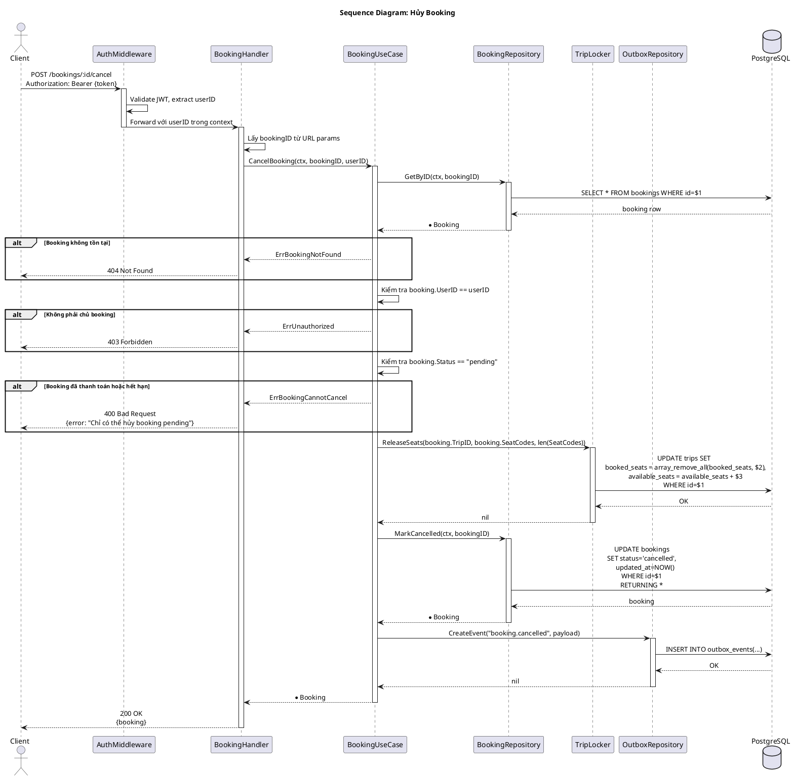

### 5.6. Biểu đồ tuần tự: Xem Danh sách Booking của Tôi

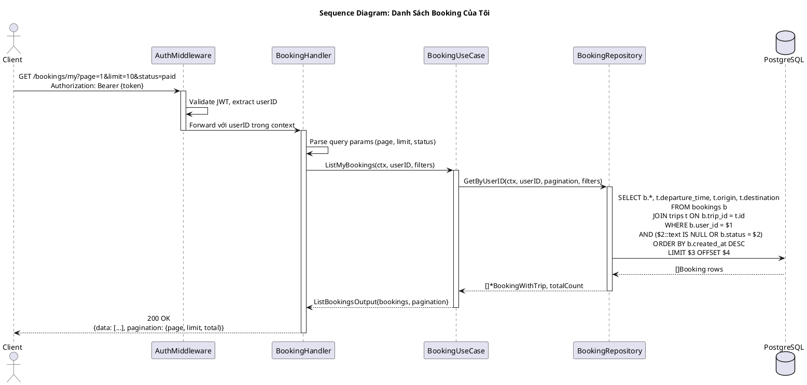

---

## 6. CÁC QUY TẮC NGHIỆP VỤ (BUSINESS RULES)

### 6.1. Quy tắc đặt ghế

| Quy tắc | Mô tả | Code Reference |
|---------|-------|----------------|
| BR-SEAT-01 | Tối đa 4 ghế/booking | `MaxSeatsPerBooking = 4` |
| BR-SEAT-02 | Các ghế phải cùng hàng (cùng prefix) | `ValidateConsecutiveSeats()` |
| BR-SEAT-03 | Số ghế phải liên tiếp (1,2,3 không được 1,3) | `ValidateConsecutiveSeats()` |
| BR-SEAT-04 | Mã ghế theo định dạng: [A-Z]+[0-9]+ | `seatPattern = ^([A-Za-z]+)(\d+)$` |

### 6.2. Quy tắc thời gian

| Quy tắc | Giá trị | Mô tả |
|---------|---------|-------|
| Thời gian giữ ghế | 15 phút | Booking pending hết hạn sau 15 phút |
| Redis lock TTL | 30 giây | Thời gian giữ distributed lock |
| Expiry check interval | 60 giây | Tần suất quét booking hết hạn |
| Expiry batch size | 50 | Số booking xử lý mỗi lần quét |

### 6.3. Mã booking và mã đơn hàng

| Loại mã | Định dạng | Ví dụ |
|---------|-----------|-------|
| Booking Code | VX + 8 hex chars | VX1A2B3C4D |
| Order Code | PAY + 16 hex chars | PAY1A2B3C4D5E6F7G8H |

### 6.4. Công thức tính giá

```go
totalAmount = basePrice * priceModifier * seatCount + pickupSurcharge + dropoffSurcharge
```

### 6.5. Trạng thái booking (State Machine)

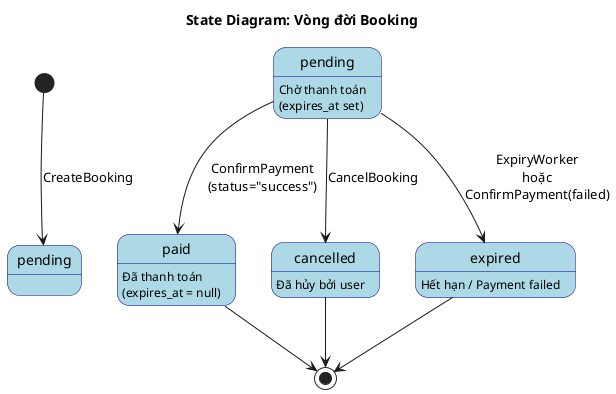

---

## 7. XỬ LÝ RACE CONDITION

### 7.1. Chiến lược đa lớp (Multi-Layer Protection)

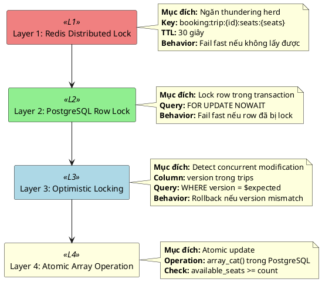

### 7.2. Sử dụng FOR UPDATE SKIP LOCKED trong Expiry Worker

```sql
SELECT * FROM bookings 
WHERE status = 'pending' AND expires_at < NOW()
FOR UPDATE SKIP LOCKED
LIMIT 50;
```

> [!tip] Giải thích
> - **Mục đích:** Cho phép nhiều worker instances xử lý đồng thời mà không bị deadlock
> - **SKIP LOCKED:** Bỏ qua các row đang bị lock bởi worker khác

---

## 8. TRANSACTIONAL OUTBOX PATTERN

### 8.1. Cấu trúc Outbox Event

```json
{
    "eventType": "booking.created",
    "bookingId": 12345,
    "code": "VX1A2B3C4D",
    "tripId": 100,
    "seatCodes": ["A01", "A02"],
    "amount": 500000,
    "status": "pending",
    "orderCode": "PAY1A2B3C4D5E6F7G8H"
}
```

### 8.2. Các topic sự kiện

| Topic | Trigger | Consumer Actions |
|-------|---------|------------------|
| booking.created | CreateBooking thành công | Gửi email xác nhận, cập nhật dashboard |
| booking.paid | ConfirmPayment(success) | Gửi vé điện tử, thông báo nhà xe |
| booking.cancelled | CancelBooking thành công | Gửi email xác nhận hủy |
| booking.expired | ExpiryWorker hoặc ConfirmPayment(failed) | Gửi email thông báo hết hạn |

---

## 9. XỬ LÝ LỖI (ERROR HANDLING)

| Domain Error | HTTP Status | Error Code | Mô tả |
|--------------|-------------|------------|-------|
| ErrSeatsNotAvailable | 409 | SEATS_NOT_AVAILABLE | Ghế đã được đặt |
| ErrSeatsBeingBooked | 409 | SEATS_BEING_BOOKED | Ghế đang được người khác đặt |
| ErrTripLocked | 409 | TRIP_LOCKED | Trip đang bị lock bởi giao dịch khác |
| ErrConcurrentModification | 409 | CONCURRENT_MODIFICATION | Xung đột version (retry) |
| ErrBookingNotFound | 404 | BOOKING_NOT_FOUND | Không tìm thấy booking |
| ErrBookingExpired | 410 | BOOKING_EXPIRED | Booking đã hết hạn |
| ErrBookingCannotCancel | 400 | BOOKING_CANNOT_CANCEL | Chỉ cancel được booking pending |
| ErrTooManySeats | 400 | TOO_MANY_SEATS | Vượt quá 4 ghế |
| ErrSeatsNotConsecutive | 400 | SEATS_NOT_CONSECUTIVE | Ghế không liên tiếp |
| ErrInvalidGuestInfo | 400 | INVALID_GUEST_INFO | Thiếu thông tin khách |
| ErrInvalidSeatCode | 400 | INVALID_SEAT_CODE | Mã ghế không hợp lệ |
| ErrPaymentNotFound | 404 | PAYMENT_NOT_FOUND | Không tìm thấy giao dịch |
| ErrPaymentAlreadyDone | 409 | PAYMENT_ALREADY_DONE | Giao dịch đã xử lý |

---

## 10. PHỤ LỤC

### 10.1. Cấu trúc Request/Response

```json
// POST /bookings - Request
{
    "tripId": 100,
    "seatCodes": ["A01", "A02"],
    "guestInfo": {
        "name": "Nguyễn Văn A",
        "phone": "0912345678",
        "email": "a@example.com"
    },
    "pickupInfo": {
        "name": "Bến xe Miền Đông",
        "time": "06:00"
    },
    "dropoffInfo": {
        "name": "Bến xe Đà Lạt"
    },
    "paymentMethod": "momo"
}

// POST /bookings - Response (201 Created)
{
    "success": true,
    "data": {
        "booking": {
            "id": 12345,
            "code": "VX1A2B3C4D",
            "tripId": 100,
            "seatCodes": ["A01", "A02"],
            "totalAmount": 500000,
            "status": "pending",
            "expiresAt": "2026-02-25T10:15:00Z"
        },
        "orderCode": "PAY1A2B3C4D5E6F7G8H",
        "paymentUrl": "https://pay.momo.vn/..."
    }
}
```
