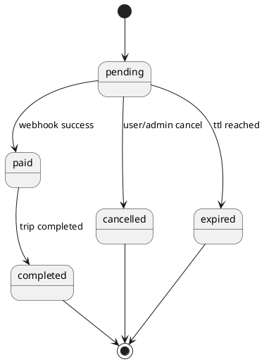
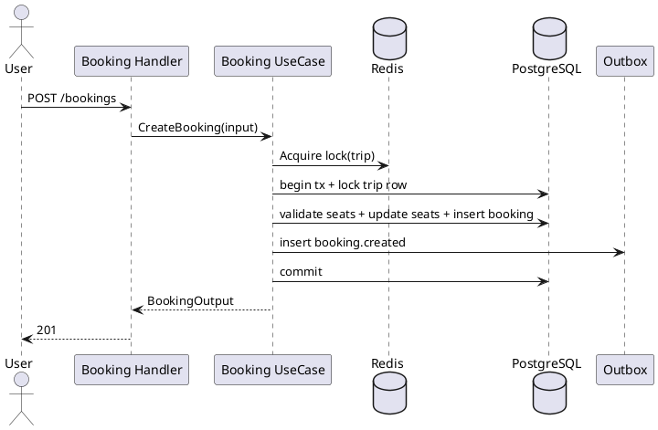

---
tags:
  - module
  - booking
  - payment
  - event-driven
created: 2026-04-01
updated: 2026-04-01
---

# MODULE BOOKING

> [!abstract] Mục tiêu
> Tài liệu mô tả đầy đủ cơ sở lý thuyết và đặc tả triển khai của module Booking trong hệ thống đặt vé xe liên tỉnh, tập trung vào tính đúng đắn giao dịch, kiểm soát đồng thời, phối hợp webhook thanh toán và liên kết kiến trúc hướng sự kiện.

> [!info] Vai trò trong hệ thống
> Booking là miền nghiệp vụ trung tâm. Mọi giá trị của hệ thống (doanh thu, độ tin cậy vận hành, trải nghiệm người dùng) đều quy tụ vào chất lượng thiết kế và triển khai của module này.

---

## 1. Bối cảnh nghiệp vụ và bài toán cốt lõi

Trong môi trường đặt vé trực tuyến, cùng một tài nguyên ghế có thể bị nhiều người dùng truy cập đồng thời. Nếu hệ thống không có cơ chế kiểm soát transaction và khóa tài nguyên phù hợp, nguy cơ overbooking là hiện hữu. Overbooking không chỉ gây lỗi kỹ thuật mà còn tạo thiệt hại nghiệp vụ: hoàn tiền cưỡng bức, tăng chi phí hỗ trợ khách hàng và suy giảm niềm tin thương hiệu.

Bên cạnh đó, quá trình thanh toán trực tuyến diễn ra bất đồng bộ với API tạo booking. Trạng thái payment có thể đến muộn qua webhook, có thể lặp hoặc sai thứ tự. Điều này yêu cầu module Booking phải xử lý state transition thận trọng và idempotent.

Do đó, module được thiết kế quanh ba trụ cột:

1. **Correctness**: không vi phạm bất biến seat/booking/payment.
2. **Concurrency Safety**: chống race condition trong luồng tạo vé.
3. **Operational Resilience**: phối hợp webhook và event-driven không làm mất nhất quán.

---

## 2. Cơ sở lý thuyết áp dụng

### 2.1 ACID transaction trong miền booking

Giao dịch booking yêu cầu tính nguyên tử vì một thao tác tạo vé bao gồm nhiều bước phụ thuộc nhau: kiểm tra ghế, cập nhật ghế, tạo booking, tạo payment transaction (nếu online), và ghi outbox event. Nếu bất kỳ bước nào thất bại, toàn bộ thay đổi phải rollback.

### 2.2 Kiểm soát đồng thời (Concurrency Control)

Module áp dụng phối hợp hai lớp bảo vệ:

- **Distributed lock** ở cấp ứng dụng (theo trip) nhằm giảm cạnh tranh nóng.
- **Row-level lock** trong transaction DB để bảo đảm quyết định cuối cùng dựa trên trạng thái nhất quán.

Mô hình kết hợp giúp giảm xác suất tranh chấp và vẫn giữ chuẩn đúng đắn ở tầng dữ liệu.

### 2.3 Idempotency trong bối cảnh webhook/event

Webhook thanh toán và consumer event đều có thể nhận lặp. Vì vậy, cập nhật trạng thái phải idempotent theo khóa giao dịch. Không giả định exactly-once delivery.

### 2.4 Tách biệt deterministic core và AI-assisted flow

AI có thể hỗ trợ đề xuất hoặc parse lệnh voice, nhưng quyết định tạo booking phải chạy qua cùng một lõi nghiệp vụ deterministic của module Booking.

---

## 3. Mục tiêu chức năng và phi chức năng

### 3.1 Yêu cầu chức năng

| ID | Yêu cầu |
|---|---|
| BK-01 | Tạo booking an toàn trong bối cảnh đồng thời |
| BK-02 | Hủy booking và giải phóng ghế |
| BK-03 | Xử lý webhook thanh toán cập nhật trạng thái |
| BK-04 | Worker expire booking quá hạn thanh toán |
| BK-05 | Voice execute tạo booking `payment_method=cod`, `status=pending` |

### 3.2 Yêu cầu phi chức năng

- Độ tin cậy transaction cao, không mất nhất quán seat/booking.
- Khả năng chịu lỗi tạm thời từ payment/broker.
- Quan sát được toàn bộ vòng đời booking qua log/trace.
- Khả năng mở rộng cho tải cao theo tuyến giờ cao điểm.

---

## 4. Mô hình dữ liệu và bất biến nghiệp vụ

### 4.1 Thực thể chính

- `trips`
- `bookings`
- `payment_transactions`
- `outbox_events`

### 4.2 Bất biến dữ liệu bắt buộc

- `available_seats >= 0`.
- Danh sách ghế đã đặt không được giao nhau giữa các booking active cùng trip.
- Booking online chỉ được đánh dấu `paid` khi transaction tương ứng thành công.
- Booking `cod` không yêu cầu payment link tại thời điểm tạo.

### 4.3 Vòng đời trạng thái booking

---

## 5. Đặc tả Use Case trọng yếu - Create Booking

### 5.1 Thông tin use case

- **ID:** UC-BK-01
- **Primary Actor:** Authenticated User
- **Trigger:** Người dùng xác nhận đặt ghế trên một trip cụ thể.
- **Tiền điều kiện:** Trip tồn tại, ghế hợp lệ, user đã xác thực.
- **Hậu điều kiện:** Booking `pending` được tạo; ghế được cập nhật nhất quán.

### 5.2 Luồng chính

1. Nhận request và validate payload.
2. Acquire distributed lock theo trip.
3. Mở transaction DB, lock row trip.
4. Kiểm tra ghế còn trống.
5. Cập nhật seat allocation nguyên tử.
6. Insert booking `pending`.
7. Nếu online payment, insert payment transaction/link.
8. Insert outbox event `booking.created`.
9. Commit transaction.
10. Trả response thành công.

### 5.3 Luồng thay thế

- Với `payment_method=cod`, bỏ qua bước tạo payment link online.

### 5.4 Ngoại lệ

- `SEATS_BEING_BOOKED` (lock cạnh tranh).
- `SEATS_NOT_AVAILABLE` (ghế đã bị chiếm).
- `INVALID_SEAT_CODE` (mã ghế sai định dạng hoặc không thuộc trip).
- `PAYMENT_LINK_UNAVAILABLE` (chỉ luồng online).

### 5.5 Tiêu chí chấp nhận

- Hai request đồng thời cùng ghế chỉ một request thành công.
- Booking tạo xong luôn phản ánh đúng số ghế còn lại.
- Booking voice execute luôn `cod/pending`.

---

## 6. Thiết kế luồng xử lý đồng thời

### 6.1 Sequence tổng quát

### 6.2 Lý do kiến trúc khóa hai lớp

- Lock ở Redis giảm “thác lũ” request đổ vào DB cùng lúc.
- Lock row DB bảo đảm quyết định cuối cùng theo dữ liệu nhất quán.
- Cấu trúc này cân bằng giữa hiệu năng và an toàn dữ liệu.

### 6.3 Kịch bản tranh chấp điển hình

Hai user cùng đặt ghế A1:

1. Cả hai request tới gần đồng thời.
2. Request 1 lấy lock trước, request 2 chờ hoặc bị từ chối mềm.
3. Request 1 commit thành công cập nhật ghế.
4. Request 2 kiểm tra lại thấy ghế không còn và trả conflict.

Kết quả: không có overbooking.

---

## 7. Tích hợp thanh toán và webhook

### 7.1 Vai trò webhook

Webhook là cơ chế đồng bộ bất đồng bộ trạng thái thanh toán từ cổng thanh toán về hệ thống. Module Booking không dựa vào callback frontend để xác nhận thanh toán cuối cùng.

### 7.2 Quy trình xử lý webhook

1. Xác thực nguồn gửi webhook.
2. Parse payload và chuẩn hóa dữ liệu.
3. Tra cứu transaction theo khóa idempotency.
4. Áp dụng state transition hợp lệ.
5. Cập nhật booking tương ứng.
6. Ghi event hậu xử lý (`booking.paid` hoặc tương đương).

### 7.3 Ràng buộc idempotency

- Cùng `order_code` xử lý nhiều lần không tạo trạng thái sai.
- Transition từ `paid` sang trạng thái chưa thanh toán bị chặn trừ khi policy đặc biệt.

---

## 8. Liên kết Event-Driven và Outbox

### 8.1 Quan hệ với MODULE_EVENT_DRIVEN_BOOKING_PLAN

Booking là producer chính của event nghiệp vụ. Mỗi mutation quan trọng của booking phải đi kèm một outbox event trong cùng transaction để phục vụ tích hợp downstream đáng tin cậy.

### 8.2 Event phát sinh từ Booking

- `booking.created`
- `booking.paid`
- `booking.cancelled`
- `booking.expired`

### 8.3 Nguyên tắc publish an toàn

- Không publish trực tiếp trong request path nếu phá vỡ latency SLO.
- Ưu tiên outbox worker để chuẩn hóa retry/quan sát.

---

## 9. Luồng voice execute trong miền booking

### 9.1 Ràng buộc nghiệp vụ

- Voice execute sử dụng `payment_method=cod`.
- Booking trả về trạng thái `pending`.
- Không tạo payment link online cho voice execute mặc định.

### 9.2 Lợi ích thiết kế

- Giảm phụ thuộc vào cổng thanh toán trong luồng voice nhanh.
- Tăng tỷ lệ hoàn tất đặt vé trong tình huống thao tác tối giản.
- Giữ toàn vẹn quy tắc booking vì vẫn đi qua core use case.

---

## 10. Yêu cầu phi chức năng chi tiết

### 10.1 Performance

- Thời gian giữ lock tối thiểu cần thiết.
- Tách truy vấn read-heavy khỏi write path nơi có thể.

### 10.2 Reliability

- Retry có kiểm soát cho thao tác ngoại vi.
- Worker expire chạy định kỳ để dọn booking pending quá hạn.

### 10.3 Security

- Validate input ở boundary.
- Kiểm soát quyền hủy booking theo vai trò/chủ sở hữu.
- Bảo vệ endpoint webhook bằng cơ chế xác thực nguồn.

### 10.4 Observability

- Log bắt buộc có `booking_id`, `trip_id`, `user_id`, `trace_id`.
- Metrics theo dõi tỷ lệ conflict, tỷ lệ expire, tỷ lệ webhook success.

---

## 11. Phân tích rủi ro và chiến lược giảm thiểu

### 11.1 Rủi ro race condition còn sót

- **Nguyên nhân:** lock không bao phủ đủ miền cạnh tranh.
- **Giảm thiểu:** chuẩn hóa khóa theo `trip_id`, kiểm chứng bằng stress test.

### 11.2 Rủi ro timeout thanh toán

- **Nguyên nhân:** gateway trễ hoặc mất callback tức thời.
- **Giảm thiểu:** webhook là nguồn sự thật, worker expire xử lý tồn đọng.

### 11.3 Rủi ro sai lệch trạng thái liên module

- **Nguyên nhân:** tích hợp bất đồng bộ lỗi hoặc out-of-order.
- **Giảm thiểu:** outbox + idempotent consumer + transition guard.

---

## 12. Kế hoạch kiểm thử module

### 12.1 Unit tests

- Validate seat set hợp lệ.
- Kiểm tra transition trạng thái booking.
- Kiểm tra policy voice `cod/pending`.

### 12.2 Integration tests

- Tạo booking đồng thời cùng trip.
- Nhận webhook success/failed/cancelled.
- Expire worker giải phóng ghế đúng hạn.

### 12.3 Stress tests

- Mô phỏng burst traffic giờ cao điểm.
- Đo tỷ lệ conflict hợp lý và không overbooking.

### 12.4 Tiêu chí nghiệm thu

- Không phát sinh overbooking trong test đồng thời.
- Webhook duplicate không gây sai trạng thái.
- Luồng voice execute luôn tuân thủ `cod/pending`.

---

## 13. Quy chuẩn vận hành production

- Thiết lập cảnh báo khi conflict ratio tăng bất thường.
- Theo dõi backlog booking pending gần ngưỡng expire.
- Có playbook xử lý sự cố webhook trễ/lặp.
- Có quy trình đối soát booking-payment theo chu kỳ.

---

## 14. Khả năng mở rộng và tiến hóa

- Tách read model phục vụ truy vấn lịch sử booking lớn.
- Hỗ trợ nhiều phương thức thanh toán với lớp anti-corruption.
- Mở rộng policy dynamic hold seat trong giai đoạn pre-booking.

---

## 15. Tiêu chí chấp nhận tổng hợp

- Module bảo toàn bất biến dữ liệu ghế/booking/payment.
- Luồng tạo vé chịu được cạnh tranh cao và không mất nhất quán.
- Webhook và event-driven tích hợp an toàn, idempotent.
- Tài liệu nghiệp vụ và hành vi triển khai khớp nhau.
