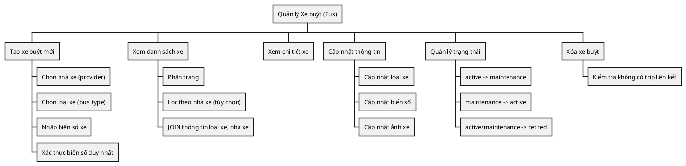
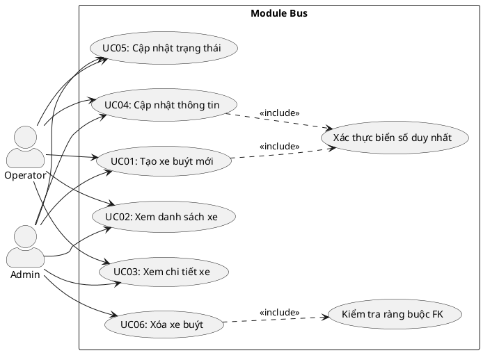
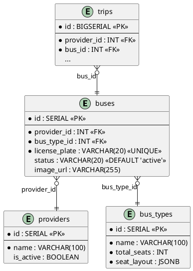
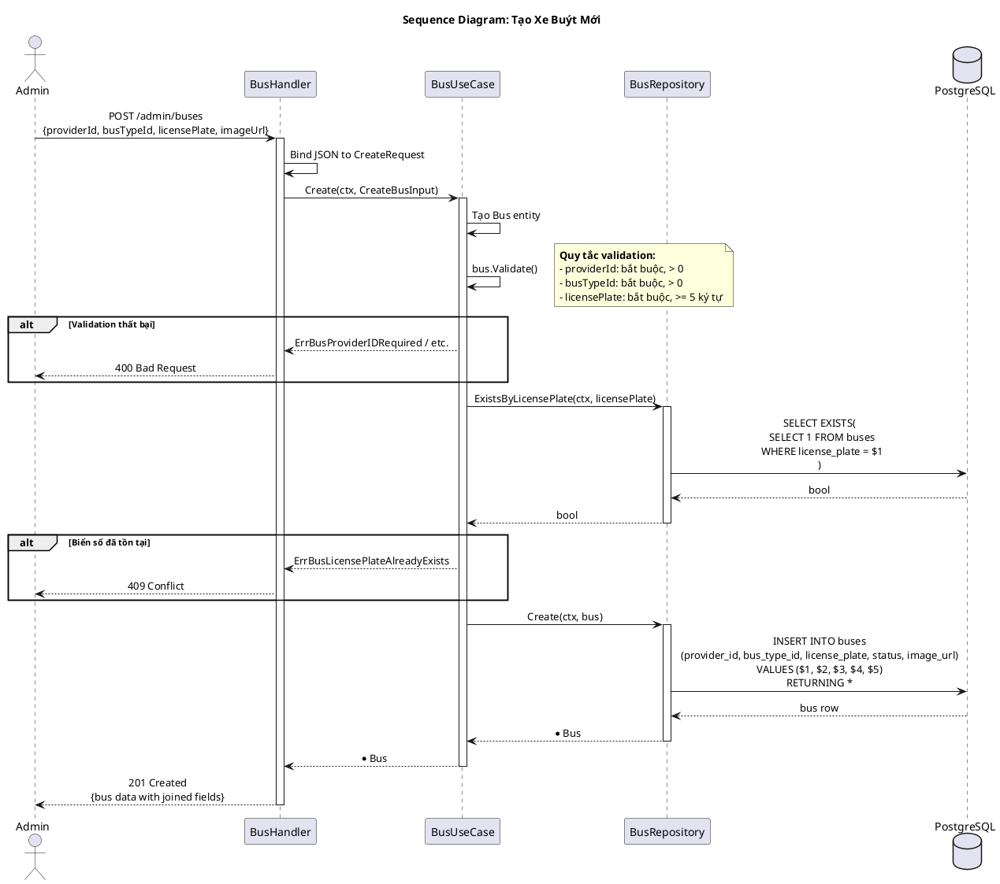
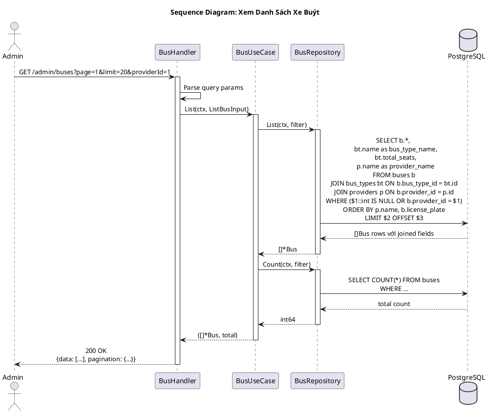
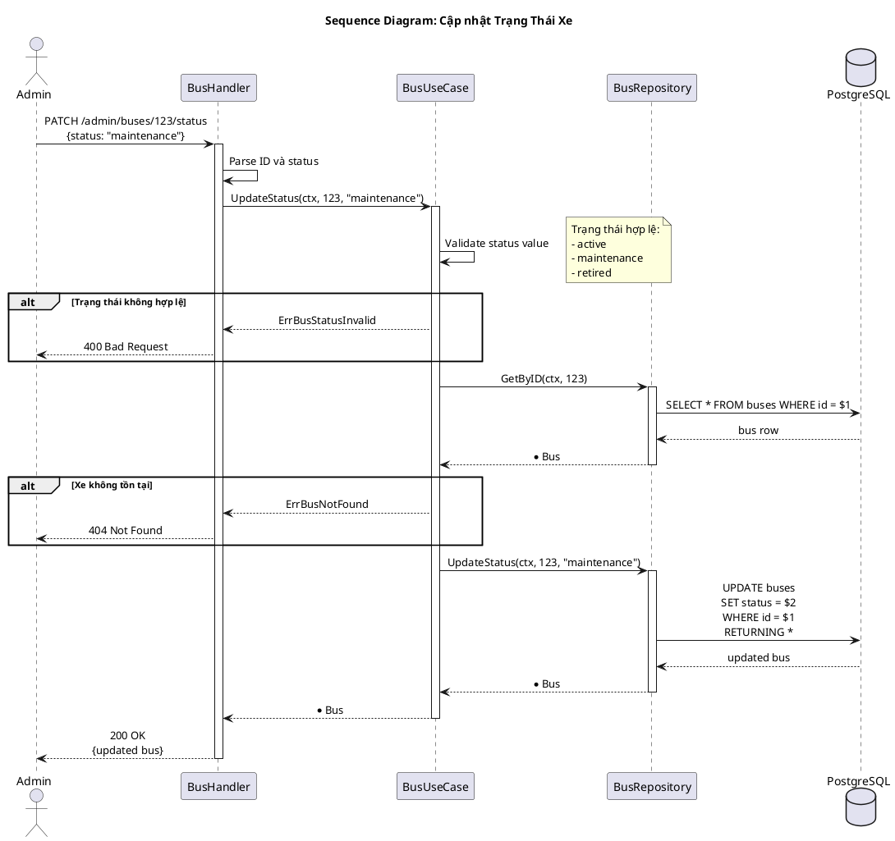
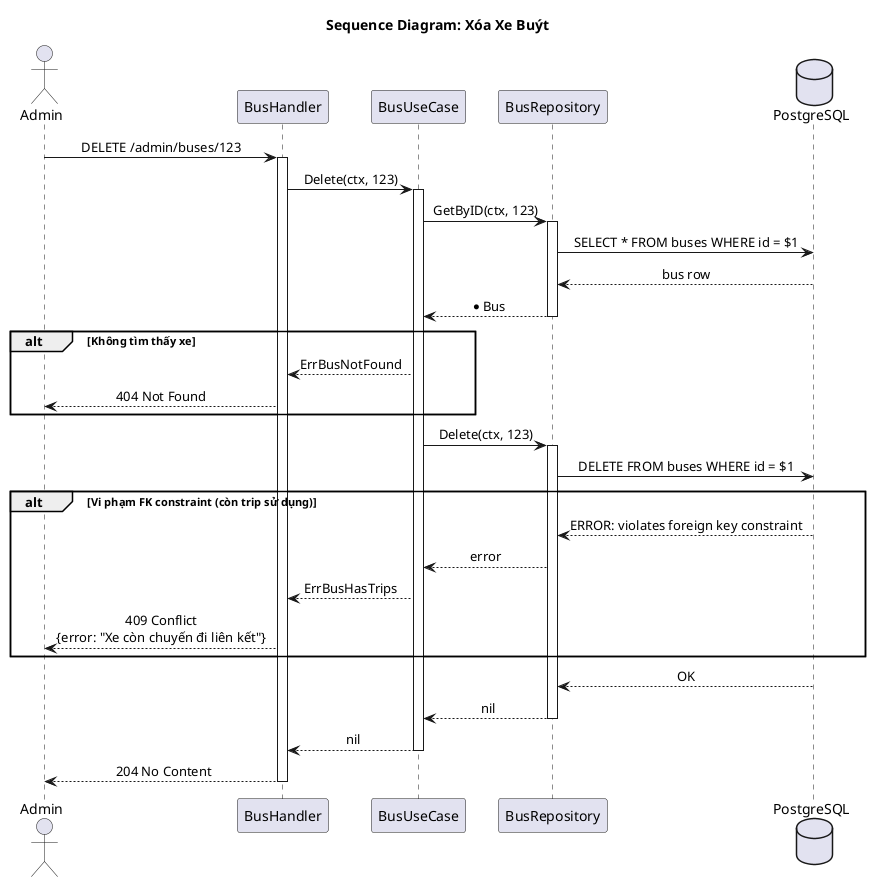
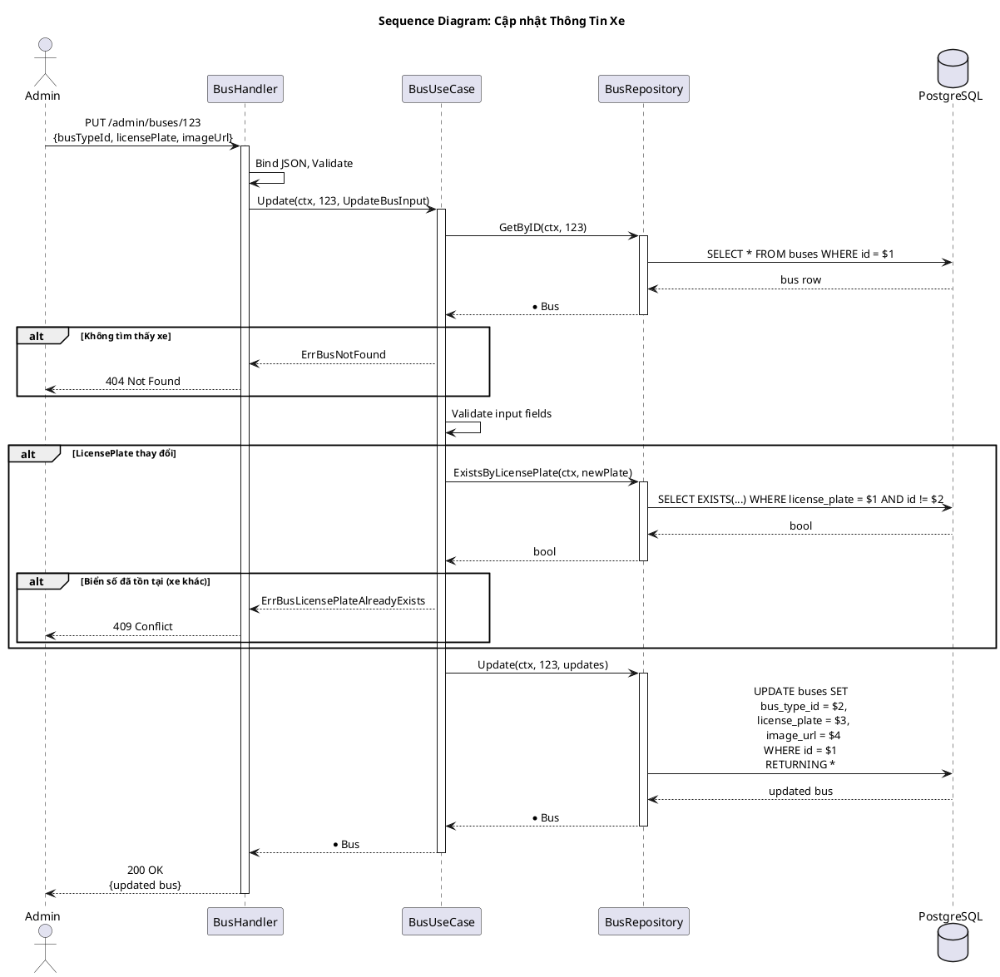
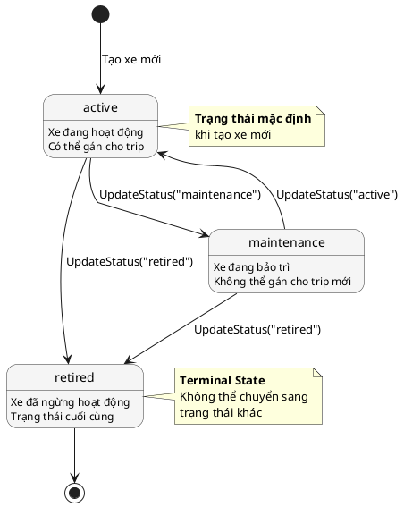

---
tags:
  - srs
  - system-design
  - bus
  - vehicle
created: 2026-02-25
updated: 2026-02-25
---

# TÀI LIỆU ĐẶC TẢ VÀ THIẾT KẾ MODULE: BUS (XE BUÝT)

> [!abstract] TỔNG QUAN
> Module Bus quản lý thông tin các xe buýt trong hệ thống đặt vé. Mỗi xe buýt thuộc về một nhà xe (Provider) và có một loại xe (BusType) xác định số ghế và cách bố trí. Module cung cấp CRUD đầy đủ cho quản trị viên để quản lý đội xe, bao gồm thông tin biển số, trạng thái hoạt động (active, maintenance, retired) và ảnh xe. Đây là module admin-only, không có public API.

---

## 1. ĐẶC TẢ YÊU CẦU (SOFTWARE REQUIREMENT SPECIFICATION)

### 1.1. Danh sách yêu cầu chức năng (Functional Requirements)

| ID | Tên chức năng | Mức độ ưu tiên | Độ phức tạp | Tác nhân (Actor) |
|-----|---------------|----------------|-------------|------------------|
| BUS-01 | Tạo xe buýt mới | P1 | L | Admin/Operator |
| BUS-02 | Xem danh sách xe buýt | P1 | M | Admin/Operator |
| BUS-03 | Xem chi tiết xe buýt | P2 | L | Admin/Operator |
| BUS-04 | Cập nhật thông tin xe | P2 | L | Admin/Operator |
| BUS-05 | Cập nhật trạng thái xe | P1 | L | Admin/Operator |
| BUS-06 | Xóa xe buýt | P3 | M | Admin |

### 1.2. Biểu đồ phân cấp chức năng (Functional Hierarchy)



---

## 2. BIỂU ĐỒ USE CASE VÀ ĐẶC TẢ (USE CASE SPECIFICATIONS)

### 2.1. Biểu đồ Use Case



### 2.2. Đặc tả Use Case: Cập nhật trạng thái xe (UpdateStatus)

> [!info] Thông tin Use Case
> **Use Case ID:** UC-BUS-05
> **Use Case Name:** Cập nhật trạng thái xe (UpdateStatus)
> **Actor:** Admin hoặc Operator
> **Trigger:** Người dùng chọn trạng thái mới cho xe

> [!note] Điều kiện tiên quyết (Pre-conditions)
> 1. Xe buýt tồn tại trong hệ thống
> 2. Trạng thái mới nằm trong danh sách hợp lệ

> [!success] Điều kiện hậu kỳ (Post-conditions)
> Trạng thái xe được cập nhật

**Luồng xử lý chính (Normal Flow):**

| Bước | Tác nhân | Hành động |
|------|----------|-----------|
| 1 | Admin | Gửi PATCH request đến `/api/v1/admin/buses/:id/status` với `{status: "maintenance"}` |
| 2 | Controller | Parse ID và status từ request |
| 3 | UseCase | Validate status value (active/maintenance/retired) |
| 4 | UseCase | Gọi `repository.UpdateStatus(ctx, id, status)` |
| 5 | Repository | Thực thi `UPDATE buses SET status = $2 WHERE id = $1 RETURNING *` |
| 6 | Controller | Trả về thông tin xe đã cập nhật |

### 2.3. Trạng thái hợp lệ

| Trạng thái | Mô tả | Transition cho phép |
|------------|-------|---------------------|
| active | Xe đang hoạt động | → maintenance, retired |
| maintenance | Xe đang bảo trì | → active, retired |
| retired | Xe đã ngừng hoạt động | (terminal state) |

---

## 3. THIẾT KẾ CƠ SỞ DỮ LIỆU (DATABASE DESIGN)

### 3.1. Sơ đồ thực thể liên kết (Entity Relationship Diagram - ERD)



### 3.2. Từ điển dữ liệu (Data Dictionary)

> [!abstract] Bảng: buses

| Tên trường | Kiểu dữ liệu | Ràng buộc | Mô tả |
|------------|--------------|-----------|-------|
| id | SERIAL | PK, NOT NULL | Khóa chính, tự động tăng |
| provider_id | INT | FK → providers.id, NOT NULL | ID nhà xe sở hữu |
| bus_type_id | INT | FK → bus_types.id, NOT NULL | ID loại xe |
| license_plate | VARCHAR(20) | UNIQUE, NOT NULL | Biển số xe (tối thiểu 5 ký tự) |
| status | VARCHAR(20) | DEFAULT 'active' | Trạng thái: active, maintenance, retired |
| image_url | VARCHAR(255) | NULL | URL ảnh xe |

### 3.3. Ví dụ dữ liệu

| id | provider_id | bus_type_id | license_plate | status | image_url |
|----|-------------|-------------|---------------|--------|-----------|
| 1 | 1 | 2 | 51B-12345 | active | https://cdn.example.com/buses/51b-12345.jpg |
| 2 | 1 | 2 | 51B-12346 | maintenance | |
| 3 | 2 | 1 | 50A-99999 | active | |

---

## 4. KIẾN TRÚC HỆ THỐNG VÀ LUỒNG XỬ LÝ (SYSTEM ARCHITECTURE)

### 4.1. Kiến trúc mã nguồn

| Lớp (Layer) | Thư mục | File | Trách nhiệm |
|-------------|---------|------|-------------|
| **Domain** | `domain/` | `entity.go` | Entity Bus; Validation methods; DTOs |
| **Domain** | `domain/` | `ports.go` | Interface: Repository |
| **Repository** | `repository/` | `repository.go` | Implement Repository interface |
| **UseCase** | `usecase/` | `usecase.go` | Implement IBusUseCase |
| **Controller** | `controller/http/` | `handler.go` | HTTP handlers |
| **Controller** | `controller/http/` | `routes.go` | Đăng ký routes |

### 4.2. Danh sách API Endpoints

| HTTP Method | Endpoint | Yêu cầu quyền | Mô tả chức năng |
|-------------|----------|---------------|-----------------|
| POST | `/api/v1/admin/buses` | Admin/Operator | Tạo xe buýt mới |
| GET | `/api/v1/admin/buses` | Admin/Operator | Danh sách xe (phân trang, filter) |
| GET | `/api/v1/admin/buses/:id` | Admin/Operator | Chi tiết xe buýt |
| PUT | `/api/v1/admin/buses/:id` | Admin/Operator | Cập nhật thông tin xe |
| PATCH | `/api/v1/admin/buses/:id/status` | Admin/Operator | Cập nhật trạng thái |
| DELETE | `/api/v1/admin/buses/:id` | Admin | Xóa xe buýt |

---

## 5. BIỂU ĐỒ TUẦN TỰ (SEQUENCE DIAGRAMS)

### 5.1. Biểu đồ tuần tự: Tạo xe buýt mới



### 5.2. Biểu đồ tuần tự: Xem danh sách xe buýt (với JOIN)



### 5.3. Biểu đồ tuần tự: Cập nhật trạng thái xe



### 5.4. Biểu đồ tuần tự: Xóa xe buýt



### 5.5. Biểu đồ tuần tự: Cập nhật thông tin xe



---

## 6. MÁY TRẠNG THÁI (STATE MACHINE)

### 6.1. Biểu đồ máy trạng thái của Bus



---

## 7. CÁC QUY TẮC NGHIỆP VỤ (BUSINESS RULES)

### 7.1. Quy tắc xác thực

| Trường | Quy tắc | Điều kiện |
|--------|---------|-----------|
| provider_id | Bắt buộc, phải tồn tại | `provider_id > 0`, FK constraint |
| bus_type_id | Bắt buộc, phải tồn tại | `bus_type_id > 0`, FK constraint |
| license_plate | Bắt buộc, duy nhất, tối thiểu 5 ký tự | `len(plate) >= 5`, UNIQUE constraint |
| status | Hợp lệ | `IN ('active', 'maintenance', 'retired')` |

### 7.2. Quy tắc xóa xe

| Quy tắc | Mô tả |
|---------|-------|
| BR-DEL-01 | Không xóa được nếu còn trip sử dụng xe này |
| BR-DEL-02 | Nên chuyển sang "retired" thay vì xóa |

### 7.3. Quy tắc sử dụng trong trip

| Quy tắc | Mô tả |
|---------|-------|
| BR-TRIP-01 | Chỉ xe có status = 'active' mới được gán cho trip |
| BR-TRIP-02 | Xe phải thuộc cùng provider với trip |

---

## 8. XỬ LÝ LỖI (ERROR HANDLING)

| Domain Error | HTTP Status | Error Code | Mô tả |
|--------------|-------------|------------|-------|
| ErrBusNotFound | 404 | BUS_NOT_FOUND | Không tìm thấy xe |
| ErrBusProviderIDRequired | 400 | BUS_PROVIDER_REQUIRED | Thiếu nhà xe |
| ErrBusBusTypeIDRequired | 400 | BUS_TYPE_REQUIRED | Thiếu loại xe |
| ErrBusLicensePlateRequired | 400 | LICENSE_PLATE_REQUIRED | Thiếu biển số |
| ErrBusLicensePlateTooShort | 400 | LICENSE_PLATE_TOO_SHORT | Biển số quá ngắn |
| ErrBusStatusInvalid | 400 | BUS_STATUS_INVALID | Trạng thái không hợp lệ |
| ErrBusLicensePlateAlreadyExists | 409 | LICENSE_PLATE_EXISTS | Biển số đã tồn tại |
| ErrBusHasTrips | 409 | BUS_HAS_TRIPS | Xe còn chuyến đi liên kết |

---

## 9. CẤU TRÚC DỮ LIỆU RESPONSE

### 9.1. BusResponse

```json
{
    "id": 1,
    "providerId": 1,
    "providerName": "Phương Trang",
    "busTypeId": 2,
    "busTypeName": "Giường nằm 40 chỗ",
    "totalSeats": 40,
    "licensePlate": "51B-12345",
    "status": "active",
    "imageUrl": "https://cdn.example.com/buses/51b-12345.jpg"
}
```

### 9.2. ListBusesResponse

```json
{
    "data": [
        {
            "id": 1,
            "providerName": "Phương Trang",
            "busTypeName": "Giường nằm 40 chỗ",
            "totalSeats": 40,
            "licensePlate": "51B-12345",
            "status": "active"
        }
    ],
    "pagination": {
        "page": 1,
        "limit": 20,
        "total": 100,
        "totalPages": 5
    }
}
```

---

## 10. TỐI ƯU QUERY

### 10.1. Khuyến nghị Index

```sql
-- Index cho tìm kiếm theo nhà xe
CREATE INDEX idx_buses_provider ON buses (provider_id);

-- Index cho tìm kiếm theo loại xe
CREATE INDEX idx_buses_bus_type ON buses (bus_type_id);

-- Index cho lọc theo trạng thái
CREATE INDEX idx_buses_status ON buses (status) WHERE status = 'active';

-- UNIQUE constraint tự động tạo index cho license_plate
```

### 10.2. Joined Query Example

```sql
SELECT b.*, 
       bt.name AS bus_type_name, 
       bt.total_seats, 
       p.name AS provider_name
FROM buses b
JOIN bus_types bt ON b.bus_type_id = bt.id
JOIN providers p ON b.provider_id = p.id
WHERE b.provider_id = $1
ORDER BY p.name, b.license_plate
LIMIT $2 OFFSET $3;
```
