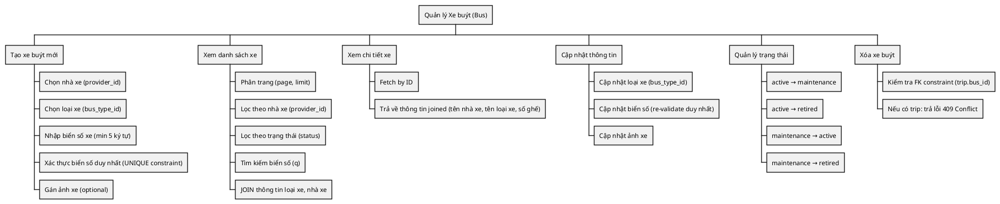
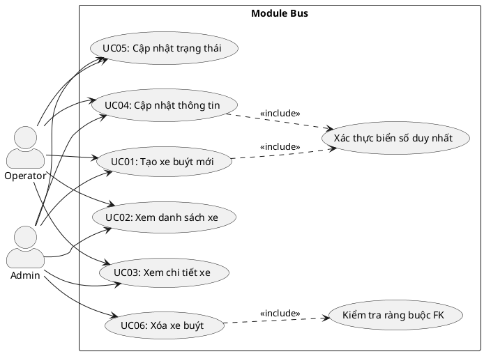
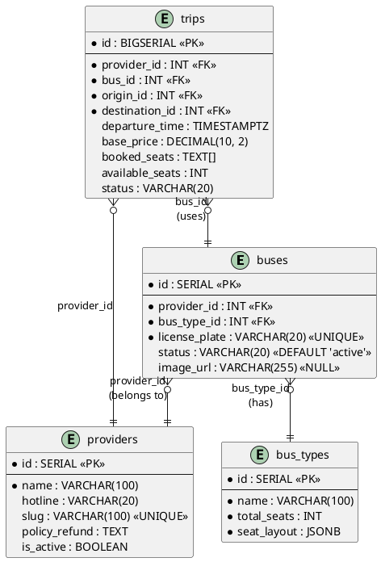
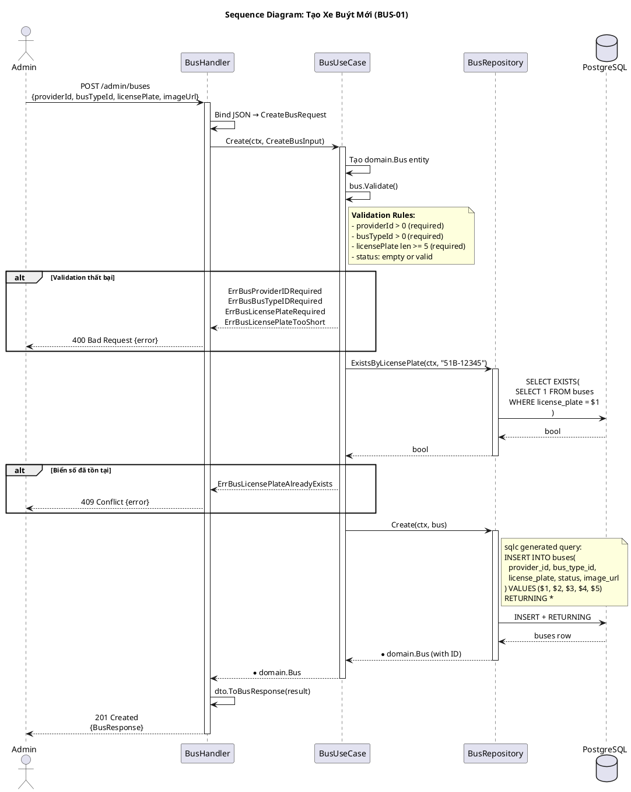
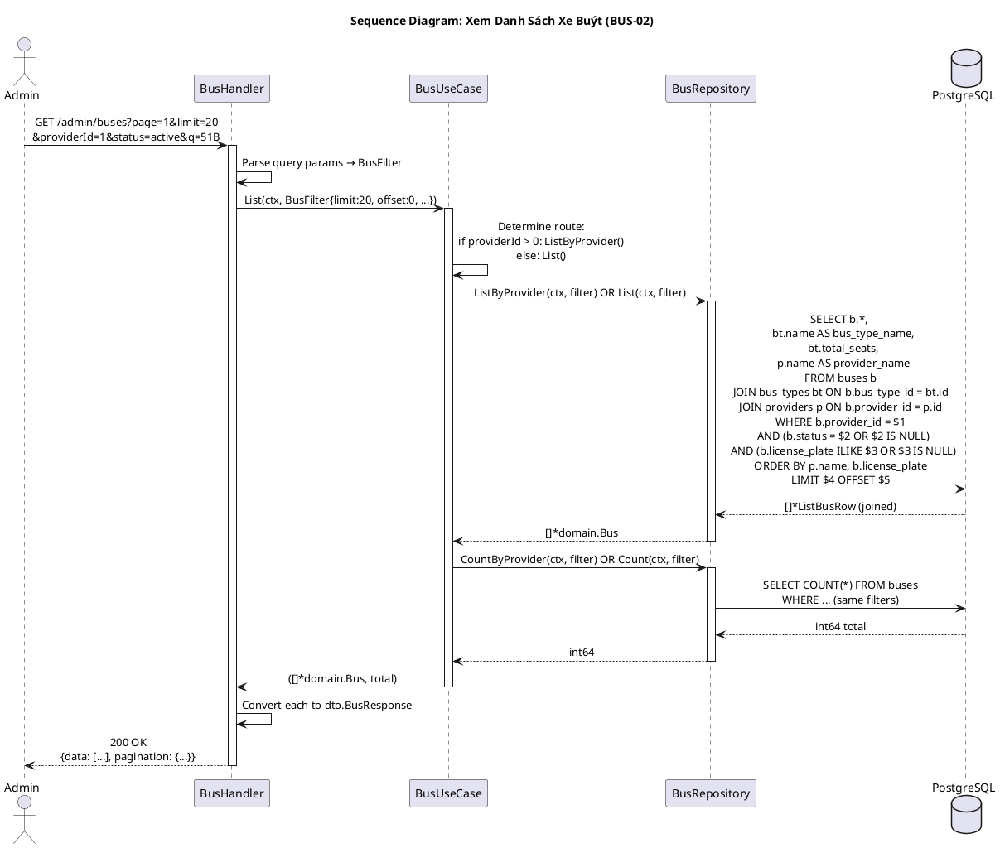
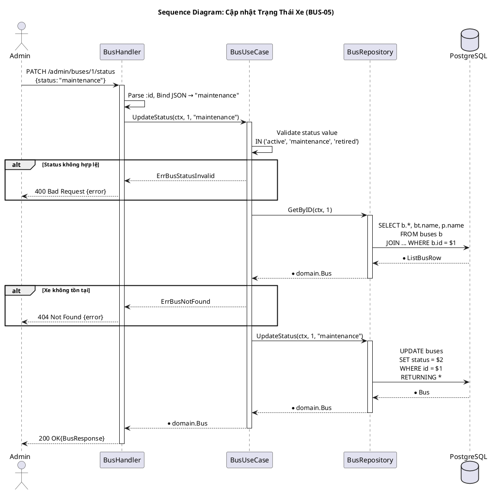
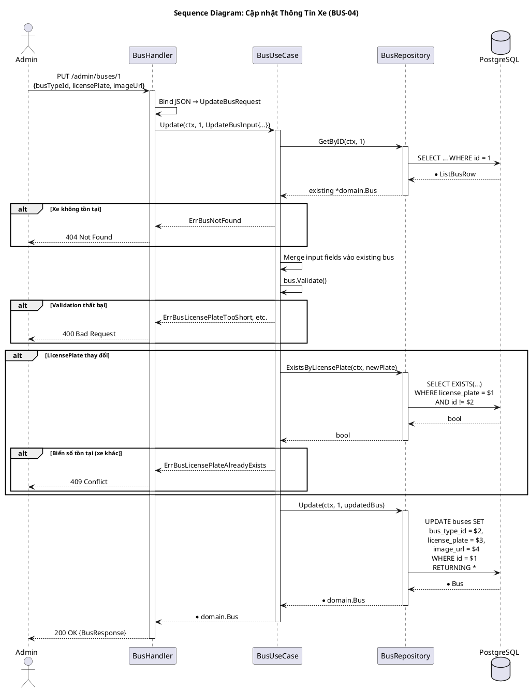
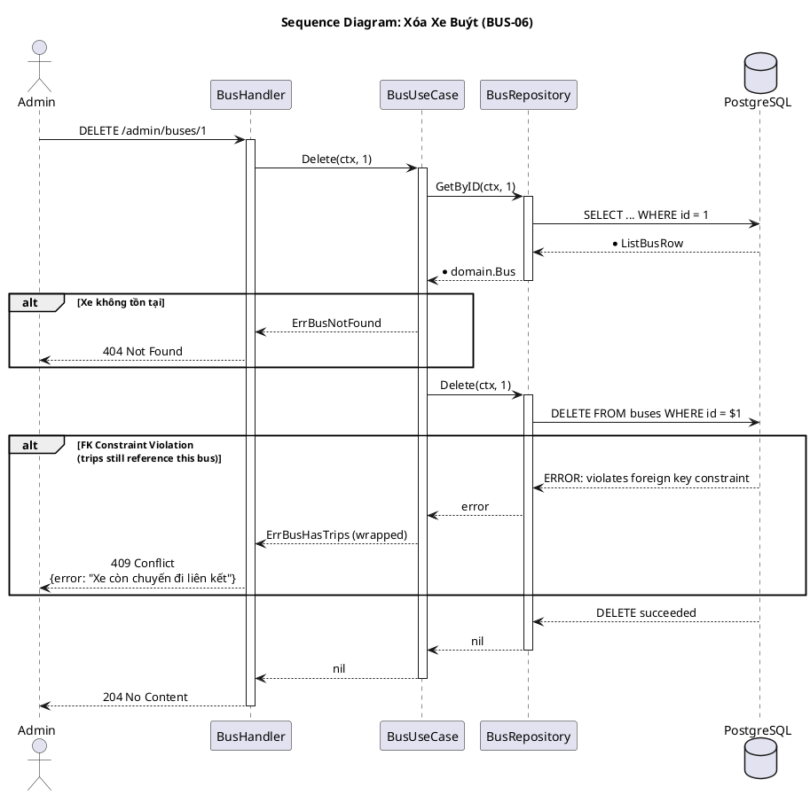
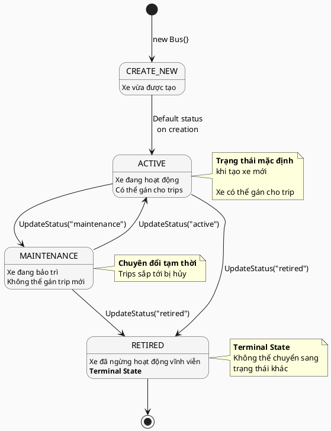

---
tags:
  - srs
  - system-design
  - bus
  - vehicle
  - admin-module
created: 2026-04-06
updated: 2026-04-06
---

# TÀI LIỆU ĐẶC TẢ VÀ THIẾT KẾ MODULE: BUS (XE BUÝT)

> [!abstract] TỔNG QUAN
> Module Bus quản lý thông tin các xe buýt trong hệ thống đặt vé xe liên tỉnh. Mỗi xe buýt là một **cá thể vật lý** được gán biển số riêng, thuộc về một nhà xe (Provider) và có một loại xe (BusType) xác định số ghế và cách bố trí. Module cung cấp CRUD đầy đủ cho quản trị viên/nhà xe nhằm quản lý đội xe, bao gồm:
> - Thêm/xóa/cập nhật xe từ tổ hợp xe của nhà xe
> - Quản lý trạng thái hoạt động (active, maintenance, retired)
> - Theo dõi ảnh xe và metadata
> - Lọc/tìm kiếm theo biển số, nhà xe, trạng thái
>
> **Phạm vi**: Admin-only APIs. Không có public endpoints. Mỗi xe chỉ được xóa khi không còn trip sử dụng (FK constraint).

---

## 1. ĐẶC TẢ YÊU CẦU (SOFTWARE REQUIREMENT SPECIFICATION)

### 1.1. Danh sách yêu cầu chức năng (Functional Requirements)

| ID | Tên chức năng | Mô tả | Mức độ ưu tiên | Độ phức tạp | Tác nhân (Actor) |
|-----|---------------|-------|----------------|-------------|------------------|
| BUS-01 | Tạo xe buýt mới | Admin/Operator tạo cá thể xe mới với biển số duy nhất, gán loại xe và nhà xe | P1 | M | Admin/Operator |
| BUS-02 | Xem danh sách xe buýt | Lấy danh sách xe với phân trang, lọc theo nhà xe, trạng thái, tìm kiếm biển số | P1 | M | Admin/Operator |
| BUS-03 | Xem chi tiết xe buýt | Lấy thông tin chi tiết một xe (kèm tên nhà xe, loại xe, số ghế) | P2 | L | Admin/Operator |
| BUS-04 | Cập nhật thông tin xe | Chỉnh sửa loại xe, biển số, ảnh xe, xác thực duy nhất | P2 | M | Admin/Operator |
| BUS-05 | Cập nhật trạng thái xe | Chuyển trạng thái xe (active ↔ maintenance, retired) | P1 | L | Admin/Operator |
| BUS-06 | Xóa xe buýt | Xóa xe khỏi hệ thống (chỉ nếu không có trip sử dụng) | P3 | M | Admin |

### 1.2. Biểu đồ phân cấp chức năng (Functional Hierarchy)



---

## 2. BIỂU ĐỒ USE CASE VÀ ĐẶC TẢ (USE CASE SPECIFICATIONS)

### 2.1. Biểu đồ Use Case



### 2.2. Đặc tả Use Case: Cập nhật trạng thái xe (UpdateStatus)

> [!info] Thông tin Use Case
> **Use Case ID:** UC-BUS-05
> **Use Case Name:** Cập nhật trạng thái xe (UpdateStatus)
> **Actor:** Admin hoặc Operator
> **Trigger:** Người dùng chọn trạng thái mới cho xe

> [!note] Điều kiện tiên quyết (Pre-conditions)
> 1. Xe buýt tồn tại trong hệ thống
> 2. Trạng thái mới nằm trong danh sách hợp lệ (active, maintenance, retired)
> 3. Xe không có trip chạy tại thời điểm cập nhật (tùy tuỳ)

> [!success] Điều kiện hậu kỳ (Post-conditions)
> - Xe được cập nhật status mới
> - Thay đổi được lưu trong DB
> - Mọi trip sắp tới bị hủy từ động (tuỳ chọn)

**Luồng xử lý chính (Normal Flow):**

| Bước | Tác nhân | Hành động |
|------|----------|-----------|
| 1 | Admin/Operator | Gửi PATCH request đến `/api/v1/admin/buses/:id/status` với `{"status": "maintenance"}` |
| 2 | BusHandler | Parse ID từ URL path, status từ body |
| 3 | BusHandler | Gọi `BusUseCase.UpdateStatus(ctx, id, status)` |
| 4 | BusUseCase | Fetch xe hiện tại bằng `GetByID` |
| 5 | BusUseCase | Validate status value trong whitelist (active/maintenance/retired) |
| 6 | BusUseCase | Gọi `BusRepository.UpdateStatus(ctx, id, status)` |
| 7 | BusRepository | Thực thi `UPDATE buses SET status = $2 WHERE id = $1 RETURNING ...` |
| 8 | Database | UPDATE thành công, trả lại record mới |
| 9 | BusHandler | Trả về 200 OK với thông tin xe đã cập nhật |

**Luồng xử lý thay thế (Alternate Flow):**

| Trường hợp | Hành động |
|-----------|-----------|
| Xe không tồn tại | → UC04 → BusUseCase → return ErrBusNotFound |
| Trạng thái không hợp lệ | → BusUseCase.Validate() → return ErrBusStatusInvalid |
| DB error | → wrap error, return 500 Internal Server Error |

### 2.3. Trạng thái hợp lệ và chuyển tiếp

| Trạng thái | Mô tả | Chuyển tiếp từ | Chuyển tiếp đến | Ghi chú |
|------------|-------|---|---|---|
| **active** | Xe đang hoạt động, sẵn sàng phục vụ chuyến đi | (khởi tạo) | maintenance, retired | Trạng thái mặc định khi tạo xe |
| **maintenance** | Xe đang được bảo trì, không thể gán chuyến mới | active | active, retired | Các chuyến sắp tới bị hủy |
| **retired** | Xe đã ngừng hoạt động vĩnh viễn | active, maintenance | (none) | **Terminal State** — không thể quay lại |

---

## 3. THIẾT KẾ CƠ SỞ DỮ LIỆU (DATABASE DESIGN)

### 3.1. Sơ đồ thực thể liên kết (Entity Relationship Diagram - ERD)



### 3.2. Từ điển dữ liệu (Data Dictionary)

> [!abstract] Bảng: buses

| Tên trường | Kiểu dữ liệu | Ràng buộc | Mô tả |
|------------|--------------|-----------|-------|
| id | SERIAL | PK, NOT NULL, AUTO_INCREMENT | Khóa chính, tự động tăng |
| provider_id | INT | FK → providers.id, NOT NULL | ID nhà xe sở hữu (multi-tenant) |
| bus_type_id | INT | FK → bus_types.id, NOT NULL | ID loại xe (định nghĩa cấu trúc ghế & số chỗ) |
| license_plate | VARCHAR(20) | UNIQUE, NOT NULL | Biển số xe (ví dụ: "51B-12345"). Min 5 ký tự, không được trùng |
| status | VARCHAR(20) | DEFAULT 'active', IN ('active','maintenance','retired') | Trạng thái hoạt động của xe |
| image_url | VARCHAR(255) | NULL | URL ảnh xe được upload lên storage (CDN) |

> [!abstract] Bảng: providers (tham chiếu)

| Tên trường | Mô tả |
|------------|-------|
| id | Khóa chính nhà xe |
| name | Tên nhà xe (ví dụ "Phương Trang") |
| is_active | Cờ hoạt động (soft-delete alternative) |

> [!abstract] Bảng: bus_types (tham chiếu)

| Tên trường | Mô tả |
|------------|-------|
| id | Khóa chính loại xe |
| name | Tên loại xe (ví dụ "Giường nằm 40 chỗ") |
| total_seats | Tổng số ghế trên loại xe này |
| seat_layout | JSONB định nghĩa layout ghế cho frontend vẽ |

### 3.3. Ví dụ dữ liệu

| id | provider_id | bus_type_id | license_plate | status | image_url |
|----|-------------|-------------|---------------|--------|-----------|
| 1 | 1 | 2 | 51B-12345 | active | https://cdn.example.com/buses/51b-12345.jpg |
| 2 | 1 | 2 | 51B-12346 | maintenance | (null) |
| 3 | 2 | 1 | 50A-99999 | active | https://cdn.example.com/buses/50a-99999.jpg |
| 4 | 2 | 1 | 50A-88888 | retired | (null) |

---

## 4. KIẾN TRÚC HỆ THỐNG VÀ LUỒNG XỬ LÝ (SYSTEM ARCHITECTURE)

### 4.1. Kiến trúc Hexagonal (Ports & Adapters)

```
┌─────────────────────────────────────────────────────────────┐
│                    HTTP HANDLER (Adapter)                   │
│              internals/bus/controller/http/                 │
│              - Create(), GetByID(), List()                  │
│              - Update(), UpdateStatus(), Delete()           │
└─────────────────────────────────────────────────────────────┘
                             ↓
┌─────────────────────────────────────────────────────────────┐
│                    USE CASE (business logic)                │
│              internals/bus/usecase/usecase.go               │
│            - BusUseCase interface & implementation          │
│            - Orchestrates domain + repo calls              │
└─────────────────────────────────────────────────────────────┘
                             ↓
┌─────────────────────────────────────────────────────────────┐
│              DOMAIN LAYER (core logic & entities)           │
│              internals/bus/domain/                          │
│              - Bus entity (id, provider_id, ...)            │
│              - Validate(), BusFilter, Input DTOs           │
│              - Repository interface (ports)                │
└─────────────────────────────────────────────────────────────┘
                             ↓
┌─────────────────────────────────────────────────────────────┐
│           REPOSITORY (Data Adapter - PgSQL)                │
│         internals/bus/repository/repository.go             │
│         Maps domain Port → SQL queries via sqlc            │
└─────────────────────────────────────────────────────────────┘
                             ↓
┌─────────────────────────────────────────────────────────────┐
│          DATABASE (PostgreSQL + sqlc generated)             │
│                sql/queries/buses.sql                        │
└─────────────────────────────────────────────────────────────┘
```

### 4.2. Bảng kiến trúc mã nguồn

| Lớp (Layer) | Thư mục | File | Trách nhiệm |
|-------------|---------|------|-------------|
| **Domain** | `domain/` | `entity.go` | Bus struct, Validate(), error constants |
| **Domain** | `domain/` | `repository.go` | Repository interface (8 methods) |
| **UseCase** | `usecase/` | `usecase.go` | BusUseCase interface + businesslogic, error wrapping |
| **Repository** | `repository/` | `repository.go` | SQL implementation via sqlc |
| **Controller** | `controller/dto/` | `bus.go` | Request/Response DTOs, MapToDomain/ToResponse |
| **Controller** | `controller/http/` | `handler.go` | HTTP handlers (Create, GetByID, List, etc.) |
| **Controller** | `controller/http/` | `routes.go` | Gin route registration |

### 4.3. Danh sách API Endpoints

| HTTP | Endpoint | Xác thực | Mô tả | Status Code |
|------|----------|----------|-------|-------------|
| **POST** | `/api/v1/admin/buses` | Admin/Operator | Tạo xe buýt mới | 201 Created / 400 / 409 |
| **GET** | `/api/v1/admin/buses` | Admin/Operator | Danh sách xe (phân trang, filter) | 200 OK |
| **GET** | `/api/v1/admin/buses/:id` | Admin/Operator | Chi tiết xe buýt | 200 OK / 404 |
| **PUT** | `/api/v1/admin/buses/:id` | Admin/Operator | Cập nhật thông tin xe | 200 OK / 400 / 404 / 409 |
| **PATCH** | `/api/v1/admin/buses/:id/status` | Admin/Operator | Cập nhật trạng thái | 200 OK / 400 / 404 |
| **DELETE** | `/api/v1/admin/buses/:id` | Admin | Xóa xe buýt | 204 No Content / 404 / 409 |

### 4.4. Request/Response DTOs

**CreateBusRequest:**
```json
{
    "providerId": 1,
    "busTypeId": 2,
    "licensePlate": "51B-12345",
    "imageUrl": "https://cdn.example.com/buses/51b-12345.jpg"  // optional
}
```

**UpdateBusRequest:**
```json
{
    "busTypeId": 2,           // optional
    "licensePlate": "51B-99999",  // optional
    "imageUrl": "https://..."  // optional
}
```

**UpdateBusStatusRequest:**
```json
{
    "status": "maintenance"  // "active" | "maintenance" | "retired"
}
```

**BusResponse (tất cả endpoints trả về):**
```json
{
    "id": 1,
    "providerId": 1,
    "providerName": "Phương Trang",
    "busTypeId": 2,
    "busTypeName": "Giường nằm 40 chỗ",
    "totalSeats": 40,
    "licensePlate": "51B-12345",
    "status": "active",
    "imageUrl": "https://cdn.example.com/buses/51b-12345.jpg"
}
```

**ListBusesResponse:**
```json
{
    "data": [
        {
            "id": 1,
            "providerId": 1,
            "providerName": "Phương Trang",
            "busTypeId": 2,
            "busTypeName": "Giường nằm 40 chỗ",
            "totalSeats": 40,
            "licensePlate": "51B-12345",
            "status": "active"
        }
    ],
    "pagination": {
        "page": 1,
        "limit": 20,
        "total": 150,
        "totalPages": 8
    }
}
```

---

## 5. BIỂU ĐỒ TUẦN TỰ (SEQUENCE DIAGRAMS)

### 5.1. Biểu đồ tuần tự: Tạo xe buýt mới



### 5.2. Biểu đồ tuần tự: Xem danh sách xe buýt (với JOIN)



### 5.3. Biểu đồ tuần tự: Cập nhật trạng thái xe



### 5.4. Biểu đồ tuần tự: Cập nhật thông tin xe



### 5.5. Biểu đồ tuần tự: Xóa xe buýt



---

## 6. MÁY TRẠNG THÁI (STATE MACHINE)

### 6.1. Biểu đồ máy trạng thái của Bus



---

## 7. CÁC QUY TẮC NGHIỆP VỤ (BUSINESS RULES)

### 7.1. Quy tắc xác thực (Validation Rules)

| Trường | Quy tắc | Ràng buộc | Error |
|--------|---------|-----------|-------|
| provider_id | Bắt buộc, phải tồn tại | `> 0`, FK constraint | ErrBusProviderIDRequired |
| bus_type_id | Bắt buộc, phải tồn tại | `> 0`, FK constraint | ErrBusBusTypeIDRequired |
| license_plate | Bắt buộc, duy nhất, min 5 ký tự | `len >= 5`, UNIQUE | ErrBusLicensePlateRequired, ErrBusLicensePlateTooShort, ErrBusLicensePlateAlreadyExists |
| status | Optional, nằm trong whitelist | `IN ('active','maintenance','retired')` | ErrBusStatusInvalid |
| image_url | Tuỳ chọn, phải là URL hợp lệ | `VARCHAR(255)` | (Frontend validation) |

### 7.2. Quy tắc tạo xe mới

| BR-CREATE-01 | Phải cung cấp provider_id và bus_type_id hợp lệ (FK check) |
|---|---|
| BR-CREATE-02 | license_plate phải duy nhất trong toàn hệ thống (UNIQUE) |
| BR-CREATE-03 | Status mặc định = 'active' nếu không cung cấp |
| BR-CREATE-04 | Không thể tạo xe nếu provider không tồn tại hay inactive |

### 7.3. Quy tắc cập nhật

| BR-UPDATE-01 | Chỉ Admin/Operator được cập nhật |
|---|---|
| BR-UPDATE-02 | Nếu license_plate thay đổi, phải validate duy nhất |
| BR-UPDATE-03 | Nếu bus_type_id thay đổi: kiểm tra trips có compatible không (tuỳ tuỳ) |
| BR-UPDATE-04 | Không được cập nhật provider_id của xe (xe "thuộc" về một provider) |

### 7.4. Quy tắc xóa xe

| BR-DELETE-01 | Không xóa được nếu còn trip sử dụng xe này (FK constraint) |
|---|---|
| BR-DELETE-02 | Chỉ Admin được xóa (Operator không) |
| BR-DELETE-03 | Khuyên dùng UpdateStatus("retired") thay vì xóa hard |
| BR-DELETE-04 | Xóa thất bại trả lỗi 409 Conflict |

### 7.5. Quy tắc sử dụng trong trip

| BR-TRIP-01 | Chỉ xe có status = 'active' mới được gán cho trip |
|---|---|
| BR-TRIP-02 | Xe phải thuộc cùng provider với trip |
| BR-TRIP-03 | Xe không được thay đổi status trong thời gian trip chạy |

---

## 8. XỬ LÝ LỖI (ERROR HANDLING)

### 8.1. Bảng ánh xạ Domain Errors → HTTP Response

| Domain Error | HTTP Status | Error Code | Message (English) | Message (Tiếng Việt) |
|--------------|-------------|------------|-------------------|----------------------|
| ErrBusNotFound | 404 | BUS_NOT_FOUND | Bus not found | Không tìm thấy xe buýt |
| ErrBusProviderIDRequired | 400 | BUS_PROVIDER_REQUIRED | Bus provider is required | Thiếu thông tin nhà xe |
| ErrBusBusTypeIDRequired | 400 | BUS_TYPE_REQUIRED | Bus type is required | Thiếu loại xe |
| ErrBusLicensePlateRequired | 400 | LICENSE_PLATE_REQUIRED | License plate is required | Thiếu biển số xe |
| ErrBusLicensePlateTooShort | 400 | LICENSE_PLATE_TOO_SHORT | License plate must be at least 5 characters | Biển số tối thiểu 5 ký tự |
| ErrBusStatusInvalid | 400 | BUS_STATUS_INVALID | Status must be one of: active, maintenance, retired | Trạng thái không hợp lệ |
| ErrBusLicensePlateAlreadyExists | 409 | LICENSE_PLATE_EXISTS | License plate already exists | Biển số này đã tồn tại |
| FK Constraint Violation | 409 | BUS_HAS_TRIPS | Bus still has associated trips | Xe còn chuyến đi liên kết |

### 8.2. Ví dụ HTTP Error Response

```json
{
    "success": false,
    "error": {
        "code": "LICENSE_PLATE_EXISTS",
        "message": "Biển số này đã tồn tại",
        "timestamp": "2026-04-06T10:30:45Z"
    }
}
```

---

## 9. CẤU TRÚC DỮ LIỆU REQUEST/RESPONSE

### 9.1. POST `/api/v1/admin/buses` - Tạo xe

**Request:**
```json
{
    "providerId": 1,
    "busTypeId": 2,
    "licensePlate": "51B-12345",
    "imageUrl": "https://cdn.example.com/bus-01.jpg"
}
```

**Response: 201 Created**
```json
{
    "success": true,
    "data": {
        "id": 1,
        "providerId": 1,
        "providerName": "Phương Trang",
        "busTypeId": 2,
        "busTypeName": "Giường nằm 40 chỗ",
        "totalSeats": 40,
        "licensePlate": "51B-12345",
        "status": "active",
        "imageUrl": "https://cdn.example.com/bus-01.jpg"
    }
}
```

### 9.2. GET `/api/v1/admin/buses?page=1&limit=20&providerId=1&status=active&q=51B`

**Response: 200 OK**
```json
{
    "success": true,
    "data": [
        {
            "id": 1,
            "providerId": 1,
            "providerName": "Phương Trang",
            "busTypeId": 2,
            "busTypeName": "Giường nằm 40 chỗ",
            "totalSeats": 40,
            "licensePlate": "51B-12345",
            "status": "active"
        },
        {
            "id": 2,
            "providerId": 1,
            "providerName": "Phương Trang",
            "busTypeId": 2,
            "busTypeName": "Giường nằm 40 chỗ",
            "totalSeats": 40,
            "licensePlate": "51B-12346",
            "status": "active"
        }
    ],
    "pagination": {
        "page": 1,
        "limit": 20,
        "total": 45,
        "totalPages": 3
    }
}
```

### 9.3. GET `/api/v1/admin/buses/:id`

**Response: 200 OK**
```json
{
    "success": true,
    "data": {
        "id": 1,
        "providerId": 1,
        "providerName": "Phương Trang",
        "busTypeId": 2,
        "busTypeName": "Giường nằm 40 chỗ",
        "totalSeats": 40,
        "licensePlate": "51B-12345",
        "status": "active",
        "imageUrl": "https://cdn.example.com/bus-01.jpg"
    }
}
```

### 9.4. PUT `/api/v1/admin/buses/:id` - Cập nhật

**Request:**
```json
{
    "busTypeId": 3,
    "licensePlate": "51B-99999",
    "imageUrl": "https://cdn.example.com/bus-updated.jpg"
}
```

**Response: 200 OK** (same BusResponse structure)

### 9.5. PATCH `/api/v1/admin/buses/:id/status` - Cập nhật trạng thái

**Request:**
```json
{
    "status": "maintenance"
}
```

**Response: 200 OK** (same BusResponse structure)

### 9.6. DELETE `/api/v1/admin/buses/:id`

**Response: 204 No Content** (empty body)

---

## 10. TỐI ƯU QUERY VÀ PERFORMANCE

### 10.1. Khuyến nghị Index

```sql
-- Tìm kiếm theo nhà xe (filter common)
CREATE INDEX idx_buses_provider_id ON buses (provider_id);

-- Tìm kiếm theo loại xe (join frequent)
CREATE INDEX idx_buses_bus_type_id ON buses (bus_type_id);

-- Lọc theo trạng thái (active buses)
CREATE INDEX idx_buses_status_active ON buses (status) 
WHERE status = 'active';

-- UNIQUE constraint tự động tạo index
-- -> no need for separate index on license_plate
```

### 10.2. Joined Query Example - List with Filters

```sql
-- Optimized list query (from sqlc generated code)
SELECT 
    b.id,
    b.provider_id,
    b.bus_type_id,
    b.license_plate,
    b.status,
    b.image_url,
    
    -- Joined fields
    bt.name AS bus_type_name,
    bt.total_seats,
    p.name AS provider_name
    
FROM buses b
    INNER JOIN bus_types bt ON b.bus_type_id = bt.id
    INNER JOIN providers p ON b.provider_id = p.id

WHERE 
    -- Optional filters
    (p.id = $1 OR $1::INT IS NULL)
    AND (b.status = $2 OR $2::VARCHAR IS NULL)
    AND (b.license_plate ILIKE $3 || '%' OR $3::VARCHAR IS NULL)

ORDER BY 
    p.name ASC,
    b.license_plate ASC

LIMIT $4 OFFSET $5;
```

### 10.3. Count Query - Efficient

```sql
SELECT COUNT(*) 
FROM buses b
    INNER JOIN providers p ON b.provider_id = p.id

WHERE 
    (p.id = $1 OR $1::INT IS NULL)
    AND (b.status = $2 OR $2::VARCHAR IS NULL)
    AND (b.license_plate ILIKE $3 || '%' OR $3::VARCHAR IS NULL);
```

### 10.4. Exists Query - Unique Check

```sql
-- O(1) lookup for license plate uniqueness
SELECT EXISTS(
    SELECT 1 FROM buses
    WHERE license_plate = $1
    LIMIT 1
);

-- For updates (exclude current record)
SELECT EXISTS(
    SELECT 1 FROM buses
    WHERE license_plate = $1 AND id != $2
    LIMIT 1
);
```

### 10.5. Performance Metrics & Benchmarks

| Query | Expected Rows | Est. Time (cold) | Est. Time (cached) | Notes |
|-------|---------------|-----|-----|---|
| GetByID | 1 | 2ms | <1ms | PK lookup, no JOIN needed |
| List (10 pages) | 200 | 15ms | 5ms | JOIN + FILTER + ORDER BY |
| Count (same filter) | 1 | 20ms | 3ms | COUNT(*) without JOIN |
| ExistsByLicensePlate | 1 | 1ms | <1ms | UNIQUE index lookup |
| Create | - | 3ms | 2ms | INSERT + FK validation |
| UpdateStatus | - | 5ms | 2ms | UPDATE + RETURNING + JOIN |
| Delete (with FK check) | - | 10ms | 5ms | FK constraint check cost |

**Assumptions:**
- PostgreSQL 13+ with 1M+ buses records
- SSD storage
- Connection pooling enabled (pgx v5)
- Indexes on provider_id, status, license_plate

### 10.6. Cacheing Strategy (tùy tuỳ)

- **Bus detail** (`GetByID`): TTL = 5 phút (thường xuyên đọc)
- **Bus list** (`List`): TTL = 1 phút (hay thay đổi status)
- **Count**: TTL = 30 giây
- **Invalidate on**: Create, Update, UpdateStatus, Delete

---

## 11. TÓM TẮT VÀ KHUYẾN CÁO

### 11.1. Yếu tố chính của module

✅ **Strengths:**
- Cấu trúc Hexagonal rõ ràng (domain → usecase → repo)
- Validation chuẩn chỉ ở domain layer
- Error handling chi tiết với ánh xạ HTTP status
- Query optimization với index + JOIN
- Idempotent & consistent updates

⚠️ **Cần chú ý:**
- FK constraint trên trips.bus_id → cần soft-delete hoặc cascade logic nếu quan hệ phức tạp
- Status transitions không được kiểm soát thropolite (nên add validation: active→maintenance, không active←retired)
- License plate search dùng ILIKE → performance có thể giảm với millions records (xem xét full-text search)

### 11.2. Mô tả vòng đời xe

```
Xe được tạo (active)
    ↓
Gán cho trips (chạy chuyến)
    ↓
Hết chuyến trong ngày → vẫn active
    ↓
Cần bảo trì → UpdateStatus(maintenance)
    ↓
Bảo trì xong → UpdateStatus(active)
    ↓
    ... (lặp cycle đặt → vận hành → bảo trì)
    ↓
Xe cũ, khai thác hết tuổi → UpdateStatus(retired)
    ↓
    [Terminal State — không khai thác nữa]
```

### 11.3. Tiếp theo (Future Enhancements)

1. **Audit trail**: Thêm `created_at`, `updated_at`, `created_by` fields để track lịch sử
2. **Soft delete**: Thêm `deleted_at` thay vì hard delete
3. **Bus metrics**: Trips count, revenue, maintenance history per bus
4. **Batch operations**: Create/Update/Delete multiple buses at once
5. **Advanced search**: Full-text search trên license_plate + provider_name
6. **Images**: Tích hợp S3/Minio for image upload & CDN delivery

---

