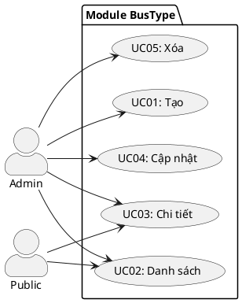

---
tags:
  - srs
  - system-design
  - bustype
  - seat-layout
created: 2026-04-06
updated: 2026-04-06
---

# TÀI LIỆU ĐẶC TẢ VÀ THIẾT KẾ MODULE: BUS TYPE (LOẠI XE)

> [!abstract] TỔNG QUAN
> Module BusType quản lý **định nghĩa cấu trúc xe** (thoại chứ không phải cá thể). Mỗi BusType định nghĩa:
> - **Tên loại**: "Giường nằm 40 chỗ", "Limousine 24 phòng"
> - **Số ghế**: 40, 24, 29...
> - **Sơ đồ ghế** (JSONB): JSON định nghĩa vị trí ghế để frontend vẽ (A01, B02, C03...)
>
> Module cung cấp CRUD, cache-friendly ListAll (thường xuyên đọc). Là _master data_ định hình **validation seat booking**.

---

## 1. ĐẶC TẢ YÊU CẦU

### 1.1. Danh sách yêu cầu chức năng

| ID | Tên chức năng | Mô tả | Ưu tiên | Độ phức tạp | Tác nhân |
|-----|---------------|-------|---------|-------------|----------|
| BST-01 | Tạo loại xe | Admin tạo BusType với name, total_seats, seat_layout JSON | P1 | M | Admin |
| BST-02 | Xem danh sách | Admin/Public lấy tất cả BusTypes (thường cached) | P1 | L | Admin/Public |
| BST-03 | Xem chi tiết | Lấy info loại xe (bao gồm sơ đồ ghế) | P2 | L | Admin/Public |
| BST-04 | Cập nhật | Chỉnh sửa name, seats, seat layout | P2 | M | Admin |
| BST-05 | Xóa loại xe | Xóa (chỉ nếu không có buses FK) | P3 | L | Admin |

---

## 2. BIỂU ĐỒ USE CASE



---

## 3. THIẾT KẾ CƠ SỞ DỮ LIỆU

### 3.1. Bảng bus_types

| Tên trường | Kiểu | Ràng buộc | Mô tả |
|------------|------|-----------|-------|
| id | SERIAL | PK | Khóa chính |
| name | VARCHAR(100) | NOT NULL, >= 2 | Tên loại xe |
| total_seats | INT | NOT NULL, > 0 | Số ghế (phải sync với seat_layout) |
| seat_layout | JSONB | NOT NULL | JSON định nghĩa sơ đồ ghế |

### 3.2. Ví dụ seat_layout

```json
{
    "rows": 8,
    "columns": 5,
    "seats": [
        {"code": "A01", "row": 1, "col": 1, "type": "standard"},
        {"code": "A02", "row": 1, "col": 2, "type": "standard"},
        {"code": "A03", "row": 1, "col": 3, "type": "standard"},
        {"code": "B01", "row": 2, "col": 1, "type": "vip"}
    ]
}
```

---

## 4. KIẾN TRÚC HỆ THỐNG

### 4.1. API Endpoints

| HTTP | Endpoint | Auth | Mô tả |
|------|----------|------|-------|
| POST | `/api/v1/admin/bus-types` | Admin | Tạo |
| GET | `/api/v1/bus-types` | Public | Danh sách (cached) |
| GET | `/api/v1/admin/bus-types` | Admin | Danh sách admin |
| GET | `/api/v1/bus-types/:id` | Public | Chi tiết |
| PUT | `/api/v1/admin/bus-types/:id` | Admin | Cập nhật |
| DELETE | `/api/v1/admin/bus-types/:id` | Admin | Xóa |

### 4.2. Response

**BusTypeResponse:**
```json
{
    "id": 1,
    "name": "Giường nằm 40 chỗ",
    "totalSeats": 40,
    "seatLayout": {
        "rows": 8,
        "columns": 5,
        "seats": [...]
    }
}
```

---

## 5. QUY TẮC NGHIỆP VỤ

| Quy tắc | Mô tả |
|--------|-------|
| BR-VAL-01 | Name bắt buộc, >= 2 ký tự |
| BR-VAL-02 | TotalSeats > 0 |
| BR-VAL-03 | SeatLayout JSONB bắt buộc (phải valid JSON) |
| BR-VAL-04 | Số ghế trong layout = total_seats |
| BR-DEL-01 | Không xóa nếu buses FK exists |

---

## 6. XỬ LÝ LỖI

| Error | HTTP | Code |
|-------|------|------|
| ErrBusTypeNotFound | 404 | BUSTYPE_NOT_FOUND |
| ErrBusTypeNameRequired | 400 | NAME_REQUIRED |
| ErrBusTypeTotalSeatsRequired | 400 | SEATS_REQUIRED |
| ErrBusTypeSeatLayoutRequired | 400 | LAYOUT_REQUIRED |

---

## 7. CACHING STRATEGY

- **ListAll()**: Cache TTL = 1 hour (thường xuyên đọc, ít thay đổi)
- **Invalidate on**: Create, Update, Delete BusType
- Frontend cũng cache list để tránh gọi API liên tục

---

