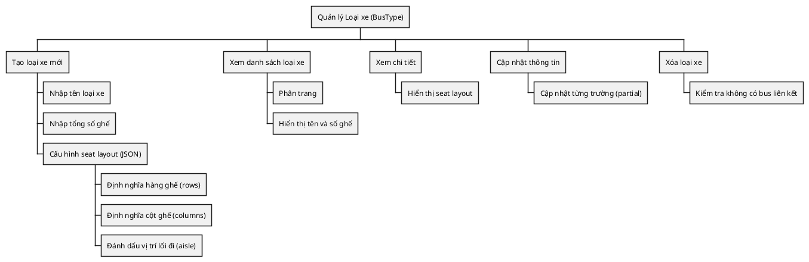
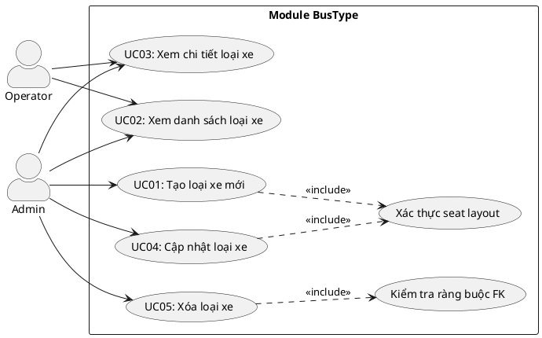
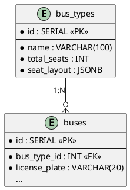
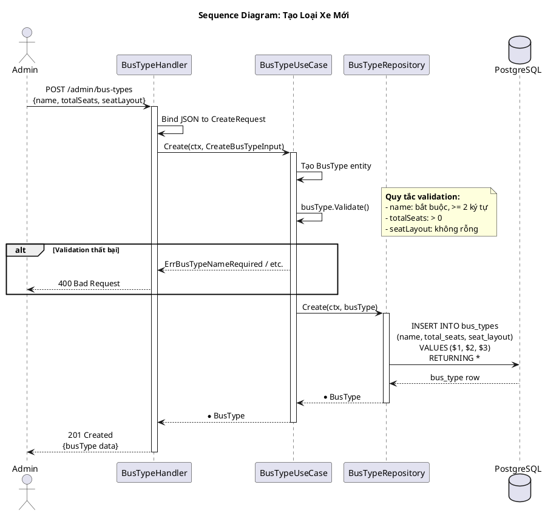
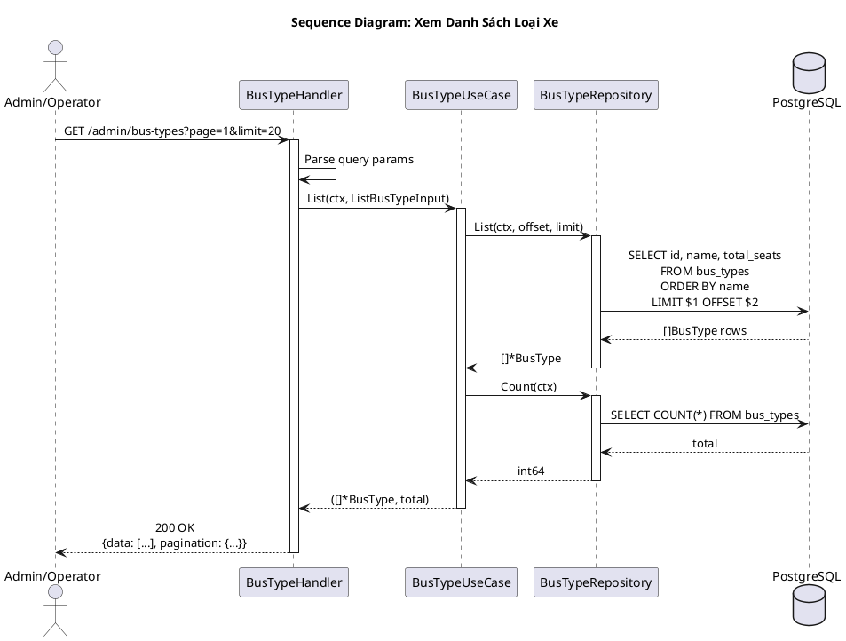
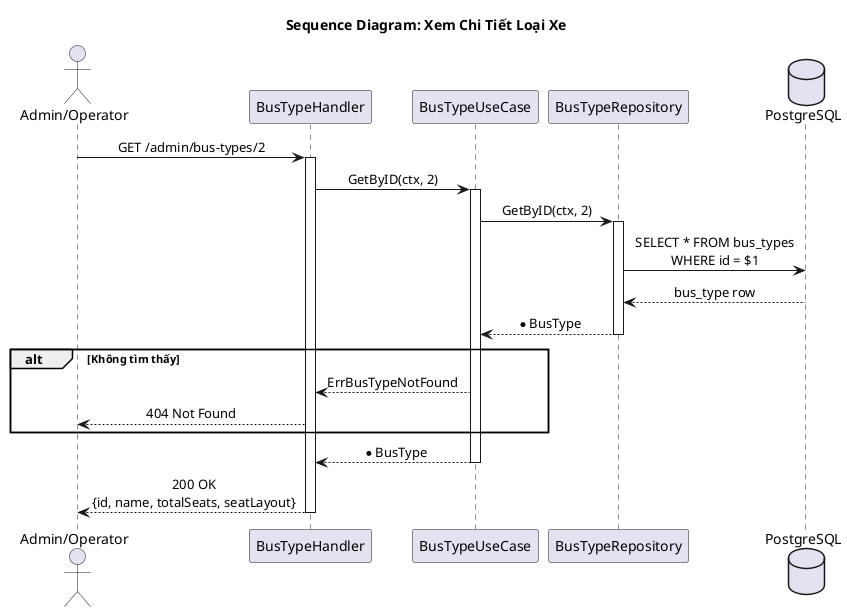
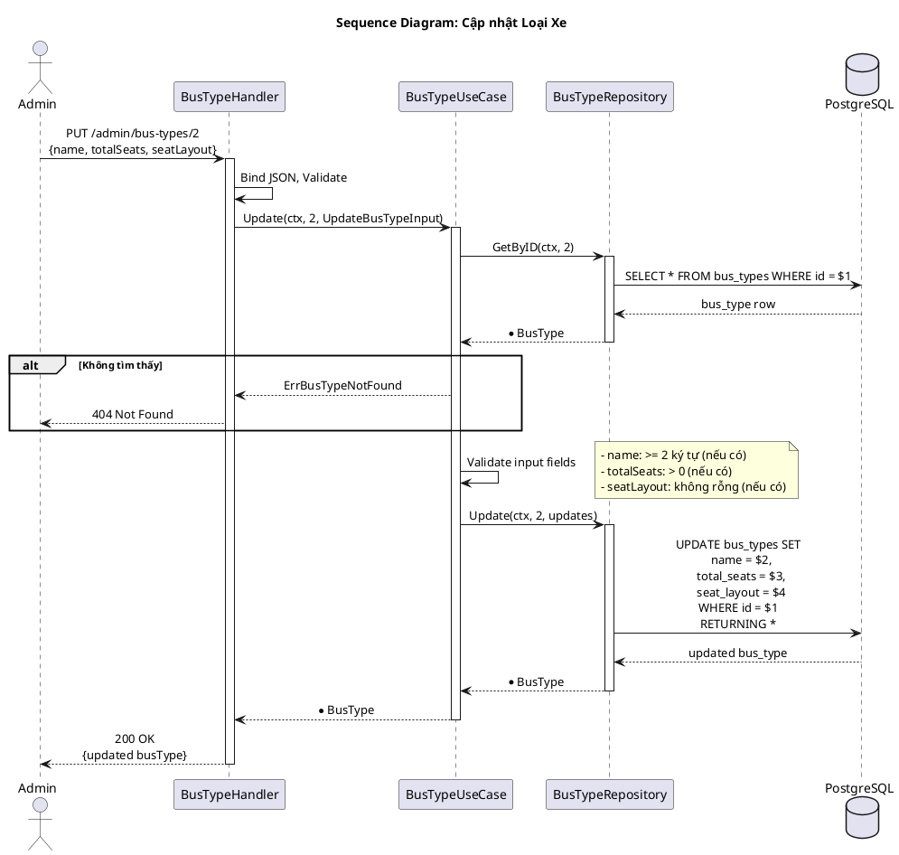
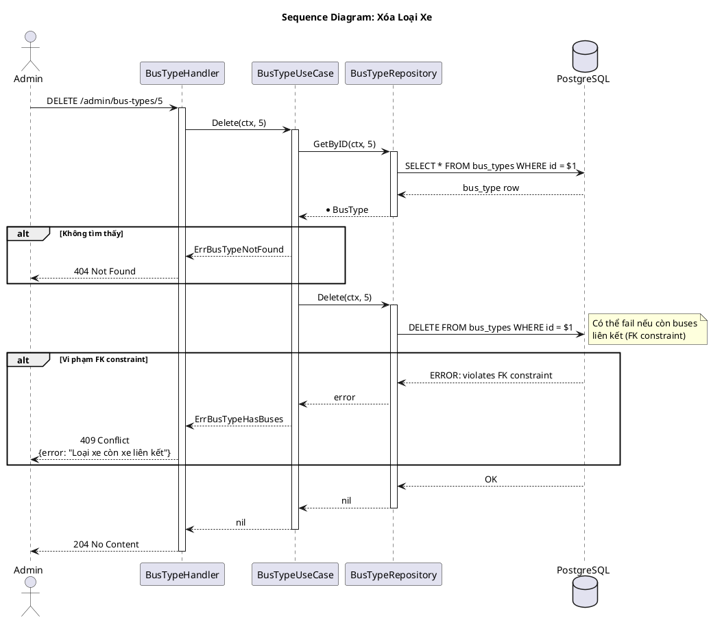
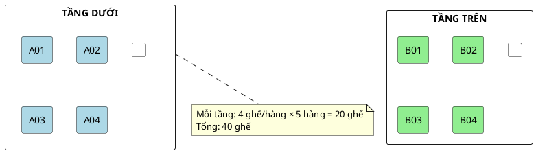

---
tags:
  - srs
  - system-design
  - bustype
  - seat-layout
created: 2026-02-25
updated: 2026-02-25
---

# TÀI LIỆU ĐẶC TẢ VÀ THIẾT KẾ MODULE: BUSTYPE (LOẠI XE)

> [!abstract] TỔNG QUAN
> Module BusType quản lý các loại xe buýt trong hệ thống, bao gồm cấu hình số chỗ ngồi và bố trí ghế (seat layout). Đây là module master data quan trọng, xác định số ghế tối đa và cách hiển thị sơ đồ ghế khi khách hàng đặt vé. Module lưu trữ seat layout dưới dạng JSON linh hoạt, cho phép cấu hình đa dạng loại xe từ xe giường nằm, xe ngồi, cho đến xe VIP. Đây là module admin-only.

---

## 1. ĐẶC TẢ YÊU CẦU (SOFTWARE REQUIREMENT SPECIFICATION)

### 1.1. Danh sách yêu cầu chức năng (Functional Requirements)

| ID | Tên chức năng | Mức độ ưu tiên | Độ phức tạp | Tác nhân (Actor) |
|-----|---------------|----------------|-------------|------------------|
| BT-01 | Tạo loại xe mới | P1 | M | Admin |
| BT-02 | Xem danh sách loại xe | P1 | L | Admin/Operator |
| BT-03 | Xem chi tiết loại xe | P2 | L | Admin/Operator |
| BT-04 | Cập nhật loại xe | P2 | M | Admin |
| BT-05 | Xóa loại xe | P3 | M | Admin |

### 1.2. Biểu đồ phân cấp chức năng (Functional Hierarchy)



---

## 2. BIỂU ĐỒ USE CASE VÀ ĐẶC TẢ (USE CASE SPECIFICATIONS)

### 2.1. Biểu đồ Use Case



### 2.2. Đặc tả Use Case: Tạo loại xe mới (Create)

> [!info] Thông tin Use Case
> **Use Case ID:** UC-BT-01
> **Use Case Name:** Tạo loại xe mới (Create)
> **Actor:** Admin
> **Trigger:** Admin cần thêm loại xe mới vào hệ thống

> [!note] Điều kiện tiên quyết (Pre-conditions)
> Admin đã đăng nhập và có quyền

> [!success] Điều kiện hậu kỳ (Post-conditions)
> Loại xe mới được tạo với seat layout hợp lệ

**Luồng xử lý chính (Normal Flow):**

| Bước | Tác nhân | Hành động |
|------|----------|-----------|
| 1 | Admin | Gửi POST request đến `/api/v1/admin/bus-types` với `{name, totalSeats, seatLayout}` |
| 2 | Controller | Bind JSON to CreateRequest |
| 3 | UseCase | Tạo BusType entity |
| 4 | UseCase | Gọi `busType.Validate()` |
| 5 | UseCase | Nếu hợp lệ, gọi `repository.Create(ctx, busType)` |
| 6 | Repository | INSERT vào database |
| 7 | Controller | Trả về 201 Created với thông tin loại xe |

---

## 3. THIẾT KẾ CƠ SỞ DỮ LIỆU (DATABASE DESIGN)

### 3.1. Sơ đồ thực thể liên kết (Entity Relationship Diagram - ERD)



### 3.2. Từ điển dữ liệu (Data Dictionary)

> [!abstract] Bảng: bus_types

| Tên trường | Kiểu dữ liệu | Ràng buộc | Mô tả |
|------------|--------------|-----------|-------|
| id | SERIAL | PK, NOT NULL | Khóa chính, tự động tăng |
| name | VARCHAR(100) | NOT NULL | Tên loại xe (tối thiểu 2 ký tự) |
| total_seats | INT | NOT NULL | Tổng số ghế (> 0) |
| seat_layout | JSONB | NOT NULL | Cấu hình bố trí ghế (JSON) |

---

## 4. CẤU TRÚC SEAT LAYOUT

### 4.1. JSON Schema

> [!info] Seat Layout là một mảng 2 chiều (rows × columns) mô tả vị trí các ghế trên xe

```json
{
    "rows": 10,
    "columns": 5,
    "layout": [
        ["A01", "A02", null, "A03", "A04"],
        ["B01", "B02", null, "B03", "B04"],
        ["C01", "C02", null, "C03", "C04"],
        ...
    ],
    "deckLabels": ["Tầng 1", "Tầng 2"]
}
```

### 4.2. Quy ước

| Giá trị | Mô tả |
|---------|-------|
| `"A01"`, `"B02"`, ... | Mã ghế (seat code) |
| `null` | Lối đi (aisle) hoặc khoảng trống |
| `"_"` | Ghế không bán (blocked/reserved) |

### 4.3. Ví dụ các loại xe phổ biến

**Xe giường nằm 40 chỗ (2 tầng):**

```json
{
    "name": "Giường nằm 40 chỗ",
    "totalSeats": 40,
    "seatLayout": {
        "decks": 2,
        "deckLabels": ["Tầng dưới", "Tầng trên"],
        "layout": {
            "deck1": [
                ["A01", "A02", null, "A03", "A04"],
                ["A05", "A06", null, "A07", "A08"],
                ["A09", "A10", null, "A11", "A12"],
                ["A13", "A14", null, "A15", "A16"],
                ["A17", "A18", null, "A19", "A20"]
            ],
            "deck2": [
                ["B01", "B02", null, "B03", "B04"],
                ["B05", "B06", null, "B07", "B08"],
                ["B09", "B10", null, "B11", "B12"],
                ["B13", "B14", null, "B15", "B16"],
                ["B17", "B18", null, "B19", "B20"]
            ]
        }
    }
}
```

**Xe ngồi 45 chỗ:**

```json
{
    "name": "Xe ngồi 45 chỗ",
    "totalSeats": 45,
    "seatLayout": {
        "decks": 1,
        "layout": {
            "deck1": [
                ["A01", "A02", null, "A03", "A04"],
                ["B01", "B02", null, "B03", "B04"],
                ["C01", "C02", null, "C03", "C04"],
                ["D01", "D02", null, "D03", "D04"],
                ["E01", "E02", null, "E03", "E04"],
                ["F01", "F02", null, "F03", "F04"],
                ["G01", "G02", null, "G03", "G04"],
                ["H01", "H02", null, "H03", "H04"],
                ["I01", "I02", null, "I03", "I04"],
                ["J01", "J02", null, "J03", "J04", "J05"]
            ]
        }
    }
}
```

**Xe Limousine 9 chỗ:**

```json
{
    "name": "Limousine 9 chỗ",
    "totalSeats": 9,
    "seatLayout": {
        "decks": 1,
        "layout": {
            "deck1": [
                ["A01", null, "A02"],
                ["B01", null, "B02"],
                ["C01", null, "C02"],
                ["D01", "D02", "D03"]
            ]
        }
    }
}
```

### 4.4. Minh họa sơ đồ ghế (Xe giường nằm)

```
+---------------------------------------+
|               TÀI XẾ                  |
+---------------------------------------+
|  [A01] [A02]  |aisle|  [A03] [A04]   |
|  [A05] [A06]  |     |  [A07] [A08]   |
|  [A09] [A10]  |     |  [A11] [A12]   |
|  [A13] [A14]  |     |  [A15] [A16]   |
|  [A17] [A18]  |     |  [A19] [A20]   |
+---------------------------------------+
|               TẦNG DƯỚI               |
+---------------------------------------+
```

---

## 5. KIẾN TRÚC HỆ THỐNG VÀ LUỒNG XỬ LÝ (SYSTEM ARCHITECTURE)

### 5.1. Kiến trúc mã nguồn

| Lớp (Layer) | Thư mục | File | Trách nhiệm |
|-------------|---------|------|-------------|
| **Domain** | `domain/` | `entity.go` | Entity BusType; Validation; DTOs |
| **Domain** | `domain/` | `ports.go` | Interface: Repository |
| **Repository** | `repository/` | `repository.go` | Implement Repository |
| **UseCase** | `usecase/` | `usecase.go` | Implement IBusTypeUseCase |
| **Controller** | `controller/http/` | `handler.go` | HTTP handlers |
| **Controller** | `controller/http/` | `routes.go` | Đăng ký routes |

### 5.2. Danh sách API Endpoints

| HTTP Method | Endpoint | Yêu cầu quyền | Mô tả chức năng |
|-------------|----------|---------------|-----------------|
| POST | `/api/v1/admin/bus-types` | Admin | Tạo loại xe mới |
| GET | `/api/v1/admin/bus-types` | Admin/Operator | Danh sách loại xe |
| GET | `/api/v1/admin/bus-types/:id` | Admin/Operator | Chi tiết loại xe |
| PUT | `/api/v1/admin/bus-types/:id` | Admin | Cập nhật loại xe |
| DELETE | `/api/v1/admin/bus-types/:id` | Admin | Xóa loại xe |

---

## 6. BIỂU ĐỒ TUẦN TỰ (SEQUENCE DIAGRAMS)

### 6.1. Biểu đồ tuần tự: Tạo loại xe mới



### 6.2. Biểu đồ tuần tự: Xem danh sách loại xe



### 6.3. Biểu đồ tuần tự: Xem chi tiết loại xe



### 6.4. Biểu đồ tuần tự: Cập nhật loại xe



### 6.5. Biểu đồ tuần tự: Xóa loại xe



---

## 7. CÁC QUY TẮC NGHIỆP VỤ (BUSINESS RULES)

### 7.1. Quy tắc xác thực

| Trường | Quy tắc | Điều kiện |
|--------|---------|-----------|
| name | Bắt buộc, tối thiểu 2 ký tự | `len(name) >= 2` |
| total_seats | Bắt buộc, số dương | `totalSeats > 0` |
| seat_layout | Bắt buộc, JSON hợp lệ | `len(seatLayout) > 0` |

### 7.2. Quy tắc seat layout

| Quy tắc | Mô tả |
|---------|-------|
| BR-LAYOUT-01 | Tổng số seat codes trong layout phải = totalSeats |
| BR-LAYOUT-02 | Seat code phải duy nhất trong cùng layout |
| BR-LAYOUT-03 | Seat code theo format: [A-Z]+[0-9]+ (vd: A01, B15) |

### 7.3. Quy tắc xóa loại xe

| Quy tắc | Mô tả |
|---------|-------|
| BR-DEL-01 | Không xóa được nếu còn xe (buses) sử dụng loại này |

---

## 8. XỬ LÝ LỖI (ERROR HANDLING)

| Domain Error | HTTP Status | Error Code | Mô tả |
|--------------|-------------|------------|-------|
| ErrBusTypeNotFound | 404 | BUSTYPE_NOT_FOUND | Không tìm thấy loại xe |
| ErrBusTypeNameRequired | 400 | BUSTYPE_NAME_REQUIRED | Thiếu tên loại xe |
| ErrBusTypeNameTooShort | 400 | BUSTYPE_NAME_TOO_SHORT | Tên quá ngắn |
| ErrBusTypeTotalSeatsRequired | 400 | BUSTYPE_TOTAL_SEATS_REQUIRED | Thiếu số ghế |
| ErrBusTypeSeatLayoutRequired | 400 | BUSTYPE_SEAT_LAYOUT_REQUIRED | Thiếu seat layout |
| ErrBusTypeHasBuses | 409 | BUSTYPE_HAS_BUSES | Loại xe còn xe liên kết |

---

## 9. CẤU TRÚC DỮ LIỆU RESPONSE

### 9.1. BusTypeResponse

```json
{
    "id": 2,
    "name": "Giường nằm 40 chỗ",
    "totalSeats": 40,
    "seatLayout": {
        "decks": 2,
        "deckLabels": ["Tầng dưới", "Tầng trên"],
        "layout": {
            "deck1": [
                ["A01", "A02", null, "A03", "A04"],
                ...
            ],
            "deck2": [
                ["B01", "B02", null, "B03", "B04"],
                ...
            ]
        }
    }
}
```

### 9.2. ListBusTypesResponse

```json
{
    "data": [
        {
            "id": 1,
            "name": "Xe ngồi 45 chỗ",
            "totalSeats": 45
        },
        {
            "id": 2,
            "name": "Giường nằm 40 chỗ",
            "totalSeats": 40
        },
        {
            "id": 3,
            "name": "Limousine 9 chỗ",
            "totalSeats": 9
        }
    ],
    "pagination": {
        "page": 1,
        "limit": 20,
        "total": 3,
        "totalPages": 1
    }
}
```

---

## 10. VISUAL: SƠ ĐỒ GHẾ CÁC LOẠI XE

### 10.1. Xe Giường Nằm 40 Chỗ (2 Tầng)



### 10.2. Xe Limousine 9 Chỗ

```
+---------------------------+
|        TÀI XẾ             |
+---------------------------+
|   [A01]    |    [A02]     |
|   [B01]    |    [B02]     |
|   [C01]    |    [C02]     |
|  [D01] [D02] [D03]        |
+---------------------------+
```
