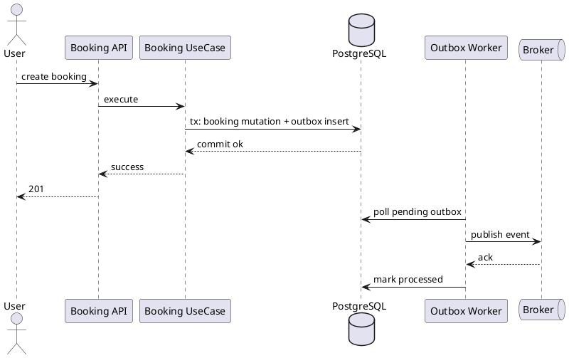
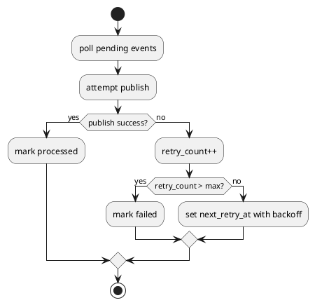
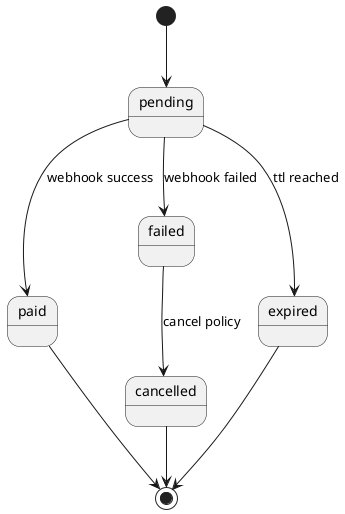

---
tags:
  - module
  - event-driven
  - booking
  - outbox
  - webhook
created: 2026-04-01
updated: 2026-04-01
---

# MODULE EVENT-DRIVEN BOOKING PLAN

> [!abstract] Mục tiêu
> Tài liệu mô tả chuyên sâu cơ sở lý thuyết và phương án triển khai kiến trúc hướng sự kiện cho miền Booking, tập trung vào transactional outbox, webhook consistency, retry semantics và khả năng quan sát vận hành trong môi trường phân tán.

> [!info] Định vị trong hệ thống
> Module này không thay thế transaction nghiệp vụ cốt lõi tại Booking. Vai trò của nó là đảm bảo **hậu xử lý bất đồng bộ** (thông báo, đồng bộ liên dịch vụ, analytics) diễn ra đáng tin cậy sau khi booking đã được commit thành công.

---

## 1. Đặt vấn đề và động cơ kiến trúc

Trong hệ thống đặt vé liên tỉnh tích hợp thanh toán và AI, vòng đời một booking thường không kết thúc tại thời điểm API trả `201 Created`. Sau bước commit giao dịch, hệ thống còn phải thực hiện nhiều tác vụ hậu xử lý như phát hành sự kiện cho notification service, đồng bộ dữ liệu cho analytics pipeline, cập nhật dashboard vận hành, và ghi nhận các mốc trạng thái cho mục tiêu kiểm toán.

Nếu toàn bộ tác vụ hậu xử lý được thực hiện đồng bộ trong request thread, hệ thống dễ đối mặt với ba rủi ro chính:

1. **Tăng độ trễ phản hồi**: request phải chờ mọi tích hợp downstream hoàn tất.
2. **Tăng độ giòn hệ thống**: lỗi tạm thời ở broker hoặc service phụ làm hỏng cả request chính.
3. **Khó mở rộng**: coupling giữa transaction cốt lõi và tích hợp ngoại vi làm suy giảm khả năng tiến hóa kiến trúc.

Vì lý do đó, đề tài lựa chọn kiến trúc event-driven kết hợp transactional outbox để tách biệt transaction nghiệp vụ với transaction tích hợp, đồng thời duy trì tính nhất quán ở mức phù hợp cho hệ phân tán.

---

## 2. Cơ sở lý thuyết

### 2.1 Event-Driven Architecture (EDA)

EDA là mô hình trong đó trạng thái hệ thống được lan truyền thông qua sự kiện (event), thay vì gọi hàm trực tiếp giữa các thành phần. Với miền Booking, event là bản ghi phát sinh khi có biến đổi trạng thái có ý nghĩa nghiệp vụ, ví dụ `booking.created`, `booking.paid`, `booking.cancelled`, `booking.expired`.

Về mặt lợi ích, EDA mang lại:

- **Giảm coupling theo thời gian**: producer không cần chờ consumer xử lý xong.
- **Khả năng mở rộng theo chiều ngang**: thêm consumer mà không thay đổi producer.
- **Khả năng tái sử dụng dữ liệu nghiệp vụ**: cùng một event có thể phục vụ nhiều use case.

Tuy nhiên, EDA cũng kéo theo các thách thức kinh điển: ordering, duplicate delivery, schema evolution, và quan trọng nhất là bảo đảm không mất event trong tình huống lỗi xen kẽ giữa DB commit và publish message.

### 2.2 Eventual Consistency

Khác với strong consistency nội bộ transaction, eventual consistency chấp nhận việc trạng thái giữa các thành phần có thể lệch tạm thời nhưng sẽ hội tụ sau một khoảng thời gian hữu hạn. Trong hệ thống đặt vé, strong consistency được giữ ở miền cốt lõi (ghế, booking, payment transaction nội bộ), còn eventual consistency được áp dụng cho các tác vụ hậu xử lý.

Phân ranh giới này giúp tối ưu chi phí kỹ thuật: không ép buộc distributed transaction xuyên nhiều hệ thống, nhưng vẫn kiểm soát được tính đúng đắn nghiệp vụ nơi quan trọng nhất.

### 2.3 Transactional Outbox Pattern

Transactional outbox giải bài toán “dual write” bằng cách ghi event vào bảng outbox **cùng transaction** với dữ liệu nghiệp vụ. Sau đó, một worker nền đọc outbox và publish lên broker. Nếu publish thất bại, worker retry theo chính sách đã định.

Lợi điểm cốt lõi:

- Loại bỏ cửa sổ lỗi DB commit thành công nhưng publish thất bại không ghi nhận.
- Cho phép audit rõ ràng trạng thái từng event (`pending`, `processing`, `processed`, `failed`).
- Dễ triển khai với hạ tầng quan hệ hiện có (PostgreSQL).

### 2.4 Webhook Consistency và vấn đề idempotency

Webhook từ cổng thanh toán là dữ liệu ngoại sinh, có thể đến muộn, đến lặp hoặc đến sai thứ tự. Vì vậy module phải thiết kế theo nguyên tắc:

- Không giả định “exactly-once delivery”.
- Mọi cập nhật từ webhook phải idempotent theo khóa giao dịch (`order_code`, `transaction_id`).
- Chỉ chấp nhận chuyển trạng thái theo transition hợp lệ đã khai báo.

---

## 3. Mục tiêu kiến trúc của module

### 3.1 Mục tiêu chức năng

- Ghi nhận đầy đủ event nghiệp vụ phát sinh từ Booking lifecycle.
- Publish event ra broker để phục vụ consumer downstream.
- Đồng bộ webhook thanh toán vào trạng thái booking một cách an toàn.

### 3.2 Mục tiêu phi chức năng

- Đảm bảo không mất event sau khi giao dịch booking commit.
- Khả năng retry có kiểm soát khi broker tạm lỗi.
- Tính quan sát được (observability) đủ sâu để vận hành production.
- Idempotent ở cả producer lẫn consumer.

### 3.3 Ranh giới trách nhiệm

- **Booking module**: quyết định nghiệp vụ cốt lõi và ghi outbox.
- **Outbox worker**: publish/retry, cập nhật trạng thái outbox.
- **Consumer services**: xử lý side effects, bắt buộc idempotent.
- **Webhook handler**: xác thực nguồn, chuẩn hóa payload, cập nhật trạng thái payment/booking.

---

## 4. Danh mục sự kiện và ngữ nghĩa

| Topic | Trigger | Ý nghĩa nghiệp vụ |
|---|---|---|
| `booking.created` | Tạo booking thành công | Xác nhận một booking mới đã tồn tại ở trạng thái `pending` |
| `booking.paid` | Webhook thanh toán thành công | Booking chuyển sang trạng thái đã thanh toán |
| `booking.cancelled` | User/Admin hủy | Booking bị hủy hợp lệ theo policy |
| `booking.expired` | Worker xử lý quá hạn | Booking không thanh toán trong TTL và bị hết hạn |

> [!note] Chính sách đặt tên event
> Dùng thì hiện tại, danh từ nghiệp vụ rõ nghĩa, không chứa thuật ngữ kỹ thuật nội bộ để thuận lợi cho tiêu chuẩn hóa schema liên dịch vụ.

---

## 5. Thiết kế dữ liệu outbox

### 5.1 Đề xuất lược đồ bảng

```sql
CREATE TABLE IF NOT EXISTS outbox_events (
  id UUID PRIMARY KEY,
  aggregate_type TEXT NOT NULL,
  aggregate_id UUID NOT NULL,
  topic TEXT NOT NULL,
  payload JSONB NOT NULL,
  headers JSONB,
  status TEXT NOT NULL DEFAULT 'pending',
  retry_count INT NOT NULL DEFAULT 0,
  next_retry_at TIMESTAMPTZ,
  created_at TIMESTAMPTZ NOT NULL DEFAULT NOW(),
  processed_at TIMESTAMPTZ,
  last_error TEXT
);
```

### 5.2 Trường dữ liệu cốt lõi

- `aggregate_type`, `aggregate_id`: định danh miền và bản ghi nghiệp vụ nguồn.
- `topic`: định tuyến event cho broker và consumer.
- `payload`: dữ liệu nghiệp vụ phiên bản hóa.
- `status`: vòng đời xử lý outbox.
- `retry_count`, `next_retry_at`: điều khiển chiến lược retry.

### 5.3 Trạng thái outbox đề xuất

- `pending`: sẵn sàng publish.
- `processing`: worker đang xử lý (tránh song trùng).
- `processed`: publish thành công.
- `failed`: vượt ngưỡng retry, cần can thiệp vận hành.

---

## 6. Luồng xử lý chuẩn

### 6.1 Luồng ghi outbox cùng transaction nghiệp vụ

1. Booking UseCase xác thực đầu vào và khóa dữ liệu seat.
2. Booking được tạo hoặc cập nhật trạng thái theo nghiệp vụ.
3. Event tương ứng được insert vào `outbox_events` trong cùng transaction.
4. Transaction commit.

Nếu transaction rollback, cả booking mutation và outbox insert đều không tồn tại; đây là điều kiện tiên quyết để tránh dual-write inconsistency.

### 6.2 Luồng worker publish

1. Worker poll sự kiện `pending` theo batch.
2. Chuyển trạng thái sang `processing` bằng cơ chế khóa phù hợp.
3. Publish tới broker.
4. Nếu thành công -> `processed`, ghi `processed_at`.
5. Nếu thất bại -> tăng `retry_count`, tính `next_retry_at`, lưu `last_error`.

### 6.3 Luồng webhook thanh toán

1. Nhận webhook từ payment gateway.
2. Xác thực chữ ký/tính toàn vẹn payload.
3. Tra cứu transaction theo khóa idempotency.
4. Áp dụng state transition hợp lệ.
5. Ghi event `booking.paid` hoặc event tương ứng.

---

## 7. Mô hình hóa bằng biểu đồ

### 7.1 Sequence tổng quát Outbox



### 7.2 Activity luồng retry



### 7.3 State machine webhook-payment alignment



---

## 8. Quy tắc nghiệp vụ và bất biến dữ liệu

### 8.1 Invariants

- Một mutation nghiệp vụ thành công phải có bản ghi outbox tương ứng.
- Event `booking.paid` chỉ được phát khi transition payment hợp lệ.
- Không cho phép chuyển booking từ `expired` sang `paid` nếu policy không cho phép.

### 8.2 Quy tắc idempotency

- Webhook cùng `order_code` xử lý lặp không tạo hiệu ứng phụ mới.
- Consumer xử lý event theo `event_id` để loại trùng.
- Producer không publish lại event đã `processed` trừ khi có quy trình replay có kiểm soát.

### 8.3 Quy tắc ordering

- Trong cùng aggregate (một booking), thứ tự sự kiện được ưu tiên bảo toàn theo `created_at` và sequence logic.
- Khác aggregate có thể xử lý song song để tăng throughput.

---

## 9. Chính sách retry, backoff và dead-letter

### 9.1 Retry policy đề xuất

- `max_retry`: cấu hình theo môi trường.
- `backoff`: exponential có jitter để tránh đồng bộ lỗi.
- `next_retry_at`: lưu cột để worker chủ động kiểm soát tải.

### 9.2 Dead-letter handling

Khi event vượt ngưỡng retry:

- Đánh dấu `failed`.
- Phát cảnh báo vận hành.
- Cho phép quy trình replay thủ công sau khi khắc phục nguyên nhân.

### 9.3 Vận hành an toàn khi replay

- Replay theo phạm vi topic/khung thời gian rõ ràng.
- Replay phải idempotent ở consumer.
- Lưu nhật ký tác vụ replay để phục vụ kiểm toán.

---

## 10. Quan hệ với module Webhook thanh toán

### 10.1 Đặc thù webhook trong miền Booking

Webhook là nguồn dữ liệu “at-least-once, out-of-order” điển hình. Do đó cần xử lý theo nguyên tắc defensive:

- Kiểm tra xác thực chữ ký trước khi xử lý business logic.
- So khớp mã giao dịch với bản ghi đã biết.
- Chặn transition không hợp lệ theo state machine.

### 10.2 Mapping trạng thái đề xuất

| Payment Transaction | Booking |
|---|---|
| success | paid |
| failed | pending hoặc failed theo policy |
| cancelled | cancelled hoặc pending theo policy |
| timeout | expired (qua worker hoặc policy đồng bộ) |

### 10.3 Event phát sinh sau webhook

- Webhook success -> `booking.paid`.
- Webhook failed/cancelled -> event tương ứng để downstream cập nhật thông báo/báo cáo.

---

## 11. Yêu cầu phi chức năng

### 11.1 Performance

- Worker xử lý theo batch để tối ưu I/O.
- Giới hạn concurrent publisher nhằm cân bằng throughput và ổn định broker.

### 11.2 Reliability

- Không mất event sau khi giao dịch cốt lõi commit.
- Hệ thống chịu được lỗi tạm thời của broker mà không làm hỏng dữ liệu booking.

### 11.3 Observability

- Mỗi event có trace fields: `event_id`, `aggregate_id`, `topic`, `retry_count`.
- Dashboard theo dõi backlog pending, tỷ lệ failed, độ trễ end-to-end.

### 11.4 Security

- Payload event không chứa thông tin nhạy cảm không cần thiết.
- Webhook endpoint có cơ chế xác thực nguồn gửi và rate limiting phù hợp.

---

## 12. Rủi ro kỹ thuật và biện pháp giảm thiểu

### 12.1 Rủi ro mất thứ tự event

- **Rủi ro:** consumer nhận `booking.cancelled` trước `booking.created` trong kịch bản lỗi mạng.
- **Giảm thiểu:** thiết kế consumer tolerant-order, có kiểm tra trạng thái hiện tại trước khi áp dụng.

### 12.2 Rủi ro duplicate delivery

- **Rủi ro:** broker hoặc webhook gửi lặp nhiều lần.
- **Giảm thiểu:** khóa idempotency theo `event_id`/`order_code` và upsert chiến lược.

### 12.3 Rủi ro backlog outbox tăng đột biến

- **Rủi ro:** broker chậm hoặc worker thiếu tài nguyên.
- **Giảm thiểu:** autoscaling worker, alert ngưỡng backlog, phân tách topic ưu tiên.

---

## 13. Kịch bản kiểm thử và xác nhận

### 13.1 Test case chức năng

| Mã | Kịch bản | Kỳ vọng |
|---|---|---|
| EVT-TC-01 | Tạo booking thành công | Có outbox `booking.created` |
| EVT-TC-02 | Broker tạm lỗi | Event được retry và cuối cùng processed |
| EVT-TC-03 | Webhook gửi lặp | Không đổi trạng thái lặp bất hợp lệ |
| EVT-TC-04 | Vượt max retry | Event chuyển `failed` và có cảnh báo |

### 13.2 Test case độ bền

- Mô phỏng restart worker giữa chừng để xác nhận không mất event.
- Mô phỏng publish timeout kéo dài để xác nhận backoff hoạt động.
- Mô phỏng out-of-order webhook để xác nhận state transition guard.

### 13.3 Tiêu chí nghiệm thu

- Không có trường hợp API trả thành công mà event tương ứng bị mất vĩnh viễn.
- Tỷ lệ xử lý thành công event đạt ngưỡng mục tiêu nội bộ sau giai đoạn retry.
- Webhook duplicate không tạo hiệu ứng phụ sai lệch dữ liệu.

---

## 14. Checklist vận hành production

- Có dashboard backlog outbox theo topic.
- Có alert cho `failed` events vượt ngưỡng.
- Có playbook replay sự kiện và rollback nghiệp vụ mềm.
- Có log correlation giữa booking request và event publish.

---

## 15. Mở rộng tương lai

- Áp dụng schema registry để quản lý tiến hóa payload event.
- Bổ sung partition strategy theo `aggregate_id` cho ordering tốt hơn.
- Tối ưu webhook gateway bằng lớp anti-corruption để hỗ trợ đa nhà cung cấp thanh toán.

---

## 16. Tiêu chí chấp nhận tổng hợp

- Outbox insert cùng transaction nghiệp vụ là bắt buộc.
- Worker retry có kiểm soát, không gây bão publish.
- Webhook xử lý idempotent và an toàn chuyển trạng thái.
- Hệ thống có đủ telemetry để điều tra sự cố đầu-cuối.
