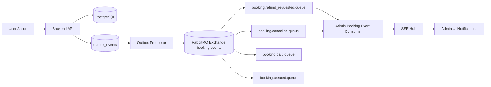

# MODULE_EVENT_DRIVEN_BOOKING_PLAN

## Mục tiêu

- Chuyển luồng booking sang hướng event-driven để dễ mở rộng, dễ quan sát, ít coupling.
- Bỏ dần các xử lý đồng bộ cũ không cần thiết cho thông báo admin.
- Giữ UI hiện tại hoạt động tốt, thêm trải nghiệm real-time rõ ràng cho admin.

---

## Scope hiện tại đã làm (UI + event cancel/refund)

- Đã thêm event `booking.cancelled` để admin nhận thông báo real-time tương tự refund.
- Đã mở consumer admin đọc nhiều queue:
  - `booking.refund_requested.queue`
  - `booking.cancelled.queue`
- Đã map SSE event động theo `eventType`:
  - `booking.refund_requested` -> `refund_requested`
  - `booking.cancelled` -> `booking_cancelled`
- Frontend admin đã nhận và hiển thị toast + feed cho cả 2 loại event.
- Header admin đã có event feed (UI layer) để theo dõi sự kiện mới.

---

## Kiến trúc mục tiêu (Event-driven)

---

## Consumer giả lập kiểu Kafka (Replay / Test)

> Có thể làm được. RabbitMQ vẫn giả lập consumer test/replay như Kafka theo 2 cách:

1. **Queue test riêng**
   - Tạo `booking.cancelled.debug.queue`
   - Bind cùng routing key `booking.cancelled`
   - Consumer debug đọc queue này để replay/so sánh payload.

2. **Re-publish từ outbox**
   - Lấy event theo `topic` trong `outbox_events`
   - Gửi lại vào exchange để test UI/consumer.

### Đề xuất chuẩn để debug

- Thêm endpoint nội bộ (admin-only) để replay event từ outbox theo `event_id` hoặc `topic`.
- Thêm cờ `x-debug-source` trong message header để tách event thật và event replay.
- Log correlation-id cho mỗi event để trace từ API -> outbox -> MQ -> SSE -> UI.

---

## Kế hoạch bỏ logic hủy cũ không theo MQ

### Hiện trạng

- Hủy vé trước đây update status xong là kết thúc, admin không có event.

### Plan chuyển hẳn event-driven

1. Mọi action admin cần biết (cancel/refund/paid) đều phải tạo outbox event.
2. UI admin chỉ nghe SSE event stream, không tự suy diễn từ polling.
3. Polling giữ như fallback khi SSE mất kết nối.

---

## Kế hoạch chuyển "booking thành công" sang event-driven

### Mục tiêu

- Sau khi payment success hoặc booking created, UI nhận trạng thái qua event thay vì chờ polling nặng.

### Phase đề xuất

1. **Phase 1**: giữ polling hiện tại, thêm event `booking.paid` push sang UI.
2. **Phase 2**: UI ưu tiên event stream, polling chỉ fallback.
3. **Phase 3**: giảm tần suất polling xuống mức tối thiểu.

---

## UI-only backlog (theo yêu cầu hiện tại)

### 1) Notification Center cho admin

- Tabs: `Tất cả` / `Hoàn vé` / `Hủy vé`.
- Mỗi item hiển thị:
  - loại event
  - mã vé
  - khách hàng
  - số tiền (nếu có)
  - timestamp relative (`vừa xong`, `2 phút trước`)

### 2) Event Feed Page

- Route mới: `/admin/booking-events`.
- Filter theo `eventType`, `bookingCode`, khoảng thời gian.
- Trạng thái SSE: `Connected`, `Reconnecting`, `Disconnected`.

### 3) Toast policy

- `refund_requested`: toast info
- `booking_cancelled`: toast warning
- debounce/grouping nếu event dồn trong thời gian ngắn.

### 4) UX fallback

- Khi SSE down: hiện banner nhỏ + tự fallback invalidate query theo interval.

---

## Checklist kỹ thuật khi triển khai tiếp

- [ ] Chuẩn hóa payload event bằng 1 contract chung (JSON schema nội bộ).
- [ ] Thêm version cho payload (`eventVersion`).
- [ ] Thêm correlation-id vào log và message header.
- [ ] Có dead-letter strategy cho consumer lỗi parse payload.
- [ ] Có replay tool cho môi trường dev/staging.

---

## Ghi chú `refunded_at`

- `refunded_at` phải set tại bước approve refund.
- Khi chuyển lại `paid` hoặc `refund_pending`, nên reset `refunded_at = NULL` để tránh dữ liệu sai ngữ nghĩa.
- UI dùng `updatedAt` + `refundedAt` cho timeline status rõ ràng.
