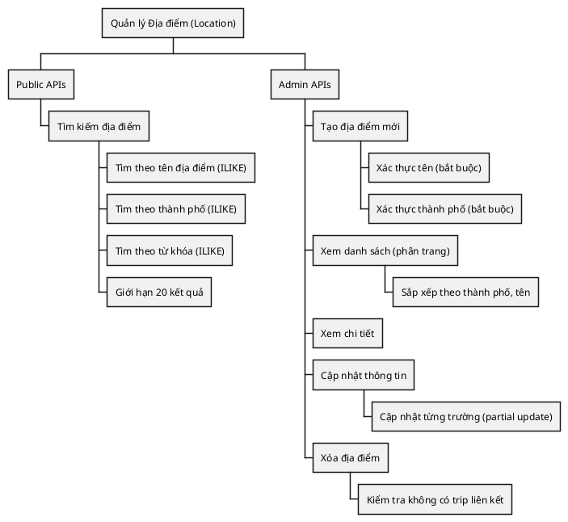
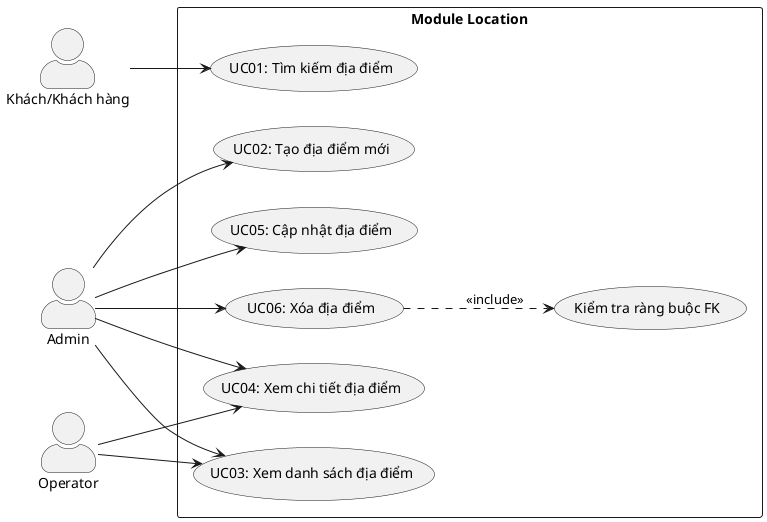
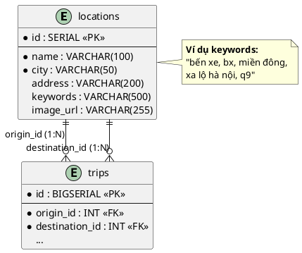
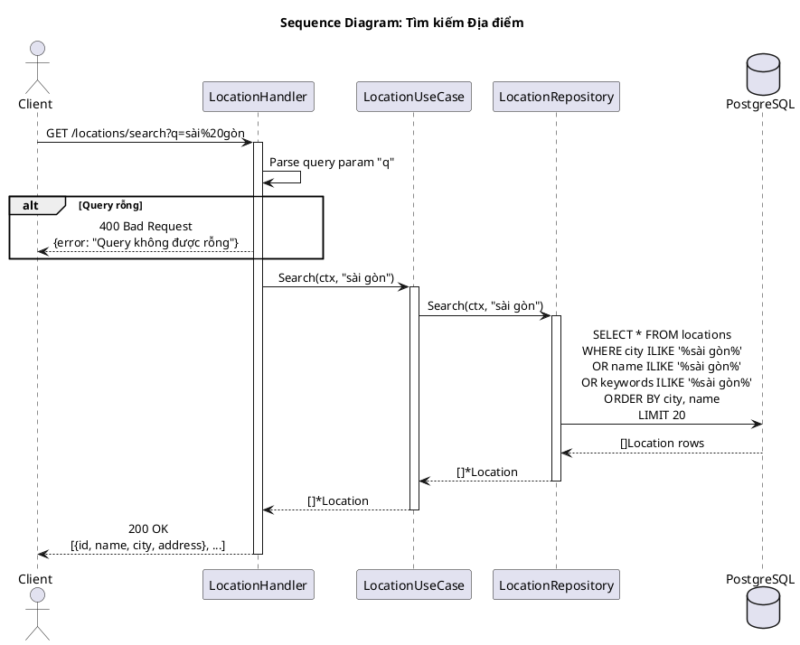
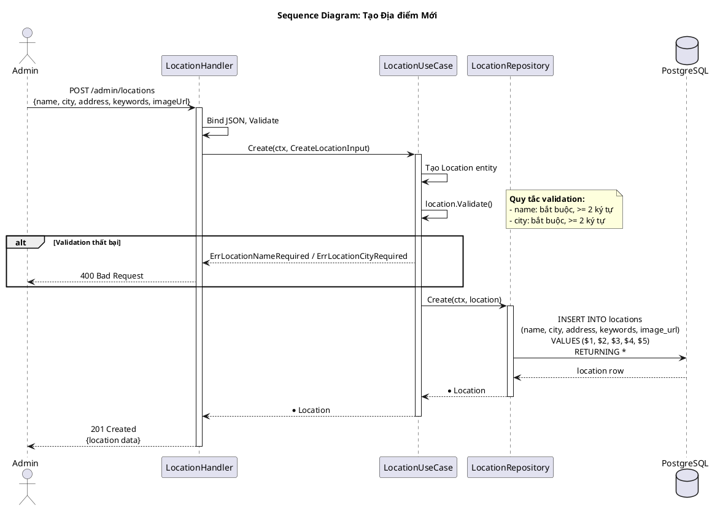
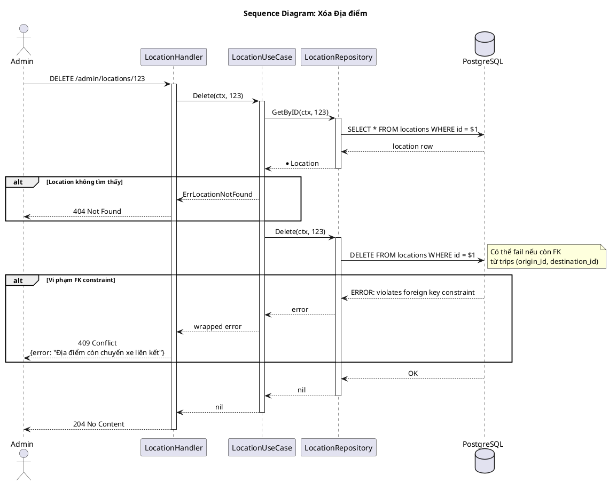
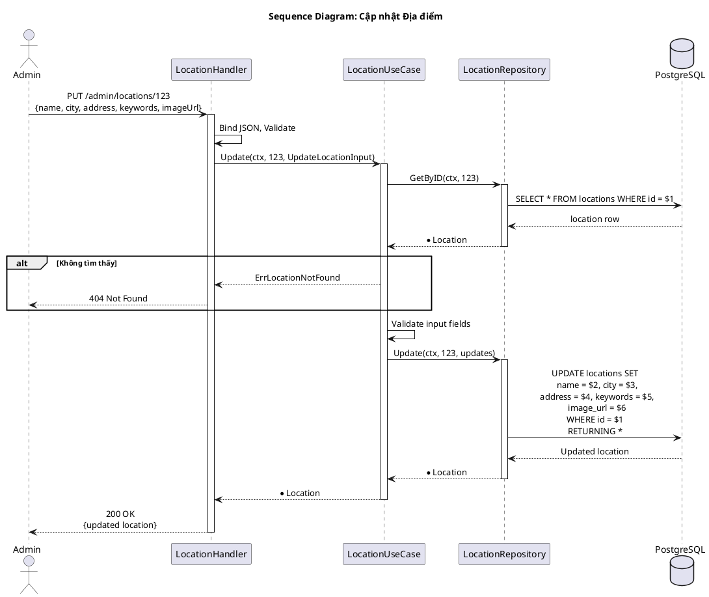

---
tags:
  - srs
  - system-design
  - location
  - station
created: 2026-02-25
updated: 2026-02-25
---

# TÀI LIỆU ĐẶC TẢ VÀ THIẾT KẾ MODULE: LOCATION (ĐỊA ĐIỂM / BẾN XE)

> [!abstract] TỔNG QUAN
> Module Location quản lý thông tin các địa điểm/bến xe trong hệ thống đặt vé xe buýt. Đây là module master data cung cấp điểm xuất phát (origin) và điểm đến (destination) cho các chuyến xe. Module hỗ trợ tìm kiếm theo từ khóa (keyword-based search) giúp người dùng dễ dàng tìm địa điểm mong muốn. Admin có thể quản lý CRUD đầy đủ các địa điểm bao gồm tên, thành phố, địa chỉ và từ khóa tìm kiếm.

---

## 1. ĐẶC TẢ YÊU CẦU (SOFTWARE REQUIREMENT SPECIFICATION)

### 1.1. Danh sách yêu cầu chức năng (Functional Requirements)

| ID | Tên chức năng | Mức độ ưu tiên | Độ phức tạp | Tác nhân (Actor) |
|-----|---------------|----------------|-------------|------------------|
| LOC-01 | Tìm kiếm địa điểm | P1 | M | Guest/Customer |
| LOC-02 | Tạo địa điểm mới | P1 | L | Admin |
| LOC-03 | Xem danh sách địa điểm (Admin) | P2 | L | Admin/Operator |
| LOC-04 | Xem chi tiết địa điểm | P2 | L | Admin/Operator |
| LOC-05 | Cập nhật địa điểm | P2 | L | Admin |
| LOC-06 | Xóa địa điểm | P3 | M | Admin |

### 1.2. Biểu đồ phân cấp chức năng (Functional Hierarchy)



---

## 2. BIỂU ĐỒ USE CASE VÀ ĐẶC TẢ (USE CASE SPECIFICATIONS)

### 2.1. Biểu đồ Use Case



### 2.2. Đặc tả Use Case chi tiết: Tìm kiếm địa điểm (Search)

> [!info] Thông tin Use Case
> **Use Case ID:** UC-LOC-01
> **Use Case Name:** Tìm kiếm địa điểm (Search)
> **Actor:** Guest hoặc Customer
> **Trigger:** Người dùng nhập từ khóa vào ô tìm kiếm địa điểm

> [!note] Điều kiện tiên quyết (Pre-conditions)
> Không có

> [!success] Điều kiện hậu kỳ (Post-conditions)
> Danh sách địa điểm phù hợp được trả về (tối đa 20 kết quả)

**Luồng xử lý chính (Normal Flow):**

| Bước | Tác nhân | Hành động |
|------|----------|-----------|
| 1 | Client | Gửi GET request đến `/api/v1/locations/search?q=sài gòn` |
| 2 | Controller | Lấy query param `q`, validate không rỗng |
| 3 | UseCase | Gọi `repository.Search(ctx, query)` |
| 4 | Repository | Thực thi SQL query tìm kiếm với ILIKE |
| 5 | Repository | So khớp với city, name, hoặc keywords |
| 6 | Repository | Sắp xếp theo city, name |
| 7 | Repository | Giới hạn 20 kết quả |
| 8 | Controller | Trả về danh sách địa điểm |

**SQL Query:**

```sql
SELECT * FROM locations 
WHERE city ILIKE '%' || $1 || '%' 
   OR name ILIKE '%' || $1 || '%'
   OR keywords ILIKE '%' || $1 || '%'
ORDER BY city, name
LIMIT 20;
```

### 2.3. Đặc tả Use Case: Tạo địa điểm mới (Create)

> [!info] Thông tin Use Case
> **Use Case ID:** UC-LOC-02
> **Use Case Name:** Tạo địa điểm mới
> **Actor:** Admin
> **Trigger:** Admin muốn thêm địa điểm/bến xe mới

**Luồng xử lý chính:**

| Bước | Tác nhân | Hành động |
|------|----------|-----------|
| 1 | Admin | Gửi POST `/api/v1/admin/locations` với body `{name, city, address, keywords, imageUrl}` |
| 2 | UseCase | Validate name >= 2 ký tự, city >= 2 ký tự |
| 3 | Repository | INSERT INTO locations |
| 4 | Controller | Trả về 201 Created |

### 2.4. Đặc tả Use Case: Xóa địa điểm (Delete)

> [!info] Thông tin Use Case
> **Use Case ID:** UC-LOC-06
> **Use Case Name:** Xóa địa điểm
> **Actor:** Admin
> **Trigger:** Admin muốn xóa địa điểm không còn sử dụng

**Luồng xử lý chính:**

| Bước | Tác nhân | Hành động |
|------|----------|-----------|
| 1 | Admin | Gửi DELETE `/api/v1/admin/locations/:id` |
| 2 | UseCase | Kiểm tra location tồn tại |
| 3 | Repository | DELETE FROM locations (có thể fail nếu còn FK) |
| 4 | Controller | Trả về 204 No Content |

---

## 3. THIẾT KẾ CƠ SỞ DỮ LIỆU (DATABASE DESIGN)

### 3.1. Sơ đồ thực thể liên kết (Entity Relationship Diagram - ERD)



### 3.2. Từ điển dữ liệu (Data Dictionary)

> [!abstract] Bảng: locations

| Tên trường | Kiểu dữ liệu | Ràng buộc | Mô tả |
|------------|--------------|-----------|-------|
| id | SERIAL | PK, NOT NULL | Khóa chính, tự động tăng |
| name | VARCHAR(100) | NOT NULL | Tên địa điểm/bến xe (tối thiểu 2 ký tự) |
| city | VARCHAR(50) | NOT NULL | Thành phố/Tỉnh (tối thiểu 2 ký tự) |
| address | VARCHAR(200) | NULL | Địa chỉ chi tiết |
| keywords | VARCHAR(500) | NULL | Từ khóa tìm kiếm (cách nhau bởi dấu phẩy) |
| image_url | VARCHAR(255) | NULL | URL ảnh địa điểm |

### 3.3. Ví dụ dữ liệu

| id | name | city | address | keywords |
|----|------|------|---------|----------|
| 1 | Bến xe Miền Đông | Hồ Chí Minh | 292 Đinh Bộ Lĩnh, Q. Bình Thạnh | bx miền đông, miền đông, bình thạnh |
| 2 | Bến xe Miền Tây | Hồ Chí Minh | 395 Kinh Dương Vương, Q. Bình Tân | bx miền tây, miền tây, bình tân, an lạc |
| 3 | Bến xe An Sương | Hồ Chí Minh | Quốc lộ 22, Hóc Môn | an sương, hóc môn, củ chi |
| 4 | Bến xe Miền Đông mới | Bình Dương | TP. Dĩ An | miền đông mới, dĩ an, suối tiên |

---

## 4. KIẾN TRÚC HỆ THỐNG VÀ LUỒNG XỬ LÝ (SYSTEM ARCHITECTURE)

### 4.1. Kiến trúc mã nguồn

| Lớp (Layer) | Thư mục | File | Trách nhiệm |
|-------------|---------|------|-------------|
| **Domain** | `domain/` | `entity.go` | Entity Location; Validation methods; DTOs: CreateLocationInput, UpdateLocationInput |
| **Domain** | `domain/` | `ports.go` | Interface: Repository |
| **Repository** | `repository/` | `repository.go` | Implement Repository interface |
| **UseCase** | `usecase/` | `usecase.go` | Implement ILocationUseCase |
| **Controller** | `controller/http/` | `handler.go` | HTTP handlers |
| **Controller** | `controller/http/` | `routes.go` | Đăng ký routes |

### 4.2. Danh sách API Endpoints

| HTTP Method | Endpoint | Yêu cầu quyền | Mô tả chức năng |
|-------------|----------|---------------|-----------------|
| GET | `/api/v1/locations/search` | Public | Tìm kiếm địa điểm |
| POST | `/api/v1/admin/locations` | Admin | Tạo địa điểm mới |
| GET | `/api/v1/admin/locations` | Admin/Operator | Danh sách địa điểm (phân trang) |
| GET | `/api/v1/admin/locations/:id` | Admin/Operator | Chi tiết địa điểm |
| PUT | `/api/v1/admin/locations/:id` | Admin | Cập nhật địa điểm |
| DELETE | `/api/v1/admin/locations/:id` | Admin | Xóa địa điểm |

---

## 5. BIỂU ĐỒ TUẦN TỰ (SEQUENCE DIAGRAMS)

### 5.1. Biểu đồ tuần tự: Tìm kiếm địa điểm



### 5.2. Biểu đồ tuần tự: Tạo địa điểm mới



### 5.3. Biểu đồ tuần tự: Xóa địa điểm



### 5.4. Biểu đồ tuần tự: Cập nhật địa điểm



---

## 6. CÁC QUY TẮC NGHIỆP VỤ (BUSINESS RULES)

### 6.1. Quy tắc xác thực

| Trường | Quy tắc | Điều kiện |
|--------|---------|-----------|
| name | Bắt buộc, tối thiểu 2 ký tự | `len(name) >= 2` |
| city | Bắt buộc, tối thiểu 2 ký tự | `len(city) >= 2` |
| address | Tùy chọn | |
| keywords | Tùy chọn, các từ khóa cách nhau bởi dấu phẩy | |

### 6.2. Quy tắc tìm kiếm

| Quy tắc | Mô tả |
|---------|-------|
| BR-SEARCH-01 | Tìm kiếm case-insensitive (ILIKE) |
| BR-SEARCH-02 | Tìm kiếm phần chuỗi (partial match) |
| BR-SEARCH-03 | Tìm trong cả 3 trường: city, name, keywords |
| BR-SEARCH-04 | Giới hạn 20 kết quả |
| BR-SEARCH-05 | Sắp xếp theo city, sau đó theo name |

### 6.3. Quy tắc xóa địa điểm

| Quy tắc | Mô tả |
|---------|-------|
| BR-DEL-01 | Không xóa được nếu còn trip sử dụng làm origin |
| BR-DEL-02 | Không xóa được nếu còn trip sử dụng làm destination |

---

## 7. XỬ LÝ LỖI (ERROR HANDLING)

| Domain Error | HTTP Status | Error Code | Mô tả |
|--------------|-------------|------------|-------|
| ErrLocationNotFound | 404 | LOCATION_NOT_FOUND | Không tìm thấy địa điểm |
| ErrLocationNameRequired | 400 | LOCATION_NAME_REQUIRED | Thiếu tên địa điểm |
| ErrLocationNameTooShort | 400 | LOCATION_NAME_TOO_SHORT | Tên quá ngắn |
| ErrLocationCityRequired | 400 | LOCATION_CITY_REQUIRED | Thiếu thành phố |
| ErrLocationCityTooShort | 400 | LOCATION_CITY_TOO_SHORT | Thành phố quá ngắn |
| ErrLocationHasTrips | 409 | LOCATION_HAS_TRIPS | Địa điểm còn chuyến xe liên kết |

---

## 8. CẤU TRÚC DỮ LIỆU RESPONSE

### 8.1. LocationResponse

```json
{
    "id": 1,
    "name": "Bến xe Miền Đông",
    "city": "Hồ Chí Minh",
    "address": "292 Đinh Bộ Lĩnh, Q. Bình Thạnh",
    "keywords": "bx miền đông, miền đông, bình thạnh",
    "imageUrl": "https://cdn.example.com/locations/mien-dong.jpg"
}
```

### 8.2. SearchLocationsResponse

```json
[
    {
        "id": 1,
        "name": "Bến xe Miền Đông",
        "city": "Hồ Chí Minh"
    },
    {
        "id": 4,
        "name": "Bến xe Miền Đông mới",
        "city": "Bình Dương"
    }
]
```

---

## 9. HƯỚNG DẪN SỬ DỤNG KEYWORDS

> [!tip] Cách đặt keywords hiệu quả
> Keywords giúp người dùng tìm kiếm địa điểm dễ dàng hơn. Nên bao gồm:
> 
> 1. **Viết tắt**: "bx" cho "bến xe", "sg" cho "Sài Gòn"
> 2. **Tên gọi khác**: "Tân Sơn Nhất" = "tân sơn nhất, tsn"
> 3. **Quận/Huyện**: "bình thạnh, quận bình thạnh, q. bình thạnh"
> 4. **Địa danh gần**: "suối tiên, đại học quốc gia"
> 5. **Không dấu**: "mien dong" bên cạnh "Miền Đông"
