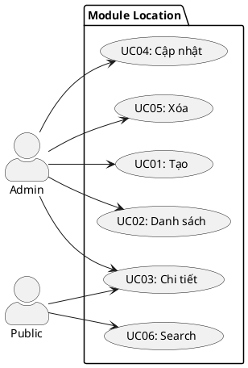

---
tags:
  - srs
  - system-design
  - location
  - master-data
created: 2026-04-06
updated: 2026-04-06
---

# TÀI LIỆU ĐẶC TẢ VÀ THIẾT KẾ MODULE: LOCATION (ĐỊA ĐIỂM)

> [!abstract] TỔNG QUAN
> Module Location quản lý các địa điểm dừng/khởi hành trong hệ thống (bến xe, ga, điểm dừng). Mỗi Location đại diện một điểm địa lý cụ thể với tên, thành phố, địa chỉ, từ khóa tìm kiếm, và ảnh. Module cung cấp:
> - **CRUD** đầy đủ cho master data
> - **Search** thông minh qua keywords, city, name
> - **Public API** để autocomplete khi người dùng chọn điểm dừng
>
> Là **master data** chi phối trải nghiệm của khách hàng (tìm kiếm chuyến → chọn từ/đến).

---

## 1. ĐẶC TẢ YÊU CẦU

### 1.1. Danh sách yêu cầu chức năng

| ID | Tên chức năng | Mục đích | Ưu tiên | Độ phức tạp | Tác nhân |
|-----|---------------|---------|---------|-------------|----------|
| LOC-01 | Tạo địa điểm | Admin tạo bến xe / địa điểm dừng | P1 | L | Admin |
| LOC-02 | Xem danh sách | Admin liệt kê địa điểm (phân trang, lọc) | P1 | L | Admin |
| LOC-03 | Xem chi tiết | Lấy thông tin chi tiết địa điểm | P2 | L | Admin/Public |
| LOC-04 | Cập nhật | Chỉnh sửa thông tin, keywords, ảnh | P2 | L | Admin |
| LOC-05 | Xóa địa điểm | Xóa (chỉ nếu không có trips FK) | P3 | L | Admin |
| LOC-06 | Search công khai | Public autocomplete search | P1 | M | Public |

---

## 2. BIỂU ĐỒ USE CASE



---

## 3. THIẾT KẾ CƠ SỞ DỮ LIỆU

### 3.1. Bảng locations

| Tên trường | Kiểu | Ràng buộc | Mô tả |
|------------|------|-----------|-------|
| id | SERIAL | PK | Khóa chính |
| name | VARCHAR(255) | NOT NULL, >= 2 | Tên bến xe |
| city | VARCHAR(100) | NOT NULL, >= 2 | Thành phố |
| address | VARCHAR(255) | NULL | Địa chỉ chi tiết |
| keywords | TEXT | NULL | Từ khóa (sai gon, hcm, quan 9) |
| image_url | VARCHAR(255) | NULL | URL ảnh |

### 3.2. Ví dụ dữ liệu

| id | name | city | keywords |
|----|------|------|----------|
| 1 | Bến xe Miền Đông Mới | Hồ Chí Minh | sai gon, hcm, quan 9 |
| 2 | Bến xe Nước Ngầm | Hà Nội | ha noi, nuoc ngam |

---

## 4. KIẾN TRÚC HỆ THỐNG

### 4.1. API Endpoints

| HTTP | Endpoint | Auth | Mô tả |
|------|----------|------|-------|
| POST | `/api/v1/admin/locations` | Admin | Tạo |
| GET | `/api/v1/admin/locations` | Admin | Danh sách admin |
| GET | `/api/v1/locations` | Public | Danh sách public |
| GET | `/api/v1/locations/:id` | Public | Chi tiết |
| PUT | `/api/v1/admin/locations/:id` | Admin | Cập nhật |
| DELETE | `/api/v1/admin/locations/:id` | Admin | Xóa |
| GET | `/api/v1/locations/search?q=miền` | Public | Search |

### 4.2. Response

**LocationResponse:**
```json
{
    "id": 1,
    "name": "Bến xe Miền Đông Mới",
    "city": "Hồ Chí Minh",
    "address": "Q9, P. Linh Chiểu",
    "keywords": "sai gon, hcm, quan 9",
    "imageUrl": "https://cdn.example.com/..."
}
```

---

## 5. QUY TẮC NGHIỆP VỤ

| Quy tắc | Mô tả |
|--------|-------|
| BR-VAL-01 | Name bắt buộc, >= 2 ký tự |
| BR-VAL-02 | City bắt buộc, >= 2 ký tự |
| BR-DEL-01 | Không xóa nếu trips FK exists |
| BR-SEARCH-01 | Search qua name, keywords, city (ILIKE) |
| BR-SEARCH-02 | Max limit = 200 (prevent abuse) |

---

## 6. XỬ LÝ LỖI

| Error | HTTP | Code |
|-------|------|------|
| ErrLocationNotFound | 404 | LOCATION_NOT_FOUND |
| ErrLocationNameRequired | 400 | NAME_REQUIRED |
| ErrLocationCityRequired | 400 | CITY_REQUIRED |

---

