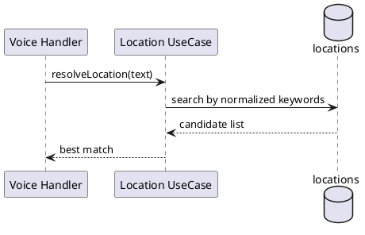

---
tags:
  - module
  - location
created: 2026-04-01
updated: 2026-04-01
---

# MODULE LOCATION

> [!abstract] Mục tiêu
> Quản lý dữ liệu điểm đi/điểm đến và khả năng tra cứu linh hoạt để phục vụ search trip, chat clarification và voice resolve trong môi trường ngôn ngữ tự nhiên.

## 1. Bối cảnh nghiệp vụ

Location là nền dữ liệu định danh hành trình. Trong thực tế, người dùng có thể nhập địa danh theo nhiều biến thể: tên đầy đủ, tên tắt, biệt danh vùng miền, hoặc phát âm gần đúng qua voice. Nếu module Location không đủ linh hoạt, toàn bộ chuỗi tìm kiếm-trip-booking sẽ suy giảm hiệu quả.

## 2. Yêu cầu chức năng

| ID | Yêu cầu |
|---|---|
| LOC-01 | Public search location theo keyword |
| LOC-02 | Admin CRUD location |
| LOC-03 | Hỗ trợ alias/keywords để match voice/chat |

## 3. Cơ sở lý thuyết chuẩn hóa địa danh

### 3.1 Normalization

Chuẩn hóa chuỗi nhập giúp giảm nhiễu do khác biệt dấu câu, viết hoa/viết thường, hoặc biến thể dấu tiếng Việt.

### 3.2 Fuzzy Matching

Trong bối cảnh voice/chat, fuzzy matching cho phép tìm candidate location dù input không trùng khớp tuyệt đối.

### 3.3 Canonical Name và Alias

- **Canonical name**: tên chuẩn hiển thị và lưu trữ chính thức.
- **Alias/keywords**: biến thể hỗ trợ tìm kiếm, không thay đổi định danh chuẩn.

## 4. API Endpoints

| Method | Endpoint | Mô tả |
|---|---|---|
| GET | `/api/v1/locations/search?q=` | Tìm kiếm location |
| GET | `/api/v1/locations/:id` | Chi tiết location |
| POST | `/api/v1/admin/locations` | Tạo location |
| PUT | `/api/v1/admin/locations/:id` | Cập nhật location |

## 5. Sequence - Voice Resolve Location

## 6. Quy tắc nghiệp vụ

- Bắt buộc có `name` và thông tin vùng địa lý chính.
- Hỗ trợ `keywords` để tăng khả năng nhận diện qua voice/chat.
- Tránh trùng canonical name trong cùng phạm vi quản trị.
- Ưu tiên location active trong kết quả trả về.

## 7. Yêu cầu phi chức năng

### 7.1 Performance

- Tối ưu truy vấn search theo keyword phổ biến.
- Trả giới hạn kết quả để bảo đảm tốc độ phản hồi.

### 7.2 Reliability

- Không để dữ liệu alias phá vỡ định danh location chuẩn.
- Đảm bảo tính nhất quán khi admin chỉnh sửa tên và keyword.

### 7.3 Maintainability

- Tách riêng logic normalize và logic truy vấn.
- Dễ mở rộng chiến lược matching trong tương lai.

## 8. Kịch bản kiểm thử

| Mã | Kịch bản | Kỳ vọng |
|---|---|---|
| LOC-TC-01 | Search từ khóa chính xác | Trả location tương ứng |
| LOC-TC-02 | Search từ khóa biến thể | Trả candidate hợp lý |
| LOC-TC-03 | Voice resolve input nhiễu nhẹ | Trả best match khả dụng |
| LOC-TC-04 | Tạo location trùng chuẩn hóa | Bị từ chối |

## 9. Tiêu chí chấp nhận

- Module trả kết quả location ổn định cho cả form, chat và voice.
- Không phát sinh sai lệch định danh địa điểm do alias.
