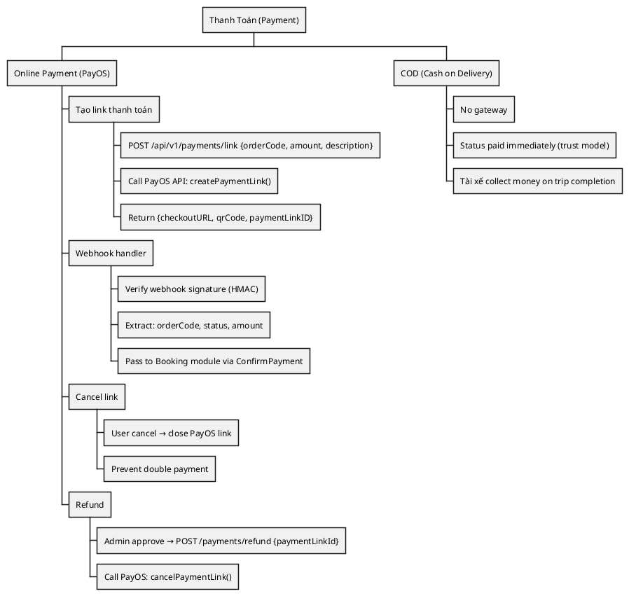
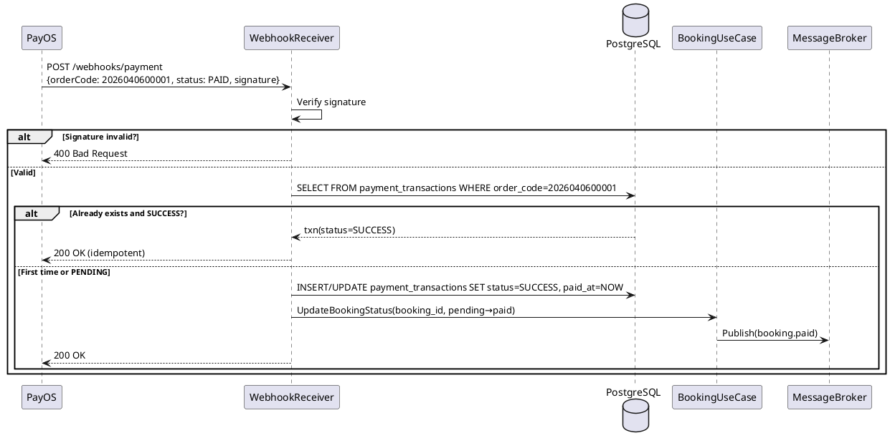
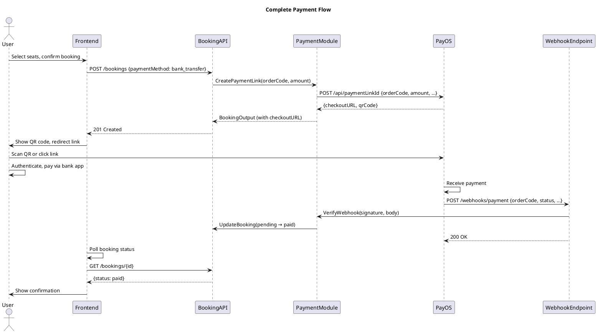

---
tags:
  - srs
  - payment-gateway
  - payos
  - webhook
  - idempotency
created: 2026-04-06
updated: 2026-04-06
---

# TÀI LIỆU ĐẶC TẢ VÀ THIẾT KẾ MODULE: PAYMENT (THANH TOÁN)

> [!abstract] TỔNG QUAN
> Module Payment là **gateway layer**, tích hợp **PayOS payment gateway** cho hệ thống. Quản lý:
> - **Tạo link thanh toán**: Hóa đơn → PayOS → QR/URL để user thanh toán
> - **Webhook xác nhận**: Webhook từ PayOS → confirm booking status
> - **Idempotency**: Webhook liệu đến nhiều lần, hệ thống phải xử lý đúng
> - **3 phương thức**: Bank transfer, Card (Visa/MC), Cash on Delivery (COD)
> - **Refund workflow**: Admin approve → PayOS reverse payment
>
> Core principle: **"Stateless payment adapter"** — business logic nằm ở Booking module.

---

## 1. ĐẶC TẢ YÊU CẦU (SRS)

### 1.1. Bối cảnh nghiệp vụ

Hệ thống cần tích hợp gateway thanh toán **PayOS** (popular ở VN) để:
1. **Nhận thanh toán online**: Bank transfer (VietQR), Card
2. **Hỗ trợ COD**: Cash on delivery (khách trả tiền tài xế)
3. **Webhook idempotent**: Xử lý webhook bị lặp từ PayOS
4. **Hoàn tiền**: Admin approve refund → PayOS reverse

### 1.2. Danh sách yêu cầu chức năng

| ID | Chức năng | Mô tả | Ưu tiên |
|----|-----------|-------|---------|
| PAY-01 | Tạo link thanh toán | POST → PayOS API → return QR/URL | P1 |
| PAY-02 | Verify webhook | Webhook từ PayOS → verify signature → xử lý | P1 |
| PAY-03 | Hủy link thanh toán | Admin hủy booking → cancel PayOS link | P2 |
| PAY-04 | Hoàn tiền (refund) | Admin approve refund → PayOS reverse | P1 |
| PAY-05 | Theo dõi status thanh toán | Query PayOS để check payment status | P2 |

### 1.3. WBS



---

## 2. API ARCHITECTURE

### 2.1. PayOS Integration Points

| Operation | PayOS API | Input | Output | Idempotent? |
|-----------|-----------|-------|--------|------------|
| **Create Link** | createPaymentLink | orderCode, amount, desc | checkoutURL, qrCode | No |
| **Get Status** | GetPaymentStatus | orderCode | "PENDING"/"SUCCESS"/"FAILED" | Yes |
| **Cancel Link** | cancelPaymentLink | paymentLinkId, reason | status=CANCELLED | Yes |
| **Verify Webhook** | verifyWebhookData | signature, body | {orderCode, status, amount} | Yes |

### 2.2. REST Endpoints (Backend Only)

| HTTP | Endpoint | Auth | Purpose |
|------|----------|------|---------|
| **POST** | `/api/v1/payments/link` | Internal (Booking UC) | Create payment link |
| **POST** | `/api/v1/payments/confirm` | Public (Webhook) | Confirm payment (webhook from PayOS) |
| **POST** | `/api/v1/payments/:id/refund` | Admin | Request refund |
| **GET** | `/api/v1/payments/status/:orderCode` | Admin | Query payment status |

### 2.3. Gateway Interface

```go
type PaymentGateway interface {
    // Create payment link (booking → checkout)
    CreatePaymentLink(ctx, orderCode, amount, desc, expiresAt, returnURL, cancelURL) (*PaymentLinkResult, error)
    
    // Get payment status (reconciliation)
    GetPaymentStatus(ctx, orderCode) (string, error)  // "PENDING"/"SUCCESS"/"FAILED"
    
    // Cancel payment link (booking cancel)
    CancelPaymentLink(ctx, orderCode, reason) error
    
    // Verify webhook signature (webhook handler)
    VerifyWebhookData(ctx, body map[string]interface{}) (*WebhookResult, error)
}
```

---

## 3. THIẾT KẾ CƠ SỞ DỮ LIỆU

### 3.1. Payment Transactions Table

| Trường | Kiểu | Mô tả |
|--------|------|-------|
| `id` | UUID | PK |
| `booking_id` | BIGSERIAL | FK booking |
| `order_code` | BIGINT | PayOS order ID |
| `amount` | INT | Giá tiền (cents) |
| `status` | VARCHAR | PENDING/SUCCESS/FAILED/REFUNDED |
| `payment_method` | VARCHAR | bank_transfer/card/cod |
| `checkout_url` | VARCHAR(2048) | Link checkout |
| `qr_code` | TEXT | QR code base64 |
| `webhook_data` | JSONB | Raw webhook từ PayOS (audit) |
| `created_at` | TIMESTAMPTZ | Khi tạo |
| `paid_at` | TIMESTAMPTZ | Khi confirm payment |
| `refunded_at` | TIMESTAMPTZ | Khi hoàn tiền |

### 3.2. Webhook Payload Example

```json
{
    "code": "00",
    "message": "success",
    "data": {
        "id": "1234567890",
        "orderCode": 2026040600001,
        "amount": 36000000,
        "amountPaid": 36000000,
        "amountRemaining": 0,
        "status": "PAID",
        "createdAt": "2026-04-06T10:30:00Z",
        "cancellationDate": null,
        "transactionDateTime": "2026-04-06T10:35:10Z"
    },
    "signature": "sha256_hmac_signature_here"
}
```

---

## 4. IDEMPOTENCY & WEBHOOK HANDLING

### 4.1. Webhook Signature Verification

```go
func VerifyWebhookData(body []byte, signature string) bool {
    // 1. Generate HMAC-SHA256 of body using PayOS API key
    hmac := generateHMAC(body, payosApiKey)
    
    // 2. Compare with signature from header
    return hmac == signature
}
```

### 4.2. Idempotent Webhook Processing

```
Problem: Webhook từ PayOS có thể đến 2+ lần với cùng orderCode
Solution: Check trước khi process

Algorithm:
  1. Verify signature
  2. Extract orderCode from webhook
  3. SELECT FROM payment_transactions WHERE order_code = orderCode
  4. IF exists:
       - If status=SUCCESS: Return OK (already processed)
       - If status=PENDING: Update to SUCCESS
     ELSE:
       - INSERT new transaction
       - Update to SUCCESS
  5. Publish booking.paid event
  6. Return 200 OK
```

### 4.3. Sequence: Webhook Processing



---

## 5. PAYMENT METHODS SUPPORT

### 5.1. Bank Transfer (VietQR)

```
User Flow:
  1. Booking creation → show QR code
  2. User scan QR → PayOS shows VietQR
  3. User open mobile banking → scan → confirm
  4. PayOS receive payment → webhook
  
System Flow:
  1. CreatePaymentLink(method=bank_transfer)
  2. PayOS return VietQR QR code
  3. Frontend display QR
  4. User scan + pay
  5. PayOS webhook → confirm
```

### 5.2. Card Payment (Visa/Mastercard)

```
User Flow:
  1. Booking → show checkout link
  2. Click link → PayOS card form
  3. Enter card details → confirm
  4. PayOS process → webhook
  
System Flow:
  1. CreatePaymentLink(method=visa)
  2. PayOS return checkout URL
  3. Frontend redirect to URL
  4. User fill card
  5. PayOS webhook → confirm
```

### 5.3. COD (Cash on Delivery)

```
No gateway integration
- CreatePaymentLink returned immediately with status=SUCCESS
- No webhook
- Trust model: tài xế collect when arrive
- Risk: không nhận tiền → follow-up needed
```

---

## 6. QUY TẮC NGHIỆP VỤ (BUSINESS RULES)

### 6.1. Payment Amount Rules

| Rule | Condition |
|------|-----------|
| Amount > 0 | payment must have positive amount |
| Amount precision | Must be in cents (0.01 VND) |
| Amount = Booking total | payment amount ≥ booking total_amount |
| Partial payment | Not supported (full payment only) |

### 6.2. Expiration Rules

| Rule | Condition |
|------|-----------|
| Link expiry | 5 minutes by default |
| Expired link | User cannot pay expired link |
| Retry payment | Can create new link if first expired |

### 6.3. Idempotency Rules

| Rule | Condition |
|------|-----------|
| Webhook repeated | Same orderCode, same signature → process once |
| Signature validation | All webhooks must have valid signature |
| Order code unique | One order per payment |

---

## 7. ERROR HANDLING

### 7.1. Payment Errors → HTTP Mapping

| Error | HTTP Status | Message |
|-------|-------------|---------|
| Signature invalid | 400 | Invalid webhook signature |
| Gateway unavailable | 503 | Payment gateway error |
| Order not found | 404 | Order code not found |
| Amount mismatch | 400 | Payment amount mismatch |
| Already paid | 409 | Payment already processed |

---

## 8. FAILURE SCENARIOS & RECOVERY

### 8.1. Webhook Missing/Late

```
Scenario: User pays, but webhook doesn't arrive

Recovery:
  1. Cron job: every 5 min, check pending bookings > 10 min
  2. For each: query PayOS GetPaymentStatus(orderCode)
  3. If status=PAID: manually call ConfirmPayment
  4. Mark booking as paid
```

### 8.2. Payment Gateway Down

```
Scenario: PayOS API down when user tries to pay

Handling:
  1. Return error: "Payment gateway temporarily unavailable"
  2. User retry später
  3. Booking expires after 10 min
  4. User can retry new booking
```

---

## 9. MONITORING & LOGGING

### 9.1. Payment Metrics

```
- Payment creation rate (per minute)
- Payment success rate (target > 99%)
- Webhook latency (p99 < 1000ms)
- Failed payments (alert if > 5%)
- Refund processing time (avg, p99)
```

### 9.2. Audit Logging

```
Log all:
  - Payment link creation (with amount, orderCode)
  - Webhook received (with signature, status)
  - Payment confirmation (booking updated)
  - Refund requests (admin action)
  
For audit: store webhook_data (JSONB) as-is from PayOS
```

---

## 10. CONFIGURATION & SECRETS

### 10.1. Environment Variables

```bash
PAYOS_API_KEY=...        # API key từ PayOS
PAYOS_API_SECRET=...     # Secret key (for HMAC)
PAYOS_CLIENT_ID=...      # Client ID
PAYOS_BASE_URL=https://api.payos.vn

PAYMENT_LINK_EXPIRY=300  # Seconds (5 min default)
PAYMENT_RETRY_INTERVAL=60  # Seconds
```

### 10.2. Secure Storage

```
- API keys in AWS Secrets Manager / K8s Secrets
- Never log API keys
- Webhook signature validation mandatory
- Rate limit webhook endpoint (100 req/min)
```

---

## 11. INTEGRATION FLOW (FULL)



---

## 12. FUTURE ENHANCEMENTS

| Feature | Priority | Impact |
|---------|----------|--------|
| Multi-currency support | P3 | Internationalization |
| Payment split (multiple cards) | P3 | UX |
| Cryptocurrency support | P3 | Niche |
| 3D Secure validation | P2 | Security |
| Payment reconciliation dashboard | P2 | Operations |

---

**Document Version**: 1.0 (Full Payment Gateway Integration)
**Last Updated**: 2026-04-06
**Status**: ✅ COMPLETE - Ready for Development
