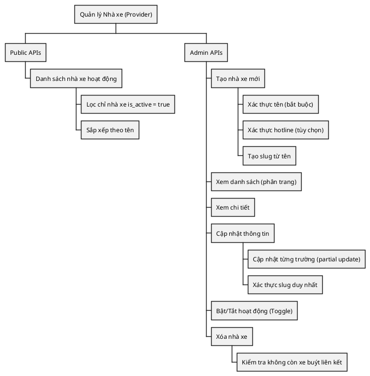
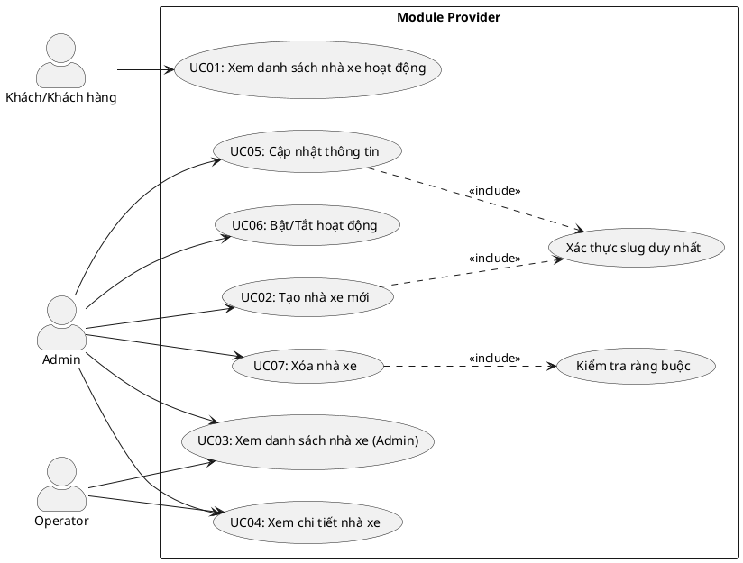
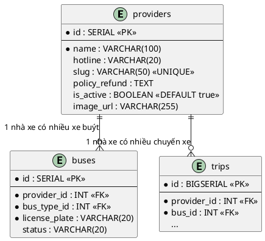
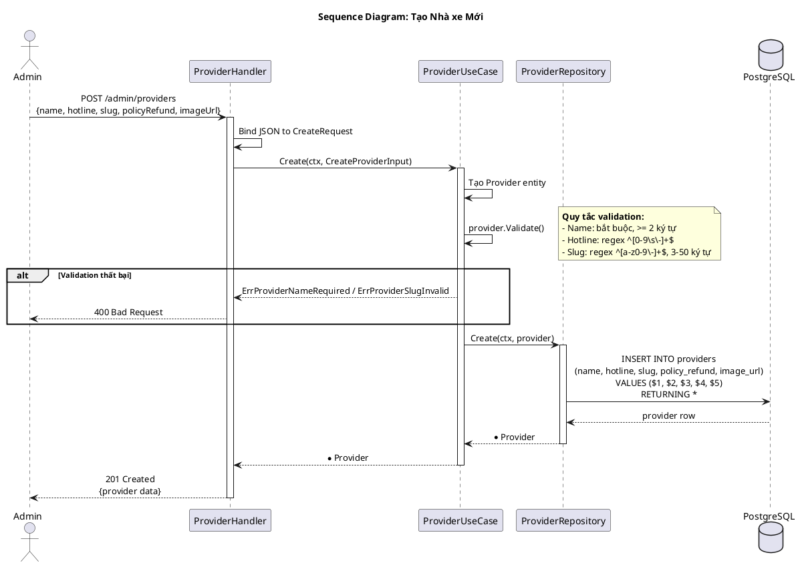
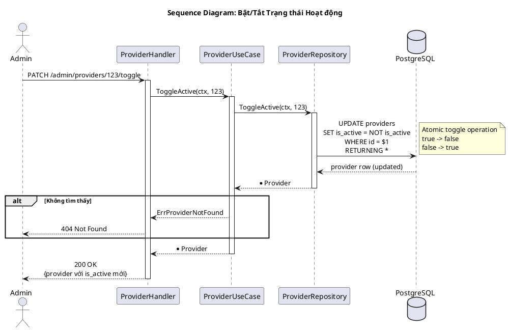
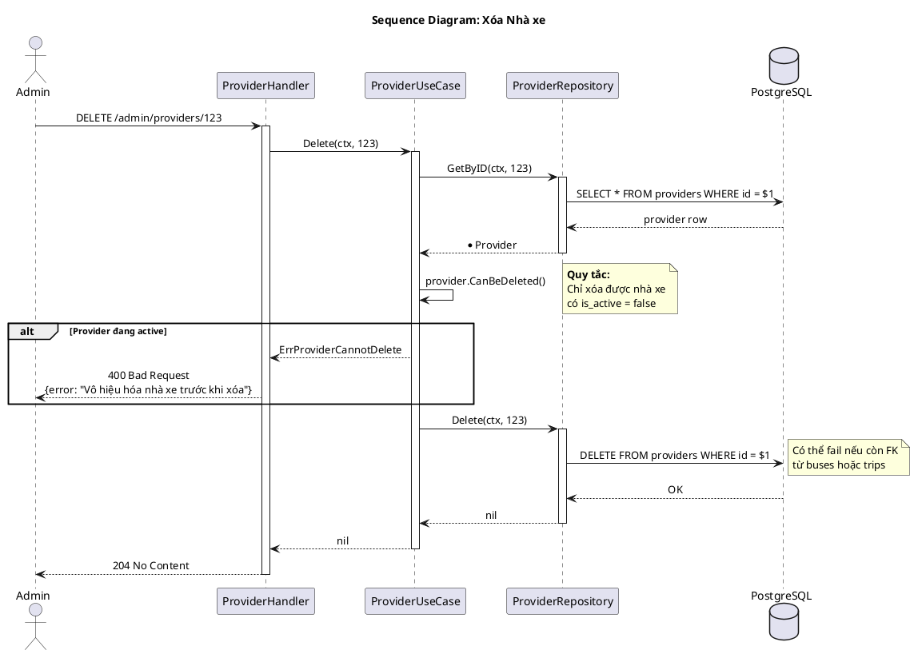
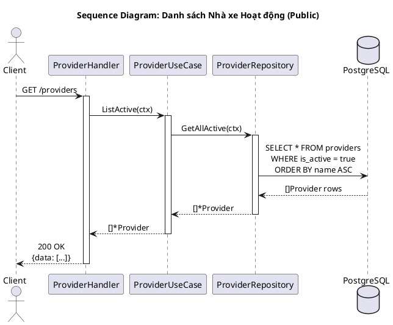
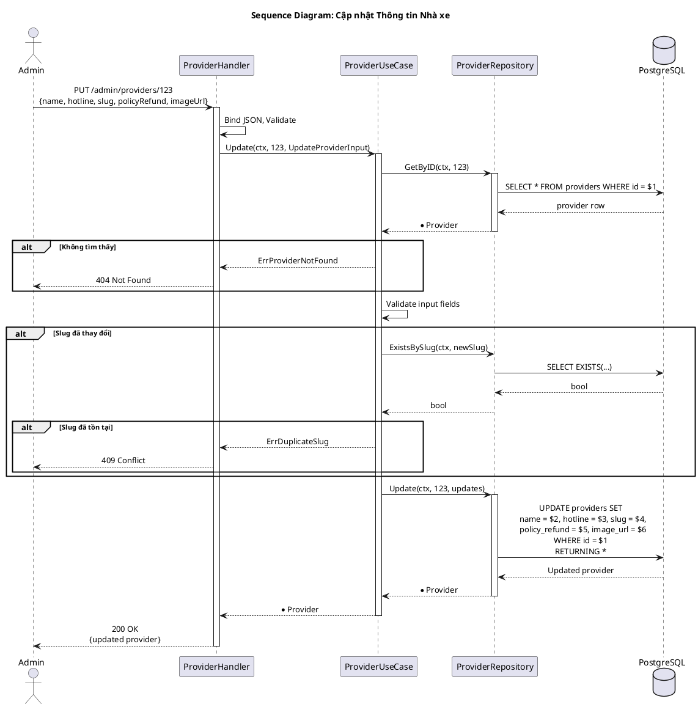

---
tags:
  - srs
  - system-design
  - provider
  - bus-company
created: 2026-02-25
updated: 2026-02-25
---

# TÀI LIỆU ĐẶC TẢ VÀ THIẾT KẾ MODULE: PROVIDER (NHÀ XE)

> [!abstract] TỔNG QUAN
> Module Provider quản lý thông tin các nhà xe (Bus Operators) trong hệ thống đặt vé xe buýt. Mỗi nhà xe có thể sở hữu nhiều xe buýt và cung cấp nhiều chuyến xe. Module cung cấp các chức năng CRUD đầy đủ cho quản trị viên và hiển thị danh sách nhà xe đang hoạt động cho khách hàng. Hệ thống hỗ trợ slug URL-friendly, số hotline, chính sách hoàn vé và trạng thái hoạt động (active/inactive).

---

## 1. ĐẶC TẢ YÊU CẦU (SOFTWARE REQUIREMENT SPECIFICATION)

### 1.1. Danh sách yêu cầu chức năng (Functional Requirements)

| ID | Tên chức năng | Mức độ ưu tiên | Độ phức tạp | Tác nhân (Actor) |
|-----|---------------|----------------|-------------|------------------|
| PRV-01 | Xem danh sách nhà xe hoạt động | P1 | L | Guest/Customer |
| PRV-02 | Tạo nhà xe mới | P1 | L | Admin |
| PRV-03 | Xem danh sách nhà xe (Admin) | P2 | L | Admin/Operator |
| PRV-04 | Xem chi tiết nhà xe | P2 | L | Admin/Operator |
| PRV-05 | Cập nhật thông tin nhà xe | P2 | L | Admin |
| PRV-06 | Bật/Tắt trạng thái hoạt động | P2 | L | Admin |
| PRV-07 | Xóa nhà xe | P3 | M | Admin |

### 1.2. Biểu đồ phân cấp chức năng (Functional Hierarchy)



---

## 2. BIỂU ĐỒ USE CASE VÀ ĐẶC TẢ (USE CASE SPECIFICATIONS)

### 2.1. Biểu đồ Use Case



### 2.2. Đặc tả Use Case chi tiết: Bật/Tắt trạng thái hoạt động (ToggleActive)

> [!info] Thông tin Use Case
> **Use Case ID:** UC-PRV-06
> **Use Case Name:** Bật/Tắt trạng thái hoạt động (ToggleActive)
> **Actor:** Admin
> **Trigger:** Admin nhấn nút toggle trạng thái của nhà xe

> [!note] Điều kiện tiên quyết (Pre-conditions)
> 1. Nhà xe tồn tại trong hệ thống
> 2. Admin đã đăng nhập và có quyền

> [!success] Điều kiện hậu kỳ (Post-conditions)
> Trạng thái is_active của nhà xe được đảo ngược (true -> false hoặc false -> true)

**Luồng xử lý chính (Normal Flow):**

| Bước | Tác nhân | Hành động |
|------|----------|-----------|
| 1 | Admin | Gửi PATCH request đến `/api/v1/admin/providers/:id/toggle` |
| 2 | Controller | Lấy provider ID từ URL params |
| 3 | UseCase | Gọi `repository.ToggleActive(ctx, id)` |
| 4 | Repository | Thực thi `UPDATE providers SET is_active = NOT is_active WHERE id = $1 RETURNING *` |
| 5 | Controller | Trả về thông tin nhà xe đã cập nhật |

### 2.3. Đặc tả Use Case: Tạo nhà xe mới (Create)

> [!info] Thông tin Use Case
> **Use Case ID:** UC-PRV-02
> **Use Case Name:** Tạo nhà xe mới
> **Actor:** Admin
> **Trigger:** Admin muốn thêm nhà xe mới vào hệ thống

**Luồng xử lý chính:**

| Bước | Tác nhân | Hành động |
|------|----------|-----------|
| 1 | Admin | Gửi POST `/api/v1/admin/providers` với body `{name, hotline, slug, policyRefund, imageUrl}` |
| 2 | UseCase | Validate: name >= 2 ký tự, hotline format, slug unique |
| 3 | Repository | INSERT INTO providers |
| 4 | Controller | Trả về 201 Created |

### 2.4. Đặc tả Use Case: Xóa nhà xe (Delete)

> [!info] Thông tin Use Case
> **Use Case ID:** UC-PRV-07
> **Use Case Name:** Xóa nhà xe
> **Actor:** Admin
> **Trigger:** Admin muốn xóa nhà xe không còn sử dụng

**Luồng xử lý chính:**

| Bước | Tác nhân | Hành động |
|------|----------|-----------|
| 1 | Admin | Gửi DELETE `/api/v1/admin/providers/:id` |
| 2 | UseCase | Kiểm tra provider.IsActive == false |
| 3 | UseCase | Kiểm tra không còn buses/trips liên kết |
| 4 | Repository | DELETE FROM providers WHERE id = $1 |
| 5 | Controller | Trả về 204 No Content |

---

## 3. THIẾT KẾ CƠ SỞ DỮ LIỆU (DATABASE DESIGN)

### 3.1. Sơ đồ thực thể liên kết (Entity Relationship Diagram - ERD)



### 3.2. Từ điển dữ liệu (Data Dictionary)

> [!abstract] Bảng: providers

| Tên trường | Kiểu dữ liệu | Ràng buộc | Mô tả |
|------------|--------------|-----------|-------|
| id | SERIAL | PK, NOT NULL | Khóa chính, tự động tăng |
| name | VARCHAR(100) | NOT NULL | Tên nhà xe (tối thiểu 2 ký tự) |
| hotline | VARCHAR(20) | NULL | Số điện thoại hotline (chỉ chứa số, dấu cách, gạch ngang) |
| slug | VARCHAR(50) | UNIQUE, NULL | Slug URL-friendly (a-z, 0-9, gạch ngang, 3-50 ký tự) |
| policy_refund | TEXT | NULL | Chính sách hoàn vé/đổi vé |
| is_active | BOOLEAN | DEFAULT true | Trạng thái hoạt động |
| image_url | VARCHAR(255) | NULL | URL ảnh logo nhà xe |

---

## 4. KIẾN TRÚC HỆ THỐNG VÀ LUỒNG XỬ LÝ (SYSTEM ARCHITECTURE)

### 4.1. Kiến trúc mã nguồn

| Lớp (Layer) | Thư mục | File | Trách nhiệm |
|-------------|---------|------|-------------|
| **Domain** | `domain/` | `entity.go` | Entity Provider; Validation methods; DTOs: CreateProviderInput, UpdateProviderInput |
| **Domain** | `domain/` | `ports.go` | Interface: Repository |
| **Repository** | `repository/` | `repository.go` | Implement Repository interface |
| **UseCase** | `usecase/` | `usecase.go` | Implement IProviderUseCase |
| **Controller** | `controller/http/` | `handler.go` | HTTP handlers |
| **Controller** | `controller/http/` | `routes.go` | Đăng ký routes |

### 4.2. Danh sách API Endpoints

| HTTP Method | Endpoint | Yêu cầu quyền | Mô tả chức năng |
|-------------|----------|---------------|-----------------|
| GET | `/api/v1/providers` | Public | Danh sách nhà xe hoạt động |
| POST | `/api/v1/admin/providers` | Admin | Tạo nhà xe mới |
| GET | `/api/v1/admin/providers` | Admin/Operator | Danh sách nhà xe (phân trang) |
| GET | `/api/v1/admin/providers/:id` | Admin/Operator | Chi tiết nhà xe |
| PUT | `/api/v1/admin/providers/:id` | Admin | Cập nhật nhà xe |
| PATCH | `/api/v1/admin/providers/:id/toggle` | Admin | Bật/tắt hoạt động |
| DELETE | `/api/v1/admin/providers/:id` | Admin | Xóa nhà xe |

---

## 5. BIỂU ĐỒ TUẦN TỰ (SEQUENCE DIAGRAMS)

### 5.1. Biểu đồ tuần tự: Tạo nhà xe mới



### 5.2. Biểu đồ tuần tự: Bật/Tắt trạng thái hoạt động



### 5.3. Biểu đồ tuần tự: Xóa nhà xe



### 5.4. Biểu đồ tuần tự: Xem danh sách nhà xe hoạt động (Public)



### 5.5. Biểu đồ tuần tự: Cập nhật thông tin nhà xe



---

## 6. CÁC QUY TẮC NGHIỆP VỤ (BUSINESS RULES)

### 6.1. Quy tắc xác thực

| Trường | Quy tắc | Regex/Điều kiện |
|--------|---------|-----------------|
| name | Bắt buộc, tối thiểu 2 ký tự | `len(name) >= 2` |
| hotline | Tùy chọn, chỉ chứa số, dấu cách, gạch ngang | `^[0-9\s\-]+$` |
| slug | Tùy chọn, chỉ chứa a-z, 0-9, gạch ngang, 3-50 ký tự | `^[a-z0-9\-]+$`, `3 <= len <= 50` |

### 6.2. Quy tắc xóa nhà xe

| Quy tắc | Mô tả |
|---------|-------|
| BR-DEL-01 | Chỉ xóa được nhà xe đã được vô hiệu hóa (is_active = false) |
| BR-DEL-02 | Không xóa được nếu còn xe buýt (buses) liên kết |
| BR-DEL-03 | Không xóa được nếu còn chuyến xe (trips) liên kết |

### 6.3. Quy tắc hiển thị public

| Quy tắc | Mô tả |
|---------|-------|
| BR-PUB-01 | Chỉ hiển thị nhà xe có is_active = true |
| BR-PUB-02 | Sắp xếp theo tên A-Z |

---

## 7. XỬ LÝ LỖI (ERROR HANDLING)

| Domain Error | HTTP Status | Error Code | Mô tả |
|--------------|-------------|------------|-------|
| ErrProviderNotFound | 404 | PROVIDER_NOT_FOUND | Không tìm thấy nhà xe |
| ErrProviderNameRequired | 400 | PROVIDER_NAME_REQUIRED | Thiếu tên nhà xe |
| ErrProviderNameTooShort | 400 | PROVIDER_NAME_TOO_SHORT | Tên quá ngắn |
| ErrProviderHotlineInvalid | 400 | PROVIDER_HOTLINE_INVALID | Số hotline không hợp lệ |
| ErrProviderSlugInvalid | 400 | PROVIDER_SLUG_INVALID | Slug không hợp lệ |
| ErrProviderSlugTooShort | 400 | PROVIDER_SLUG_TOO_SHORT | Slug quá ngắn |
| ErrProviderSlugTooLong | 400 | PROVIDER_SLUG_TOO_LONG | Slug quá dài |
| ErrDuplicateSlug | 409 | DUPLICATE_SLUG | Slug đã tồn tại |
| ErrProviderCannotDelete | 400 | PROVIDER_CANNOT_DELETE | Không thể xóa nhà xe |

---

## 8. CẤU TRÚC DỮ LIỆU RESPONSE

### 8.1. ProviderResponse

```json
{
    "id": 1,
    "name": "Phương Trang",
    "hotline": "1900 6067",
    "slug": "phuong-trang",
    "policyRefund": "Hoàn 100% nếu hủy trước 24h...",
    "isActive": true,
    "imageUrl": "https://cdn.example.com/providers/phuong-trang.png"
}
```

### 8.2. ListProvidersResponse (Admin)

```json
{
    "data": [
        {
            "id": 1,
            "name": "Phương Trang",
            "hotline": "1900 6067",
            "slug": "phuong-trang",
            "isActive": true
        }
    ],
    "pagination": {
        "page": 1,
        "limit": 20,
        "total": 50,
        "totalPages": 3
    }
}
```
