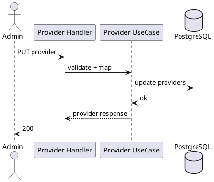

---
tags:
  - module
  - provider
created: 2026-04-01
updated: 2026-04-01
---

# MODULE PROVIDER

> [!abstract] Mục tiêu
> Quản lý thực thể nhà xe (provider) như một chủ thể nghiệp vụ cấp cao, làm nền cho quản trị phương tiện, chuyến xe, thương hiệu hiển thị và chính sách vận hành.

## 1. Bối cảnh nghiệp vụ

Provider là đơn vị vận hành thực tế trong hệ thống đặt vé. Tính chính xác của dữ liệu provider ảnh hưởng đến niềm tin người dùng, khả năng lọc chuyến theo thương hiệu và mức độ đúng đắn trong quản trị nội bộ.

## 2. Yêu cầu chức năng

| ID | Yêu cầu |
|---|---|
| PRV-01 | Admin tạo/cập nhật/kích hoạt-vô hiệu hóa provider |
| PRV-02 | Public đọc danh sách provider active |
| PRV-03 | Tìm kiếm provider theo tên/slug |

## 3. Mô hình dữ liệu

- `providers(id, name, hotline, slug, policy_refund, is_active)`

## 4. API Endpoints

| Method | Endpoint | Mô tả |
|---|---|---|
| GET | `/api/v1/providers` | Danh sách provider |
| GET | `/api/v1/providers/:id` | Chi tiết provider |
| POST | `/api/v1/admin/providers` | Tạo provider |
| PUT | `/api/v1/admin/providers/:id` | Cập nhật provider |
| PATCH | `/api/v1/admin/providers/:id/status` | Cập nhật trạng thái |

## 5. Sequence cập nhật provider

## 6. Quy tắc nghiệp vụ

- `slug` duy nhất trên toàn hệ thống.
- Provider inactive không được sử dụng để tạo trip mới.
- Thay đổi policy cần lưu vết để phục vụ kiểm toán vận hành.

## 7. Yêu cầu phi chức năng

- Truy vấn danh sách provider active tối ưu cho luồng public.
- Log đầy đủ thao tác admin để phục vụ audit.
- Không làm sai lệch dữ liệu lịch sử khi thay đổi trạng thái provider.

## 8. Tiêu chí chấp nhận

- Không cho phép tạo provider trùng slug.
- Provider inactive không xuất hiện ở luồng tạo trip mới.
