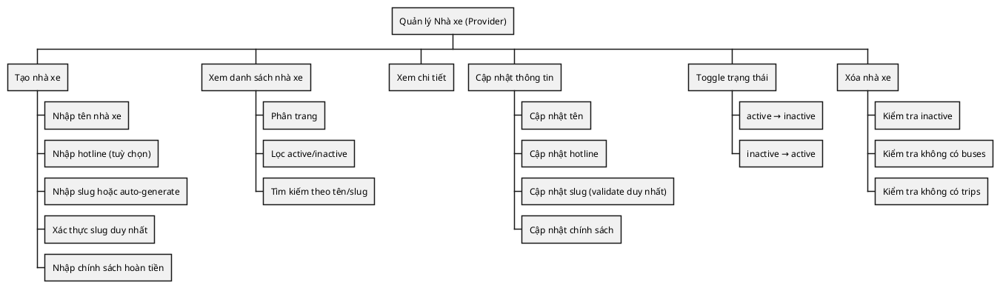
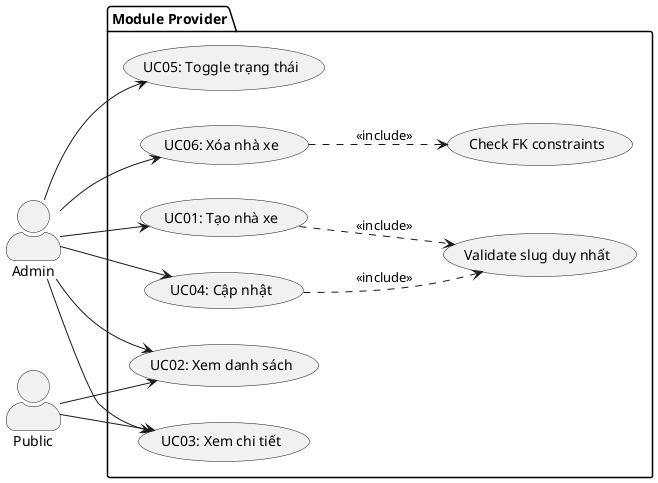
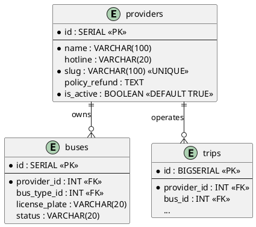
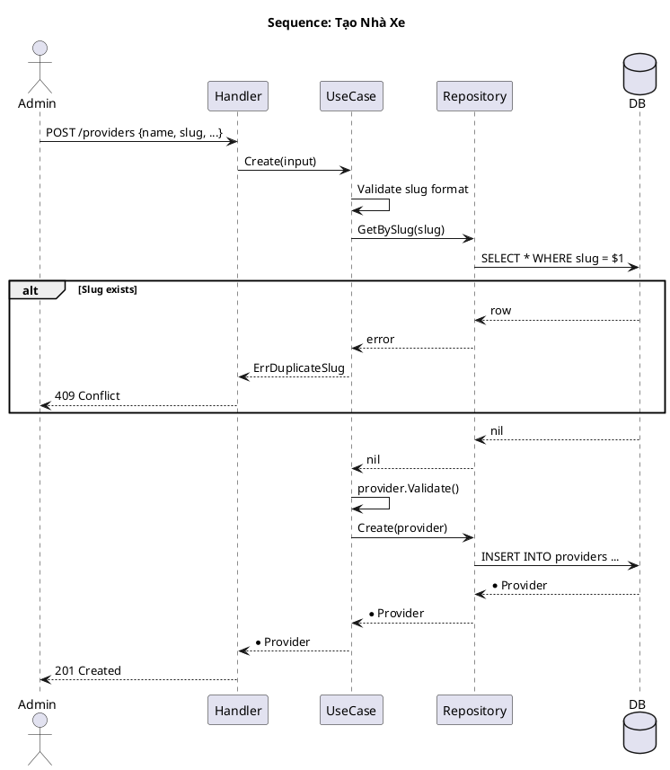
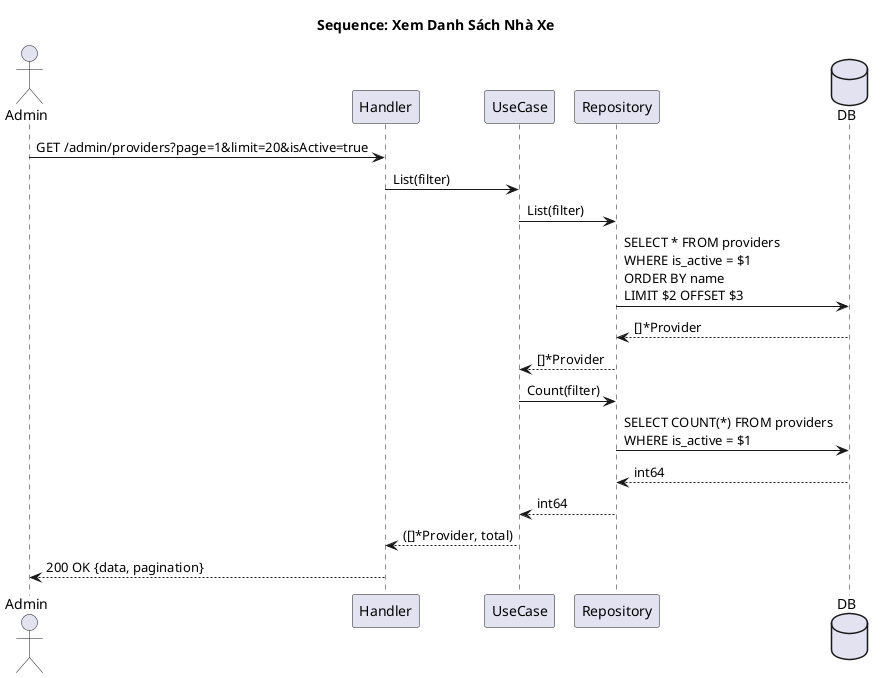
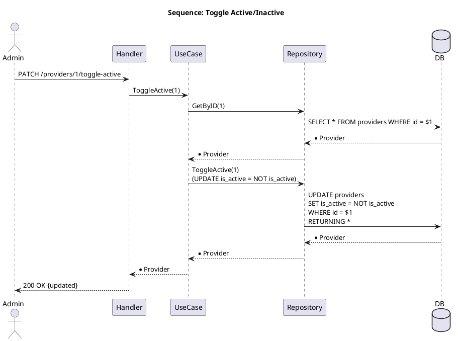
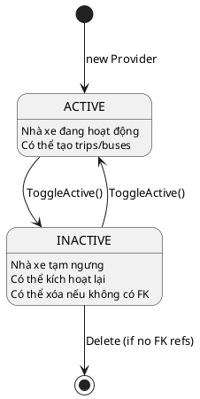

---
tags:
  - srs
  - system-design
  - provider
  - multi-tenant
created: 2026-04-06
updated: 2026-04-06
---

# TÀI LIỆU ĐẶC TẢ VÀ THIẾT KẾ MODULE: PROVIDER (NHÀ XE)

> [!abstract] TỔNG QUAN
> Module Provider quản lý thông tin các nhà xe (kinh doanh, đơn vị vận tải) trong hệ thống. Mỗi Provider là một đơn vị multi-tenant nắm giữ:
> - **Danh tính**: Tên, hotline, slug (dùng cho URL-friendly identity)
> - **Chính sách**: Chính sách hoàn tiền, điều khoản dịch vụ
> - **Tài nguyên**: Danh sách xe buýt (Buses), các chuyến đi (Trips)
> - **Trạng thái**: Active/Inactive (soft-delete alternative)
>
> Module cung cấp CRUD, search, active/inactive toggle. Chỉ **inactive providers** mới được xóa. Là _master data_ tối quan trọng trong hệ thống bookings.

---

## 1. ĐẶC TẢ YÊU CẦU (SOFTWARE REQUIREMENT SPECIFICATION)

### 1.1. Danh sách yêu cầu chức năng

| ID | Tên chức năng | Mô tả | Mức độ ưu tiên | Độ phức tạp | Tác nhân |
|-----|---------------|-------|----------------|-------------|----------|
| PROV-01 | Tạo nhà xe mới | Admin tạo nhà xe với tên, hotline, slug duy nhất, chính sách | P1 | M | Admin |
| PROV-02 | Xem danh sách nhà xe | Lấy danh sách tất cả nhà xe (active/inactive), phân trang, lọc | P1 | L | Admin/Public |
| PROV-03 | Xem chi tiết nhà xe | Lấy thông tin chi tiết một nhà xe | P2 | L | Admin/Public |
| PROV-04 | Cập nhật thông tin nhà xe | Chỉnh sửa tên, hotline, slug, chính sách hoàn tiền | P2 | M | Admin |
| PROV-05 | Bật/tắt trạng thái nhà xe | Toggle active/inactive (soft-delete) | P1 | L | Admin |
| PROV-06 | Xóa nhà xe | Xóa vĩnh viễn (chỉ nếu inactive và không có buses/trips) | P3 | M | Admin |

### 1.2. Biểu đồ phân cấp chức năng



---

## 2. BIỂU ĐỒ USE CASE



---

## 3. THIẾT KẾ CƠ SỞ DỮ LIỆU (DATABASE DESIGN)

### 3.1. ERD



### 3.2. Từ điển dữ liệu

| Tên trường | Kiểu dữ liệu | Ràng buộc | Mô tả |
|------------|--------------|-----------|-------|
| id | SERIAL | PK | Khóa chính nhà xe |
| name | VARCHAR(100) | NOT NULL, len >= 2 | Tên nhà xe (ví dụ: "Phương Trang") |
| hotline | VARCHAR(20) | NULL | Số điện thoại (regex: digits, spaces, dashes) |
| slug | VARCHAR(100) | UNIQUE, NOT NULL, len 3-50 | URL-friendly identifier (lowercase, dashes) |
| policy_refund | TEXT | NULL | Chính sách hoàn tiền (long text) |
| is_active | BOOLEAN | DEFAULT TRUE, NOT NULL | Trạng thái hoạt động (soft-delete) |

### 3.3. Ví dụ dữ liệu

| id | name | hotline | slug | is_active |
|----|------|---------|------|-----------|
| 1 | Phương Trang | 1900 6067 | phuong-trang | true |
| 2 | Thaco Bus | 1900 1110 | thaco-bus | true |
| 3 | Sapa Express | 1900 2222 | sapa-express | false |

---

## 4. KIẾN TRÚC HỆ THỐNG

### 4.1. Cấu trúc mã nguồn

| Lớp | Thư mục | File | Trách nhiệm |
|-----|---------|------|-------------|
| **Domain** | `domain/` | `entity.go` | Provider struct, Validate(), GenerateSlug(), CanBeDeleted() |
| **Domain** | `domain/` | `repository.go` | Repository interface (8 methods) |
| **UseCase** | `usecase/` | `usecase.go` | ProviderUseCase interface + logic, includes slug duplicate check |
| **Repository** | `repository/` | `repository.go` | SQL implementation |
| **Controller** | `controller/dto/` | `provider.go` | Request/Response DTOs |
| **Controller** | `controller/http/` | `handler.go` | HTTP handlers |

### 4.2. API Endpoints

| HTTP | Endpoint | Auth | Mô tả |
|------|----------|------|-------|
| **POST** | `/api/v1/admin/providers` | Admin | Tạo nhà xe |
| **GET** | `/api/v1/admin/providers` | Admin | Danh sách (admin) |
| **GET** | `/api/v1/providers` | Public | Danh sách (public - active only) |
| **GET** | `/api/v1/admin/providers/:id` | Admin | Chi tiết |
| **GET** | `/api/v1/providers/{slug}` | Public | Chi tiết by slug |
| **PUT** | `/api/v1/admin/providers/:id` | Admin | Cập nhật |
| **PATCH** | `/api/v1/admin/providers/:id/toggle-active` | Admin | Toggle active/inactive |
| **DELETE** | `/api/v1/admin/providers/:id` | Admin | Xóa |

### 4.3. Response Structure

**ProviderResponse:**
```json
{
    "id": 1,
    "name": "Phương Trang",
    "hotline": "1900 6067",
    "slug": "phuong-trang",
    "policyRefund": "Hủy >= 24h: 100%...",
    "isActive": true
}
```

---

## 5. BIỂU ĐỒ TUẦN TỰ

### 5.1. Tạo nhà xe



### 5.2. Danh sách nhà xe



### 5.3. Toggle trạng thái



---

## 6. MÁY TRẠNG THÁI



---

## 7. QUY TẮC NGHIỆP VỤ

### 7.1. Validation Rules

| Trường | Quy tắc | Error |
|--------|---------|-------|
| name | Bắt buộc, >= 2 ký tự | ErrProviderNameRequired, ErrProviderNameTooShort |
| hotline | Tuỳ chọn, chỉ digits/spaces/dashes | ErrProviderHotlineInvalid |
| slug | Bắt buộc, 3-50 ký tự, lowercase+dashes, duy nhất | ErrProviderSlugInvalid, ErrProviderSlugTooShort/Long, ErrDuplicateSlug |
| policy_refund | Tuỳ chọn, long text | (no validation) |

### 7.2. Quy tắc tạo

| BR-CREATE-01 | Nhà xe mới được tạo với `is_active = TRUE` |
|---|---|
| BR-CREATE-02 | Slug phải duy nhất, không được trùng nhà xe khác |
| BR-CREATE-03 | Nếu không cung cấp slug, có thể auto-generate từ tên |

### 7.3. Quy tắc xóa

| BR-DELETE-01 | Chỉ xóa được nếu `is_active = FALSE` |
|---|---|
| BR-DELETE-02 | Không xóa được nếu còn buses FK (foreign key) |
| BR-DELETE-03 | Không xóa được nếu còn trips FK |
| BR-DELETE-04 | Khuyên: Toggle inactive thay vì xóa hard |

### 7.4. Quy tắc toggle

| BR-TOGGLE-01 | Toggle từ active → inactive, hoặc vice versa |
|---|---|
| BR-TOGGLE-02 | Khi toggle inactive: trips sắp tới nên bị hủy (hệ thống) |

---

## 8. XỬ LÝ LỖI

| Domain Error | HTTP Status | Code | Mô tả |
|--------------|-------------|------|-------|
| ErrProviderNotFound | 404 | PROVIDER_NOT_FOUND | Không tìm thấy nhà xe |
| ErrProviderNameRequired | 400 | NAME_REQUIRED | Thiếu tên nhà xe |
| ErrProviderNameTooShort | 400 | NAME_TOO_SHORT | Tên quá ngắn |
| ErrProviderHotlineInvalid | 400 | HOTLINE_INVALID | Hotline không hợp lệ |
| ErrProviderSlugInvalid | 400 | SLUG_INVALID | Slug không hợp lệ (format) |
| ErrProviderSlugTooShort/Long | 400 | SLUG_LEN_INVALID | Slug quá ngắn/dài |
| ErrDuplicateSlug | 409 | SLUG_EXISTS | Slug này đã tồn tại |
| ErrProviderCannotDelete | 409 | CANNOT_DELETE | Nhà xe còn active hoặc có FK refs |

---

## 9. CẤU TRÚC REQUEST/RESPONSE

**CreateProviderRequest:**
```json
{
    "name": "Phương Trang",
    "hotline": "1900 6067",
    "slug": "phuong-trang",
    "policyRefund": "Hủy >= 24h: 100%, 6-24h: 70%..."
}
```

**ListProvidersResponse:**
```json
{
    "success": true,
    "data": [
        {
            "id": 1,
            "name": "Phương Trang",
            "hotline": "1900 6067",
            "slug": "phuong-trang",
            "isActive": true
        }
    ],
    "pagination": {
        "page": 1,
        "limit": 20,
        "total": 50,
        "totalPages": 3
    }
}
```

---

## 10. TỐI ƯU QUERY

**Recommended Indexes:**
```sql
CREATE INDEX idx_providers_slug ON providers (slug);
CREATE INDEX idx_providers_is_active ON providers (is_active) WHERE is_active = TRUE;
CREATE INDEX idx_providers_name ON providers (name);
```

---
