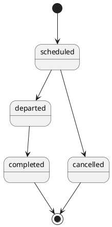
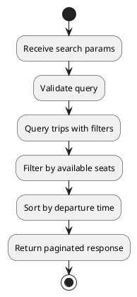

---
tags:
  - module
  - trip
  - schedule
created: 2026-04-01
updated: 2026-04-01
---

# MODULE TRIP

> [!abstract] Mục tiêu
> Quản lý dữ liệu chuyến xe, cung cấp chức năng tìm kiếm và chi tiết chuyến theo tiêu chí hành trình-thời gian-sức chứa, làm nguồn dữ liệu quyết định cho booking và recommendation.

## 1. Bối cảnh nghiệp vụ

Trip là đối tượng đại diện cho một phiên vận hành cụ thể của nhà xe trên tuyến đường xác định, gắn với phương tiện, lịch khởi hành và năng lực ghế. Chất lượng của module Trip ảnh hưởng trực tiếp đến:

- Tỷ lệ tìm thấy chuyến phù hợp.
- Độ chính xác dữ liệu ghế khả dụng.
- Khả năng lập kế hoạch từ AI chat/voice.

## 2. Yêu cầu chức năng

| ID | Yêu cầu |
|---|---|
| TRIP-01 | Search trip theo `origin`/`destination`/`date`/`passengers` |
| TRIP-02 | Xem chi tiết trip |
| TRIP-03 | Admin tạo/cập nhật/xóa trip |
| TRIP-04 | Admin cập nhật trạng thái theo state machine |

## 3. Cơ sở lý thuyết lập lịch và năng lực chở

Trong bài toán vận tải, một trip hợp lệ phải đồng thời thỏa ba nhóm ràng buộc:

1. **Ràng buộc thời gian**: điểm đến phải sau điểm đi (`arrival_time > departure_time`).
2. **Ràng buộc sức chứa**: tổng ghế đặt không vượt năng lực xe.
3. **Ràng buộc trạng thái**: chỉ trip trạng thái mở bán mới có thể booking.

Việc mô hình hóa rõ ba nhóm ràng buộc giúp hệ thống tránh sai lệch dữ liệu lịch sử và tạo nền tảng cho tối ưu hóa tuyến trong tương lai.

## 4. Vòng đời trạng thái Trip

- `scheduled -> departed -> completed`
- `scheduled -> cancelled`

## 5. API Endpoints

| Method | Endpoint | Mô tả |
|---|---|---|
| GET | `/api/v1/trips` | Tìm kiếm chuyến |
| GET | `/api/v1/trips/:id` | Chi tiết chuyến |
| POST | `/api/v1/admin/trips` | Tạo chuyến |
| PUT | `/api/v1/admin/trips/:id` | Cập nhật chuyến |
| PATCH | `/api/v1/admin/trips/:id/status` | Cập nhật trạng thái |

## 6. DFD luồng Search Trip

## 7. Quy tắc dữ liệu và lọc kết quả

- Nếu thiếu `passengers`, mặc định `1`.
- Chỉ trả trip có đủ ghế theo số lượng yêu cầu.
- Chỉ trả trip ở trạng thái cho phép booking.
- Sắp xếp kết quả theo thời gian khởi hành tăng dần (mặc định).

## 8. Quan hệ với AI recommendation

Trip là nguồn dữ liệu để AI gợi ý hành trình. Tuy nhiên AI chỉ đề xuất; việc chọn trip và tạo booking vẫn qua backend deterministic.

Quy tắc phối hợp:

- Khi chat đủ field (`origin`, `destination`, `date`, `time`, `budget`), Trip module cung cấp tập candidate.
- Voice plan cũng sử dụng Trip module để tìm candidate trước khi execute.

## 9. Yêu cầu phi chức năng

### 9.1 Performance

- Search endpoint cần tối ưu chỉ mục cho bộ lọc route/date/status.
- Trả phân trang để tránh payload quá lớn.

### 9.2 Reliability

- Đồng bộ dữ liệu `available_seats` với trạng thái booking.
- Bảo vệ tính đúng đắn trạng thái trip theo state machine.

### 9.3 Maintainability

- Tách rõ logic query và logic chuyển trạng thái.
- Dễ mở rộng thêm điều kiện lọc trong tương lai.

## 10. Kịch bản kiểm thử

| Mã | Kịch bản | Kỳ vọng |
|---|---|---|
| TRIP-TC-01 | Search hợp lệ đầy đủ params | Trả đúng danh sách trip |
| TRIP-TC-02 | Thiếu `passengers` | Mặc định `1` |
| TRIP-TC-03 | Trip không đủ ghế | Không xuất hiện trong kết quả |
| TRIP-TC-04 | Chuyển trạng thái sai quy tắc | Bị từ chối |

## 11. Tiêu chí chấp nhận

- Kết quả tìm chuyến phản ánh đúng dữ liệu thực tế và quy tắc trạng thái.
- Không trả trip không khả dụng cho booking.
- Module đáp ứng tốt vai trò nguồn dữ liệu cho cả form flow và AI flow.
