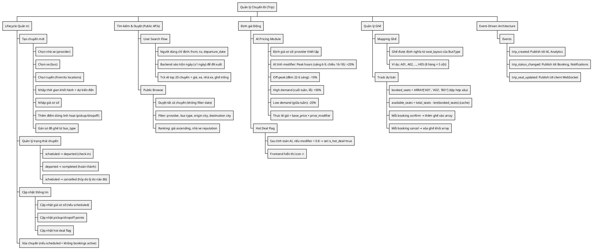
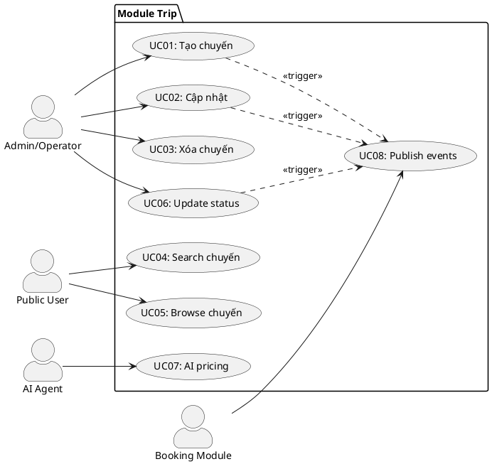
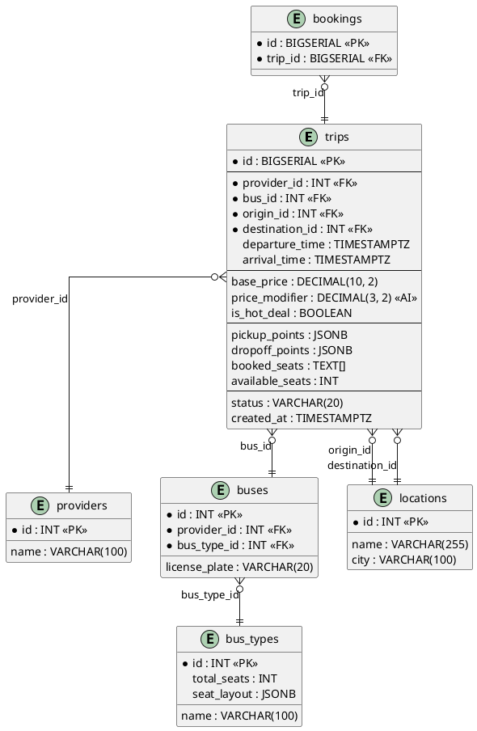
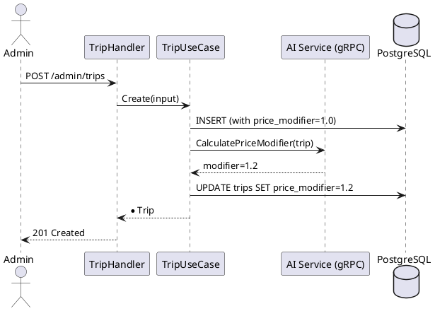
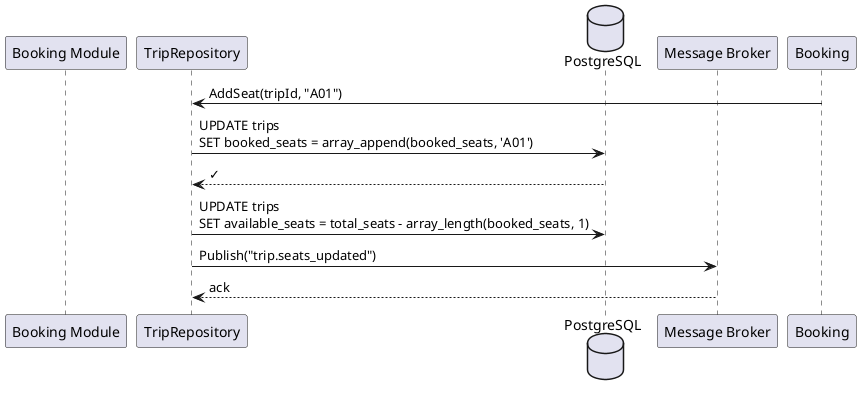
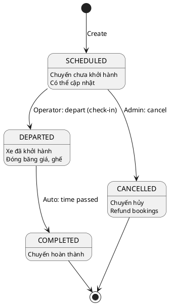
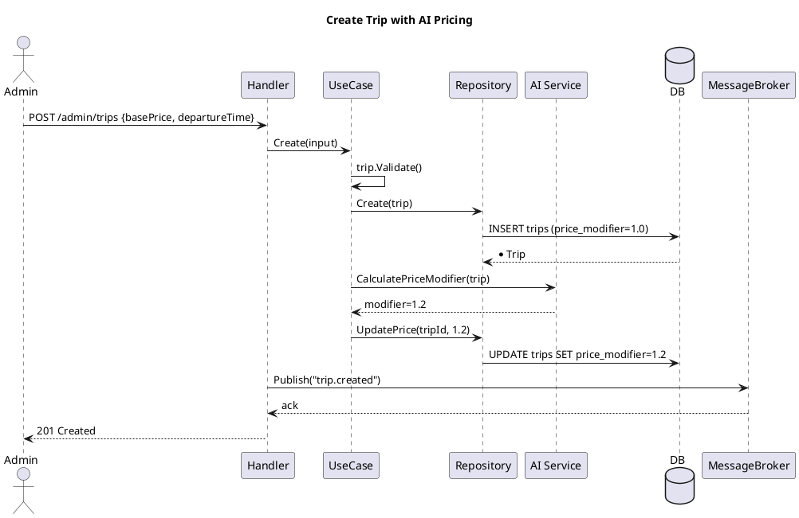
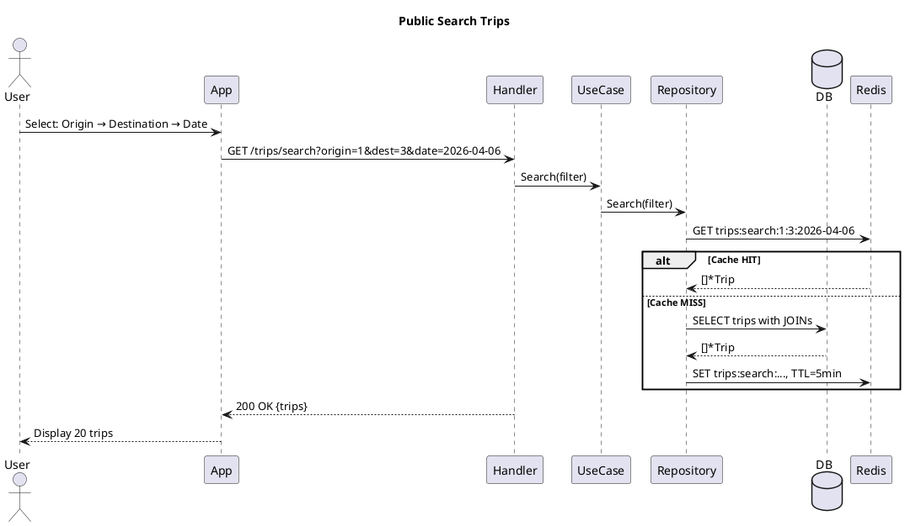
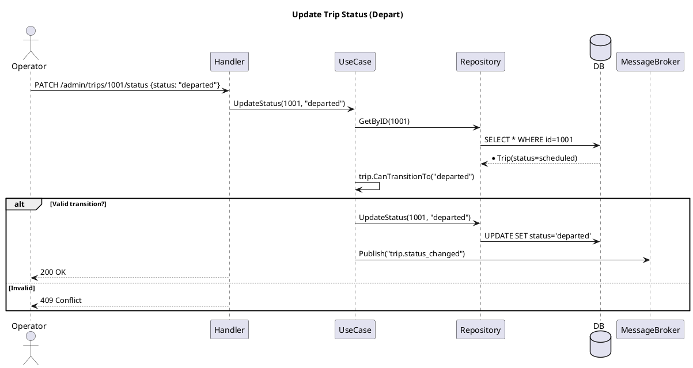

---
tags:
  - srs
  - system-design
  - trip
  - core-module
  - pricing
  - ai-driven
  - event-driven
created: 2026-04-06
updated: 2026-04-06
---

# TÀI LIỆU ĐẶC TẢ VÀ THIẾT KẾ MODULE: TRIP (CHUYẾN ĐI)

> [!abstract] TỔNG QUAN
> Module Trip là **core của hệ thống**, quản lý toàn bộ thông tin chuyến đi xe buýt. Mỗi Trip là một chuyến cụ thể trên tuyến đường cụ thể vào ngày cụ thể, với:
> - **Định giá thông minh**: Giá cơ sở + hệ số AI (surge pricing, hot deal)
> - **Quản lý ghế**: Theo dõi danh sách ghế đã bán (array TEXT[])
> - **Điểm dừng linh hoạt**: Pickup/dropoff points (JSONB) — đặc tính VN
> - **Vòng đời trạng thái**: scheduled → departed → completed/cancelled
> - **Hai luồng tìm kiếm**: Search (tìm kiếm chuyên sâu) + Browse (duyệt)
> - **Event-driven**: Tích hợp với Booking + AI Agent + Messaging
>
> Là **thế mạnh cạnh tranh** của platform — linh hoạt hơn các competitor quốc tế.

---

## 1. ĐẶC TẢ YÊU CẦU (SOFTWARE REQUIREMENT SPECIFICATION - SRS)

### 1.1. Context nghiệp vụ

Trong kinh doanh vận tải đường bộ Việt Nam, người dùng kỳ vọng:
1. **Cấu trúc chuyến đi từ lại** (pickup/dropoff tại nhiều điểm, không chỉ bến chính)
2. **Giá động** theo nhu cầu (cao điểm, lễ)
3. **Tìm kiếm nhanh** (from → to → date)
4. **Thông tin đầy đủ** (xe, nhà xe, thời gian, giá... all-in-one)

Trip là nút giao của tất cả: kết nối Provider + Bus + Location + Booking + AI pricing.

### 1.2. Danh sách yêu cầu chức năng

| ID | Tên chức năng | Mô tả | Ưu tiên | Độ phức tạp | Tác nhân |
|-----|---------------|-------|---------|-------------|----------|
| TRIP-01 | Tạo chuyến đi | Admin/Provider tạo trip: from, to, time, bus, price, pickup/dropoff points | P1 | H | Admin/Operator |
| TRIP-02 | Xem danh sách (Admin) | Admin xem tất cả trips, lọc theo provider/status | P1 | M | Admin |
| TRIP-03 | Xem chi tiết | Lấy info chi tiết trip (bao gồm đội xe info, địa điểm, sơ đồ ghế) | P1 | M | Admin/Public |
| TRIP-04 | Cập nhật trip | Chỉnh sửa info (status, giá, điểm dừng) — chỉ nếu scheduled | P2 | M | Admin |
| TRIP-05 | Xóa chuyến | Xóa trip (chỉ nếu scheduled + không có bookings) | P3 | L | Admin |
| TRIP-06 | Search chuyến (Public) | Người dùng tìm: from → to → date → đề xuất 20 chuyến | P1 | H | Public/App |
| TRIP-07 | Browse chuyến (Public) | Duyệt tất cả chuyến (filter provider/bus type) | P2 | M | Public |
| TRIP-08 | Cập nhật trạng thái | scheduled → departed → completed / cancelled | P1 | L | System/Operator |
| TRIP-09 | AI pricing modifier | AI Agent tính hệ số giá (1.2 peak hour, 0.9 off-peak) | P1 | H | AI Service |
| TRIP-10 | Event: Trip created | Publish event "trip.created" cho AI training, analytics | P1 | L | System |

### 1.3. Biểu đồ phân cấp chức năng (Functional Hierarchy - WBS)



---

## 2. BIỂU ĐỒ USE CASE & DỮ LIỆU FLOW

### 2.1. Use Case Diagram



### 2.2. Data Flow Diagram (Search)

```plantuml
@startuml
!define DIRECTION right

participant User
participant "TripHandler"
participant "TripUseCase"
participant "TripRepository"
database "PostgreSQL"
participant "Redis Cache"

User -> TripHandler: Search trips {from, to, date}
TripHandler -> TripUseCase: Search(filter)
TripUseCase -> TripRepository: Search(filter)
TripRepository -> Redis Cache: GET "trips:search:..."
alt Cache HIT
    Redis Cache --> TripRepository: [*Trip]
else Cache MISS
    TripRepository -> PostgreSQL: SELECT trips with JOINs
    PostgreSQL --> TripRepository: [*Trip]
    TripRepository -> Redis Cache: SET "trips:search:...", TTL=5min
end
TripRepository --> TripUseCase: [*Trip]
TripUseCase --> TripHandler: [*Trip]
TripHandler --> User: 200 OK {trips}

@enduml
```

---

## 3. THIẾT KẾ CƠ SỞ DỮ LIỆU (DATABASE DESIGN)

### 3.1. ERD - Entity Relationship Diagram



### 3.2. Từ điển dữ liệu (Data Dictionary)

| Tên trường | Kiểu | Ràng buộc | Mô tả |
|------------|------|-----------|-------|
| `id` | BIGSERIAL | PK | Khóa chính chuyến |
| `provider_id` | INT | FK, NOT NULL | ID nhà xe |
| `bus_id` | INT | FK, NOT NULL | ID xe cụ thể |
| `origin_id` | INT | FK, NOT NULL | ID tuyến đi |
| `destination_id` | INT | FK, NOT NULL | ID tuyến đến |
| `departure_time` | TIMESTAMPTZ | NOT NULL, > NOW() | Thời gian khởi hành |
| `arrival_time` | TIMESTAMPTZ | NOT NULL, > departure_time | Thời gian dự kiến đến |
| `base_price` | DECIMAL(10,2) | NOT NULL, > 0 | Giá cơ sở (VND) |
| `price_modifier` | DECIMAL(3,2) | DEFAULT 1.0 | Hệ số giá từ AI (0.5-2.0) |
| `is_hot_deal` | BOOLEAN | DEFAULT FALSE | Flag hot deal |
| `pickup_points` | JSONB | [] default | Danh sách điểm dừng đi |
| `dropoff_points` | JSONB | [] default | Danh sách điểm dừng về |
| `booked_seats` | TEXT[] | DEFAULT {} | Mảng ghế đã bán |
| `available_seats` | INT | NOT NULL, >= 0 | Cache ghế trống |
| `status` | VARCHAR(20) | DEFAULT 'scheduled' | Trạng thái (enum) |
| `created_at` | TIMESTAMPTZ | DEFAULT NOW() | Audit trail |

### 3.3. Pickup/Dropoff Points JSON Example

```json
{
    "pickup_points": [
        {"name": "Bến xe Miền Đông Mới", "time": "06:00", "surcharge": 0.0},
        {"name": "Tô Ký Q12", "time": "06:15", "surcharge": 10000.0},
        {"name": "Thủ Đức", "time": "06:30", "surcharge": 15000.0}
    ],
    "dropoff_points": [
        {"name": "Bến xe Nước Ngầm", "time": "09:00", "surcharge": 0.0},
        {"name": "Hàng Cót", "time": "08:50", "surcharge": -20000.0}
    ]
}
```

---

## 4. KIẾN TRÚC HỆ THỐNG (SYSTEM ARCHITECTURE)

### 4.1. Hexagonal Architecture (Ports & Adapters)

```
HTTP HANDLERS
    ↓
USE CASE LAYER (Business Logic)
    ↓ DOMAIN LAYER (Trip Entity, State Machine)
    ↓ REPOSITORY INTERFACE (Ports)
    ↓
REPOSITORY IMPLEMENTATION (Adapters - SQL via sqlc)
    ↓
DATA LAYER (PostgreSQL, Redis, Message Broker)
```

### 4.2. API Endpoints - Full Reference

| HTTP | Endpoint | Auth | Status | Mô tả |
|------|----------|------|--------|-------|
| **POST** | `/api/v1/admin/trips` | Admin | 201 | Tạo chuyến |
| **GET** | `/api/v1/admin/trips` | Admin | 200 | Danh sách admin |
| **GET** | `/api/v1/admin/trips/:id` | Admin | 200/404 | Chi tiết admin |
| **PUT** | `/api/v1/admin/trips/:id` | Admin | 200/409 | Cập nhật |
| **PATCH** | `/api/v1/admin/trips/:id/status` | Admin | 200/409 | Chuyển trạng thái |
| **DELETE** | `/api/v1/admin/trips/:id` | Admin | 204/409 | Xóa |
| **GET** | `/api/v1/trips/search` | Public | 200 | Search public |
| **GET** | `/api/v1/trips/browse` | Public | 200 | Browse public |
| **GET** | `/api/v1/trips/:id` | Public | 200/404 | Chi tiết public |

### 4.3. Repository Interface (10 Methods)

```go
type ITripRepository interface {
    Create(ctx context.Context, trip *Trip) (*Trip, error)
    GetByID(ctx context.Context, tripID int64) (*Trip, error)
    Update(ctx context.Context, trip *Trip) (*Trip, error)
    UpdateStatus(ctx context.Context, tripID int64, status string) (*Trip, error)
    Delete(ctx context.Context, tripID int64) error
    List(ctx context.Context, filter *ListFilter, page, limit int) ([]*Trip, error)
    Search(ctx context.Context, filter *SearchFilter, page, limit int) ([]*Trip, error)
    Browse(ctx context.Context, filter *BrowseFilter, page, limit int) ([]*Trip, error)
    CountActiveBookings(ctx context.Context, tripID int64) (int, error)
    ListAll(ctx context.Context) ([]*Trip, error)
}
```

### 4.4. Request/Response DTOs

**CreateTripRequest**:
```json
{
    "providerId": 1,
    "busId": 5,
    "originId": 1,
    "destinationId": 3,
    "departureTime": "2026-04-06T06:00:00Z",
    "arrivalTime": "2026-04-06T09:00:00Z",
    "basePrice": 300000,
    "pickupPoints": [...],
    "dropoffPoints": [...]
}
```

**TripResponse (Complete)**:
```json
{
    "id": 1001,
    "providerId": 1,
    "providerName": "Phương Trang",
    "busId": 5,
    "busTypeName": "Giường nằm 40 chỗ",
    "originName": "Bến xe Miền Đông Mới",
    "originCity": "Hồ Chí Minh",
    "destinationName": "Bến xe Nước Ngầm",
    "destinationCity": "Hà Nội",
    "departureTime": "2026-04-06T06:00:00Z",
    "arrivalTime": "2026-04-06T09:00:00Z",
    "basePrice": 300000,
    "priceModifier": 1.2,
    "finalPrice": 360000,
    "isHotDeal": false,
    "availableSeats": 37,
    "status": "scheduled",
    "bookedSeats": ["A01", "A02"],
    "pickupPoints": [...],
    "dropoffPoints": [...]
}
```

---

## 5. ĐỊNH GIÁ ĐỘNG & AI INTEGRATION (PRICING ENGINE)

### 5.1. Pricing Algorithm

```
Input: Trip (base_price, departure_time, occupancy_rate)
Output: price_modifier (0.5-2.0 range)

1. Time-based: Peak hours (+20%), off-peak (-10%)
2. Day-based: Weekend (+15%), holiday (+50%), weekday (-5%)
3. Occupancy-based: >85% full (+20%), <30% (-20%)
4. Apply all: modifier = 1.0 × time_factor × day_factor × occupancy_factor
5. Hot deal: if modifier < 0.8 → is_hot_deal = true
6. Cap: modifier = max(0.5, min(2.0, modifier))
```

**Example 1: Peak time, weekend, 90% occupancy**
- Base: 300,000 VND
- Modifiers: 1.2 (peak) × 1.15 (weekend) × 1.2 (occupancy) = **1.66**
- Final Price: 300,000 × 1.66 = **498,000 VND**

**Example 2: Off-peak, Tuesday, 20% occupancy**
- Base: 300,000 VND
- Modifiers: 0.9 (off-peak) × 0.95 (weekday) × 0.8 (occupancy) = **0.68**
- Final Price: 300,000 × 0.68 = **205,200 VND** (is_hot_deal = true 🔥)

### 5.2. AI Service Integration (gRPC)



---

## 6. QUẢN LÝ GHẾ (SEAT ALLOCATION)

### 6.1. Seat State Machine

```
Initial: booked_seats = []
  ↓
Booking A01: booked_seats = ['A01'], available_seats = 39
  ↓
Booking A02: booked_seats = ['A01', 'A02'], available_seats = 38
  ↓
Cancel A01: booked_seats = ['A02'], available_seats = 39
  ↓
Full: booked_seats = [all 40], available_seats = 0 → Cannot book
```

### 6.2. Seat Update Flow



---

## 7. VÒNG ĐỜI TRẠNG THÁI (STATE MACHINE)

### 7.1. Status Transition Diagram



### 7.2. Transition Rules

| From | To | Condition | Side Effects |
|-----|----|-----------|----|
| scheduled | departed | Operator action | Freeze trip |
| scheduled | cancelled | Admin action | Refund all bookings |
| departed | completed | Auto (time-based) | Calculate revenue |

---

## 8. SEARCH & BROWSE MODES

### 8.1. Search Mode (Public - User Search)

```
Input: origin_id, destination_id, date, min_seats
Output: Paginated trips ranked by price
Algorithm:
  - Query trips WHERE origin, destination, date ±1 day, available >= min_seats
  - Check Redis cache, cache miss → query DB
  - Return top 20 + pagination
  - TTL: 5 min
```

### 8.2. Browse Mode (Admin - List All)

```
Input: {provider_id?, bus_type_id?, page, limit}
Output: Paginated trips
Query: SELECT ... WHERE (provider_id OR NULL) AND (bus_type_id OR NULL)
Order: departure_time DESC
Pagination: page, limit
```

---

## 9. EVENT-DRIVEN ARCHITECTURE (Messaging)

### 9.1. Events Published

| Event | When | Format | Consumer |
|-------|------|--------|----------|
| `trip.created` | After Create | {tripId, providerId, from, to, basePrice} | AI, Analytics |
| `trip.status_changed` | After UpdateStatus | {tripId, oldStatus, newStatus} | Booking, Notifications |
| `trip.seats_updated` | After booking | {tripId, seatCode, action} | WebSocket |
| `trip.price_updated` | After AI pricing | {tripId, oldPrice, newPrice} | Analytics |

---

## 10. QUY TẮC NGHIỆP VỤ (BUSINESS RULES)

### 10.1. Validation Rules

| Rule | Condition | Error |
|------|-----------|-------|
| provider_id required | > 0 | ErrTripProviderRequired |
| origin ≠ destination | Valid | ErrInvalidInput |
| departure > NOW | Valid | ErrTripDepartureInPast |
| arrival > departure | Valid | ErrArrivalBeforeDeparture |
| base_price > 0 | Valid | ErrTripPriceInvalid |
| valid status | IN (scheduled, departed, completed, cancelled) | ErrTripStatusInvalid |

### 10.2. Update Rules

| Rule | Condition |
|------|-----------|
| Can update only if scheduled | trip.CanBeModified() |
| Cannot update price after departed | status ≠ scheduled |
| Cannot set arrival < departure | validation error |

### 10.3. Delete Rules

| Rule | Condition |
|------|-----------|
| Can delete only if scheduled | status = scheduled |
| Cannot delete if active bookings | CountActiveBookings(tripId) = 0 |
| Result: 409 Conflict if fails | HTTP status |

### 10.4. Booking Rules

| Rule |
|------|
| Booking confirm → add to booked_seats |
| Booking cancel → remove from booked_seats |
| Only book if available_seats > 0 |
| Pickup/dropoff surcharge add to final_price |

---

## 11. XỬ LÝ LỖI (ERROR HANDLING)

### 11.1. Error Mapping

| Domain Error | HTTP Status | Error Code | Message |
|--------------|-------------|------------|---------|
| ErrTripNotFound | 404 | TRIP_NOT_FOUND | Không tìm thấy chuyến |
| ErrInvalidInput | 400 | INVALID_INPUT | Dữ liệu không hợp lệ |
| ErrTripStatusInvalid | 400 | STATUS_INVALID | Trạng thái không hợp lệ |
| ErrTripTransitionInvalid | 409 | TRANSITION_INVALID | Không thể chuyển trạng thái |
| ErrTripDepartureInPast | 400 | DEPARTURE_PAST | Thời gian khởi hành đã qua |
| ErrArrivalBeforeDeparture | 400 | ARRIVAL_BEFORE_DEP | Arrival > Departure |
| ErrTripCannotModify | 409 | CANNOT_MODIFY | Chuyến không thể sửa |
| ErrTripCannotDelete | 409 | CANNOT_DELETE | Chuyến không thể xóa |
| ErrTripHasActiveBookings | 409 | HAS_BOOKINGS | Chuyến còn bookings |

### 11.2. Error Response Example

```json
{
    "success": false,
    "error": {
        "code": "TRANSITION_INVALID",
        "message": "Cannot transition from 'departed' to 'scheduled'",
        "timestamp": "2026-04-06T10:30:45Z"
    }
}
```

---

## 12. BIỂU ĐỒ TUẦN TỰ (KEY SEQUENCE DIAGRAMS)

### 12.1. Create Trip Flow



### 12.2. Search Trip Flow



### 12.3. Update Status Flow



---

## 13. TỐI ƯU QUERY & PERFORMANCE

### 13.1. Index Strategy

```sql
-- Search by route + date
CREATE INDEX idx_trips_origin_dest_departure 
    ON trips (origin_id, destination_id, DATE(departure_time))
    WHERE status = 'scheduled';

-- Filter by provider
CREATE INDEX idx_trips_provider_status 
    ON trips (provider_id, status);

-- Filter by price (ranking)
CREATE INDEX idx_trips_final_price 
    ON trips ((base_price * price_modifier) ASC)
    WHERE status = 'scheduled';

-- Available seats
CREATE INDEX idx_trips_available_seats 
    ON trips (available_seats DESC)
    WHERE status = 'scheduled';
```

### 13.2. Sample Search Query

```sql
SELECT t.*, p.name, b.license_plate, bt.name, 
       l_org.name, l_dst.name
FROM trips t
JOIN providers p ON t.provider_id = p.id
JOIN buses b ON t.bus_id = b.id
JOIN bus_types bt ON b.bus_type_id = bt.id
JOIN locations l_org ON t.origin_id = l_org.id
JOIN locations l_dst ON t.destination_id = l_dst.id
WHERE t.origin_id = $1 
  AND t.destination_id = $2
  AND DATE(t.departure_time) IN ($3-1, $3, $3+1)
  AND t.available_seats >= $4
  AND t.status = 'scheduled'
ORDER BY (t.base_price * t.price_modifier) ASC
LIMIT $5 OFFSET $6;
```

### 13.3. Performance Targets

| Query | Expected Time | Cache | Notes |
|-------|---|---|---|
| Search (20 trips) | 50ms | 5min | Full JOIN |
| GetByID | 2ms | - | PK lookup |
| UpdateStatus | 10ms | - | UPDATE + RETURNING |
| CountActiveBookings | 5ms | - | Subquery count |

### 13.4. Caching Strategy

```
Redis Keys:
- trips:search:{originId}:{destId}:{date} TTL=5min
- trips:provider:{providerId} TTL=2min
- trips:browse:{filter_hash} TTL=3min

Invalidation:
- Create trip → Invalidate trips:provider:{providerId}
- Update trip → Invalidate trips:browse:*
- Delete trip → Invalidate trips:* (all)
```

---

## 14. DEPLOYMENT & OPERATIONS

### 14.1. Pre-Integration Checklist

- [ ] DB migrations applied, indexes created
- [ ] Redis connection pooled
- [ ] Message Broker topics created (trip.created, trip.status_changed, ...)
- [ ] AI Service gRPC endpoint available
- [ ] JWT middleware configured
- [ ] Structured logging with correlationId

### 14.2. Monitoring Metrics

```
- Search response time (p99 < 100ms)
- Booking success rate (> 99%)
- Trip creation rate
- Cache hit ratio (target > 80%)
- Event publishing latency (< 100ms)
```

---

## 15. FUTURE ENHANCEMENTS

| Feature | Priority | Effort | Impact |
|---------|----------|--------|--------|
| Custom provider pricing rules | P2 | M | Personalization |
| Loyalty program discounts | P2 | H | Retention |
| Real-time seat WebSocket | P2 | M | UX |
| Multi-leg trips (A→B→C) | P3 | H | Routing |
| AI demand forecasting | P3 | H | Optimization |

---

**Document Version**: 2.0 (Full Professional SRS + Implementation)
**Last Updated**: 2026-04-06
**Status**: ✅ COMPLETE - Ready for Development
