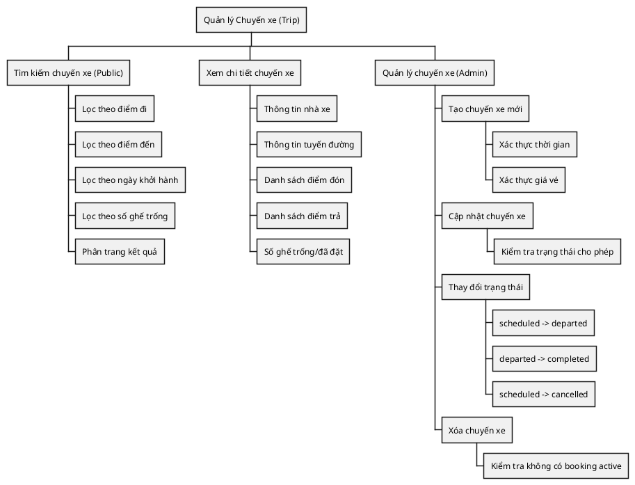
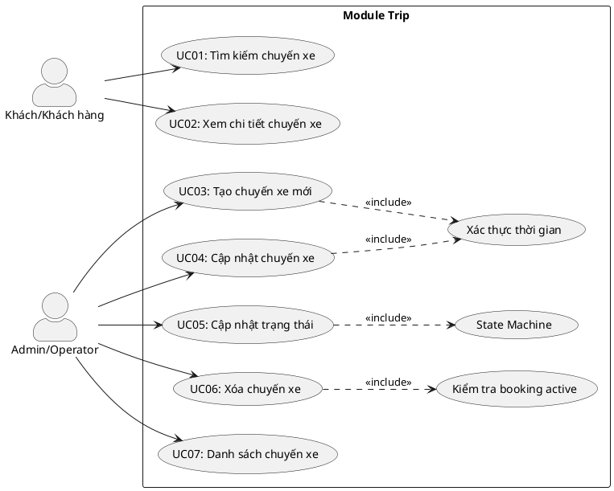
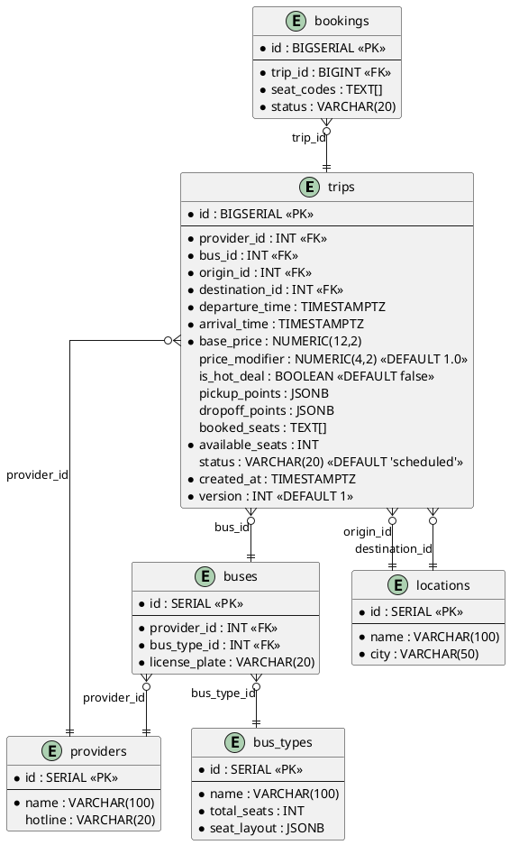
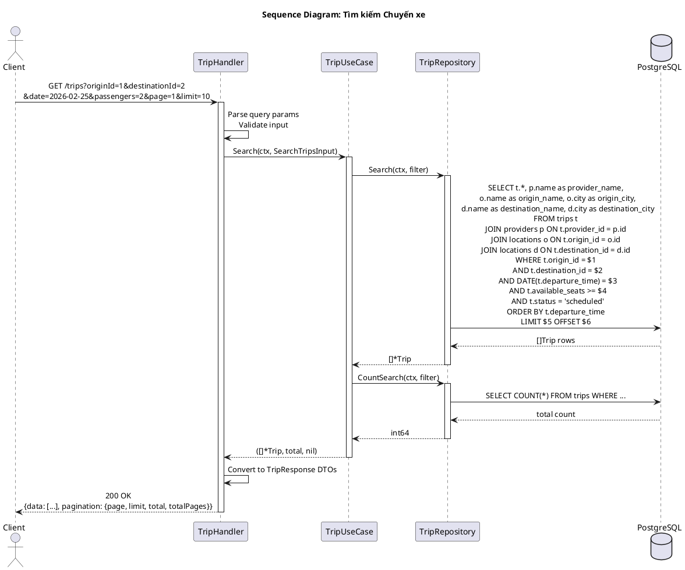
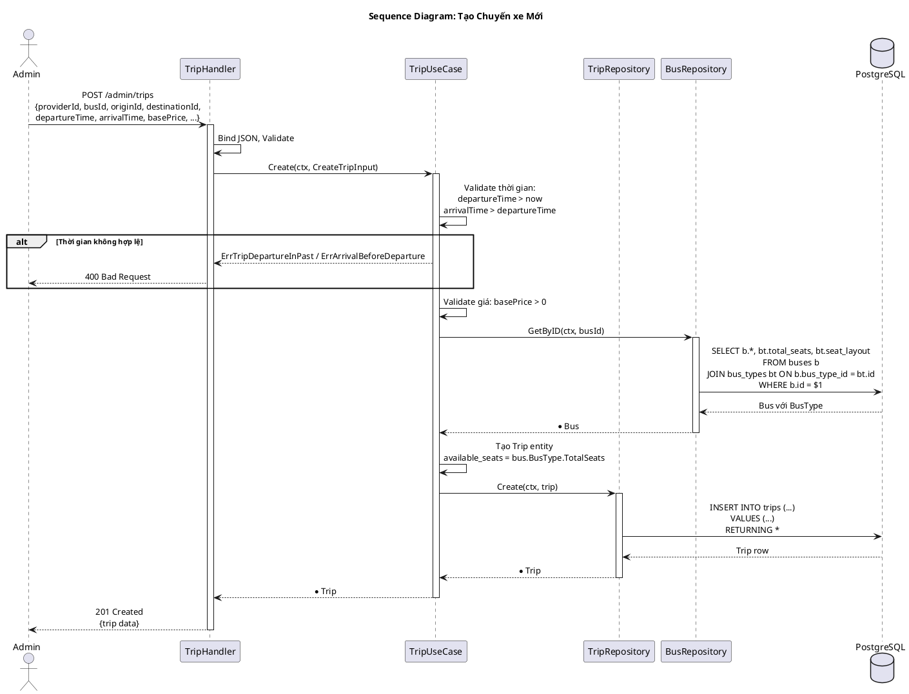
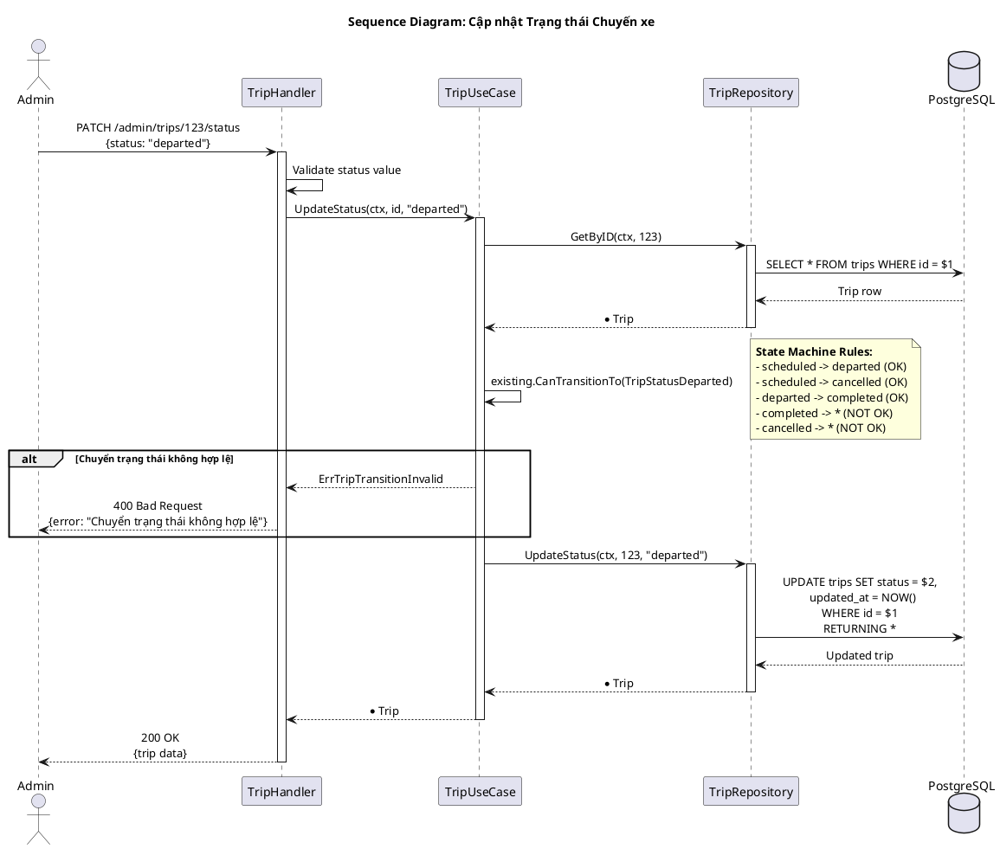
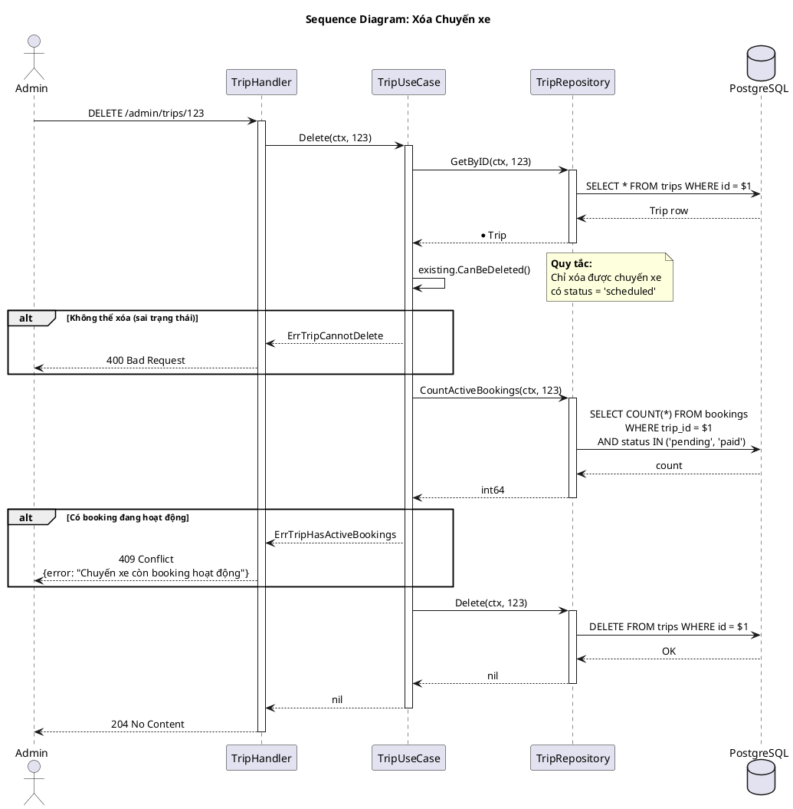
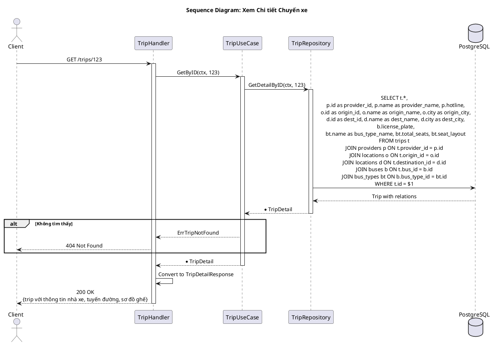
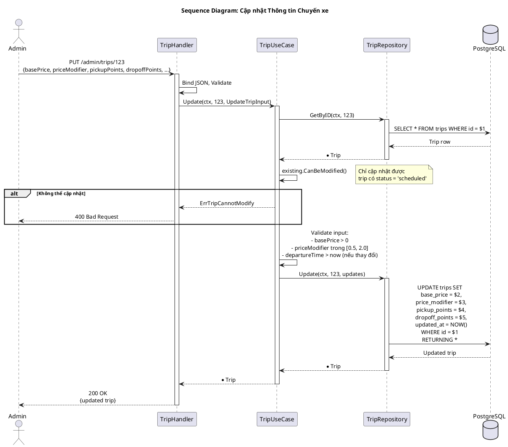
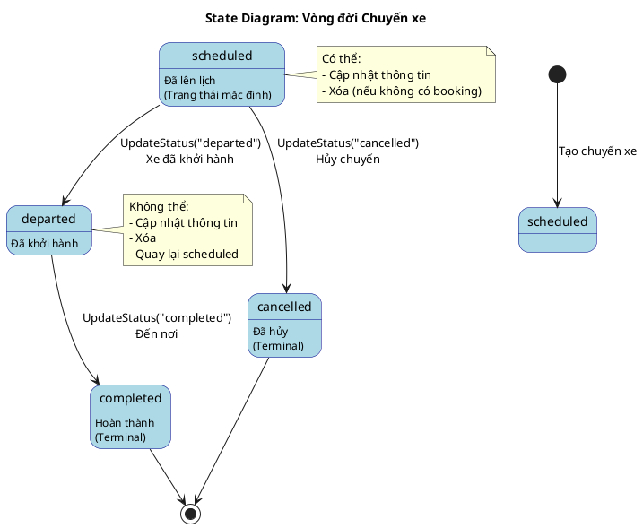

---
tags:
  - srs
  - system-design
  - trip
  - schedule
created: 2026-02-25
updated: 2026-02-25
---

# TÀI LIỆU ĐẶC TẢ VÀ THIẾT KẾ MODULE: TRIP (CHUYẾN XE)

> [!abstract] TỔNG QUAN
> Module Trip quản lý thông tin các chuyến xe trong hệ thống đặt vé xe buýt. Đây là module trung tâm kết nối giữa nhà xe (Provider), xe buýt (Bus), địa điểm (Location) và đặt vé (Booking). Module cung cấp các chức năng tìm kiếm chuyến xe cho khách hàng và quản lý chuyến xe cho admin bao gồm: tạo mới, cập nhật, thay đổi trạng thái và xóa chuyến xe. Hệ thống sử dụng **state machine** để quản lý vòng đời chuyến xe từ "scheduled" -> "departed" -> "completed" hoặc "cancelled".

---

## 1. ĐẶC TẢ YÊU CẦU (SOFTWARE REQUIREMENT SPECIFICATION)

### 1.1. Danh sách yêu cầu chức năng (Functional Requirements)

| ID | Tên chức năng | Mức độ ưu tiên | Độ phức tạp | Tác nhân (Actor) |
|-----|---------------|----------------|-------------|------------------|
| TRIP-01 | Tìm kiếm chuyến xe | P1 | M | Guest/Customer |
| TRIP-02 | Xem chi tiết chuyến xe | P1 | L | Guest/Customer |
| TRIP-03 | Tạo chuyến xe mới | P1 | M | Admin/Operator |
| TRIP-04 | Cập nhật thông tin chuyến xe | P2 | M | Admin/Operator |
| TRIP-05 | Cập nhật trạng thái chuyến xe | P1 | M | Admin/Operator |
| TRIP-06 | Xóa chuyến xe | P2 | M | Admin/Operator |
| TRIP-07 | Danh sách chuyến xe (Admin) | P2 | M | Admin/Operator |
| TRIP-08 | Quản lý điểm đón/trả | P2 | L | Admin/Operator |

### 1.2. Biểu đồ phân cấp chức năng (Functional Hierarchy)



---

## 2. BIỂU ĐỒ USE CASE VÀ ĐẶC TẢ (USE CASE SPECIFICATIONS)

### 2.1. Biểu đồ Use Case



### 2.2. Đặc tả Use Case chi tiết: Tìm kiếm chuyến xe (SearchTrips)

> [!info] Thông tin Use Case
> **Use Case ID:** UC-TRIP-01
> **Use Case Name:** Tìm kiếm chuyến xe (SearchTrips)
> **Actor:** Guest hoặc Customer
> **Trigger:** Người dùng nhập thông tin tìm kiếm và nhấn nút tìm

> [!note] Điều kiện tiên quyết (Pre-conditions)
> Không có

> [!success] Điều kiện hậu kỳ (Post-conditions)
> Danh sách chuyến xe phù hợp được trả về với phân trang

**Luồng xử lý chính (Normal Flow):**

| Bước | Tác nhân | Hành động |
|------|----------|-----------|
| 1 | Client | Gửi GET request đến `/api/v1/trips?originId=1&destinationId=2&date=2026-02-25&passengers=2&page=1&limit=10` |
| 2 | Controller | Parse query params, validate input, tạo `SearchTripsInput` |
| 3 | UseCase | Gọi `repository.Search(ctx, filter)` |
| 4 | Repository | Thực thi SQL query với JOIN providers, locations |
| 5 | Repository | Lọc theo: origin_id, destination_id, DATE(departure_time), available_seats >= passengers, status = 'scheduled' |
| 6 | Repository | Sắp xếp theo departure_time ASC |
| 7 | Repository | Áp dụng LIMIT và OFFSET cho phân trang |
| 8 | UseCase | Gọi `repository.CountSearch(ctx, filter)` để lấy tổng số |
| 9 | Controller | Chuyển đổi sang response DTOs, trả về với pagination metadata |

**Luồng thay thế (Alternative Flow):**

| Flow ID | Điều kiện | Xử lý |
|---------|-----------|-------|
| AF-1 | Không có kết quả | Trả về danh sách rỗng với total = 0 |
| AF-2 | Không truyền passengers | Mặc định passengers = 1 |
| AF-3 | Không truyền pagination | Mặc định page = 1, limit = 20 |

### 2.3. Đặc tả Use Case: Tạo chuyến xe mới (CreateTrip)

> [!info] Thông tin Use Case
> **Use Case ID:** UC-TRIP-03
> **Use Case Name:** Tạo chuyến xe mới (CreateTrip)
> **Actor:** Admin/Operator
> **Trigger:** Admin muốn tạo chuyến xe mới trong hệ thống

**Luồng xử lý chính:**

| Bước | Tác nhân | Hành động |
|------|----------|-----------|
| 1 | Admin | Gửi POST `/api/v1/admin/trips` với body chứa thông tin chuyến |
| 2 | UseCase | Validate thời gian: departure_time > now, arrival_time > departure_time |
| 3 | UseCase | Validate giá vé: base_price > 0 |
| 4 | UseCase | Lấy thông tin bus để xác định total_seats |
| 5 | UseCase | Tạo entity Trip với available_seats = total_seats |
| 6 | Repository | INSERT INTO trips |
| 7 | Controller | Trả về 201 Created |

### 2.4. Đặc tả Use Case: Cập nhật trạng thái (UpdateStatus)

> [!info] Thông tin Use Case
> **Use Case ID:** UC-TRIP-05
> **Use Case Name:** Cập nhật trạng thái chuyến xe
> **Actor:** Admin/Operator
> **Trigger:** Admin thay đổi trạng thái chuyến xe (xe đã khởi hành, hoàn thành, hủy)

**Luồng xử lý chính:**

| Bước | Tác nhân | Hành động |
|------|----------|-----------|
| 1 | Admin | Gửi PATCH `/api/v1/admin/trips/:id/status` với body `{status: "departed"}` |
| 2 | UseCase | Lấy chuyến xe hiện tại từ database |
| 3 | UseCase | Gọi `existing.CanTransitionTo(newStatus)` - kiểm tra state machine |
| 4 | UseCase | Nếu hợp lệ, cập nhật status |
| 5 | Controller | Trả về trip đã cập nhật |

### 2.5. Đặc tả Use Case: Xóa chuyến xe (DeleteTrip)

> [!info] Thông tin Use Case
> **Use Case ID:** UC-TRIP-06
> **Use Case Name:** Xóa chuyến xe
> **Actor:** Admin/Operator
> **Trigger:** Admin muốn xóa chuyến xe chưa có booking

**Luồng xử lý chính:**

| Bước | Tác nhân | Hành động |
|------|----------|-----------|
| 1 | Admin | Gửi DELETE `/api/v1/admin/trips/:id` |
| 2 | UseCase | Kiểm tra trip.Status == "scheduled" |
| 3 | UseCase | Đếm số booking active (pending/paid) |
| 4 | UseCase | Nếu có booking active, trả về lỗi |
| 5 | Repository | DELETE FROM trips WHERE id = $1 |
| 6 | Controller | Trả về 204 No Content |

---

## 3. THIẾT KẾ CƠ SỞ DỮ LIỆU (DATABASE DESIGN)

### 3.1. Sơ đồ thực thể liên kết (Entity Relationship Diagram - ERD)



### 3.2. Từ điển dữ liệu (Data Dictionary)

> [!abstract] Bảng: trips

| Tên trường | Kiểu dữ liệu | Ràng buộc | Mô tả |
|------------|--------------|-----------|-------|
| id | BIGSERIAL | PK, NOT NULL | Khóa chính, tự động tăng |
| provider_id | INT | FK -> providers.id, NOT NULL | ID nhà xe |
| bus_id | INT | FK -> buses.id, NOT NULL | ID xe buýt |
| origin_id | INT | FK -> locations.id, NOT NULL | ID điểm xuất phát |
| destination_id | INT | FK -> locations.id, NOT NULL | ID điểm đến |
| departure_time | TIMESTAMPTZ | NOT NULL | Thời gian khởi hành |
| arrival_time | TIMESTAMPTZ | NOT NULL | Thời gian dự kiến đến |
| base_price | NUMERIC(12,2) | NOT NULL | Giá vé cơ bản (VND) |
| price_modifier | NUMERIC(4,2) | DEFAULT 1.0 | Hệ số điều chỉnh giá (vd: 1.2 = tăng 20%) |
| is_hot_deal | BOOLEAN | DEFAULT false | Đánh dấu khuyến mãi |
| pickup_points | JSONB | NULL | Danh sách điểm đón `[{name, time, surcharge}, ...]` |
| dropoff_points | JSONB | NULL | Danh sách điểm trả `[{name, time, surcharge}, ...]` |
| booked_seats | TEXT[] | DEFAULT '{}' | Mảng mã ghế đã đặt |
| available_seats | INT | NOT NULL | Số ghế còn trống |
| status | VARCHAR(20) | DEFAULT 'scheduled' | Trạng thái: scheduled, departed, completed, cancelled |
| created_at | TIMESTAMPTZ | DEFAULT NOW() | Thời điểm tạo |
| version | INT | DEFAULT 1 | Phiên bản cho optimistic locking |

**Cấu trúc pickup_points/dropoff_points:**

```json
[
    {
        "name": "Bến xe Miền Đông",
        "time": "06:00",
        "surcharge": 0
    },
    {
        "name": "Ngã tư Bình Phước",
        "time": "06:30",
        "surcharge": 10000
    }
]
```

---

## 4. KIẾN TRÚC HỆ THỐNG VÀ LUỒNG XỬ LÝ (SYSTEM ARCHITECTURE)

### 4.1. Kiến trúc mã nguồn

| Lớp (Layer) | Thư mục | File | Trách nhiệm |
|-------------|---------|------|-------------|
| **Domain** | `domain/` | `entity.go` | Entity Trip; Value objects: TripStatus, Point; Validation methods; State machine logic |
| **Domain** | `domain/` | `dto.go` | DTOs: SearchTripsInput, CreateTripInput, UpdateTripInput, AdminListInput |
| **Domain** | `domain/` | `ports.go` | Interface: Repository |
| **Repository** | `repository/` | `repository.go` | Implement Repository interface, SQLC queries |
| **UseCase** | `usecase/` | `usecase.go` | Implement ITripUseCase |
| **Controller** | `controller/http/` | `handler.go` | HTTP handlers |
| **Controller** | `controller/http/` | `routes.go` | Đăng ký routes (public + admin) |

### 4.2. Danh sách API Endpoints

| HTTP Method | Endpoint | Yêu cầu quyền | Mô tả chức năng |
|-------------|----------|---------------|-----------------|
| GET | `/api/v1/trips` | Public | Tìm kiếm chuyến xe |
| GET | `/api/v1/trips/:id` | Public | Xem chi tiết chuyến xe |
| POST | `/api/v1/admin/trips` | Admin/Operator | Tạo chuyến xe mới |
| GET | `/api/v1/admin/trips` | Admin/Operator | Danh sách chuyến xe (có filter) |
| PUT | `/api/v1/admin/trips/:id` | Admin/Operator | Cập nhật chuyến xe |
| PATCH | `/api/v1/admin/trips/:id/status` | Admin/Operator | Thay đổi trạng thái |
| DELETE | `/api/v1/admin/trips/:id` | Admin/Operator | Xóa chuyến xe |

---

## 5. BIỂU ĐỒ TUẦN TỰ (SEQUENCE DIAGRAMS)

### 5.1. Biểu đồ tuần tự: Tìm kiếm chuyến xe (Search)



### 5.2. Biểu đồ tuần tự: Tạo chuyến xe mới (Create)



### 5.3. Biểu đồ tuần tự: Cập nhật trạng thái chuyến xe



### 5.4. Biểu đồ tuần tự: Xóa chuyến xe



### 5.5. Biểu đồ tuần tự: Xem chi tiết chuyến xe



### 5.6. Biểu đồ tuần tự: Cập nhật thông tin chuyến xe



---

## 6. CÁC QUY TẮC NGHIỆP VỤ (BUSINESS RULES)

### 6.1. Quy tắc xác thực thời gian

| Quy tắc | Mô tả |
|---------|-------|
| BR-TIME-01 | Thời gian khởi hành phải lớn hơn thời gian hiện tại |
| BR-TIME-02 | Thời gian đến phải lớn hơn thời gian khởi hành |

### 6.2. Quy tắc trạng thái (State Machine)



### 6.3. Quy tắc xóa chuyến xe

| Quy tắc | Mô tả |
|---------|-------|
| BR-DEL-01 | Chỉ xóa được chuyến xe có status = 'scheduled' |
| BR-DEL-02 | Không xóa được nếu có booking pending hoặc paid |

### 6.4. Quy tắc cập nhật

| Quy tắc | Mô tả |
|---------|-------|
| BR-UPD-01 | Chỉ cập nhật được chuyến xe có status = 'scheduled' |
| BR-UPD-02 | Không cập nhật được departure_time nếu đã có booking |

### 6.5. Quy tắc giá vé

| Quy tắc | Mô tả |
|---------|-------|
| BR-PRICE-01 | base_price > 0 |
| BR-PRICE-02 | price_modifier thường trong khoảng [0.5, 2.0] |
| BR-PRICE-03 | Giá cuối = base_price * price_modifier |

---

## 7. XỬ LÝ LỖI (ERROR HANDLING)

| Domain Error | HTTP Status | Error Code | Mô tả |
|--------------|-------------|------------|-------|
| ErrTripNotFound | 404 | TRIP_NOT_FOUND | Không tìm thấy chuyến xe |
| ErrInvalidInput | 400 | VALIDATION_ERROR | Dữ liệu đầu vào không hợp lệ |
| ErrTripStatusInvalid | 400 | TRIP_STATUS_INVALID | Trạng thái không hợp lệ |
| ErrTripTransitionInvalid | 400 | TRIP_TRANSITION_INVALID | Chuyển trạng thái không hợp lệ |
| ErrTripDepartureInPast | 400 | TRIP_DEPARTURE_IN_PAST | Thời gian khởi hành đã qua |
| ErrArrivalBeforeDeparture | 400 | ARRIVAL_BEFORE_DEPARTURE | Thời gian đến trước khởi hành |
| ErrTripProviderRequired | 400 | TRIP_PROVIDER_REQUIRED | Thiếu nhà xe |
| ErrTripOriginRequired | 400 | TRIP_ORIGIN_REQUIRED | Thiếu điểm đi |
| ErrTripDestinationRequired | 400 | TRIP_DESTINATION_REQUIRED | Thiếu điểm đến |
| ErrTripPriceInvalid | 400 | TRIP_PRICE_INVALID | Giá vé không hợp lệ |
| ErrTripCannotModify | 400 | TRIP_CANNOT_MODIFY | Không thể cập nhật chuyến xe |
| ErrTripCannotDelete | 400 | TRIP_CANNOT_DELETE | Không thể xóa chuyến xe |
| ErrTripHasActiveBookings | 409 | TRIP_HAS_ACTIVE_BOOKINGS | Chuyến xe còn booking hoạt động |

---

## 8. TỐI ƯU HÓA TRUY VẤN (QUERY OPTIMIZATION)

### 8.1. Đề xuất Index

```sql
-- Index cho tìm kiếm chuyến xe
CREATE INDEX idx_trips_search ON trips (
    origin_id, 
    destination_id, 
    departure_time, 
    status
) WHERE status = 'scheduled';

-- Index cho admin list
CREATE INDEX idx_trips_admin ON trips (
    provider_id, 
    status, 
    created_at DESC
);

-- Index cho booking count
CREATE INDEX idx_bookings_trip_status ON bookings (
    trip_id, 
    status
) WHERE status IN ('pending', 'paid');
```

### 8.2. Ví dụ Joined Query

```sql
SELECT t.*, 
       p.name as provider_name,
       o.name as origin_name, o.city as origin_city,
       d.name as destination_name, d.city as destination_city
FROM trips t
JOIN providers p ON t.provider_id = p.id
JOIN locations o ON t.origin_id = o.id
JOIN locations d ON t.destination_id = d.id
WHERE t.origin_id = $1
  AND t.destination_id = $2
  AND DATE(t.departure_time) = $3::date
  AND t.available_seats >= $4
  AND t.status = 'scheduled'
ORDER BY t.departure_time
LIMIT $5 OFFSET $6;
```
