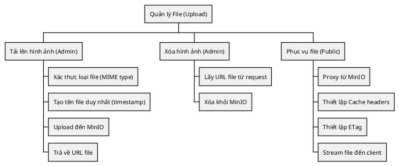
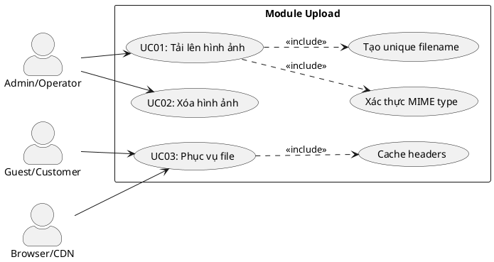
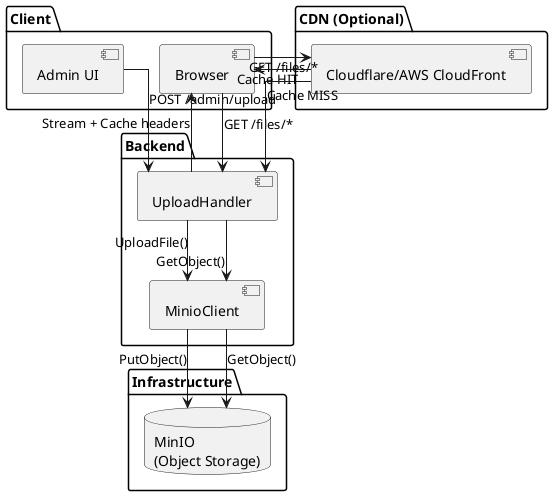
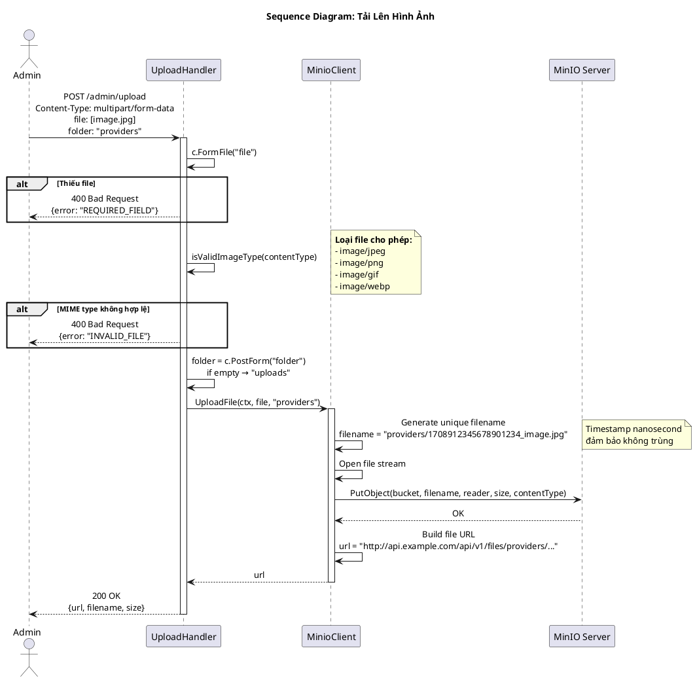
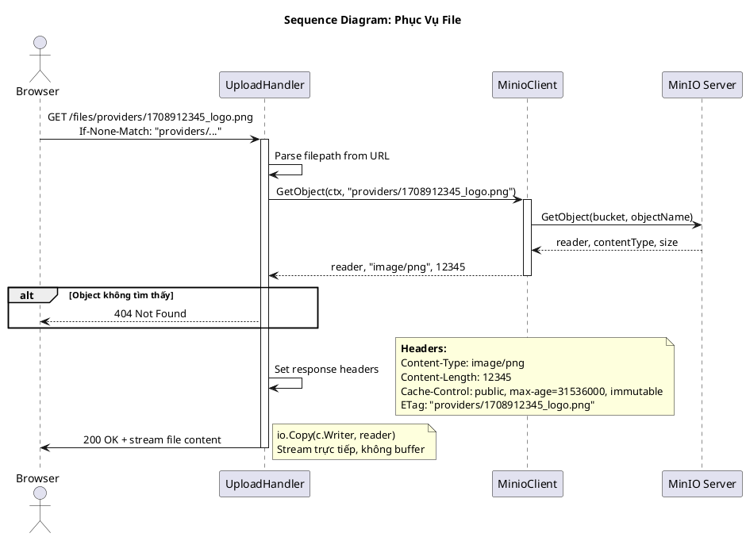
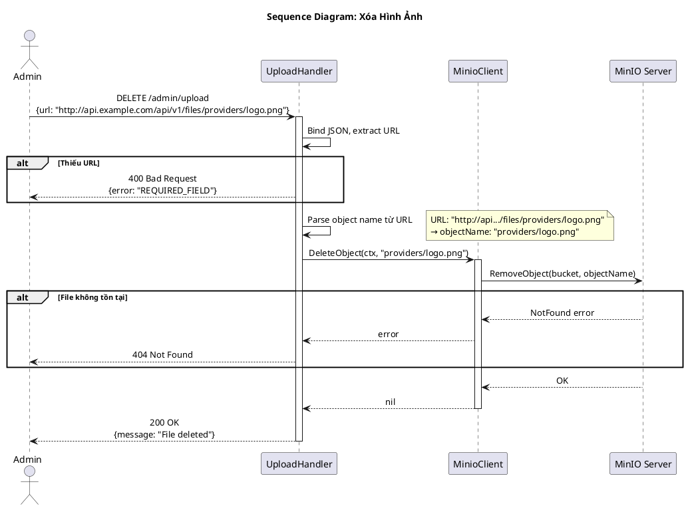
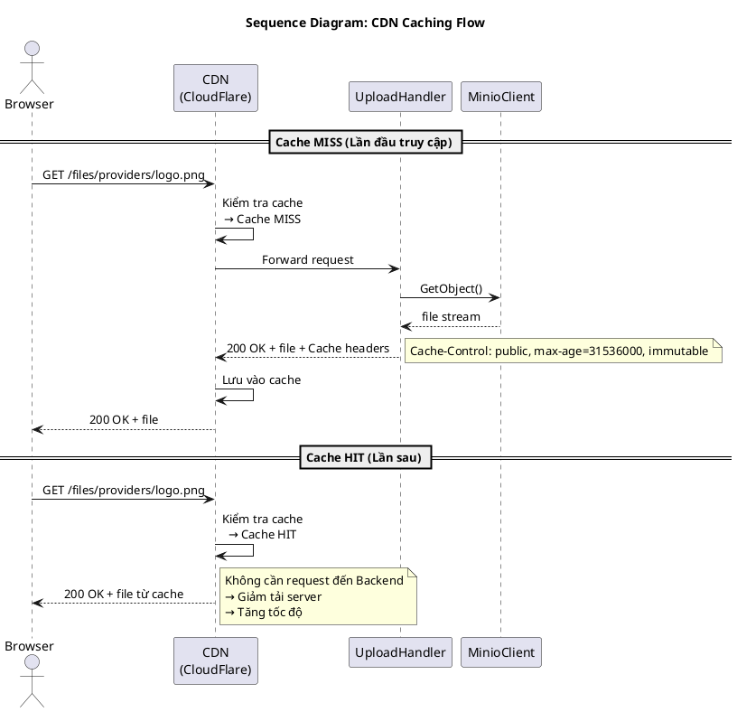
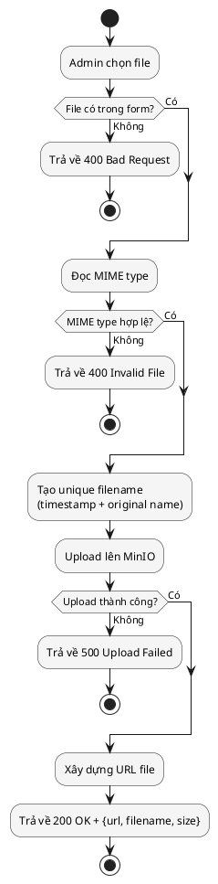

---
tags:
  - srs
  - system-design
  - upload
  - minio
  - file-storage
created: 2026-02-25
updated: 2026-02-25
---

# TÀI LIỆU ĐẶC TẢ VÀ THIẾT KẾ MODULE: UPLOAD (QUẢN LÝ FILE)

> [!abstract] TỔNG QUAN
> Module Upload quản lý việc tải lên và phục vụ các file media (hình ảnh) trong hệ thống đặt vé xe buýt. Module sử dụng MinIO làm object storage, tương thích với Amazon S3 API. Hệ thống hỗ trợ tải lên hình ảnh cho các đối tượng như: ảnh nhà xe (providers), ảnh xe buýt (buses), ảnh địa điểm (locations). Module áp dụng chiến lược immutable caching với tên file chứa timestamp nanosecond, cho phép CDN và browser cache vĩnh viễn.

---

## 1. ĐẶC TẢ YÊU CẦU (SOFTWARE REQUIREMENT SPECIFICATION)

### 1.1. Danh sách yêu cầu chức năng (Functional Requirements)

| ID    | Tên chức năng              | Mức độ ưu tiên | Độ phức tạp | Tác nhân (Actor) |
| ----- | -------------------------- | -------------- | ----------- | ---------------- |
| UP-01 | Tải lên hình ảnh           | P1             | M           | Admin/Operator   |
| UP-02 | Xóa hình ảnh               | P2             | L           | Admin/Operator   |
| UP-03 | Phục vụ file (Serve/Proxy) | P1             | M           | Guest/Customer   |

### 1.2. Biểu đồ phân cấp chức năng (Functional Hierarchy)



---

## 2. BIỂU ĐỒ USE CASE VÀ ĐẶC TẢ (USE CASE SPECIFICATIONS)

### 2.1. Biểu đồ Use Case



### 2.2. Đặc tả Use Case: Tải lên hình ảnh (UploadImage)

> [!info] Thông tin Use Case
> **Use Case ID:** UC-UP-01
> **Use Case Name:** Tải lên hình ảnh (UploadImage)
> **Actor:** Admin hoặc Operator
> **Trigger:** Người dùng chọn file và gửi form upload

> [!note] Điều kiện tiên quyết (Pre-conditions)
> 1. Người dùng đã đăng nhập và có quyền admin/operator
> 2. MinIO service đang hoạt động

> [!success] Điều kiện hậu kỳ (Post-conditions)
> 1. File được lưu trên MinIO
> 2. URL file được trả về cho client

**Luồng xử lý chính (Normal Flow):**

| Bước | Tác nhân | Hành động |
|------|----------|-----------|
| 1 | Client | Gửi POST request (multipart/form-data) đến `/api/v1/admin/upload` với file và folder |
| 2 | Handler | Đọc file từ form data |
| 3 | Handler | Gọi `isValidImageType(contentType)` kiểm tra MIME type |
| 4 | Handler | Lấy folder từ form (mặc định: "uploads") |
| 5 | MinioClient | Gọi `UploadFile(ctx, file, folder)` |
| 6 | MinioClient | Tạo tên file: `{folder}/{timestamp_nano}_{original_name}` |
| 7 | MinioClient | Upload file lên MinIO bucket |
| 8 | Handler | Trả về URL, filename và size |

---

## 3. KIẾN TRÚC HỆ THỐNG VÀ LUỒNG XỬ LÝ (SYSTEM ARCHITECTURE)

### 3.1. Kiến trúc tổng quan



### 3.2. Kiến trúc mã nguồn

| Lớp (Layer) | Thư mục | File | Trách nhiệm |
|-------------|---------|------|-------------|
| **Controller** | `controller/http/` | `handler.go` | HTTP handlers: UploadImage, DeleteImage, ServeFile |
| **Controller** | `controller/http/` | `routes.go` | Đăng ký routes (admin + public) |
| **Infrastructure** | `pkgs/minio/` | `minio.go` | MinIO client wrapper |

### 3.3. Danh sách API Endpoints

| HTTP Method | Endpoint | Yêu cầu quyền | Mô tả chức năng |
|-------------|----------|---------------|-----------------|
| POST | `/api/v1/admin/upload` | Admin/Operator | Tải lên hình ảnh |
| DELETE | `/api/v1/admin/upload` | Admin/Operator | Xóa hình ảnh |
| GET | `/api/v1/files/*filepath` | Public | Phục vụ file (proxy từ MinIO) |

---

## 4. BIỂU ĐỒ TUẦN TỰ (SEQUENCE DIAGRAMS)

### 4.1. Biểu đồ tuần tự: Tải lên hình ảnh



### 4.2. Biểu đồ tuần tự: Phục vụ file (ServeFile)



### 4.3. Biểu đồ tuần tự: Xóa hình ảnh



### 4.4. Biểu đồ tuần tự: Cache CDN (Optional)



---

## 5. CẤU HÌNH VÀ TÍCH HỢP MINIO

### 5.1. Cấu hình MinIO Client

```go
type MinioConfig struct {
    Endpoint        string // "minio:9000"
    AccessKeyID     string // "minioadmin"
    SecretAccessKey string // "minioadmin"
    BucketName      string // "bus-tickets"
    UseSSL          bool   // false for development
}
```

### 5.2. Cấu trúc tên file (Naming Convention)

> [!tip] Quy ước đặt tên
> ```
> {bucket}/{folder}/{timestamp_nano}_{original_filename}
> ```

**Ví dụ:**
- `bus-tickets/providers/1708912345678901234_phuongtrang-logo.png`
- `bus-tickets/buses/1708912345678901235_51b-12345.jpg`
- `bus-tickets/locations/1708912345678901236_mien-dong.png`

### 5.3. Folder phổ biến

| Folder | Mục đích |
|--------|----------|
| `providers` | Logo nhà xe |
| `buses` | Ảnh xe buýt |
| `locations` | Ảnh địa điểm/bến xe |
| `uploads` | Mặc định (chưa phân loại) |

---

## 6. CHIẾN LƯỢC CACHING

### 6.1. Immutable Cache Strategy

> [!info] Tại sao Immutable?
> Do tên file chứa timestamp nanosecond, mỗi file là duy nhất và không bao giờ thay đổi. Điều này cho phép:

```http
Cache-Control: public, max-age=31536000, immutable
```

| Directive | Giải thích |
|-----------|------------|
| `public` | Cho phép CDN và proxy cache |
| `max-age=31536000` | Cache 1 năm (365 × 24 × 60 × 60) |
| `immutable` | File không bao giờ thay đổi, không cần revalidate |

### 6.2. ETag Header

```http
ETag: "providers/1708912345678901234_logo.png"
```

- Sử dụng object name làm ETag (đơn giản nhưng đủ duy nhất)
- Hỗ trợ conditional requests (If-None-Match)

### 6.3. Lợi ích

| Lợi ích | Mô tả |
|---------|-------|
| Giảm tải MinIO | CDN và browser cache file |
| Tăng tốc độ tải trang | File được lấy từ cache |
| Tiết kiệm băng thông | Không tải lại file đã có |

---

## 7. CÁC QUY TẮC NGHIỆP VỤ (BUSINESS RULES)

### 7.1. Quy tắc loại file

| MIME Type | Cho phép | Ghi chú |
|-----------|----------|---------|
| image/jpeg | ✅ | Ảnh JPEG/JPG |
| image/png | ✅ | Ảnh PNG |
| image/gif | ✅ | Ảnh GIF (có thể animated) |
| image/webp | ✅ | Ảnh WebP |
| Khác | ❌ | Từ chối |

### 7.2. Quy tắc upload

| Quy tắc | Mô tả |
|---------|-------|
| BR-UP-01 | Chỉ cho phép các MIME type trong danh sách |
| BR-UP-02 | File phải được gửi qua form-data với key "file" |
| BR-UP-03 | Folder mặc định là "uploads" nếu không chỉ định |

### 7.3. Quy tắc xóa

| Quy tắc | Mô tả |
|---------|-------|
| BR-DEL-01 | Chỉ xóa được file nếu có URL hợp lệ |
| BR-DEL-02 | Không có soft delete, xóa là xóa vĩnh viễn |

> [!warning] Lưu ý về xóa file
> Khi xóa file, các tham chiếu đến URL đó trong database (providers.image_url, buses.image_url, locations.image_url) sẽ trỏ đến file không tồn tại. Cần cập nhật các record liên quan sau khi xóa.

---

## 8. XỬ LÝ LỖI (ERROR HANDLING)

| Error | HTTP Status | Error Code | Mô tả |
|-------|-------------|------------|-------|
| ErrUploadUnavailable | 503 | UPLOAD_UNAVAILABLE | MinIO service không khả dụng |
| ErrRequiredField | 400 | REQUIRED_FIELD | Thiếu file hoặc URL |
| ErrInvalidFile | 400 | INVALID_FILE | MIME type không hợp lệ |
| ErrNotFound | 404 | NOT_FOUND | File không tồn tại |
| ErrUploadFailed | 500 | UPLOAD_FAILED | Lỗi khi upload lên MinIO |
| ErrDeleteFailed | 500 | DELETE_FAILED | Lỗi khi xóa file |

---

## 9. CẤU TRÚC DỮ LIỆU RESPONSE

### 9.1. UploadResponse

```json
{
    "url": "http://api.example.com/api/v1/files/providers/1708912345_logo.png",
    "filename": "logo.png",
    "size": 123456
}
```

### 9.2. DeleteResponse

```json
{
    "message": "File deleted"
}
```

### 9.3. ServeFile Response Headers

```http
HTTP/1.1 200 OK
Content-Type: image/png
Content-Length: 123456
Cache-Control: public, max-age=31536000, immutable
ETag: "providers/1708912345_logo.png"

[binary data]
```

---

## 10. SƠ ĐỒ LUỒNG DỮ LIỆU (DATA FLOW)



---

## 11. BẢO MẬT

### 11.1. Các biện pháp bảo mật

| Biện pháp | Mô tả |
|-----------|-------|
| MIME Type Validation | Chỉ chấp nhận image/* |
| Auth Required | Upload/Delete yêu cầu token admin/operator |
| No Directory Listing | MinIO bucket không cho phép list objects |
| Unique Filenames | Timestamp nano ngăn chặn đoán tên file |

### 11.2. Không có trong phạm vi

| Tính năng | Lý do |
|-----------|-------|
| Virus Scanning | Cần tích hợp service riêng |
| Image Resizing | Tối ưu sau nếu cần |
| Size Limits | Có thể thêm ở middleware |
