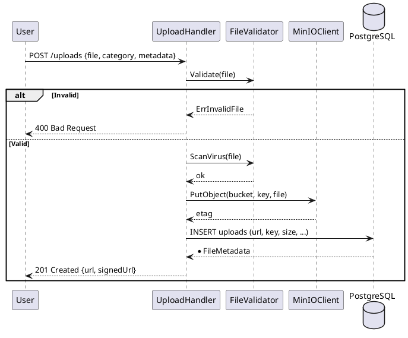

---
tags:
  - srs
  - upload
  - file-management
  - minio
  - media
  - bucket-storage
created: 2026-04-06
updated: 2026-04-06
---

# TÀI LIỆU ĐẶC TẢ VÀ THIẾT KẾ MODULE: UPLOAD (UPLOAD TỆP)

> [!abstract] TỔNG QUAN
> Module Upload là **media management layer**, quản lý upload ảnh/tài liệu. Sử dụng **MinIO** (S3-compatible object storage) để:
> - **Upload ảnh**: Bus images, provider logos, user avatars
> - **Upload tài liệu**: Licenses, certificates, proofs
> - **Signed URLs**: Generate download links với expiry
> - **CDN caching**: Serve via CDN để tăng tốc độ
> - **Cleanup**: Auto delete stale files
>
> Core principle: **"Simple, scalable S3-compatible storage"** — separates file logic from business logic.

---

## 1. ĐẶC TẢ YÊU CẦU (SRS)

### 1.1. Bối cảnh nghiệp vụ

Hệ thống cần lưu trữ:
1. **Ảnh xe**: License plate, bus exterior, interior layout
2. **Logo nhà xe**: Provider branding
3. **Ảnh user**: Avatar, ID verification photos
4. **Tài liệu**: Driving license, vehicle registration, insurance

### 1.2. Danh sách yêu cầu chức năng

| ID | Chức năng | Mô tả | Ưu tiên |
|----|-----------|-------|---------|
| UP-01 | Upload file | User upload → MinIO → return URL | P1 |
| UP-02 | Xóa file | Admin delete → remove from MinIO | P2 |
| UP-03 | Signed URL | Generate temporary download link | P1 |
| UP-04 | Batch upload | Upload multiple files (driver license, ID) | P2 |
| UP-05 | Cleanup stale | Cron: delete unused files after 30 days | P2 |

---

## 2. API ARCHITECTURE

### 2.1. REST Endpoints

| HTTP | Endpoint | Auth | Purpose | Rate Limit |
|------|----------|------|---------|-----------|
| **POST** | `/api/v1/uploads` | Auth | Upload file | 10/min per user |
| **GET** | `/api/v1/uploads/:id` | Public | Download (signed URL) | - |
| **DELETE** | `/api/v1/uploads/:id` | Auth/Admin | Delete file | - |
| **GET** | `/api/v1/uploads` | Auth | List my uploads | 100/min |
| **POST** | `/api/v1/uploads/batch` | Auth | Batch upload | 5/min per user |

### 2.2. Upload Request/Response

**UploadRequest**:
```json
{
    "file": "<binary data>",
    "category": "bus_image|provider_logo|user_avatar|document",
    "metadata": {
        "busId": 5,
        "description": "Bus exterior photo"
    }
}
```

**UploadResponse**:
```json
{
    "id": "550e8400-e29b-41d4-a716-446655440000",
    "url": "https://cdn.example.com/uploads/bus/2026/04/550e8400.jpg",
    "signedUrl": "https://minio.example.com/uploads/550e8400.jpg?X-Amz-Algorithm=...",
    "size": 2048576,
    "contentType": "image/jpeg",
    "uploadedAt": "2026-04-06T10:30:00Z",
    "expiresAt": "2026-04-13T10:30:00Z"
}
```

---

## 3. THIẾT KẾ CƠ SỞ DỮ LIỆU

### 3.1. File Metadata Table

| Trường | Kiểu | Mô tả |
|--------|------|-------|
| `id` | UUID | PK |
| `user_id` | BIGINT | FK user (who uploaded) |
| `key` | VARCHAR(512) | S3 key path |
| `url` | VARCHAR(2048) | Public/CDN URL |
| `size` | BIGINT | File size (bytes) |
| `content_type` | VARCHAR(100) | MIME type |
| `category` | VARCHAR(50) | bus_image/logo/avatar/document |
| `metadata` | JSONB | {busId, description, ...} |
| `uploaded_at` | TIMESTAMPTZ | Upload time |
| `accessed_at` | TIMESTAMPTZ | Last download (for cleanup) |
| `deleted_at` | TIMESTAMPTZ | Soft delete |

### 3.2. MinIO Bucket Structure

```
uploads/
├── bus/
│   ├── 2026/04/
│   │   ├── bus_1_exterior.jpg
│   │   ├── bus_1_interior.jpg
├── provider/
│   ├── 2026/04/
│   │   ├── provider_1_logo.png
├── user/
│   ├── 2026/04/
│   │   ├── user_100_avatar.jpg
│   │   ├── user_100_id_front.jpg
└── documents/
    ├── 2026/04/
        ├── license_2026_04_06.pdf
```

---

## 4. UPLOAD PROCESS

### 4.1. Upload Flow



### 4.2. Validation Rules

| Rule | Condition | Error |
|------|-----------|-------|
| File size | 1 MB - 50 MB | ErrFileTooLarge |
| File type | PNG, JPG, PDF, ZIP | ErrInvalidContentType |
| Virus scan | Clean (ClamAV) | ErrVirusDetected |
| Rate limit | 10 uploads/min/user | ErrRateLimitExceeded |

### 4.3. Key Generation

```
Pattern: {category}/{year}/{month}/{UUID}.{ext}

Example:
  - bus/2026/04/550e8400-e29b-41d4-a716-446655440000.jpg
  - provider/2026/04/38cff9c3-1234-5678-abcd-ef1234567890.png
```

---

## 5. SIGNED URL & CDN

### 5.1. Signed URL (Temporary Download)

```
Purpose: Generate time-limited download link

Expiry: 1 hour by default (configurable)
Signature: HMAC-SHA256 with MinIO secret key
Format: https://minio.example.com/bucket/key?X-Amz-Algorithm=...
```

### 5.2. CDN Caching

```
Public URLs:
  - Cache-Control: public, max-age=86400 (1 day)
  - Serve via CDN (Cloudflare/CloudFront)
  - Invalidate on delete

Private URLs (signed):
  - Cache-Control: private, max-age=3600
  - Direct from MinIO
```

---

## 6. DELETE & CLEANUP

### 6.1. Soft Delete

```
User delete → mark deleted_at, don't physically remove
After 7 days: background job permanently deletes
```

### 6.2. Stale File Cleanup (Cron)

```
every 24 hours:
  1. Find files deleted > 7 days ago
  2. Check if still referenced
  3. If not: delete from MinIO + DB
```

---

## 7. SECURITY & CONFIGURATION

### 7.1. Security

```
- Validate file magic bytes (not just extension)
- Antivirus scan (ClamAV)
- Store outside webroot (via S3)
- Generate random names
- Rate limiting per user
```

### 7.2. Environment

```bash
MINIO_ENDPOINT=http://localhost:9000
MINIO_ACCESS_KEY=...
MINIO_SECRET_KEY=...
MINIO_BUCKET=uploads

UPLOAD_MAX_SIZE=52428800  # 50 MB
CDN_DOMAIN=https://cdn.example.com
SIGNED_URL_EXPIRY=3600    # 1 hour
```

---

## 8. INTEGRATION WITH MODULES

### 8.1. Bus Module Integration

```
Bus entity → image_url (FK uploads.id)
When create bus:
  1. Upload image
  2. Store upload.id in buses.image_url
```

### 8.2. Provider Module Integration

```
Provider entity → logo_url (FK uploads.id)
When delete provider:
  1. Mark uploads as deleted
  2. Cleanup after 7 days
```

---

## 9. ERROR HANDLING

| Error | HTTP Status | Message |
|-------|-------------|---------|
| File too large | 413 | File exceeds 50 MB limit |
| Invalid type | 400 | Only PNG, JPG, PDF allowed |
| Virus detected | 403 | File failed virus scan |
| Rate limit | 429 | Too many uploads |
| Storage down | 503 | Storage service unavailable |

---

## 10. MONITORING

### 10.1. Metrics

```
- Upload rate (per minute)
- Success rate (target > 99%)
- Average latency (p99 < 5s)
- Storage usage (bytes)
- Cleanup count (per day)
```

### 10.2. Backup & Recovery

```
- Daily backup to secondary MinIO
- S3 cross-region replication
- Retention: 30 days
```

---

**Document Version**: 1.0 (File Upload & Storage Management)
**Last Updated**: 2026-04-06
**Status**: ✅ COMPLETE - Ready for Development
