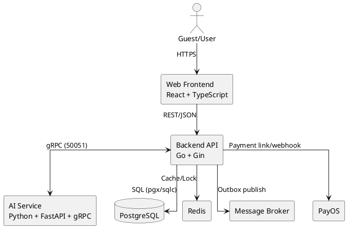

---
tags:
  - srs
  - system-design
  - technology
  - architecture
created: 2026-04-01
updated: 2026-04-01
---

# TÀI LIỆU NGĂN XẾP CÔNG NGHỆ (TECHNOLOGY STACK)

> [!abstract] Tổng quan
> Tài liệu mô tả ngăn xếp công nghệ triển khai thực tế cho hệ thống đặt vé xe liên tỉnh tích hợp AI chat/voice. Kiến trúc gồm ba lớp chính: Go Backend (core nghiệp vụ), Python AI Service (NLP), React Frontend (tương tác người dùng), cùng hạ tầng dữ liệu/sự kiện phục vụ vận hành.

## 1. Kiến trúc tổng thể

## 2. Công nghệ chi tiết

### 2.1 Backend (Go)

| Thành phần | Công nghệ | Vai trò |
|---|---|---|
| HTTP Framework | Gin | REST API, middleware auth/error/logging |
| DB Driver | pgx/v5 | Kết nối PostgreSQL hiệu năng cao |
| Query Layer | sqlc | Sinh mã truy vấn type-safe |
| Dependency Injection | uber/dig | Quản lý dependency theo module |
| Config | Viper | Đọc `.env` và runtime config |
| Cache/Lock | go-redis/v9 | Distributed lock và cache ngắn hạn |
| Auth | JWT v5 | Access/refresh token |
| Messaging | RabbitMQ/Kafka | Event-driven qua outbox |

### 2.2 AI Service (Python)

| Thành phần | Công nghệ | Vai trò |
|---|---|---|
| API/Health/Admin | FastAPI | Endpoint quản trị và health check |
| RPC | grpcio | Nhận request Chat/Voice từ Go |
| NLP/LLM | LangChain + provider SDK | Parse ý định, tạo phản hồi |
| Validation | Pydantic v2 | Kiểm tra schema request/response |
| Observability | structlog | Structured logging |

> [!note] Qdrant
> Qdrant không phải dependency bắt buộc cho luồng chat/voice chính. Hệ thống có thể vận hành ở chế độ tối giản khi không bật thành phần này.

### 2.3 Frontend (React)

| Thành phần | Công nghệ | Vai trò |
|---|---|---|
| Core UI | React + TypeScript | Xây dựng web app |
| Router | TanStack Router | File-based routing |
| Server State | TanStack Query | Fetch/cache API data |
| Global State | Zustand | Quản lý state cục bộ |
| UI Kit | shadcn/ui + Tailwind v4 | Component system và styling |
| HTTP Client | Axios | API client và interceptors |

### 2.4 Data & Infrastructure

| Thành phần | Công nghệ | Vai trò |
|---|---|---|
| RDBMS | PostgreSQL 16 | Dữ liệu nghiệp vụ cốt lõi |
| Cache | Redis 7 | Lock, cache tạm thời |
| Object Storage | MinIO | Lưu trữ tệp upload |
| Queue/Stream | RabbitMQ, Kafka | Event bất đồng bộ |
| Container | Docker Compose | Môi trường dev đồng nhất |

## 3. Quy ước triển khai

### 3.1 Môi trường

- `development`: local docker + hot reload.
- `staging`: kiểm thử tích hợp trước phát hành.
- `production`: triển khai tách dịch vụ và giám sát đầy đủ.

### 3.2 Cấu hình quan trọng

- `DATABASE_URI`
- `AI_AGENT_GRPC_ADDR`
- `OPENAI_API_KEY`
- `ENABLE_QDRANT` (tùy chọn)
- `PAYOS_*`

### 3.3 Chính sách chất lượng

- Backend: `go test ./...` và lint trước merge.
- Frontend: `npm run lint` và `npm run build`.
- AI Service: syntax/type check và gRPC integration smoke test.

## 4. Liên kết với yêu cầu nghiệp vụ

- Voice execute booking tuân thủ `payment_method=cod`, `status=pending`.
- Chat clarification chỉ xử lý thiếu trường trong scope: `origin`, `destination`, `date`, `time`, `budget`.
- Quyết định giao dịch cuối cùng thuộc backend nghiệp vụ, AI không tự cập nhật trạng thái booking.

## 5. Kết luận

Ngăn xếp công nghệ hiện tại phù hợp cho bài toán đặt vé thời gian thực có AI hỗ trợ. Kiến trúc tách ranh giới trách nhiệm rõ ràng giữa tương tác ngôn ngữ tự nhiên và lõi nghiệp vụ giao dịch, giúp mở rộng hệ thống trong khi vẫn kiểm soát tính nhất quán dữ liệu.
