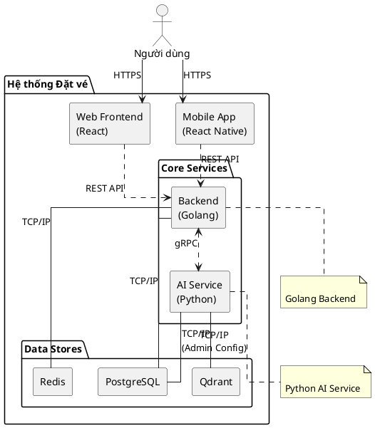

---
tags:
  - srs
  - system-design
  - technology
  - architecture
created: 2026-03-29
updated: 2026-03-29
---

# TÀI LIỆU PHÂN TÍCH NGĂN XẾP CÔNG NGHỆ (TECHNOLOGY STACK)

> [!abstract] TỔNG QUAN
> Tài liệu này cung cấp một cái nhìn tổng quan và phân tích chi tiết về các công nghệ được sử dụng trong dự án hệ thống đặt vé xe buýt. Hệ thống được xây dựng dựa trên kiến trúc microservices, bao gồm bốn thành phần chính: **Backend (Go)**, **AI Service (Python)**, **Web Frontend (React)**, và **Mobile App (React Native)**. Mỗi thành phần được lựa chọn công nghệ chuyên biệt để tối ưu hóa hiệu suất, khả năng mở rộng và bảo trì.

---

## 1. KIẾN TRÚC TỔNG THỂ (OVERALL ARCHITECTURE)

Hệ thống được thiết kế theo kiến trúc hướng dịch vụ, nơi các thành phần giao tiếp với nhau qua các giao thức được tiêu chuẩn hóa (RESTful API và gRPC).

- **Backend (Go)**: Đóng vai trò là dịch vụ trung tâm, xử lý logic nghiệp vụ cốt lõi, quản lý cơ sở dữ liệu và xác thực người dùng.
- **AI Service (Python)**: Cung cấp các khả năng xử lý ngôn ngữ tự nhiên (NLP) và máy học, được gọi bởi Backend qua gRPC để thực hiện các tác vụ thông minh.
- **Web Frontend (React)**: Giao diện người dùng trên nền tảng web, cho phép người dùng và quản trị viên tương tác với hệ thống.
- **Mobile App (React Native)**: Ứng dụng di động cho cả hai nền tảng iOS và Android, cung cấp trải nghiệm người dùng tiện lợi khi di chuyển.
- **Cơ sở hạ tầng**: Docker được sử dụng để đóng gói và triển khai các dịch vụ một cách nhất quán trên các môi trường.

---

## 2. PHÂN TÍCH CÔNG NGHỆ CHI TIẾT

### 2.1. Backend (Golang)

Backend được xây dựng bằng ngôn ngữ **Go (Golang)**, tập trung vào hiệu năng cao và khả năng xử lý đồng thời. Các thư viện chính được lựa chọn để xây dựng một nền tảng REST API mạnh mẽ và có cấu trúc tốt.

> [!cite] Nguồn
> Các thư viện được liệt kê dưới đây được định nghĩa trong file `backend/go.mod`.

| Thư viện | Phiên bản | Chức năng |
|---|---|---|
| `github.com/gin-gonic/gin` | v1.11.0 | Web framework chính, cung cấp routing và middleware cho HTTP. |
| `github.com/jackc/pgx/v5` | v5.8.0 | Driver hiệu năng cao và tiện dụng cho cơ sở dữ liệu PostgreSQL. |
| `github.com/redis/go-redis/v9` | v9.17.2 | Client cho Redis, được sử dụng để caching và quản lý session. |
| `github.com/golang-jwt/jwt/v5` | v5.3.0 | Hỗ trợ tạo và xác thực JSON Web Tokens (JWT) cho mục đích xác thực. |
| `go.uber.org/dig` | v1.19.0 | Framework Dependency Injection (DI) giúp quản lý sự phụ thuộc và cấu trúc mã nguồn. |
| `github.com/spf13/viper` | v1.21.0 | Quản lý cấu hình ứng dụng từ file, biến môi trường và nhiều nguồn khác. |
| `github.com/rs/zerolog` | v1.34.0 | Thư viện ghi log có cấu trúc (structured logging) với hiệu suất cao. |
| `google.golang.org/grpc` | v1.79.1 | Framework cho giao thức Remote Procedure Call (RPC) để giao tiếp với AI Service. |
| `golang.org/x/crypto` | v0.47.0 | Cung cấp các thuật toán mã hóa, điển hình là `bcrypt` để băm mật khẩu. |

### 2.2. AI Service (Python)

Dịch vụ AI được phát triển bằng **Python**, tận dụng hệ sinh thái mạnh mẽ cho Machine Learning và AI. Dịch vụ này cung cấp các API thông minh qua gRPC.

> [!cite] Nguồn
> Các thư viện được liệt kê dưới đây được định nghĩa trong file `aiservice/pyproject.toml`.

| Thư viện | Phiên bản | Chức năng |
|---|---|---|
| `fastapi` | >=0.115.0 | Web framework hiện đại, hiệu năng cao để xây dựng API (dùng cho các endpoint quản trị). |
| `grpcio` | >=1.68.0 | Thư viện gRPC cho Python, cho phép giao tiếp với Backend. |
| `langchain` | >=0.3.0 | Framework chính để xây dựng các ứng dụng dựa trên mô hình ngôn ngữ lớn (LLM). |
| `langgraph` | >=0.2.0 | Mở rộng của LangChain, cho phép xây dựng các agent và đồ thị trạng thái phức tạp. |
| `qdrant-client` | >=1.12.0 | Client cho Qdrant, một vector database dùng cho các tác vụ tìm kiếm tương đồng (RAG). |
| `sqlalchemy` | >=2.0.0 | ORM cho Python, được sử dụng để quản lý cấu hình của agent và tenant trong DB. |
| `pydantic` | >=2.0.0 | Thư viện validate dữ liệu, đảm bảo tính toàn vẹn của dữ liệu đầu vào và đầu ra. |
| `structlog` | >=24.0.0 | Ghi log có cấu trúc, tương tự Zerolog bên phía Go. |

### 2.3. Web Frontend (React + TypeScript)

Giao diện web được xây dựng bằng **React** và **TypeScript**, mang lại trải nghiệm người dùng hiện đại, nhanh và an toàn về kiểu dữ liệu.

> [!cite] Nguồn
> Các thư viện được liệt kê dưới đây được định nghĩa trong file `templateUi/package.json`.

| Thư viện | Phiên bản | Chức năng |
|---|---|---|
| `react` | ^19.2.0 | Thư viện UI nền tảng để xây dựng giao diện người dùng. |
| `typescript` | ~5.9.3 | Ngôn ngữ lập trình cung cấp kiểu tĩnh cho JavaScript, tăng độ tin cậy của mã nguồn. |
| `@tanstack/react-router` | ^1.136.6 | Hệ thống routing cho SPA (Single Page Application) với cơ chế type-safe. |
| `@tanstack/react-query` | ^5.90.9 | Quản lý trạng thái phía server, caching, và đồng bộ hóa dữ liệu. |
| `zustand` | ^5.0.8 | Giải pháp quản lý trạng thái phía client nhỏ gọn và hiệu quả. |
| `zod` | ^4.1.12 | Thư viện validate schema, đặc biệt hữu ích cho việc xác thực dữ liệu từ form và API. |
| `axios` | ^1.13.2 | HTTP client để thực hiện các yêu cầu API đến Backend. |
| `tailwindcss` | ^4.0.0 | CSS framework cung cấp các utility classes để xây dựng UI một cách nhanh chóng. |
| `shadcn/ui` | N/A | Tập hợp các component UI được xây dựng sẵn, có thể tái sử dụng và tùy biến. |
| `vite` | ^6.0.7 | Công cụ build và development server thế hệ mới, cho trải nghiệm phát triển nhanh. |

### 2.4. Mobile App (React Native)

Ứng dụng di động được phát triển bằng **React Native**, cho phép chia sẻ một lượng lớn mã nguồn giữa hai nền tảng iOS và Android.

> [!cite] Nguồn
> Các thư viện được liệt kê dưới đây được định nghĩa trong file `moblie/package.json`.

| Thư viện | Phiên bản | Chức năng |
|---|---|---|
| `react-native` | 0.81.5 | Framework chính để xây dựng ứng dụng di động native từ React. |
| `expo` | ~54.0.33 | Nền tảng và bộ công cụ giúp đơn giản hóa quá trình phát triển và triển khai React Native. |
| `expo-router` | ~6.0.23 | Hệ thống routing dựa trên file cho ứng dụng React Native, tương tự như Next.js. |
| `@tanstack/react-query` | ^5.90.21 | Quản lý và caching dữ liệu từ API, tương tự như trên Web Frontend. |
| `zustand` | ^5.0.11 | Quản lý trạng thái toàn cục cho ứng dụng. |
| `axios` | ^1.13.6 | HTTP client để giao tiếp với Backend API. |
| `zod` | ^4.3.6 | Validate dữ liệu, đảm bảo tính nhất quán giữa client và server. |
| `twrnc` | ^4.16.0 | Giải pháp sử dụng cú pháp Tailwind CSS trong React Native. |

---

## 3. CƠ SỞ HẠ TẦNG VÀ TRIỂN KHAI (INFRASTRUCTURE & DEPLOYMENT)

> [!cite] Nguồn
> Cấu hình được tham chiếu từ các file `Dockerfile` và `docker-compose.yml` trong dự án.

- **Docker & Docker Compose**: Mỗi dịch vụ (Backend, AI Service) được đóng gói thành một Docker image riêng biệt. `docker-compose.yml` được sử dụng để điều phối việc khởi chạy toàn bộ hệ thống trong môi trường phát triển, bao gồm cả các dịch vụ phụ thuộc như PostgreSQL và Redis.
- **PostgreSQL**: Hệ quản trị cơ sở dữ liệu quan hệ, lưu trữ dữ liệu nghiệp vụ chính của hệ thống như người dùng, chuyến đi, và vé xe.
- **Redis**: Cơ sở dữ liệu key-value trong bộ nhớ, được sử dụng cho các tác vụ yêu cầu độ trễ thấp như caching, quản lý session, và blacklist token.
- **Qdrant**: Vector database được tối ưu hóa cho việc tìm kiếm thông tin dựa trên vector embedding, là nền tảng cho tính năng RAG (Retrieval-Augmented Generation) của AI Service.
