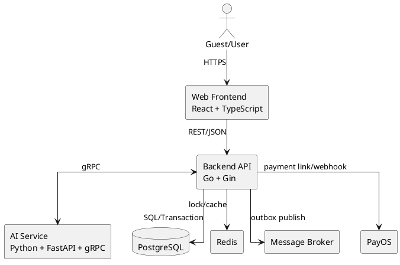
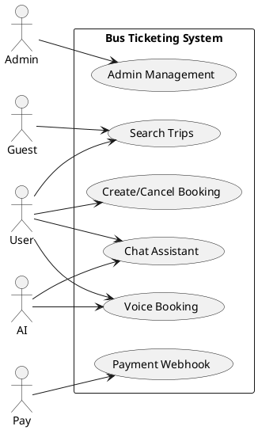
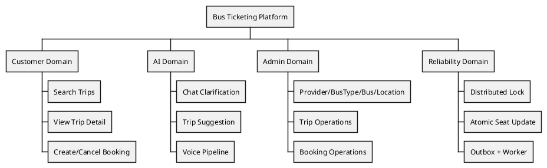
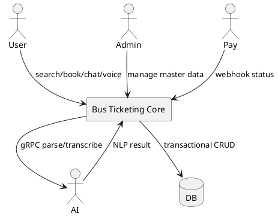
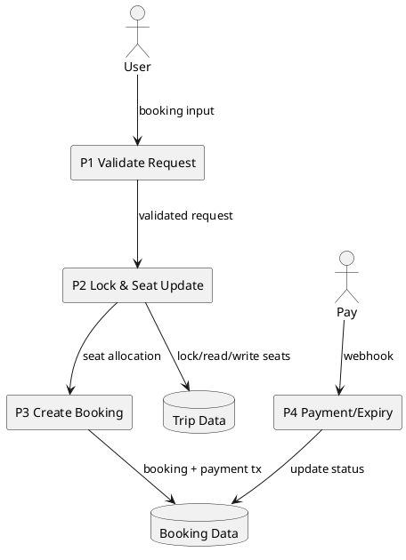
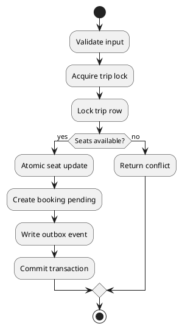
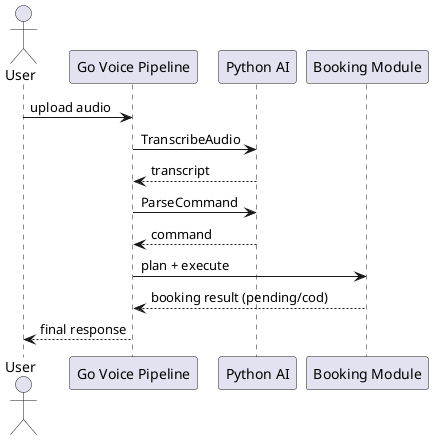

---
tags:
  - final-report
  - compilation
  - obsidian
created: 2026-04-01
updated: 2026-04-01
---

#### TRƯỜNG ĐẠI HỌC KIẾN TRÚC HÀ NỘI

#### KHOA CÔNG NGHỆ THÔNG TIN

##### -------------------

# ĐỒ ÁN TỐT NGHIỆP KỸ SƯ

## NGÀNH: CÔNG NGHỆ THÔNG TIN

## KHÓA: 2021 - 2026

#### ĐỀ TÀI:

## THIẾT KẾ VÀ PHÁT TRIỂN

## HỆ THỐNG ĐẶT VÉ XE LIÊN TỈNH

## TÍCH HỢP TRỢ LÝ AI CHAT/VOICE

#### GIÁO VIÊN HƯỚNG DẪN: ........................................

#### NHÓM SINH VIÊN THỰC HIỆN: ........................................

#### HÀ NỘI, 2026

---

## LỜI CẢM ƠN

Nhóm xin bày tỏ lòng cảm ơn chân thành đến giảng viên hướng dẫn, các thầy cô trong Khoa Công nghệ Thông tin và các bên liên quan đã hỗ trợ, phản biện và tạo điều kiện trong suốt quá trình thực hiện đồ án. Những góp ý về phân tích nghiệp vụ, kiến trúc hệ thống và phương pháp kiểm thử đã giúp nhóm hoàn thiện đề tài theo hướng học thuật và khả dụng thực tiễn.

---

## LỜI CAM ĐOAN

Nhóm cam đoan nội dung báo cáo, mã nguồn và kết quả trình bày trong tài liệu là sản phẩm do nhóm thực hiện. Các tài liệu, chuẩn và công trình tham khảo đều được trích dẫn theo đúng quy định.

---

## LỜI MỞ ĐẦU

Trong bối cảnh nhu cầu di chuyển liên tỉnh tăng mạnh, các nền tảng đặt vé cần đồng thời đáp ứng hai tiêu chí: trải nghiệm thao tác nhanh cho người dùng và tính đúng đắn dữ liệu cho đơn vị vận hành. Đây là bài toán phức hợp vì hệ thống phải xử lý truy cập đồng thời cao, tránh overbooking, và vẫn duy trì khả năng tương tác tự nhiên qua chat/voice.

Đề tài lựa chọn hướng tiếp cận *AI-assisted, business-deterministic*: AI được sử dụng để parse ngôn ngữ tự nhiên, nhận diện ý định và làm rõ thông tin thiếu; trong khi backend nghiệp vụ vẫn là thành phần quyết định giao dịch đặt vé cuối cùng. Cách tiếp cận này nhằm cân bằng giữa đổi mới trải nghiệm và kiểm soát rủi ro nghiệp vụ.

---

## MỤC LỤC

- Chương 1. Giới thiệu đề tài
- Chương 2. Cơ sở công nghệ và kiến trúc triển khai
- Chương 3. Phân tích và đặc tả yêu cầu hệ thống
- Chương 4. Thiết kế và hiện thực giải pháp
- Chương 5. Kiểm thử và đánh giá
- Chương 6. Kết luận và hướng phát triển
- Phụ lục A. Ma trận truy vết yêu cầu
- Phụ lục B. Danh mục tài liệu module

---

## CHƯƠNG 1 - GIỚI THIỆU ĐỀ TÀI

### 1.1 Bối cảnh và lý do chọn đề tài

Hệ sinh thái vận tải hành khách liên tỉnh tại Việt Nam đang dịch chuyển nhanh sang mô hình số hóa dịch vụ. Tuy nhiên, chất lượng số hóa vẫn thường dừng ở mức hiển thị thông tin chuyến và tiếp nhận đặt vé cơ bản. Trong thực tế vận hành, các lỗi phát sinh phổ biến gồm: nhập sai thông tin hành trình, xung đột ghế khi nhiều người dùng đặt cùng thời điểm, và quy trình hỗ trợ khách hàng thủ công khi người dùng không nhập đủ dữ liệu.

Song song đó, sự phát triển của các mô hình ngôn ngữ lớn tạo điều kiện tích hợp giao tiếp tự nhiên vào quy trình đặt vé. Dù vậy, nếu AI được triển khai như một thành phần độc lập, thiếu ràng buộc nghiệp vụ, hệ thống dễ rơi vào tình trạng “hội thoại tốt nhưng giao dịch không đáng tin cậy”. Vì vậy, bài toán nghiên cứu của đề tài không chỉ là tích hợp AI, mà là tích hợp AI trong một kiến trúc có khả năng bảo toàn tính nhất quán dữ liệu.

### 1.2 Mục tiêu nghiên cứu

#### 1.2.1 Mục tiêu tổng quát

Thiết kế và phát triển hệ thống đặt vé xe liên tỉnh tích hợp trợ lý AI chat/voice, bảo đảm tính đúng đắn nghiệp vụ booking trong bối cảnh đồng thời và nâng cao trải nghiệm tương tác người dùng.

#### 1.2.2 Mục tiêu cụ thể

- Xây dựng tập use case cốt lõi và đặc tả theo chuẩn SRS.
- Thiết kế luồng booking có cơ chế lock và atomic update để giảm race condition.
- Triển khai AI service qua gRPC cho chat parsing và voice pipeline.
- Chuẩn hóa chat clarification theo phạm vi field bắt buộc: `origin`, `destination`, `date`, `time`, `budget`.
- Chuẩn hóa voice execute tạo booking với `payment_method=cod` và `status=pending`.

### 1.3 Phạm vi nghiên cứu

> [!info] In-scope
> - Xác thực người dùng (JWT), phân quyền vai trò.
> - Tìm chuyến, xem chi tiết chuyến.
> - Tạo/hủy booking, xử lý webhook thanh toán, worker hết hạn booking.
> - AI chat/voice phục vụ luồng đặt vé.
> - Quản trị dữ liệu nền: provider, bus type, bus, location, trip, booking.

> [!warning] Out-of-scope
> - Dynamic pricing thời gian thực dựa trên học tăng cường.
> - Tích hợp tổng đài đa kênh.
> - Tối ưu lịch tuyến ở quy mô toàn mạng lưới.

### 1.4 Câu hỏi nghiên cứu

- Làm thế nào để tích hợp AI vào quy trình đặt vé mà không làm suy giảm tính quyết định của backend nghiệp vụ?
- Cơ chế nào giúp giảm xung đột ghế khi có nhiều request đồng thời?
- Mô hình đặc tả nào giúp truy vết nhất quán từ yêu cầu nghiệp vụ đến API/module triển khai?

---

## CHƯƠNG 2 - CƠ SỞ CÔNG NGHỆ VÀ KIẾN TRÚC TRIỂN KHAI

### 2.1 Tổng quan kiến trúc



### 2.2 Lựa chọn công nghệ

| Lớp | Công nghệ chính | Lý do lựa chọn |
|---|---|---|
| Frontend | React + TypeScript + TanStack | Tổ chức state rõ ràng, phù hợp SPA có nghiệp vụ nhiều bước |
| Backend | Go + Gin + pgx + sqlc | Hiệu năng cao, kiểm soát transaction chặt, dễ mô-đun hóa |
| AI Service | Python + FastAPI + gRPC | Thuận lợi tích hợp NLP/LLM, tách biên xử lý ngôn ngữ |
| Data/Infra | PostgreSQL, Redis, Broker | Bảo đảm dữ liệu giao dịch và xử lý bất đồng bộ |

### 2.3 Nguyên tắc kiến trúc áp dụng

- Phụ thuộc một chiều giữa các layer.
- Backend chịu trách nhiệm business invariants.
- AI không tự cập nhật trạng thái giao dịch.
- Side effects được phát sự kiện qua outbox để tăng độ bền vững tích hợp.

---

## CHƯƠNG 3 - PHÂN TÍCH VÀ ĐẶC TẢ YÊU CẦU HỆ THỐNG

### 3.1 Phân tích tác nhân nghiệp vụ

| Tác nhân | Vai trò |
|---|---|
| Guest | Tra cứu chuyến xe công khai |
| Authenticated User | Đặt/hủy vé, tương tác chat/voice |
| Admin/Operator | Quản trị dữ liệu và vận hành hệ thống |
| AI Service | Cung cấp parse/transcribe qua gRPC |
| Payment Gateway | Gửi webhook trạng thái thanh toán |
| Worker | Xử lý expire booking và outbox |

### 3.2 Biểu đồ Use Case tổng thể



### 3.3 Phân rã chức năng (Functional Hierarchy)



### 3.4 DFD mức khung cảnh



### 3.5 DFD mức 1 cho Booking



### 3.6 ERD tóm tắt

```plantuml
@startuml
entity users { *id }
entity providers { *id }
entity bus_types { *id }
entity buses { *id; provider_id; bus_type_id }
entity locations { *id }
entity trips { *id; bus_id; origin_id; destination_id; available_seats }
entity bookings { *id; trip_id; user_id; payment_method; status }
entity payment_transactions { *id; booking_id; status }
entity outbox_events { *id; topic; status }

providers ||--o{ buses
bus_types ||--o{ buses
buses ||--o{ trips
locations ||--o{ trips
trips ||--o{ bookings
users ||--o{ bookings
bookings ||--o{ payment_transactions
@enduml
```

### 3.7 Yêu cầu chức năng chính

| ID | Yêu cầu |
|---|---|
| FR-TR-01 | Tìm chuyến theo route/date/passengers |
| FR-BK-01 | Tạo booking an toàn đồng thời |
| FR-BK-03 | Xử lý webhook thanh toán |
| FR-AI-02 | Chat hỏi đúng field thiếu trong scope |
| FR-AI-04 | Voice execute tạo booking `COD/pending` |

### 3.8 Đặc tả Use Case trọng yếu

#### UC-BK-01 Create Booking

- **Primary Actor:** Authenticated User
- **Preconditions:** Trip hợp lệ, ghế hợp lệ, token hợp lệ
- **Postconditions:** Booking `pending`, ghế cập nhật, outbox event được ghi

**Main Flow**

1. Validate request tại controller.
2. Acquire distributed lock theo trip.
3. Lock row trip trong transaction.
4. Kiểm tra ghế còn trống.
5. Cập nhật ghế nguyên tử.
6. Tạo booking và payment transaction (nếu online).
7. Ghi outbox event.
8. Commit và trả kết quả.

**Exceptions**

- `409 SEATS_BEING_BOOKED`
- `409 SEATS_NOT_AVAILABLE`
- `400 INVALID_SEAT_CODE`

#### UC-AI-CHAT-02 Clarify Missing Fields

- **Rule:** Chỉ hỏi theo thứ tự `origin`, `destination`, `date`, `time`, `budget`.
- **Acceptance:** Không hỏi ngoài phạm vi booking.

#### UC-AI-VOICE-04 Voice Execute Booking

- **Rule:** Execute mode bắt buộc `payment_method=cod`.
- **Acceptance:** Booking tạo thành công phải có `status=pending`.

---

## CHƯƠNG 4 - THIẾT KẾ VÀ HIỆN THỰC GIẢI PHÁP

### 4.1 Thiết kế luồng booking nhất quán



### 4.2 Thiết kế luồng voice pipeline



### 4.3 Thiết kế degrade khi AI lỗi

- Timeout gRPC được giới hạn theo context deadline.
- Khi AI unavailable, hệ thống trả response fallback có hướng dẫn nhập thông tin thủ công.
- Không làm gián đoạn các luồng backend không phụ thuộc AI (ví dụ: tra cứu trip qua form).

### 4.4 Thiết kế dữ liệu và bất biến

- `available_seats >= 0`.
- `arrival_time > departure_time`.
- Trạng thái booking, payment transaction và seat allocation phải đồng bộ theo quy tắc chuyển trạng thái.

---

## CHƯƠNG 5 - KIỂM THỬ VÀ ĐÁNH GIÁ

### 5.1 Chiến lược kiểm thử

- Unit test cho domain/usecase cốt lõi.
- Integration test cho API và module interaction.
- Smoke E2E cho luồng chat/voice booking quan trọng.

### 5.2 Kịch bản kiểm chứng đại diện

| Kịch bản | Dữ liệu vào | Kỳ vọng | Kết quả |
|---|---|---|---|
| Voice execute booking | Audio chứa đủ thông tin | Tạo booking `pending/cod` | Đạt |
| Chat thiếu `date` | Tin nhắn thiếu ngày | Hệ thống hỏi `date` | Đạt |
| 2 request cùng ghế | Concurrent booking | 1 thành công, 1 conflict | Đạt |

### 5.3 Đánh giá theo mục tiêu nghiệp vụ

- Mục tiêu BO-01 được đáp ứng thông qua lock + atomic update + worker.
- Mục tiêu BO-02 được hỗ trợ bởi chat clarification và voice pipeline.
- Mục tiêu BO-03 được cải thiện nhờ policy hỏi thiếu trường và chuẩn hóa validate input.

### 5.4 Hạn chế và đe dọa tính hiệu lực

- Môi trường kiểm thử cục bộ chưa phản ánh đầy đủ độ trễ production.
- Tập dữ liệu thử nghiệm chưa đại diện toàn bộ mùa cao điểm.
- Chất lượng parse có thể biến thiên theo cấu hình model.

---

## CHƯƠNG 6 - KẾT LUẬN VÀ HƯỚNG PHÁT TRIỂN

### 6.1 Kết luận

Đề tài đã hiện thực một hệ thống đặt vé liên tỉnh tích hợp AI theo định hướng kiểm soát rủi ro nghiệp vụ. Kiến trúc phân lớp và quy tắc vận hành cho phép AI hỗ trợ mạnh ở tầng tương tác người dùng nhưng không phá vỡ tính quyết định của backend giao dịch.

### 6.2 Hướng phát triển

- Mở rộng recommendation ranking dựa trên dữ liệu hành vi lịch sử.
- Bổ sung dashboard observability cho AI latency và conversion booking.
- Xây dựng bộ benchmark tải cao cho các tuyến trọng điểm.

---

## PHỤ LỤC A - MA TRẬN TRUY VẾT YÊU CẦU (RTM)

| Business Objective | FR | Use Case | API | Module |
|---|---|---|---|---|
| BO-01 | FR-BK-01 | UC-BK-01 | `POST /api/v1/bookings` | Booking |
| BO-01 | FR-BK-03 | UC-BK-01 | `POST /api/v1/bookings/webhook` | Booking |
| BO-02 | FR-AI-02 | UC-AI-CHAT-02 | `POST /api/v1/ai/chat` | AI Agent |
| BO-02 | FR-AI-04 | UC-AI-VOICE-04 | `POST /api/v1/ai/voice/booking/pipeline` | AI Agent + Booking |
| BO-03 | FR-TR-01 | UC-TR-01 | `GET /api/v1/trips` | Trip |

---

## PHỤ LỤC B - DANH MỤC TÀI LIỆU MODULE

- `MODULE_AUTH.md`
- `MODULE_PROVIDER.md`
- `MODULE_BUSTYPE.md`
- `MODULE_BUS.md`
- `MODULE_LOCATION.md`
- `MODULE_TRIP.md`
- `MODULE_BOOKING.md`
- `MODULE_UPLOAD.md`
- `MODULE_AI_AGENT.md`
- `MODULE_EVENT_DRIVEN_BOOKING_PLAN.md`
- `TECHNOLOGY_STACK.md`
- `report1.md`
- `report3.md`
- `report7.md`

---

## TÀI LIỆU THAM KHẢO

[1] ISO/IEC/IEEE 29148:2018, *Systems and software engineering - Life cycle processes - Requirements engineering*.

[2] IIBA, *A Guide to the Business Analysis Body of Knowledge (BABOK Guide)*, v3.

[3] A. Cockburn, *Writing Effective Use Cases*.

[4] R. Pressman and B. Maxim, *Software Engineering: A Practitioner’s Approach*.

[5] M. Fowler, *Patterns of Enterprise Application Architecture*.
