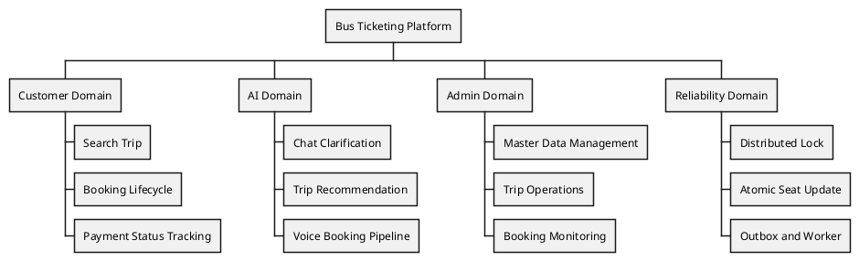

---
tags:
  - report
  - introduction
  - business-analysis
  - academic
created: 2026-04-01
updated: 2026-04-01
---

# CAPSTONE PROJECT REPORT

## Report 1 - Project Introduction

## NGHIÊN CỨU VÀ PHÁT TRIỂN HỆ THỐNG ĐẶT VÉ XE LIÊN TỈNH TÍCH HỢP AI CHAT/VOICE

---

## I. Record of Changes

| Date | Type | In charge | Change Description |
|---|---|---|---|
| 2026-04-01 | A | Team | Tạo mới bản học thuật cho Report 1 |
| 2026-04-01 | M | Team | Chuẩn hóa nội dung theo domain Bus Ticketing + AI |

---

## II. Project Introduction

### 1. Research Context and Motivation

Trong vận tải hành khách liên tỉnh, chất lượng dịch vụ số không chỉ được đánh giá bởi giao diện tìm chuyến, mà còn bởi độ tin cậy của dữ liệu ghế, tốc độ hoàn tất đặt vé và khả năng giảm sai sót nhập liệu. Phần lớn hệ thống hiện hành tối ưu theo hướng marketplace/listing; tuy nhiên, khoảng cách giữa lớp hội thoại AI và lớp thực thi nghiệp vụ vẫn lớn. Hệ quả là chatbot có thể trả lời tốt về ngôn ngữ nhưng không chuyển hóa thành hành động đặt vé nhất quán ở backend.

Đề tài hướng tới một mô hình thực dụng: AI hỗ trợ hiểu ý định và hoàn thiện thông tin thiếu, trong khi backend vẫn là điểm ra quyết định nghiệp vụ cuối cùng. Cách tiếp cận này đồng thuận với thực hành kỹ nghệ yêu cầu hiện đại, trong đó phân tách rõ requirement ở lớp nghiệp vụ và lớp công nghệ, đồng thời ràng buộc acceptance criteria để giảm độ lệch giữa tài liệu và hệ thống thực thi [1], [2].

### 2. Problem Statement

Hệ thống đặt vé truyền thống đối mặt bốn vấn đề cốt lõi:

1. **Sai sót nhập liệu:** Người dùng dễ nhầm điểm đi/điểm đến/ngày giờ trong luồng nhiều bước.
2. **Xung đột ghế:** Nhiều request đồng thời trên cùng tài nguyên ghế gây lỗi overbooking nếu thiếu cơ chế khóa và cập nhật nguyên tử.
3. **Đứt gãy giữa AI và nghiệp vụ:** Hệ AI chỉ dừng ở lớp hội thoại, không gắn với giao dịch đặt vé thực.
4. **Chi phí vận hành tăng:** Thiếu ranh giới module rõ ràng làm tăng nợ kỹ thuật và giảm khả năng mở rộng.

### 3. Research Objectives

#### 3.1 General Objective

Thiết kế và hiện thực hệ thống đặt vé xe liên tỉnh tích hợp AI chat/voice, cân bằng giữa trải nghiệm người dùng và tính đúng đắn nghiệp vụ.

#### 3.2 Specific Objectives

- O1: Xác định và đặc tả bộ use case cốt lõi theo chuẩn SRS.
- O2: Xây dựng luồng booking có khả năng chống race condition.
- O3: Tích hợp AI service qua gRPC cho chat/voice parsing.
- O4: Chuẩn hóa luồng chat hỏi thiếu thông tin trong phạm vi booking (`origin`, `destination`, `date`, `time`, `budget`).
- O5: Chuẩn hóa voice execute theo quy tắc tạo booking `COD/pending`.
- O6: Đồng bộ tài liệu học thuật giữa Report 1-3-7 và tài liệu module.

### 4. Scope and Delimitation

#### 4.1 In-Scope

- Đăng ký/đăng nhập/xác thực JWT.
- Tìm chuyến, xem chi tiết chuyến.
- Tạo/hủy booking, webhook thanh toán, expiry worker.
- AI Chat: parse + missing-field clarification + suggestion.
- AI Voice: transcribe -> parse -> plan -> execute.
- Quản trị dữ liệu provider, bus, bus type, location, trip, booking.

#### 4.2 Out-of-Scope

- Dynamic pricing thời gian thực dựa trên reinforcement learning.
- Tổng đài thoại tự động đa kênh.
- Tối ưu lịch trình tuyến ở mức toàn mạng lưới.

### 5. Product Vision

Sản phẩm định hướng theo nguyên lý *AI-assistance with deterministic business core*: AI dùng để hiểu và làm rõ nhu cầu, còn mọi quyết định nghiệp vụ (khóa ghế, tạo booking, cập nhật trạng thái) được thực thi tại backend theo quy tắc xác định. Nhờ đó hệ thống vẫn mở rộng năng lực AI mà không đánh đổi tính ổn định nghiệp vụ [3], [4].

### 6. Business Opportunity Analysis

Phân tích BA cho thấy ba nhóm lợi ích:

- **Lợi ích vận hành:** giảm xung đột đặt ghế, giảm ticket hỗ trợ do nhập sai thông tin.
- **Lợi ích người dùng:** giảm thao tác và tăng tốc độ hoàn tất đặt vé qua chat/voice.
- **Lợi ích chiến lược:** tạo nền dữ liệu cho recommendation và phân tích hành vi ở giai đoạn sau.

#### 6.1 Success Metrics (KPI)

- Tỷ lệ hoàn tất booking từ luồng voice/chat.
- Thời gian trung bình từ tìm chuyến đến tạo booking.
- Tỷ lệ request thất bại do seat conflict.
- Tỷ lệ chat clarification hoàn thiện đủ trường bắt buộc.

### 7. Methodological Approach

Nhóm sử dụng phương pháp kết hợp:

- **Business Analysis:** stakeholder mapping, requirement elicitation, prioritization theo giá trị nghiệp vụ [1].
- **Requirements Engineering:** mô hình hóa FR/NFR và traceability theo ISO/IEC/IEEE 29148 [2].
- **Software Architecture:** phân lớp module và boundary context theo nguyên lý phụ thuộc một chiều.
- **Empirical Validation:** kiểm thử integration + smoke E2E với dữ liệu thực nghiệm.

### 8. High-Level Feature Tree

### 9. Expected Scientific and Practical Contribution

- Đề xuất mô hình kết hợp AI parsing và deterministic booking core cho bài toán vận tải liên tỉnh.
- Xây dựng bộ use case specification khả dụng cho bối cảnh triển khai thực tế.
- Chuẩn hóa phương pháp đồng bộ tài liệu học thuật với tài liệu kỹ thuật theo module.

---

## III. Conclusion

Report 1 xác lập nền tảng nghiên cứu và định hướng sản phẩm cho toàn bộ đề tài. Các báo cáo tiếp theo sẽ chuyển hóa tầm nhìn này thành bộ đặc tả yêu cầu chi tiết (Report 3) và báo cáo kiểm chứng triển khai (Report 7).

---

## References

[1] IIBA, *A Guide to the Business Analysis Body of Knowledge (BABOK Guide)*, v3.

[2] ISO/IEC/IEEE 29148:2018, *Systems and software engineering - Life cycle processes - Requirements engineering*.

[3] M. Fowler, *Patterns of Enterprise Application Architecture*, Addison-Wesley.

[4] G. Hohpe and B. Woolf, *Enterprise Integration Patterns*, Addison-Wesley.
