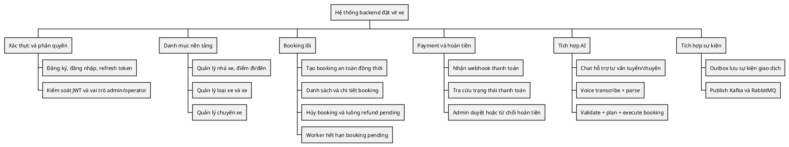

---
tags:
  - report
  - report1
  - backend
  - capstone
created: 2026-04-01
updated: 2026-04-01
---

# BÁO CÁO ĐỒ ÁN TỐT NGHIỆP

## Báo cáo 1 - Giới thiệu đề tài (Phiên bản Backend)

## NGHIÊN CỨU VÀ PHÁT TRIỂN HỆ THỐNG BACKEND ĐẶT VÉ XE LIÊN TỈNH TÍCH HỢP AI CHAT/VOICE

---

## I. Lịch sử thay đổi

| Ngày | Loại | Người thực hiện | Nội dung thay đổi |
|---|---|---|---|
| 2026-04-01 | A | Nhóm dự án | Tạo mới tài liệu Báo cáo 1 theo hướng backend |
| 2026-04-01 | M | Nhóm dự án | Bổ sung phân tích thị trường và khoảng trống nghiệp vụ |
| 2026-04-01 | M | Nhóm dự án | Bổ sung phạm vi, ràng buộc, giả định, quản trị rủi ro |
| 2026-04-01 | M | Nhóm dự án | Chuyển toàn bộ nội dung sang tiếng Việt học thuật |

Quy ước:

- `A`: Added
- `M`: Modified
- `D`: Deleted

---

## II. Giới thiệu đề tài

## 1. Tổng quan dự án

### 1.1 Thông tin dự án

| Hạng mục | Giá trị |
|---|---|
| Tên đề tài | Hệ thống backend đặt vé xe liên tỉnh tích hợp AI chat/voice |
| Tên mã nội bộ | BUS-TICKETING-AI |
| Loại sản phẩm | Nền tảng dịch vụ backend theo hướng API |
| Ngôn ngữ chính | Go |
| Framework HTTP | Gin |
| Cơ sở dữ liệu | PostgreSQL |
| Đồng bộ phiên và khóa phân tán | Redis |
| Hạ tầng sự kiện | Kafka, RabbitMQ |
| Tích hợp AI | gRPC đến AI Service (Python/FastAPI) |
| Tiền tố API | `/api/v1` |

### 1.2 Bối cảnh xuất phát đề tài

Trong miền nghiệp vụ bán vé xe liên tỉnh, doanh nghiệp cần xử lý đồng thời hai áp lực:

1. Áp lực trải nghiệm người dùng: tìm chuyến nhanh, đặt chỗ nhanh, thanh toán rõ trạng thái.
2. Áp lực vận hành: tránh trùng ghế, kiểm soát hoàn tiền, theo dõi dữ liệu giao dịch theo thời gian.

Hầu hết hệ thống hiện có tập trung mạnh vào giao diện hoặc thương mại điện tử, nhưng chưa thể hiện rõ ràng cách đảm bảo tính đúng đắn giao dịch dưới tải đồng thời cao.

Đề tài này lựa chọn tiếp cận backend-first: mọi quyết định làm thay đổi trạng thái nghiệp vụ phải đi qua luật miền (domain rule), còn AI đóng vai trò hỗ trợ hiểu ý định người dùng.

### 1.3 Bài toán trung tâm

Đề tài tập trung giải bài toán:

1. Đảm bảo nhất quán ghế ngồi khi nhiều người dùng đặt cùng chuyến.
2. Đồng bộ trạng thái thanh toán và booking trong bối cảnh callback trễ/lặp.
3. Quản trị quy trình hủy vé và hoàn tiền có kiểm soát bởi admin.
4. Cho phép người dùng tương tác bằng chat/voice nhưng không làm suy giảm an toàn giao dịch.

### 1.4 Mục tiêu đề tài

#### 1.4.1 Mục tiêu tổng quát

Xây dựng backend đặt vé xe liên tỉnh có khả năng mở rộng, đảm bảo tính đúng đắn giao dịch, hỗ trợ AI chat/voice và sẵn sàng cho vận hành thực tế.

#### 1.4.2 Mục tiêu cụ thể

1. Thiết kế API phân tách rõ public, authenticated, admin.
2. Triển khai luồng booking an toàn đồng thời bằng khóa phân tán và cập nhật ghế nguyên tử.
3. Triển khai luồng payment webhook + polling để hòa giải trạng thái.
4. Triển khai luồng refund request và quyết định approve/reject bởi admin.
5. Triển khai cầu nối AI chat/voice có bước validate trước execute.
6. Triển khai outbox worker và expiry worker để tách side-effect khỏi luồng đồng bộ.

### 1.5 Đối tượng hưởng lợi

| Đối tượng | Nhu cầu chính | Giá trị từ hệ thống |
|---|---|---|
| Khách chưa đăng nhập | Tra cứu tuyến/chuyến | Dữ liệu chuyến minh bạch, tìm kiếm nhanh |
| Người dùng đăng nhập | Đặt vé ổn định | Tránh tranh chấp ghế, kiểm tra trạng thái dễ dàng |
| Quản trị viên | Điều phối vận hành | Bảng điều khiển booking, refund, doanh thu |
| Nhà xe/đối tác | Quản lý chuyến và phương tiện | CRUD danh mục rõ quyền |
| Nhóm kỹ thuật | Dễ bảo trì và mở rộng | Cấu trúc module rõ ràng, tách lớp nghiệp vụ |

---

## 2. Cơ sở hình thành sản phẩm

### 2.1 Thực trạng thị trường

Hệ sinh thái bán vé xe hiện tại gồm các nhóm nền tảng chính:

1. Nền tảng tổng hợp nhiều nhà xe (aggregator).
2. Cổng bán vé nội bộ của từng nhà xe.
3. Kênh OTA mở rộng từ du lịch.
4. Trợ lý hội thoại đơn giản tích hợp vào ứng dụng bán vé.

Từ khảo sát, nhóm nhận thấy các điểm thiếu hụt lặp lại:

1. Không công bố rõ mô hình chống trùng ghế.
2. Trạng thái thanh toán và trạng thái booking dễ lệch nhau.
3. Quy trình hoàn tiền thiếu chuẩn hóa và khó truy vết.
4. Chatbot hỗ trợ tốt đầu vào nhưng yếu ở lớp kiểm soát giao dịch.

### 2.2 Khoảng trống cần giải quyết

| Vấn đề | Biểu hiện | Tác động |
|---|---|---|
| Tranh chấp ghế | Hai yêu cầu cùng chọn một ghế | Overbooking, tăng khiếu nại |
| Lệch trạng thái thanh toán | Callback đến trễ/lặp | Tốn công đối soát thủ công |
| Hoàn tiền không chuẩn | Thiếu bước duyệt thống nhất | Sai lệch dữ liệu tài chính |
| Chat/voice không ràng buộc | Lệnh mơ hồ hoặc sai profile | Booking sai thông tin |

### 2.3 Luận điểm lựa chọn kiến trúc

Đề tài chọn kiến trúc backend đặt trọng tâm vào tính đúng đắn:

1. Backend là nguồn chân lý (source of truth) cho trạng thái giao dịch.
2. AI chỉ đóng vai trò suy luận ý định, không tự quyết định thay đổi trạng thái.
3. Side-effect ngoại vi xử lý theo mô hình bất đồng bộ qua outbox.

---

## 3. Mục tiêu kinh doanh và giá trị ứng dụng

### 3.1 Cơ hội kinh doanh

Sự tăng trưởng nhu cầu di chuyển liên tỉnh mở ra nhu cầu số hóa quy trình đặt vé với độ tin cậy cao. Nếu hệ thống đảm bảo được tính nhất quán giao dịch, doanh nghiệp có thể:

1. Giảm tỷ lệ lỗi nghiệp vụ và chi phí hỗ trợ.
2. Tăng tỷ lệ hoàn tất thanh toán trong giờ cao điểm.
3. Tăng lòng tin người dùng nhờ trạng thái minh bạch.

### 3.2 Mô hình giá trị theo nhóm lợi ích

| Nhóm lợi ích | Giá trị cốt lõi |
|---|---|
| Người dùng cuối | Đặt vé an toàn, trạng thái rõ, hỗ trợ voice/chat |
| Bộ phận vận hành | Quy trình refund có kiểm soát, dễ đối soát |
| Quản lý sản phẩm | Dữ liệu đo lường rõ cho tối ưu chuyển đổi |
| Kỹ thuật hệ thống | Nền tảng sẵn sàng mở rộng theo module |

### 3.3 Chỉ số thành công định hướng

| Nhóm chỉ số | Mục tiêu định hướng |
|---|---|
| Chất lượng booking | Giảm lỗi tranh chấp ghế gây thất bại giao dịch |
| Tính đúng đắn payment | Tăng tỷ lệ đồng bộ booking-payment |
| Tốc độ xử lý vận hành | Rút ngắn vòng đời xử lý refund pending |
| Trải nghiệm AI | Tăng tỷ lệ người dùng hoàn tất flow voice |

---

## 4. Tầm nhìn sản phẩm backend

### 4.1 Tuyên bố tầm nhìn

Xây dựng nền tảng backend đặt vé xe liên tỉnh nơi AI giúp người dùng mô tả nhu cầu tự nhiên, còn hệ thống lõi luôn đảm bảo tính đúng đắn nghiệp vụ khi ghi nhận giao dịch.

### 4.2 Nguyên tắc phát triển

1. Correctness trước convenience.
2. Tách rõ lớp trình bày, lớp nghiệp vụ, lớp lưu trữ.
3. Mọi thay đổi trạng thái quan trọng phải có khả năng truy vết.
4. Mọi tích hợp ngoài phải giả định có lỗi và được xử lý an toàn.

### 4.3 Bản đồ năng lực sản phẩm

| Nhóm năng lực | Nội dung |
|---|---|
| Danh tính và phân quyền | Đăng ký, đăng nhập, refresh, logout, RBAC |
| Danh mục và chuyến xe | Quản lý provider/location/bus/bus-type/trip |
| Booking lõi | Đặt vé, giữ ghế, hủy, hết hạn booking |
| Payment và refund | Webhook, polling, approve/reject refund |
| AI hỗ trợ | Chat, voice transcribe, parse, validate, execute |
| Vận hành | Worker, event stream, báo cáo thống kê |

### 4.4 Cây chức năng mức cao

---

## 5. Cơ sở lý thuyết định hướng công nghệ

Phần này nêu khung lý thuyết mức định hướng; phần nghiên cứu sâu cho từng công nghệ được trình bày đầy đủ trong Báo cáo 7.

### 5.1 Nguyên lý kiến trúc tầng và domain-driven

Hệ thống tuân theo luồng phụ thuộc một chiều:

1. Controller nhận HTTP và kiểm tra dữ liệu vào.
2. UseCase thực thi luật nghiệp vụ và phối hợp transaction.
3. Repository làm việc với cơ sở dữ liệu.

Ưu điểm:

1. Cô lập nghiệp vụ khỏi framework.
2. Dễ kiểm thử usecase độc lập.
3. Dễ thay đổi công nghệ hạ tầng mà ít tác động domain.

### 5.2 Nguyên lý nhất quán giao dịch trong hệ phân tán nhẹ

Do không dùng distributed transaction xuyên nhiều hệ thống, đề tài áp dụng tổ hợp:

1. Khóa phân tán theo trip key ở Redis.
2. Khóa hàng dữ liệu (row lock) tại PostgreSQL.
3. Outbox pattern để phát sự kiện sau commit.

Mục tiêu là giảm nguy cơ inconsistency giữa DB và broker.

### 5.3 Nguyên lý tích hợp AI an toàn nghiệp vụ

AI pipeline được thiết kế theo mô hình “assistive, not authoritative”:

1. AI suy luận ý định từ văn bản/giọng nói.
2. Backend xác thực user/profile/ràng buộc nghiệp vụ.
3. Chỉ khi hợp lệ mới cho phép execute thao tác booking.

---

## 6. Phạm vi dự án và giới hạn

### 6.1 Phạm vi trong giai đoạn hiện tại

| Nhóm chức năng | Nội dung trong phạm vi |
|---|---|
| Auth | Register/login/refresh/logout |
| Public APIs | Search trips, browse, trip detail, provider, bus type, location |
| Booking | Create/list/get/cancel, voice plan/execute |
| Payment | Webhook + status polling |
| Refund | Refund request + approve/reject |
| AI | Chat + voice validate/transcribe/pipeline |
| Vận hành | Outbox worker + expiry worker + stream sự kiện |

### 6.2 Ngoài phạm vi

1. Engine định giá động theo hành vi thị trường.
2. Triển khai multi-region active-active.
3. Mô hình chống gian lận tài chính chuyên sâu.
4. Tích hợp CRM/call-center toàn diện.

### 6.3 Ràng buộc kỹ thuật

| Nhóm ràng buộc | Mô tả |
|---|---|
| Hạ tầng | Cần PostgreSQL và Redis ổn định để đảm bảo booking core |
| Tích hợp ngoài | Payment callback có thể trễ hoặc lặp |
| Chất lượng đầu vào voice | Phụ thuộc âm thanh và engine STT |
| Dữ liệu danh mục | Cần dữ liệu tuyến/điểm đi-đến chính xác |

### 6.4 Giả định chính

1. Gateway thanh toán cung cấp thông tin callback đủ để đối soát.
2. AI service luôn có đường truyền gRPC ổn định trong ngưỡng timeout.
3. Người dùng admin/operator thao tác theo quy trình vận hành chuẩn.

### 6.5 Danh mục rủi ro ban đầu

| Mã rủi ro | Mô tả | Mức ảnh hưởng | Biện pháp giảm thiểu |
|---|---|---|---|
| R1 | Lock contention cao tại cùng chuyến | Cao | TTL lock hợp lý, trả conflict rõ nghĩa |
| R2 | Webhook về trễ gây lệch trạng thái | Cao | Cơ chế polling hòa giải |
| R3 | Broker lỗi làm backlog outbox tăng | Trung bình | Retry + đánh dấu failed + replay |
| R4 | Parse voice sai ngữ cảnh | Trung bình | Validate nghiêm và yêu cầu bổ sung trường |
| R5 | Sai thao tác refund từ admin | Cao | Guard trạng thái + validate metadata |

---

## 7. Kế hoạch phát triển mức cao

### 7.1 Phân kỳ triển khai

| Giai đoạn | Trọng tâm | Kết quả |
|---|---|---|
| GĐ1 | Nền tảng auth + router | Route group và middleware hoàn chỉnh |
| GĐ2 | Danh mục + chuyến | CRUD quản trị và public search |
| GĐ3 | Booking core | Lock, seat update nguyên tử, create/cancel |
| GĐ4 | Payment + refund | Webhook, polling, approve/reject |
| GĐ5 | AI chat/voice | Validate, transcribe, pipeline, execute |
| GĐ6 | Reliability | Outbox và expiry worker |
| GĐ7 | Kiểm thử + tài liệu | Đối chiếu SRS, hoàn thiện báo cáo |

### 7.2 Tiêu chí nghiệm thu từng giai đoạn

1. API hoạt động đúng quyền truy cập và chuẩn response.
2. Luồng booking không tạo overbooking trong kịch bản tranh chấp ghế.
3. Luồng refund đảm bảo chuyển trạng thái hợp lệ.
4. Luồng voice không thể vượt qua bước validate backend.

---

## 8. Định hướng biên soạn Chương 3 và Chương 4

Mục này liên kết trực tiếp bộ ba báo cáo với cấu trúc khóa luận thường gặp, trong đó Chương 3 là cơ sở lý thuyết công nghệ và Chương 4 là phân tích, thiết kế, triển khai hệ thống.

### 8.1 Ánh xạ tài liệu theo chương

| Chương khóa luận | Nội dung trọng tâm | Tài liệu tham chiếu chính |
|---|---|---|
| Chương 3 | Cơ sở lý thuyết công nghệ sử dụng | Báo cáo 7 (mục Cơ sở lý thuyết) |
| Chương 4 | Phân tích nghiệp vụ, thiết kế hệ thống, ERD, luồng runtime | Báo cáo 3 + Báo cáo 7 |

### 8.2 Khung nội dung đề xuất cho Chương 3

1. Lý thuyết kiến trúc DDD và phân lớp controller-usecase-repository.
2. Lý thuyết Monorepo và quản trị thay đổi xuyên nhiều dịch vụ.
3. Lý thuyết về giao dịch, khóa dữ liệu và đảm bảo nhất quán với PostgreSQL + Redis.
4. Lý thuyết tích hợp hệ thống phân tán qua outbox, Kafka, RabbitMQ.
5. Lý thuyết AI assistant an toàn nghiệp vụ: validate trước execute.
6. Lý thuyết bảo mật API với JWT và RBAC.

### 8.3 Khung nội dung đề xuất cho Chương 4

1. Mô tả cấu trúc monorepo và tổ chức source code theo domain.
2. Mô hình DDD theo từng bounded context nghiệp vụ.
3. Sơ đồ luồng chạy code cho các use case trọng yếu: booking, payment, refund, voice pipeline.
4. Sơ đồ ERD và diễn giải ràng buộc dữ liệu chi tiết.
5. Truy vết từ yêu cầu SRS đến thành phần triển khai thực tế.

### 8.4 Phương pháp nghiên cứu và thu thập dữ liệu

| Phương pháp | Cách thực hiện trong đề tài | Mục tiêu |
|---|---|---|
| Phân tích tài liệu chuẩn | Đối chiếu ISO/IEC/IEEE 29148, ISO/IEC 25010 | Chuẩn hóa yêu cầu và chất lượng |
| Reverse engineering code | Đọc route, usecase, repository, schema SQL | Mô tả đúng hệ thống đã triển khai |
| Mô hình hóa UML/ERD | Dùng PlantUML cho kiến trúc và luồng runtime | Trực quan hóa thiết kế |
| Truy vết yêu cầu | Lập ma trận FR/NFR - Use Case - API | Bảo đảm tính nhất quán tài liệu |

### 8.5 Tiêu chí đánh giá tài liệu hoàn chỉnh

1. Nội dung lý thuyết gắn với công nghệ thực tế đang dùng, không trình bày rời rạc.
2. Mọi sơ đồ trong Chương 4 phải ánh xạ được sang module source code tương ứng.
3. ERD phải thể hiện rõ thực thể, quan hệ, khóa, trạng thái dữ liệu nghiệp vụ.
4. Các quyết định kỹ thuật phải nêu được trade-off và biện pháp giảm rủi ro.

---

## III. Kết luận

Báo cáo 1 xác lập nền tảng học thuật và thực tiễn cho đề tài theo hướng backend. Tài liệu đã:

1. Làm rõ bối cảnh và bài toán trung tâm cần giải quyết.
2. Xác định phạm vi và giới hạn nghiên cứu một cách minh bạch.
3. Đặt ra tầm nhìn sản phẩm cùng tiêu chí thành công đo lường được.
4. Đưa ra khung cơ sở lý thuyết và kiến trúc định hướng cho các báo cáo tiếp theo.

Báo cáo 3 sẽ đặc tả yêu cầu chi tiết (SRS), còn Báo cáo 7 sẽ trình bày triển khai, cơ sở lý thuyết đầy đủ từng công nghệ, kiểm thử và đánh giá cuối cùng.

---

## Tài liệu tham khảo

[1] ISO/IEC/IEEE 29148:2018, Systems and software engineering - Requirements engineering.

[2] ISO/IEC 25010:2011, Systems and software Quality Requirements and Evaluation.

[3] Martin Fowler, Patterns of Enterprise Application Architecture.

[4] Gregor Hohpe, Bobby Woolf, Enterprise Integration Patterns.

[5] Eric Evans, Domain-Driven Design: Tackling Complexity in the Heart of Software.
