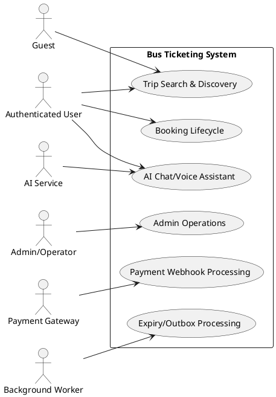
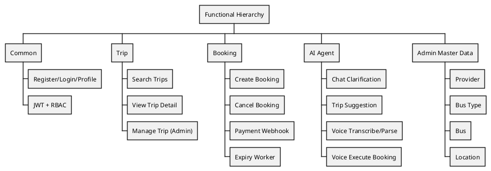
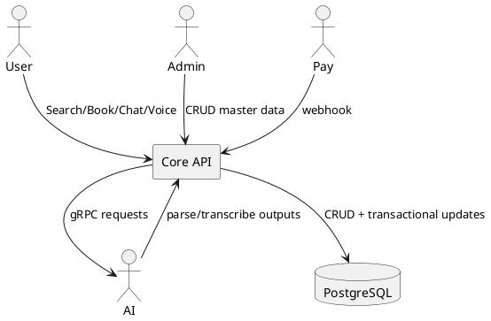
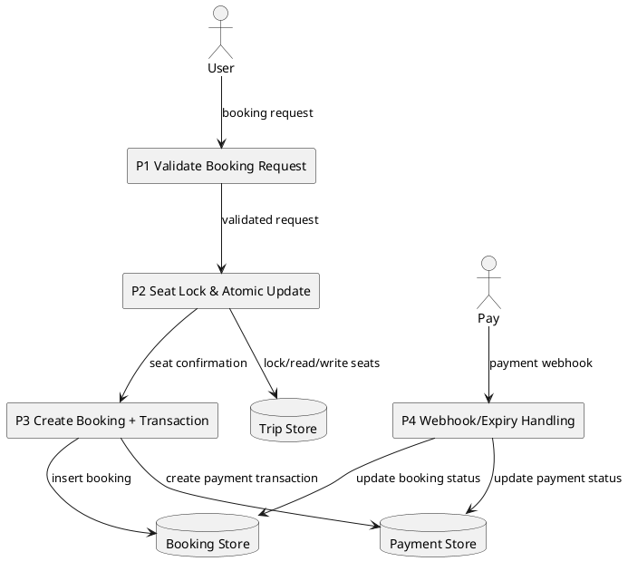

---
tags:
  - report
  - srs
  - business-analysis
  - usecase-specification
created: 2026-04-01
updated: 2026-04-01
---

# CAPSTONE PROJECT REPORT

## Report 3 - Software Requirement Specification

## HỆ THỐNG ĐẶT VÉ XE LIÊN TỈNH TÍCH HỢP AI CHAT/VOICE

---

## I. Record of Changes

| Date | Type | In charge | Description |
|---|---|---|---|
| 2026-04-01 | A | Team | Viết mới SRS theo domain Bus Ticketing + AI |
| 2026-04-01 | M | Team | Bổ sung UC Specification, RTM, FR/NFR |

---

## II. Software Requirement Specification

> [!abstract] Mục tiêu tài liệu
> Tài liệu xác định yêu cầu phần mềm cho hệ thống đặt vé xe liên tỉnh tích hợp AI hội thoại/giọng nói; bảo đảm khả năng truy vết từ mục tiêu nghiệp vụ đến use case, API và module triển khai.

## 1. Introduction

### 1.1 Purpose

Tài liệu SRS mô tả tập yêu cầu chức năng và phi chức năng của hệ thống, làm cơ sở cho thiết kế, kiểm thử và nghiệm thu. Đối tượng sử dụng gồm giảng viên hướng dẫn, nhóm phát triển, nhóm kiểm thử và bên vận hành.

### 1.2 Scope of Product

Sản phẩm cung cấp năng lực đặt vé liên tỉnh theo hai chế độ tương tác:

- Luồng có cấu trúc (form-based).
- Luồng ngôn ngữ tự nhiên (chat/voice).

Điểm trọng tâm của đề tài là giữ backend làm lớp quyết định nghiệp vụ cuối cùng, trong khi AI thực hiện parse/transcribe/clarification để tăng tỷ lệ hoàn tất use case đặt vé.

### 1.3 Definitions and Acronyms

| Term | Meaning |
|---|---|
| SRS | Software Requirement Specification |
| UC | Use Case |
| FR | Functional Requirement |
| NFR | Non-functional Requirement |
| RTM | Requirement Traceability Matrix |
| COD | Cash On Delivery |
| DFD | Data Flow Diagram |
| ERD | Entity Relationship Diagram |

### 1.4 Referenced Standards

- ISO/IEC/IEEE 29148:2018 - Requirements Engineering [1].
- BABOK v3 - Business Analysis discipline [2].

---

## 2. Business Analysis Context

### 2.1 Business Objectives

- BO-01: Tăng tỷ lệ hoàn tất đặt vé thành công trong bối cảnh đồng thời cao.
- BO-02: Giảm thời gian thao tác đặt vé bằng chat/voice.
- BO-03: Giảm lỗi vận hành do sai thông tin đầu vào.

### 2.2 Stakeholders

| Stakeholder | Concern |
|---|---|
| Guest/User | Tìm chuyến nhanh, đặt vé chính xác, thao tác tối giản |
| Admin/Operator | Quản trị master data, kiểm soát trạng thái trip/booking |
| Product Owner | KPI chuyển đổi, ổn định nghiệp vụ |
| Engineering Team | Kiến trúc rõ ranh giới, dễ bảo trì/mở rộng |
| QA Team | Traceability yêu cầu - kiểm thử |

### 2.3 Business Constraints

- Hệ thống phải chống overbooking khi có truy cập đồng thời.
- Chat clarification chỉ nằm trong booking scope gồm `origin`, `destination`, `date`, `time`, `budget`.
- Voice execute phải tạo booking với `payment_method=cod` và trạng thái `pending`.

---

## 3. Overall Description

### 3.1 Product Perspective

Hệ thống triển khai đa dịch vụ gồm:

- React Frontend (UI người dùng/admin).
- Go Backend (core nghiệp vụ + REST API).
- Python AI Service (gRPC cho chat/voice NLP).
- PostgreSQL, Redis, message broker, worker.

### 3.2 System Context Diagram



### 3.3 Actors and Responsibilities

| Actor | Responsibility |
|---|---|
| Guest | Tra cứu chuyến xe công khai |
| Authenticated User | Đặt/hủy vé, quản lý booking, dùng chat/voice |
| Admin/Operator | Quản trị dữ liệu nền và vận hành trip/booking |
| AI Service | Parse intent, transcribe audio, trả kết quả NLP |
| Payment Gateway | Gửi webhook trạng thái thanh toán |
| Background Worker | Xử lý expire booking và outbox |

### 3.4 Functional Hierarchy



### 3.5 Data Flow Diagram - Context



### 3.6 Data Flow Diagram - Level 1 (Booking)



---

## 4. Functional Requirements (FR)

### 4.1 Auth/Common

| ID | Requirement | Priority |
|---|---|---|
| FR-CM-01 | Người dùng đăng ký tài khoản | High |
| FR-CM-02 | Người dùng đăng nhập và nhận JWT | High |
| FR-CM-03 | Endpoint bảo vệ theo role (RBAC) | High |
| FR-CM-04 | Người dùng xem/cập nhật profile | Medium |

### 4.2 Trip

| ID | Requirement | Priority |
|---|---|---|
| FR-TR-01 | Tìm chuyến theo route/date/passengers | High |
| FR-TR-02 | Trả trip detail đầy đủ dữ liệu ghế/trạng thái | High |
| FR-TR-03 | Admin CRUD trip | Medium |
| FR-TR-04 | Cập nhật status trip theo state machine | High |

### 4.3 Booking

| ID | Requirement | Priority |
|---|---|---|
| FR-BK-01 | Tạo booking an toàn trong bối cảnh đồng thời | High |
| FR-BK-02 | Hủy booking và giải phóng ghế đúng quy tắc | High |
| FR-BK-03 | Xử lý webhook thanh toán cập nhật trạng thái | High |
| FR-BK-04 | Worker tự động expire booking quá hạn | High |

### 4.4 AI Agent

| ID | Requirement | Priority |
|---|---|---|
| FR-AI-01 | Chat parse intent và trích xuất thực thể | High |
| FR-AI-02 | Chat chỉ hỏi field thiếu trong booking scope | High |
| FR-AI-03 | Voice transcribe audio và parse command | High |
| FR-AI-04 | Voice execute tạo booking `COD/pending` | High |
| FR-AI-05 | AI unavailable phải degrade graceful | Medium |

### 4.5 Admin Master Data

| ID | Requirement | Priority |
|---|---|---|
| FR-ADM-01 | Quản lý Provider | Medium |
| FR-ADM-02 | Quản lý Bus Type/Seat Layout | Medium |
| FR-ADM-03 | Quản lý Bus | Medium |
| FR-ADM-04 | Quản lý Location | Medium |

---

## 5. Use Case Specifications

> [!info] Use Case Template
> ID, Name, Primary Actor, Trigger, Preconditions, Postconditions, Main Flow, Alternate Flow, Exceptions, Business Rules, Acceptance Criteria.

### UC-TR-01 Search Trips

- **ID:** UC-TR-01
- **Primary Actor:** Guest/User
- **Trigger:** Người dùng gửi yêu cầu tìm chuyến.
- **Preconditions:** Không bắt buộc đăng nhập.
- **Postconditions:** Danh sách chuyến phù hợp được trả về.

**Main Flow**

1. Actor nhập `origin`, `destination`, `date`, `passengers`.
2. System validate query params.
3. System truy vấn dữ liệu trip theo điều kiện.
4. System lọc theo số ghế khả dụng.
5. System trả kết quả phân trang.

**Alternate Flow**

- AF1: Không có kết quả, trả danh sách rỗng kèm metadata.

**Exceptions**

- EX1: Query invalid, trả `400 VALIDATION_ERROR`.

**Acceptance Criteria**

- AC1: Trả đúng tập trip theo route/date.
- AC2: Không trả trip thiếu ghế cho số lượng khách yêu cầu.

---

### UC-BK-01 Create Booking

- **ID:** UC-BK-01
- **Primary Actor:** Authenticated User
- **Trigger:** Người dùng chọn ghế và xác nhận đặt vé.
- **Preconditions:**
  - Trip tồn tại và trạng thái cho phép đặt.
  - Danh sách ghế hợp lệ.
  - User token hợp lệ.
- **Postconditions:**
  - Booking trạng thái `pending` được tạo.
  - Ghế được cập nhật nhất quán.
  - Outbox event được ghi.

**Main Flow**

1. Controller bind và validate request.
2. UseCase acquire distributed lock theo trip.
3. Transaction khóa row trip trong DB.
4. Kiểm tra seat availability.
5. Atomic update `booked_seats` và `available_seats`.
6. Insert booking `pending`.
7. Nếu online payment, tạo payment transaction/link.
8. Ghi outbox `booking.created`.
9. Commit transaction và trả response.

**Alternate Flow**

- AF1: `payment_method=cod` thì bỏ qua tạo payment link.

**Exceptions**

- EX1: `409 SEATS_BEING_BOOKED` khi lock không thành công.
- EX2: `409 SEATS_NOT_AVAILABLE` khi ghế đã được đặt.
- EX3: `400 INVALID_SEAT_CODE` khi mã ghế không hợp lệ.

**Business Rules**

- BR-BK-01: Mỗi request booking phải có danh sách ghế.
- BR-BK-02: Chỉ cập nhật ghế khi lock thành công.
- BR-BK-03: Booking từ luồng voice luôn `cod/pending`.

**Acceptance Criteria**

- AC1: Hai request đồng thời cùng ghế chỉ một request thành công.
- AC2: Booking lưu đúng seat set đã xác nhận.

---

### UC-AI-CHAT-02 Clarify Missing Fields

- **ID:** UC-AI-CHAT-02
- **Primary Actor:** Authenticated User
- **Trigger:** User gửi yêu cầu đặt/tìm vé nhưng thiếu thông tin.
- **Preconditions:** Chat endpoint khả dụng, session hợp lệ.
- **Postconditions:** System trả câu hỏi follow-up đúng field thiếu.

**Main Flow**

1. User gửi message tự nhiên.
2. System parse intent/entities.
3. System xác định field thiếu trong booking scope.
4. System hỏi theo thứ tự:
   - `origin`
   - `destination`
   - `date`
   - `time`
   - `budget`
5. User bổ sung thông tin còn thiếu.
6. Khi đủ field, system chuyển sang suggest trip.

**Exceptions**

- EX1: AI timeout, trả thông báo fallback và hướng dẫn nhập tay.

**Business Rules**

- BR-AI-CHAT-01: Không hỏi ngoài booking scope.

**Acceptance Criteria**

- AC1: Nếu thiếu `date`, hệ thống hỏi `date` thay vì hỏi field ngoài phạm vi.
- AC2: Khi đủ field, hệ thống trả danh sách gợi ý chuyến.

---

### UC-AI-VOICE-04 Voice Execute Booking

- **ID:** UC-AI-VOICE-04
- **Primary Actor:** Authenticated User
- **Trigger:** User upload audio và bật execute mode.
- **Preconditions:** AI service khả dụng, user active.
- **Postconditions:** Booking được tạo hoặc trả lý do thất bại.

**Main Flow**

1. User upload audio.
2. Go backend gọi `TranscribeAudio`.
3. Go backend gọi `ParseCommand`.
4. Voice plan tìm candidate trip phù hợp.
5. Voice execute tạo booking.
6. Response trả transcript + parse + booking result.

**Alternate Flow**

- AF1: Nếu trip đề xuất hết ghế, fallback sang candidate hợp lệ tiếp theo.

**Exceptions**

- EX1: AI service unavailable, trả `503 SERVICE_UNAVAILABLE`.
- EX2: Parse không đủ thông tin tối thiểu, trả yêu cầu bổ sung.

**Business Rules**

- BR-AI-VOICE-01: Voice execute dùng `payment_method=cod`.
- BR-AI-VOICE-02: Booking tạo thành công có trạng thái `pending`.

**Acceptance Criteria**

- AC1: Voice execute thành công phải tạo booking `cod/pending`.
- AC2: Kết quả phản hồi có đủ transcript và trạng thái booking.

---

## 6. Data Requirements

### 6.1 Core Entities

- `users`
- `providers`
- `bus_types`
- `buses`
- `locations`
- `trips`
- `bookings`
- `payment_transactions`
- `outbox_events`

### 6.2 ERD

```plantuml
@startuml
entity users { *id }
entity providers { *id }
entity bus_types { *id }
entity buses { *id; provider_id; bus_type_id }
entity locations { *id }
entity trips { *id; bus_id; origin_id; destination_id; status; available_seats }
entity bookings { *id; trip_id; user_id; status; payment_method }
entity payment_transactions { *id; booking_id; order_code; status }
entity outbox_events { *id; topic; status }

providers ||--o{ buses
bus_types ||--o{ buses
buses ||--o{ trips
locations ||--o{ trips
trips ||--o{ bookings
users ||--o{ bookings
bookings ||--o{ payment_transactions
@enduml
```

### 6.3 Data Integrity Constraints

- `arrival_time > departure_time`.
- `available_seats >= 0`.
- `available_seats` tương thích với `booked_seats`.
- Booking `cod` không yêu cầu trường payment link online.

---

## 7. Non-functional Requirements (NFR)

### 7.1 Performance

- NFR-PF-01: Search API duy trì p95 trong ngưỡng vận hành nội bộ.
- NFR-PF-02: AI call timeout được quản lý bằng context deadline.

### 7.2 Reliability

- NFR-RL-01: Booking bắt buộc lock + atomic update.
- NFR-RL-02: Outbox pattern giảm rủi ro mất event khi broker lỗi.

### 7.3 Security

- NFR-SC-01: JWT auth cho endpoint bảo vệ.
- NFR-SC-02: Validate input tại boundary.
- NFR-SC-03: Không lưu secret trong source control.

### 7.4 Maintainability

- NFR-MT-01: Ranh giới module rõ ràng.
- NFR-MT-02: Tách mapper request/domain/response.
- NFR-MT-03: Tài liệu và code được soát đồng bộ theo mốc release.

---

## 8. Requirement Traceability Matrix (RTM)

| Business Objective | FR | Use Case | API | Module |
|---|---|---|---|---|
| BO-01 | FR-BK-01 | UC-BK-01 | `POST /api/v1/bookings` | Booking |
| BO-01 | FR-BK-04 | UC-BK-01 | `POST /api/v1/bookings/expire` (worker) | Booking |
| BO-02 | FR-AI-02 | UC-AI-CHAT-02 | `POST /api/v1/ai/chat` | AI Agent |
| BO-02 | FR-AI-04 | UC-AI-VOICE-04 | `POST /api/v1/ai/voice/booking/pipeline` | AI Agent + Booking |
| BO-03 | FR-TR-01 | UC-TR-01 | `GET /api/v1/trips` | Trip |

---

## 9. Validation Criteria for SRS Completion

- Mỗi FR có use case liên kết và điểm kiểm thử nghiệm thu.
- Mỗi use case có pre/post condition, luồng chính, alternate, exception.
- Có RTM thể hiện truy vết từ mục tiêu nghiệp vụ đến API/module.

---

## References

[1] ISO/IEC/IEEE 29148:2018, *Systems and software engineering - Life cycle processes - Requirements engineering*.

[2] IIBA, *A Guide to the Business Analysis Body of Knowledge (BABOK Guide)*, v3.

[3] A. Cockburn, *Writing Effective Use Cases*.

[4] K. Pohl, *Requirements Engineering: Fundamentals, Principles, and Techniques*.
