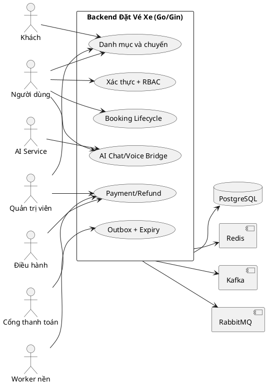
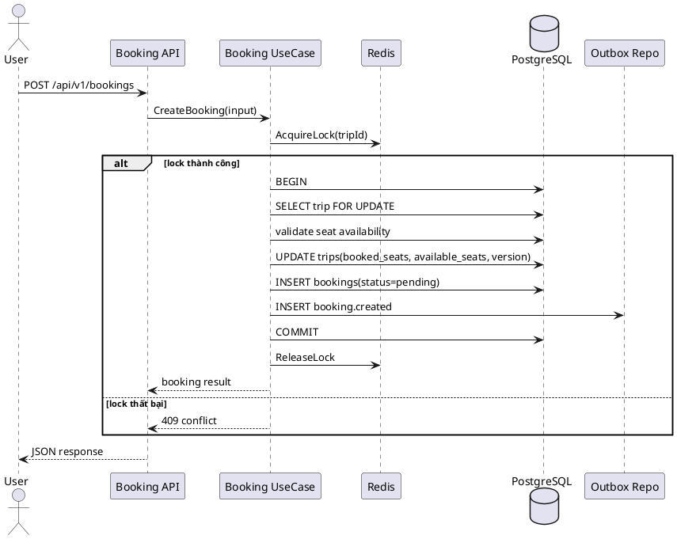
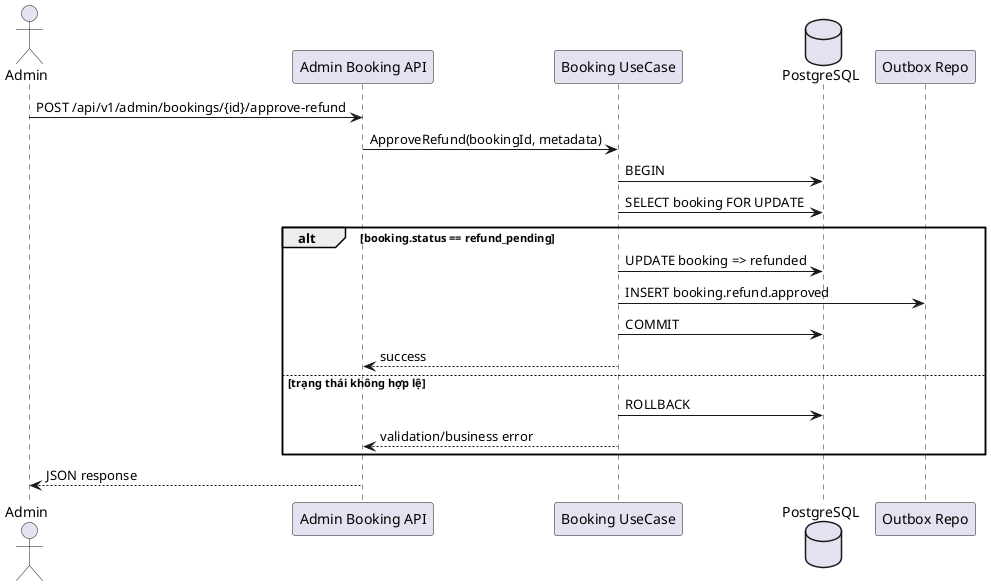
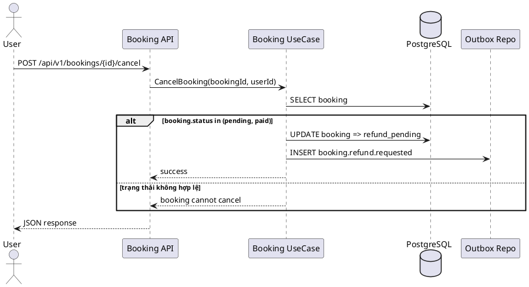
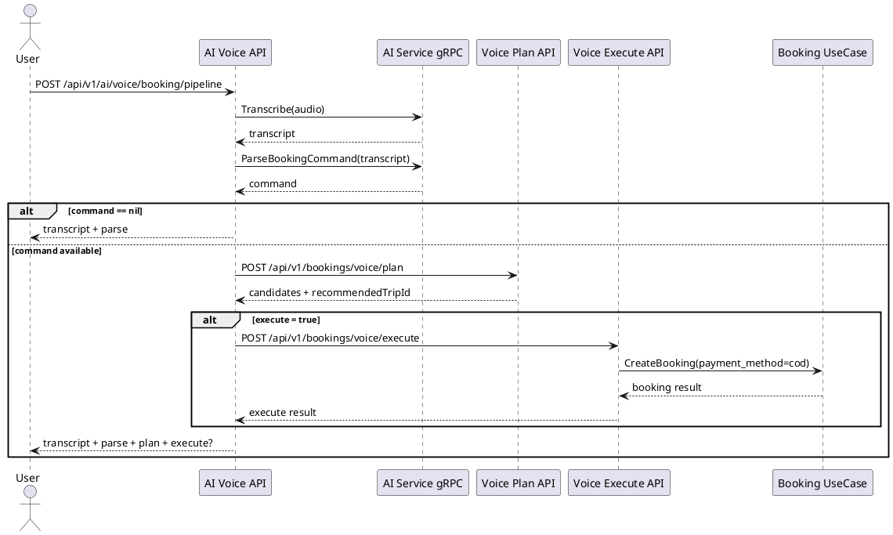
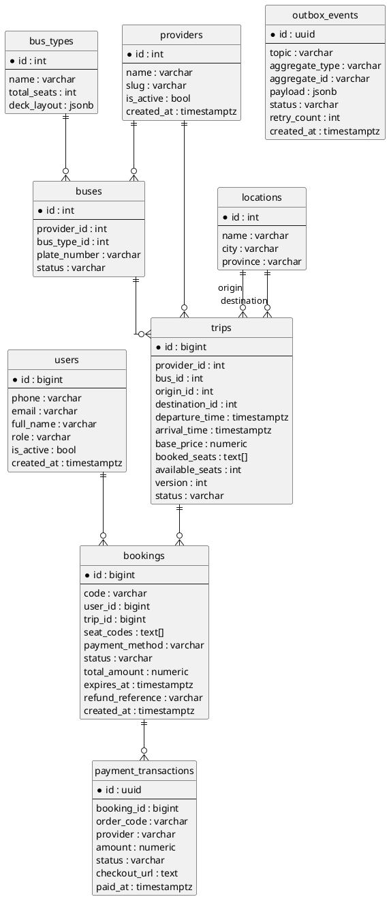

---
tags:
  - report
  - report3
  - srs
  - backend
created: 2026-04-01
updated: 2026-04-01
---

# BÁO CÁO ĐỒ ÁN TỐT NGHIỆP

## Báo cáo 3 - Đặc tả yêu cầu phần mềm (SRS) - Phiên bản Backend

## HỆ THỐNG BACKEND ĐẶT VÉ XE LIÊN TỈNH TÍCH HỢP AI CHAT/VOICE

---

## I. Lịch sử thay đổi

| Ngày | Loại | Người thực hiện | Nội dung |
|---|---|---|---|
| 2026-04-01 | A | Nhóm dự án | Tạo mới tài liệu SRS backend |
| 2026-04-01 | M | Nhóm dự án | Bổ sung use case chi tiết theo module |
| 2026-04-01 | M | Nhóm dự án | Bổ sung FR/NFR và ma trận truy vết yêu cầu |
| 2026-04-01 | M | Nhóm dự án | Viết lại toàn bộ tiếng Việt và mở rộng ERD |

Quy ước:

- `A`: Added
- `M`: Modified
- `D`: Deleted

---

## II. Đặc tả yêu cầu phần mềm

## 1. Giới thiệu tài liệu SRS

### 1.1 Mục đích tài liệu

Tài liệu này mô tả đầy đủ yêu cầu phần mềm cho hệ thống backend đặt vé xe liên tỉnh tích hợp AI chat/voice, làm cơ sở để:

1. Thiết kế kiến trúc và triển khai code.
2. Lập kế hoạch kiểm thử chức năng và phi chức năng.
3. Đối chiếu truy vết từ yêu cầu đến endpoint và luồng nghiệp vụ thực tế.

### 1.2 Phạm vi hệ thống

Phạm vi SRS bao gồm các thành phần backend:

1. Xác thực và phân quyền.
2. Danh mục nền tảng (provider, location, bus-type, bus).
3. Quản lý chuyến và tìm kiếm chuyến.
4. Booking lifecycle, thanh toán, hoàn tiền.
5. Tích hợp AI chat/voice.
6. Worker nền và phát sự kiện bất đồng bộ.

### 1.3 Thuật ngữ và viết tắt

| Viết tắt | Diễn giải |
|---|---|
| API | Application Programming Interface |
| BR | Business Rule |
| DDD | Domain-Driven Design |
| ERD | Entity Relationship Diagram |
| FR | Functional Requirement |
| NFR | Non-Functional Requirement |
| RBAC | Role-Based Access Control |
| SRS | Software Requirement Specification |
| STT | Speech-To-Text |
| UC | Use Case |
| VO | Value Object |

### 1.4 Tài liệu liên quan

1. Báo cáo 1 - Giới thiệu đề tài backend.
2. Báo cáo 7 - Báo cáo cuối kỳ và triển khai hệ thống.
3. Tài liệu nội bộ module backend trong thư mục `obsidian`.

---

## 2. Mô tả tổng quan hệ thống

### 2.1 Bối cảnh nghiệp vụ

Hệ thống phục vụ quy trình đặt vé xe liên tỉnh với yêu cầu trọng tâm là đảm bảo tính nhất quán dữ liệu ghế và trạng thái giao dịch khi người dùng đặt vé đồng thời, đồng thời cho phép tương tác tự nhiên qua chat/voice.

### 2.2 Sơ đồ ngữ cảnh hệ thống



### 2.3 Ranh giới và trách nhiệm

| Thành phần | Trách nhiệm |
|---|---|
| Backend API | Xử lý nghiệp vụ cốt lõi, xác thực, phân quyền |
| AI Service | STT, parse lệnh, phản hồi chat |
| Payment gateway | Tạo link thanh toán, callback trạng thái |
| Message broker | Phân phối sự kiện cho hệ thống downstream |
| Redis | Token cache, distributed lock |
| PostgreSQL | Nguồn dữ liệu chính cho transaction |

### 2.4 Ma trận module backend

| Module | Vai trò |
|---|---|
| `auth` | Đăng ký, đăng nhập, refresh/logout, middleware ngữ cảnh người dùng |
| `provider` | Quản lý nhà xe public/admin |
| `location` | Quản lý điểm đi/đến và tìm kiếm |
| `bustype` | Quản lý loại xe và số ghế |
| `bus` | Quản lý phương tiện |
| `trip` | CRUD chuyến và API tìm kiếm/browse |
| `booking` | Đặt vé, hủy vé, thanh toán, refund, dashboard |
| `aiagent` | API chat/voice và tích hợp gRPC AI |
| `upload` | Tải lên và cung cấp tệp công khai |

---

## 3. Đặc tả giao diện ngoài

### 3.1 Chuẩn request/response API

#### 3.1.1 Chuẩn response thành công

```json
{
  "code": 200,
  "status": "success",
  "message": "",
  "data": {}
}
```

#### 3.1.2 Chuẩn response lỗi

```json
{
  "code": 400,
  "status": "error",
  "message": "Noi dung loi",
  "error_code": "VALIDATION_ERROR"
}
```

### 3.2 Quy tắc phân quyền

| Nhóm API | Quyền truy cập |
|---|---|
| Public | Không cần token |
| Authenticated | JWT hợp lệ |
| Admin/Operator | JWT hợp lệ + role middleware |

### 3.3 Danh sách endpoint cốt lõi

| Nhóm | Method | Path | Quyền |
|---|---|---|---|
| Auth | POST | `/api/v1/auth/register` | Public |
| Auth | POST | `/api/v1/auth/login` | Public |
| Auth | POST | `/api/v1/auth/refresh` | Public |
| Auth | POST | `/api/v1/auth/logout` | Public |
| Trip | GET | `/api/v1/trips` | Public |
| Trip | GET | `/api/v1/trips/browse` | Public |
| Trip | GET | `/api/v1/trips/:id` | Public |
| Booking | POST | `/api/v1/bookings` | User |
| Booking | GET | `/api/v1/bookings/my` | User |
| Booking | GET | `/api/v1/bookings/:id` | User |
| Booking | POST | `/api/v1/bookings/:id/cancel` | User |
| Booking | POST | `/api/v1/bookings/voice/plan` | User |
| Booking | POST | `/api/v1/bookings/voice/execute` | User |
| Payment | POST | `/api/v1/bookings/payments/webhook` | Public (gateway) |
| Payment | GET | `/api/v1/bookings/payments/:orderCode/status` | Public |
| Admin Booking | GET | `/api/v1/admin/bookings` | Admin/Operator |
| Admin Booking | GET | `/api/v1/admin/bookings/stats` | Admin/Operator |
| Admin Booking | POST | `/api/v1/admin/bookings/:id/approve-refund` | Admin/Operator |
| Admin Booking | POST | `/api/v1/admin/bookings/:id/reject-refund` | Admin/Operator |
| AI | POST | `/api/v1/ai/chat` | Public |
| AI | POST | `/api/v1/ai/voice/booking/validate` | User |
| AI | POST | `/api/v1/ai/voice/booking/transcribe` | User |
| AI | POST | `/api/v1/ai/voice/booking/pipeline` | User |

### 3.4 Giao diện tích hợp ngoài

| Tích hợp | Cơ chế | Dữ liệu chính |
|---|---|---|
| AI service | gRPC | chat, transcript, parse command |
| Payment gateway | HTTP callback + API query | order code, trạng thái, chữ ký |
| Kafka | producer | sự kiện booking tổng quát |
| RabbitMQ | producer | sự kiện refund |

---

## 4. Đặc tả Use Case

### 4.1 Danh mục Use Case

| Mã | Use Case | Tác nhân chính |
|---|---|---|
| UC-CM-01 | Đăng ký tài khoản | Khách |
| UC-CM-02 | Đăng nhập | Người dùng |
| UC-TR-01 | Tìm chuyến theo tuyến/ngày | Khách, Người dùng |
| UC-TR-02 | Xem chi tiết chuyến | Khách, Người dùng |
| UC-BK-01 | Tạo booking | Người dùng |
| UC-BK-02 | Xem danh sách booking của tôi | Người dùng |
| UC-BK-03 | Hủy booking | Người dùng |
| UC-PM-01 | Nhận callback thanh toán | Cổng thanh toán |
| UC-PM-02 | Duyệt hoàn tiền | Admin, Operator |
| UC-AI-01 | Chat tư vấn hành trình | Khách, Người dùng |
| UC-AI-02 | Pipeline voice booking | Người dùng |
| UC-BG-01 | Worker hết hạn booking | Worker nền |
| UC-BG-02 | Worker publish outbox | Worker nền |

### 4.2 Đặc tả UI và UC theo mẫu bảng

Phần này được trình bày theo đúng phong cách đặc tả tài liệu khóa trước: mỗi chức năng gồm:

1. `a. UI Specifications` (hoặc `Integration Specifications` với UC hệ thống - hệ thống).
2. `b. UC Specifications` với metadata, luồng chính, luồng thay thế, ngoại lệ, tần suất sử dụng, business rules.

#### 4.2.1 UC-CM-01 - Đăng ký tài khoản

##### a. UI Specifications

Màn hình đăng ký cho phép khách tạo tài khoản mới.

| Field Name | Description |
|---|---|
| Full Name | Nhập họ tên người dùng |
| Phone | Nhập số điện thoại (định danh đăng nhập) |
| Email | Nhập email liên hệ (tùy chọn) |
| Password | Nhập mật khẩu theo chính sách bảo mật |
| Confirm Password | Nhập lại mật khẩu để xác nhận |
| Register | Nút gửi yêu cầu đăng ký |

##### b. UC Specifications

| Thuộc tính | Giá trị | Thuộc tính | Giá trị |
|---|---|---|---|
| ID and Name | UC-CM-01 - Đăng ký tài khoản | Created By | Nhóm Backend |
| Date Created | 01/04/2026 | Primary Actor | Khách |
| Secondary Actors | Auth Service | Trigger | Người dùng nhấn `Register` |
| Description | Tạo tài khoản mới trong hệ thống | Preconditions | Số điện thoại chưa tồn tại |
| Postconditions | Tài khoản được tạo thành công | Frequency of Use | Cao |
| Business Rules | BR-01 | Assumptions | Dịch vụ xác thực và DB hoạt động ổn định |

Normal Flows:

| Step | Step Details |
|---|---|
| 1 | Khách mở màn hình đăng ký |
| 2 | Nhập full name, phone, email, password, confirm password |
| 3 | Hệ thống validate dữ liệu đầu vào |
| 4 | Hệ thống kiểm tra trùng số điện thoại |
| 5 | Hệ thống băm mật khẩu và lưu người dùng |
| 6 | Hệ thống trả kết quả đăng ký thành công |

Alternative Flows:

| Flow | Details |
|---|---|
| AF1 | Email để trống: hệ thống vẫn cho phép tạo tài khoản |

Exceptions:

| Mã lỗi | Chi tiết |
|---|---|
| CM01E1 | Số điện thoại đã tồn tại |
| CM01E2 | Dữ liệu đầu vào không hợp lệ |

#### 4.2.2 UC-CM-02 - Đăng nhập

##### a. UI Specifications

Màn hình đăng nhập cho phép người dùng truy cập hệ thống.

| Field Name | Description |
|---|---|
| Phone | Nhập số điện thoại |
| Password | Nhập mật khẩu |
| Login | Nút xác thực đăng nhập |
| Forgot Password | Liên kết phục hồi mật khẩu (giai đoạn sau) |

##### b. UC Specifications

| Thuộc tính | Giá trị | Thuộc tính | Giá trị |
|---|---|---|---|
| ID and Name | UC-CM-02 - Đăng nhập | Created By | Nhóm Backend |
| Date Created | 01/04/2026 | Primary Actor | Người dùng |
| Secondary Actors | Auth Service | Trigger | Người dùng nhấn `Login` |
| Description | Xác thực và cấp JWT token | Preconditions | Tài khoản tồn tại và active |
| Postconditions | Access token và refresh token được cấp | Frequency of Use | Rất cao |
| Business Rules | BR-01 | Assumptions | Đồng hồ hệ thống đồng bộ thời gian |

Normal Flows:

| Step | Step Details |
|---|---|
| 1 | Người dùng nhập phone và password |
| 2 | Hệ thống validate payload |
| 3 | Hệ thống đối sánh mật khẩu đã băm |
| 4 | Hệ thống phát access token và refresh token |
| 5 | Hệ thống trả thông tin phiên đăng nhập |

Alternative Flows:

| Flow | Details |
|---|---|
| AF1 | Người dùng đã đăng nhập phiên cũ: cho phép đăng nhập phiên mới |

Exceptions:

| Mã lỗi | Chi tiết |
|---|---|
| CM02E1 | Sai thông tin đăng nhập |
| CM02E2 | Tài khoản bị khóa/inactive |

#### 4.2.3 UC-TR-01 - Tìm chuyến theo tuyến và ngày

##### a. UI Specifications

Màn hình tìm chuyến cho phép người dùng nhập tuyến và ngày đi.

| Field Name | Description |
|---|---|
| Origin | Điểm đi |
| Destination | Điểm đến |
| Departure Date | Ngày khởi hành |
| Seat Count | Số ghế dự kiến |
| Search | Nút tìm chuyến |

##### b. UC Specifications

| Thuộc tính | Giá trị | Thuộc tính | Giá trị |
|---|---|---|---|
| ID and Name | UC-TR-01 - Tìm chuyến | Created By | Nhóm Backend |
| Date Created | 01/04/2026 | Primary Actor | Khách, Người dùng |
| Secondary Actors | Trip Service | Trigger | Người dùng nhấn `Search` |
| Description | Truy vấn danh sách chuyến phù hợp | Preconditions | Origin, destination hợp lệ |
| Postconditions | Danh sách chuyến được trả về | Frequency of Use | Rất cao |
| Business Rules | BR-01 | Assumptions | Dữ liệu trip đã seed/khởi tạo |

Normal Flows:

| Step | Step Details |
|---|---|
| 1 | Người dùng nhập bộ lọc tìm kiếm |
| 2 | Hệ thống validate query params |
| 3 | Hệ thống truy vấn trips theo tuyến và ngày |
| 4 | Hệ thống trả danh sách đã phân trang |

Alternative Flows:

| Flow | Details |
|---|---|
| AF1 | Không có seat_count: hệ thống dùng giá trị mặc định |

Exceptions:

| Mã lỗi | Chi tiết |
|---|---|
| TR01E1 | Query param sai định dạng |

#### 4.2.4 UC-TR-02 - Xem chi tiết chuyến

##### a. UI Specifications

Màn hình chi tiết chuyến hiển thị thông tin xe, thời gian, giá và sơ đồ ghế.

| Field Name | Description |
|---|---|
| Trip Summary | Nhà xe, giờ đi/đến, tuyến |
| Seat Map | Bản đồ ghế và trạng thái |
| Pickup/Dropoff | Danh sách điểm đón/trả |
| Fare Details | Giá vé và phụ phí |
| Continue Booking | Nút chuyển sang đặt vé |

##### b. UC Specifications

| Thuộc tính | Giá trị | Thuộc tính | Giá trị |
|---|---|---|---|
| ID and Name | UC-TR-02 - Xem chi tiết chuyến | Created By | Nhóm Backend |
| Date Created | 01/04/2026 | Primary Actor | Khách, Người dùng |
| Secondary Actors | Trip Service | Trigger | Người dùng mở trip detail |
| Description | Trả đầy đủ thông tin một chuyến cụ thể | Preconditions | Trip ID hợp lệ |
| Postconditions | Dữ liệu chi tiết hiển thị đầy đủ | Frequency of Use | Cao |
| Business Rules | BR-01 | Assumptions | Chuyến chưa bị xóa mềm |

Normal Flows:

| Step | Step Details |
|---|---|
| 1 | Frontend gửi yêu cầu lấy chi tiết trip |
| 2 | Hệ thống truy vấn trip theo ID |
| 3 | Hệ thống tổng hợp thông tin bus/provider/location |
| 4 | Hệ thống trả payload chi tiết chuyến |

Alternative Flows:

| Flow | Details |
|---|---|
| AF1 | Trip đã full ghế: vẫn hiển thị nhưng khóa thao tác đặt |

Exceptions:

| Mã lỗi | Chi tiết |
|---|---|
| TR02E1 | Không tìm thấy trip |

#### 4.2.5 UC-BK-01 - Tạo booking

##### a. UI Specifications

Màn hình đặt vé cho phép chọn ghế, nhập thông tin khách và phương thức thanh toán.

| Field Name | Description |
|---|---|
| Passenger Name | Họ tên hành khách |
| Passenger Phone | Số điện thoại liên hệ |
| Seat Codes | Danh sách ghế muốn đặt |
| Pickup Point | Điểm đón |
| Dropoff Point | Điểm trả |
| Payment Method | `cod` hoặc `bank_transfer` |
| Confirm Booking | Nút xác nhận đặt vé |

##### b. UC Specifications

| Thuộc tính | Giá trị | Thuộc tính | Giá trị |
|---|---|---|---|
| ID and Name | UC-BK-01 - Tạo booking | Created By | Nhóm Backend |
| Date Created | 01/04/2026 | Primary Actor | Người dùng |
| Secondary Actors | Redis, Payment Gateway | Trigger | Người dùng nhấn `Confirm Booking` |
| Description | Tạo booking an toàn đồng thời, không overbooking | Preconditions | JWT hợp lệ, danh sách ghế hợp lệ |
| Postconditions | Booking được tạo ở trạng thái `pending` | Frequency of Use | Rất cao |
| Business Rules | BR-01, BR-02, BR-03, BR-04, BR-05, BR-06 | Assumptions | Lock service và DB hoạt động bình thường |

Normal Flows:

| Step | Step Details |
|---|---|
| 1 | API nhận payload tạo booking |
| 2 | Hệ thống chuẩn hóa danh sách ghế |
| 3 | Kiểm tra luật số ghế và ghế liền kề |
| 4 | Acquire distributed lock theo `tripId` |
| 5 | Mở transaction và khóa bản ghi trip (`FOR UPDATE`) |
| 6 | Kiểm tra availability và cập nhật ghế nguyên tử |
| 7 | Tạo booking trạng thái `pending` |
| 8 | Nếu `bank_transfer` thì tạo payment transaction/link |
| 9 | Ghi outbox event `booking.created` |
| 10 | Trả kết quả về client |

Alternative Flows:

| Flow | Details |
|---|---|
| AF1 | `payment_method=cod`: bỏ qua tạo payment link, booking vẫn `pending` |
| AF2 | Voice execute tìm thấy booking pending cùng trip: tái sử dụng booking |

Exceptions:

| Mã lỗi | Chi tiết |
|---|---|
| BK01E1 | Không acquire được lock -> conflict |
| BK01E2 | Ghế không còn trống -> seat unavailable |
| BK01E3 | Tạo payment link thất bại -> release ghế, booking `expired` |

#### 4.2.6 UC-BK-02 - Xem danh sách booking của tôi

##### a. UI Specifications

Màn hình lịch sử đặt vé hiển thị danh sách booking theo người dùng đăng nhập.

| Field Name | Description |
|---|---|
| Booking Code | Mã booking |
| Trip Summary | Tuyến, giờ khởi hành |
| Seat Codes | Ghế đã đặt |
| Status | Trạng thái booking |
| Payment Summary | Trạng thái thanh toán |
| View Detail | Nút xem chi tiết booking |

##### b. UC Specifications

| Thuộc tính | Giá trị | Thuộc tính | Giá trị |
|---|---|---|---|
| ID and Name | UC-BK-02 - Danh sách booking của tôi | Created By | Nhóm Backend |
| Date Created | 01/04/2026 | Primary Actor | Người dùng |
| Secondary Actors | Booking Service | Trigger | Người dùng mở trang lịch sử booking |
| Description | Truy vấn danh sách booking theo user | Preconditions | Người dùng đã đăng nhập |
| Postconditions | Danh sách booking được hiển thị | Frequency of Use | Cao |
| Business Rules | BR-01 | Assumptions | User context trong JWT hợp lệ |

Normal Flows:

| Step | Step Details |
|---|---|
| 1 | Frontend gửi yêu cầu lấy booking của tôi |
| 2 | Middleware xác thực JWT |
| 3 | Hệ thống truy vấn bookings theo user_id |
| 4 | Hệ thống trả danh sách có phân trang |

Alternative Flows:

| Flow | Details |
|---|---|
| AF1 | Không có booking: trả danh sách rỗng |

Exceptions:

| Mã lỗi | Chi tiết |
|---|---|
| BK02E1 | Token không hợp lệ hoặc hết hạn |

#### 4.2.7 UC-BK-03 - Hủy booking

##### a. UI Specifications

Màn hình chi tiết booking cho phép gửi yêu cầu hủy vé.

| Field Name | Description |
|---|---|
| Booking Code | Mã booking cần hủy |
| Cancel Reason | Lý do hủy (tùy chọn) |
| Confirm Cancel | Nút xác nhận hủy booking |

##### b. UC Specifications

| Thuộc tính | Giá trị | Thuộc tính | Giá trị |
|---|---|---|---|
| ID and Name | UC-BK-03 - Hủy booking | Created By | Nhóm Backend |
| Date Created | 01/04/2026 | Primary Actor | Người dùng |
| Secondary Actors | Booking Service | Trigger | Người dùng nhấn `Confirm Cancel` |
| Description | Chuyển booking hợp lệ sang `refund_pending` | Preconditions | Booking thuộc về user và đang ở trạng thái cho phép hủy |
| Postconditions | Booking chuyển `refund_pending` và ghi event | Frequency of Use | Trung bình |
| Business Rules | BR-11 | Assumptions | Chính sách hủy theo nhà xe đã cấu hình |

Normal Flows:

| Step | Step Details |
|---|---|
| 1 | Người dùng chọn booking cần hủy |
| 2 | Hệ thống xác thực quyền sở hữu booking |
| 3 | Hệ thống kiểm tra trạng thái hiện tại |
| 4 | Hệ thống cập nhật trạng thái sang `refund_pending` |
| 5 | Hệ thống ghi event `booking.refund.requested` |
| 6 | Hệ thống trả thông báo hủy thành công |

Alternative Flows:

| Flow | Details |
|---|---|
| AF1 | Booking chưa thanh toán nhưng còn hiệu lực: vẫn chuyển `refund_pending` theo policy |

Exceptions:

| Mã lỗi | Chi tiết |
|---|---|
| BK03E1 | Booking không thuộc user hiện tại |
| BK03E2 | Trạng thái booking không cho phép hủy |

#### 4.2.8 UC-PM-01 - Nhận callback thanh toán

##### a. UI Specifications

UC này không có UI người dùng; tương tác dạng hệ thống - hệ thống.

| Field Name | Description |
|---|---|
| orderCode | Mã giao dịch từ gateway |
| status | Trạng thái thanh toán (`success/failed/cancelled`) |
| signature | Chữ ký xác thực callback |
| amount | Số tiền thanh toán |

##### b. UC Specifications

| Thuộc tính | Giá trị | Thuộc tính | Giá trị |
|---|---|---|---|
| ID and Name | UC-PM-01 - Callback thanh toán | Created By | Nhóm Backend |
| Date Created | 01/04/2026 | Primary Actor | Payment Gateway |
| Secondary Actors | Booking Service | Trigger | Gateway gửi HTTP callback |
| Description | Cập nhật trạng thái payment/booking theo callback | Preconditions | Callback có payload hợp lệ |
| Postconditions | Booking được hòa giải đúng trạng thái | Frequency of Use | Cao |
| Business Rules | BR-09, BR-10 | Assumptions | Kênh callback bảo mật theo IP/signature |

Normal Flows:

| Step | Step Details |
|---|---|
| 1 | Gateway gửi callback tới endpoint webhook |
| 2 | Hệ thống parse payload và verify chữ ký |
| 3 | Hệ thống tìm payment transaction theo orderCode |
| 4 | Cập nhật trạng thái payment transaction |
| 5 | Nếu success thì cập nhật booking `paid` và ghi outbox |
| 6 | Nếu failed/cancelled thì expire booking và trả ghế |

Alternative Flows:

| Flow | Details |
|---|---|
| AF1 | Callback trùng lặp: xử lý idempotent theo orderCode |

Exceptions:

| Mã lỗi | Chi tiết |
|---|---|
| PM01E1 | Chữ ký callback không hợp lệ |
| PM01E2 | Không tìm thấy giao dịch ứng với orderCode |

#### 4.2.9 UC-PM-02 - Duyệt hoặc từ chối hoàn tiền

##### a. UI Specifications

Màn hình quản trị refund cho phép admin/operator duyệt hoặc từ chối yêu cầu hoàn tiền.

| Field Name | Description |
|---|---|
| Booking Code | Mã booking cần xử lý |
| Refund Reference | Mã tham chiếu hoàn tiền |
| Confirm Code | Mã xác nhận nội bộ (nếu có) |
| Approve Refund | Nút duyệt hoàn tiền |
| Reject Refund | Nút từ chối hoàn tiền |

##### b. UC Specifications

| Thuộc tính | Giá trị | Thuộc tính | Giá trị |
|---|---|---|---|
| ID and Name | UC-PM-02 - Duyệt hoàn tiền | Created By | Nhóm Backend |
| Date Created | 01/04/2026 | Primary Actor | Admin, Operator |
| Secondary Actors | Booking Service, Outbox Worker | Trigger | Admin/operator nhấn approve/reject |
| Description | Xử lý yêu cầu refund pending theo quy trình kiểm soát | Preconditions | Booking đang ở `refund_pending` |
| Postconditions | Booking chuyển `refunded` hoặc quay về `paid` | Frequency of Use | Trung bình |
| Business Rules | BR-12, BR-13 | Assumptions | Metadata refund đầy đủ |

Normal Flows (Approve):

| Step | Step Details |
|---|---|
| 1 | Admin mở danh sách refund pending |
| 2 | Chọn booking cần duyệt |
| 3 | Nhập refund reference/confirm code |
| 4 | Hệ thống kiểm tra trạng thái booking |
| 5 | Hệ thống cập nhật booking sang `refunded` |
| 6 | Hệ thống ghi event `booking.refund.approved` |

Alternative Flows:

| Flow | Details |
|---|---|
| AF1 | Admin chọn reject: booking quay về `paid`, ghi event reject |

Exceptions:

| Mã lỗi | Chi tiết |
|---|---|
| PM02E1 | Booking không ở trạng thái `refund_pending` |
| PM02E2 | Thiếu metadata bắt buộc khi approve |

#### 4.2.10 UC-AI-01 - Chat tư vấn hành trình

##### a. UI Specifications

Widget chat cho phép người dùng đặt câu hỏi về tuyến, giá, giờ chạy.

| Field Name | Description |
|---|---|
| Message Input | Ô nhập nội dung hội thoại |
| Send | Nút gửi câu hỏi |
| Quick Suggestion | Gợi ý câu hỏi nhanh |
| Chat History | Lịch sử hội thoại |

##### b. UC Specifications

| Thuộc tính | Giá trị | Thuộc tính | Giá trị |
|---|---|---|---|
| ID and Name | UC-AI-01 - Chat tư vấn hành trình | Created By | Nhóm Backend |
| Date Created | 01/04/2026 | Primary Actor | Khách, Người dùng |
| Secondary Actors | AI Service (gRPC) | Trigger | Người dùng nhấn `Send` |
| Description | Chuyển tiếp truy vấn chat và trả câu trả lời từ AI | Preconditions | Nội dung câu hỏi không rỗng |
| Postconditions | Trả phản hồi tư vấn có cấu trúc | Frequency of Use | Trung bình |
| Business Rules | BR-14, BR-15 | Assumptions | AI service khả dụng |

Normal Flows:

| Step | Step Details |
|---|---|
| 1 | Người dùng gửi câu hỏi từ chat widget |
| 2 | Backend kiểm tra độ dài và sanitize input |
| 3 | Backend gọi AI service qua gRPC |
| 4 | AI service trả lời theo prompt hệ thống |
| 5 | Backend trả response về frontend |

Alternative Flows:

| Flow | Details |
|---|---|
| AF1 | AI timeout: trả thông báo thử lại |

Exceptions:

| Mã lỗi | Chi tiết |
|---|---|
| AI01E1 | Nội dung câu hỏi không hợp lệ |

#### 4.2.11 UC-AI-02 - Pipeline voice booking

##### a. UI Specifications

Màn hình đặt vé bằng giọng nói cho phép người dùng ghi âm, xem parse và xác nhận đặt.

| Field Name | Description |
|---|---|
| Audio Input | Tệp ghi âm từ người dùng |
| Execute Toggle | Cờ thực thi đặt vé ngay (`execute=true`) |
| Transcript Panel | Văn bản chuyển từ giọng nói |
| Parse Result | Kết quả phân tích lệnh đặt vé |
| Plan Candidates | Danh sách chuyến gợi ý |
| Confirm Execute | Nút xác nhận thực thi đặt vé |

##### b. UC Specifications

| Thuộc tính | Giá trị | Thuộc tính | Giá trị |
|---|---|---|---|
| ID and Name | UC-AI-02 - Voice booking pipeline | Created By | Nhóm Backend |
| Date Created | 01/04/2026 | Primary Actor | Người dùng |
| Secondary Actors | AI Service, Booking Service | Trigger | Người dùng gửi audio pipeline |
| Description | Xử lý audio -> transcript -> parse -> plan -> execute | Preconditions | User active và audio hợp lệ |
| Postconditions | Trả transcript/parse/plan, tùy chọn execute tạo booking | Frequency of Use | Trung bình |
| Business Rules | BR-14, BR-15 | Assumptions | Dịch vụ STT/NLU phản hồi ổn định |

Normal Flows:

| Step | Step Details |
|---|---|
| 1 | Endpoint pipeline nhận multipart audio và cờ execute |
| 2 | Handler gọi gRPC `TranscribeAudio` |
| 3 | Handler gọi gRPC `ParseVoiceCommand` |
| 4 | Nếu parse có command, gọi nội bộ `/bookings/voice/plan` |
| 5 | Nếu execute=true, gọi nội bộ `/bookings/voice/execute` |
| 6 | Trả payload gồm transcript, parse, plan và execute result |

Alternative Flows:

| Flow | Details |
|---|---|
| AF1 | Parse không ra command: chỉ trả transcript + parse |

Exceptions:

| Mã lỗi | Chi tiết |
|---|---|
| AI02E1 | Audio không hợp lệ hoặc vượt giới hạn |
| AI02E2 | Voice command chứa profile fields bị cấm |

#### 4.2.12 UC-BG-01 - Worker hết hạn booking

##### a. UI Specifications

UC dạng worker nền, không có UI trực tiếp.

| Field Name | Description |
|---|---|
| Poll Interval | Chu kỳ quét booking pending quá hạn |
| Batch Size | Số bản ghi xử lý mỗi lượt |

##### b. UC Specifications

| Thuộc tính | Giá trị | Thuộc tính | Giá trị |
|---|---|---|---|
| ID and Name | UC-BG-01 - Expiry worker | Created By | Nhóm Backend |
| Date Created | 01/04/2026 | Primary Actor | Worker nền |
| Secondary Actors | Booking Repository | Trigger | Tick định kỳ của worker |
| Description | Tự động chuyển booking pending quá hạn sang expired | Preconditions | Worker đã khởi động |
| Postconditions | Booking expired và ghế được hoàn trả | Frequency of Use | Cao |
| Business Rules | BR-07, BR-08 | Assumptions | Nguồn thời gian hệ thống nhất quán |

Normal Flows:

| Step | Step Details |
|---|---|
| 1 | Worker quét booking `pending` có `expires_at` quá hạn |
| 2 | Lock từng booking phù hợp để tránh race |
| 3 | Trả ghế về trip tương ứng |
| 4 | Cập nhật trạng thái booking `expired` |
| 5 | Ghi log vận hành |

Alternative Flows:

| Flow | Details |
|---|---|
| AF1 | Không có booking quá hạn: worker ngủ tới chu kỳ kế tiếp |

Exceptions:

| Mã lỗi | Chi tiết |
|---|---|
| BG01E1 | DB timeout trong lúc quét |

#### 4.2.13 UC-BG-02 - Worker publish outbox

##### a. UI Specifications

UC dạng worker nền, không có UI trực tiếp.

| Field Name | Description |
|---|---|
| Pending Event Batch | Lô sự kiện outbox trạng thái `pending` |
| Retry Count | Bộ đếm retry khi publish thất bại |
| Topic Router | Điều hướng Kafka/RabbitMQ theo topic |

##### b. UC Specifications

| Thuộc tính | Giá trị | Thuộc tính | Giá trị |
|---|---|---|---|
| ID and Name | UC-BG-02 - Outbox publish worker | Created By | Nhóm Backend |
| Date Created | 01/04/2026 | Primary Actor | Worker nền |
| Secondary Actors | Kafka, RabbitMQ | Trigger | Tick định kỳ của outbox processor |
| Description | Publish sự kiện outbox và cập nhật trạng thái xử lý | Preconditions | Kết nối broker hợp lệ |
| Postconditions | Event được mark `published` hoặc `failed` | Frequency of Use | Cao |
| Business Rules | BR-16, BR-17 | Assumptions | Broker sẵn sàng nhận message |

Normal Flows:

| Step | Step Details |
|---|---|
| 1 | Worker lấy batch outbox event trạng thái `pending` |
| 2 | Xác định broker đích theo topic |
| 3 | Publish message tới broker |
| 4 | Nếu thành công: mark `published` |
| 5 | Nếu thất bại: mark `failed`, tăng `retry_count` |

Alternative Flows:

| Flow | Details |
|---|---|
| AF1 | Event `refund.*` được route sang RabbitMQ |
| AF2 | Event khác route sang Kafka |

Exceptions:

| Mã lỗi | Chi tiết |
|---|---|
| BG02E1 | Broker unavailable |
| BG02E2 | Payload không hợp lệ với schema consumer |

### 4.3 Sequence diagram cho các Use Case trọng yếu

#### 4.3.1 Sequence - UC-BK-01 (Tạo booking)



#### 4.3.2 Sequence - UC-PM-02 (Approve/Reject refund)



#### 4.3.3 Sequence - UC-BK-03 (Hủy booking -> refund pending)



#### 4.3.4 Sequence - UC-AI-02 (Voice pipeline)



---

## 5. Yêu cầu chức năng (FR)

### 5.1 Nhóm Auth và Access Control

| Mã FR | Mô tả yêu cầu | Ưu tiên |
|---|---|---|
| FR-AUTH-01 | Hệ thống phải cho phép đăng ký tài khoản mới | Cao |
| FR-AUTH-02 | Hệ thống phải xác thực đăng nhập bằng mật khẩu đã băm | Cao |
| FR-AUTH-03 | Hệ thống phải phát access token và refresh token | Cao |
| FR-AUTH-04 | Hệ thống phải hỗ trợ refresh token | Cao |
| FR-AUTH-05 | Hệ thống phải hỗ trợ logout và blacklist token | Trung bình |
| FR-AUTH-06 | Endpoint protected phải bắt buộc JWT middleware | Cao |
| FR-AUTH-07 | Endpoint admin phải bắt buộc role middleware | Cao |

### 5.2 Nhóm Catalog và Trip

| Mã FR | Mô tả yêu cầu | Ưu tiên |
|---|---|---|
| FR-CAT-01 | Public phải truy vấn được provider đang active | Cao |
| FR-CAT-02 | Public phải tìm kiếm được location theo từ khóa | Cao |
| FR-CAT-03 | Public phải lấy được danh sách bus type | Cao |
| FR-CAT-04 | Admin/operator phải CRUD được provider | Cao |
| FR-CAT-05 | Admin/operator phải CRUD được location | Cao |
| FR-CAT-06 | Admin/operator phải CRUD được bus type | Cao |
| FR-CAT-07 | Admin/operator phải CRUD được bus | Cao |
| FR-TRIP-01 | Public phải tìm chuyến theo tuyến và ngày | Cao |
| FR-TRIP-02 | Public phải browse chuyến theo nhiều bộ lọc | Cao |
| FR-TRIP-03 | Public phải xem được chi tiết chuyến | Cao |
| FR-TRIP-04 | Admin/operator phải CRUD được trip | Cao |
| FR-TRIP-05 | Hệ thống phải kiểm soát chuyển trạng thái trip hợp lệ | Cao |

### 5.3 Nhóm Booking Core

| Mã FR | Mô tả yêu cầu | Ưu tiên |
|---|---|---|
| FR-BK-01 | Booking tạo mới phải yêu cầu danh sách ghế không rỗng | Cao |
| FR-BK-02 | Booking phải giới hạn tối đa 4 ghế mỗi yêu cầu | Cao |
| FR-BK-03 | Booking nhiều ghế phải kiểm tra luật ghế liền kề | Cao |
| FR-BK-04 | Hệ thống phải acquire distributed lock trước khi cập nhật ghế | Cao |
| FR-BK-05 | Hệ thống phải kiểm tra ghế còn trống trong transaction | Cao |
| FR-BK-06 | Hệ thống phải cập nhật ghế theo cơ chế nguyên tử | Cao |
| FR-BK-07 | Hệ thống phải tạo booking trạng thái `pending` có `expires_at` | Cao |
| FR-BK-08 | Người dùng phải xem được danh sách booking cá nhân | Cao |
| FR-BK-09 | Người dùng phải lấy được chi tiết booking theo id | Cao |
| FR-BK-10 | Người dùng phải hủy booking theo chính sách nghiệp vụ | Cao |
| FR-BK-11 | Hệ thống phải hỗ trợ lookup booking theo code | Trung bình |
| FR-BK-12 | Hệ thống phải ghi outbox event khi tạo booking thành công | Cao |

### 5.4 Nhóm Payment và Refund

| Mã FR | Mô tả yêu cầu | Ưu tiên |
|---|---|---|
| FR-PM-01 | Webhook payment phải parse và validate dữ liệu callback | Cao |
| FR-PM-02 | Hệ thống phải verify chữ ký callback khi gateway hỗ trợ | Cao |
| FR-PM-03 | Callback success phải cập nhật payment success và booking paid | Cao |
| FR-PM-04 | Callback fail/cancel phải cập nhật booking phù hợp và trả ghế | Cao |
| FR-PM-05 | Hệ thống phải hỗ trợ endpoint polling trạng thái payment | Cao |
| FR-RF-01 | Người dùng hủy booking phải chuyển trạng thái `refund_pending` khi đủ điều kiện | Cao |
| FR-RF-02 | Admin/operator phải xem danh sách refund pending | Cao |
| FR-RF-03 | Admin/operator phải approve refund bằng endpoint riêng | Cao |
| FR-RF-04 | Admin/operator phải reject refund bằng endpoint riêng | Cao |
| FR-RF-05 | Approve/reject phải ghi outbox event tương ứng | Cao |

### 5.5 Nhóm AI Chat/Voice

| Mã FR | Mô tả yêu cầu | Ưu tiên |
|---|---|---|
| FR-AI-01 | Hệ thống phải cung cấp endpoint chat proxy đến AI service | Cao |
| FR-AI-02 | Endpoint validate voice phải yêu cầu user đã đăng nhập | Cao |
| FR-AI-03 | Validate voice phải từ chối payload chứa profile fields | Cao |
| FR-AI-04 | Validate voice phải kiểm tra tính hợp lệ route và ngày đi | Cao |
| FR-AI-05 | Endpoint transcribe phải xử lý multipart audio | Cao |
| FR-AI-06 | Endpoint pipeline phải trả transcript + parse + kế hoạch | Cao |
| FR-AI-07 | Pipeline phải hỗ trợ execute booking có điều kiện | Cao |
| FR-AI-08 | AI sync endpoint phải giới hạn quyền admin/operator | Trung bình |

### 5.6 Nhóm Worker và tích hợp sự kiện

| Mã FR | Mô tả yêu cầu | Ưu tiên |
|---|---|---|
| FR-WK-01 | Worker hết hạn phải quét booking pending quá hạn | Cao |
| FR-WK-02 | Worker hết hạn phải trả ghế trước khi đánh dấu expired | Cao |
| FR-WK-03 | Worker outbox phải poll sự kiện pending theo batch | Cao |
| FR-WK-04 | Worker outbox phải publish topic refund sang RabbitMQ | Cao |
| FR-WK-05 | Worker outbox phải publish topic còn lại sang Kafka | Cao |
| FR-WK-06 | Worker outbox phải đánh dấu trạng thái published/failed | Cao |

---

## 6. Yêu cầu phi chức năng (NFR)

### 6.1 Hiệu năng

| Mã NFR | Yêu cầu |
|---|---|
| NFR-PERF-01 | API tìm chuyến phải phản hồi ổn định theo SLO đã cấu hình |
| NFR-PERF-02 | API tạo booking phải có timeout rõ ràng cho lock và DB transaction |
| NFR-PERF-03 | API pipeline voice phải giới hạn kích thước file upload |

### 6.2 Độ tin cậy

| Mã NFR | Yêu cầu |
|---|---|
| NFR-REL-01 | Không được tạo trạng thái overbooking ở dữ liệu đã commit |
| NFR-REL-02 | Callback payment lặp không được gây chuyển trạng thái sai |
| NFR-REL-03 | Event outbox không được mất im lặng |
| NFR-REL-04 | Worker phải shutdown an toàn theo context cancellation |

### 6.3 Bảo mật

| Mã NFR | Yêu cầu |
|---|---|
| NFR-SEC-01 | Endpoint private bắt buộc có JWT |
| NFR-SEC-02 | Endpoint admin bắt buộc có role hợp lệ |
| NFR-SEC-03 | Payload đầu vào phải validate tại biên HTTP |
| NFR-SEC-04 | Không cho phép voice payload ghi đè profile người dùng |

### 6.4 Khả năng bảo trì

| Mã NFR | Yêu cầu |
|---|---|
| NFR-MNT-01 | Cấu trúc code phải tách lớp controller/usecase/repository |
| NFR-MNT-02 | Domain error phải có sentinel rõ ràng để map HTTP |
| NFR-MNT-03 | Tài liệu phải truy vết được từ yêu cầu đến endpoint |

### 6.5 Vận hành và quan sát

| Mã NFR | Yêu cầu |
|---|---|
| NFR-OPS-01 | Hệ thống phải log các thao tác booking/payment/refund quan trọng |
| NFR-OPS-02 | Dashboard admin phải có endpoint thống kê và chuỗi doanh thu |
| NFR-OPS-03 | Hệ thống phải hỗ trợ stream sự kiện refund qua SSE |

---

## 7. Cơ sở dữ liệu và ERD chi tiết

### 7.1 ERD tổng quan



### 7.2 Mô hình dữ liệu logic và chuẩn hóa

1. Mô hình được thiết kế theo chuẩn hóa đến mức 3NF cho các thực thể chính (`users`, `providers`, `bus_types`, `buses`, `locations`, `trips`, `bookings`).
2. Một số cột dạng JSONB/ARRAY được dùng có chủ đích cho dữ liệu bán cấu trúc và hiệu năng truy vấn:
  1. `seat_layout` của `bus_types`.
  2. `pickup_points`, `dropoff_points`, `booked_seats` của `trips`.
  3. `guest_info`, `pickup_info`, `dropoff_info` của `bookings`.
3. Thiết kế này cân bằng giữa chuẩn hóa dữ liệu và tốc độ xử lý ở các luồng đặt vé thời gian thực.

### 7.3 Data dictionary chi tiết

#### 7.3.1 Bảng `users`

| Cột | Kiểu | Bắt buộc | Ràng buộc chính | Ý nghĩa |
|---|---|---|---|---|
| `id` | BIGSERIAL | Có | PK | Định danh người dùng |
| `phone` | VARCHAR(20) | Có | UNIQUE | Số điện thoại đăng nhập |
| `username` | VARCHAR(50) | Không | UNIQUE | Tên định danh người dùng |
| `password_hash` | VARCHAR(255) | Có |  | Mật khẩu đã băm |
| `full_name` | VARCHAR(100) | Có |  | Họ tên hiển thị |
| `email` | VARCHAR(100) | Không |  | Email liên hệ |
| `role` | VARCHAR(20) | Có | DEFAULT `customer` | Vai trò RBAC |
| `created_at` | TIMESTAMPTZ | Có | DEFAULT NOW() | Thời điểm tạo |

#### 7.3.2 Bảng `providers`

| Cột | Kiểu | Bắt buộc | Ràng buộc chính | Ý nghĩa |
|---|---|---|---|---|
| `id` | SERIAL | Có | PK | Định danh nhà xe |
| `name` | VARCHAR(100) | Có |  | Tên nhà xe |
| `hotline` | VARCHAR(20) | Không |  | Số hotline |
| `slug` | VARCHAR(100) | Không | UNIQUE | Mã định danh URL |
| `policy_refund` | TEXT | Không |  | Chính sách hoàn tiền |
| `is_active` | BOOLEAN | Có | DEFAULT TRUE | Trạng thái hoạt động |
| `image_url` | VARCHAR(500) | Không |  | Ảnh thương hiệu |

#### 7.3.3 Bảng `bus_types`

| Cột | Kiểu | Bắt buộc | Ràng buộc chính | Ý nghĩa |
|---|---|---|---|---|
| `id` | SERIAL | Có | PK | Định danh loại xe |
| `name` | VARCHAR(100) | Có |  | Tên loại xe |
| `total_seats` | INT | Có |  | Tổng số ghế |
| `seat_layout` | JSONB | Có |  | Cấu trúc bố trí ghế |

#### 7.3.4 Bảng `buses`

| Cột | Kiểu | Bắt buộc | Ràng buộc chính | Ý nghĩa |
|---|---|---|---|---|
| `id` | SERIAL | Có | PK | Định danh xe |
| `provider_id` | INT | Có | FK -> `providers.id` | Nhà xe sở hữu |
| `bus_type_id` | INT | Có | FK -> `bus_types.id` | Loại xe |
| `license_plate` | VARCHAR(20) | Có | UNIQUE | Biển số xe |
| `status` | VARCHAR(20) | Có | DEFAULT `active` | Trạng thái xe |
| `image_url` | VARCHAR(500) | Không |  | Ảnh phương tiện |

#### 7.3.5 Bảng `locations`

| Cột | Kiểu | Bắt buộc | Ràng buộc chính | Ý nghĩa |
|---|---|---|---|---|
| `id` | SERIAL | Có | PK | Định danh điểm |
| `name` | VARCHAR(255) | Có |  | Tên bến/điểm đón trả |
| `city` | VARCHAR(100) | Có |  | Thành phố |
| `address` | VARCHAR(255) | Không |  | Địa chỉ chi tiết |
| `keywords` | TEXT | Không |  | Từ khóa tìm kiếm |
| `image_url` | VARCHAR(500) | Không |  | Ảnh địa điểm |

#### 7.3.6 Bảng `trips`

| Cột | Kiểu | Bắt buộc | Ràng buộc chính | Ý nghĩa |
|---|---|---|---|---|
| `id` | BIGSERIAL | Có | PK | Định danh chuyến |
| `provider_id` | INT | Có | FK -> `providers.id` | Nhà xe vận hành |
| `bus_id` | INT | Có | FK -> `buses.id` | Xe phục vụ chuyến |
| `origin_id` | INT | Có | FK -> `locations.id` | Điểm đi |
| `destination_id` | INT | Có | FK -> `locations.id` | Điểm đến |
| `departure_time` | TIMESTAMPTZ | Có |  | Giờ khởi hành |
| `arrival_time` | TIMESTAMPTZ | Có |  | Giờ đến dự kiến |
| `base_price` | DECIMAL(10,2) | Có |  | Giá cơ sở |
| `price_modifier` | DECIMAL(3,2) | Không | DEFAULT 1.0 | Hệ số điều chỉnh giá |
| `is_hot_deal` | BOOLEAN | Không | DEFAULT FALSE | Cờ khuyến mãi |
| `pickup_points` | JSONB | Có | DEFAULT `[]` | Danh sách điểm đón |
| `dropoff_points` | JSONB | Có | DEFAULT `[]` | Danh sách điểm trả |
| `booked_seats` | TEXT[] | Không | DEFAULT `{}` | Mảng ghế đã đặt |
| `available_seats` | INT | Có |  | Số ghế còn trống |
| `version` | INT | Không | DEFAULT 1 | Phiên bản chống race |
| `status` | VARCHAR(20) | Không | DEFAULT `scheduled` | Trạng thái chuyến |
| `created_at` | TIMESTAMPTZ | Không | DEFAULT NOW() | Thời điểm tạo |

#### 7.3.7 Bảng `bookings`

| Cột | Kiểu | Bắt buộc | Ràng buộc chính | Ý nghĩa |
|---|---|---|---|---|
| `id` | BIGSERIAL | Có | PK | Định danh booking |
| `code` | VARCHAR(12) | Có | UNIQUE | Mã booking |
| `trip_id` | BIGINT | Có | FK -> `trips.id` | Chuyến được đặt |
| `user_id` | BIGINT | Không | FK -> `users.id` | Người đặt (nullable cho khách vãng lai) |
| `guest_info` | JSONB | Có |  | Thông tin khách |
| `pickup_info` | JSONB | Có |  | Điểm đón thực tế |
| `dropoff_info` | JSONB | Có |  | Điểm trả thực tế |
| `seat_codes` | TEXT[] | Có |  | Danh sách ghế đặt |
| `total_amount` | DECIMAL(10,2) | Có |  | Tổng tiền booking |
| `status` | VARCHAR(20) | Không | DEFAULT `pending` | Trạng thái booking |
| `payment_method` | VARCHAR(20) | Không |  | COD/VNPAY/MOMO |
| `expires_at` | TIMESTAMPTZ | Không |  | Hạn thanh toán |
| `refund_reference` | VARCHAR(100) | Không |  | Mã tham chiếu hoàn tiền |
| `refund_note` | TEXT | Không |  | Ghi chú hoàn tiền |
| `refunded_at` | TIMESTAMPTZ | Không |  | Thời điểm hoàn tiền |
| `created_at` | TIMESTAMPTZ | Không | DEFAULT NOW() | Thời điểm tạo |
| `updated_at` | TIMESTAMPTZ | Không | DEFAULT NOW() | Thời điểm cập nhật |

#### 7.3.8 Bảng `payment_transactions`

| Cột | Kiểu | Bắt buộc | Ràng buộc chính | Ý nghĩa |
|---|---|---|---|---|
| `id` | UUID | Có | PK | Định danh giao dịch thanh toán |
| `booking_id` | BIGINT | Có | FK -> `bookings.id` | Booking liên quan |
| `order_code` | VARCHAR(50) | Có | UNIQUE | Mã đơn hàng gateway |
| `amount` | DECIMAL(10,2) | Có |  | Số tiền thanh toán |
| `status` | VARCHAR(20) | Không | DEFAULT `pending` | Trạng thái giao dịch |
| `payment_method` | VARCHAR(20) | Không |  | Phương thức thanh toán |
| `webhook_data` | JSONB | Không |  | Payload callback thô |
| `checkout_url` | TEXT | Không |  | Link thanh toán |
| `qr_code` | TEXT | Không |  | Nội dung QR |
| `created_at` | TIMESTAMPTZ | Không | DEFAULT NOW() | Thời điểm tạo |
| `paid_at` | TIMESTAMPTZ | Không |  | Thời điểm thanh toán thành công |
| `refunded_at` | TIMESTAMPTZ | Không |  | Thời điểm hoàn tiền |

#### 7.3.9 Bảng `outbox_events`

| Cột | Kiểu | Bắt buộc | Ràng buộc chính | Ý nghĩa |
|---|---|---|---|---|
| `id` | UUID | Có | PK | Định danh sự kiện outbox |
| `topic` | VARCHAR(100) | Có |  | Chủ đề sự kiện |
| `payload` | JSONB | Có |  | Nội dung sự kiện |
| `status` | VARCHAR(20) | Không | DEFAULT `pending` | Trạng thái publish |
| `retry_count` | INT | Không | DEFAULT 0 | Số lần retry |
| `created_at` | TIMESTAMPTZ | Không | DEFAULT NOW() | Thời điểm ghi event |
| `processed_at` | TIMESTAMPTZ | Không |  | Thời điểm xử lý thành công |

### 7.4 Khóa ngoại, chỉ mục và tối ưu truy vấn

#### 7.4.1 Khóa ngoại bắt buộc

1. `buses.provider_id` -> `providers.id`.
2. `buses.bus_type_id` -> `bus_types.id`.
3. `trips.provider_id` -> `providers.id`.
4. `trips.bus_id` -> `buses.id`.
5. `trips.origin_id`, `trips.destination_id` -> `locations.id`.
6. `bookings.trip_id` -> `trips.id`.
7. `bookings.user_id` -> `users.id`.
8. `payment_transactions.booking_id` -> `bookings.id`.

#### 7.4.2 Chỉ mục hiện có theo migration

| Tên chỉ mục | Bảng | Mục đích |
|---|---|---|
| `idx_trips_search` | `trips(origin_id, destination_id, departure_time)` | Tối ưu tìm chuyến theo tuyến-ngày |
| `idx_trips_provider` | `trips(provider_id)` | Lọc chuyến theo nhà xe |
| `idx_bookings_trip` | `bookings(trip_id)` | Truy vấn booking theo chuyến |
| `idx_bookings_user` | `bookings(user_id)` | Truy vấn lịch sử booking theo user |
| `idx_bookings_pending_expired` | `bookings(status, expires_at)` (partial) | Worker expire booking pending |
| `idx_payment_tx_booking` | `payment_transactions(booking_id)` | Join booking - payment |
| `idx_payment_tx_order` | `payment_transactions(order_code)` | Đối soát theo order code |
| `idx_payment_tx_status` | `payment_transactions(status)` (partial) | Quét giao dịch pending |
| `idx_outbox_pending` | `outbox_events(status)` (partial) | Worker publish outbox |

### 7.5 Ràng buộc dữ liệu nghiệp vụ

1. `trips.origin_id` phải khác `trips.destination_id`.
2. `trips.available_seats` luôn lớn hơn hoặc bằng 0.
3. `bookings.seat_codes` phải không rỗng và không chứa trùng.
4. `bookings.status` chỉ chuyển theo state machine hợp lệ.
5. `payment_transactions.order_code` là duy nhất toàn hệ thống.
6. `outbox_events` chỉ được mark `published` sau khi broker ack thành công.

### 7.6 Trạng thái nghiệp vụ chuẩn

| Domain | Tập trạng thái | Mô tả |
|---|---|---|
| Booking | `pending`, `paid`, `expired`, `refund_pending`, `refunded`, `cancelled` | Vòng đời chính của vé |
| Payment transaction | `pending`, `success`, `failed`, `cancelled` | Trạng thái cổng thanh toán |
| Outbox event | `pending`, `published`, `failed` | Trạng thái phát sự kiện |

---

## 8. Business Rules

| Mã BR | Luật nghiệp vụ |
|---|---|
| BR-01 | Mỗi booking phải có ít nhất một ghế |
| BR-02 | Một booking không vượt quá 4 ghế |
| BR-03 | Nếu chọn nhiều ghế thì phải thỏa quy tắc ghế liền kề |
| BR-04 | Tạo booking bắt buộc acquire lock theo trip |
| BR-05 | Không acquire được lock thì phải trả conflict |
| BR-06 | Cập nhật ghế phải thực hiện trong transaction có khóa bản ghi |
| BR-07 | Booking pending quá hạn phải được worker expire |
| BR-08 | Expire booking phải trả ghế về trip |
| BR-09 | Callback payment thành công phải chuyển booking sang paid |
| BR-10 | Callback payment thất bại có thể dẫn đến expire booking |
| BR-11 | Hủy booking hợp lệ chuyển sang refund_pending |
| BR-12 | Approve refund yêu cầu metadata tham chiếu hợp lệ |
| BR-13 | Reject refund phải đưa booking về paid |
| BR-14 | Voice command không được chứa profile fields |
| BR-15 | Voice execute phải lấy profile từ backend context |
| BR-16 | Outbox topic liên quan refund đi RabbitMQ |
| BR-17 | Outbox topic còn lại đi Kafka |

---

## 9. Ma trận truy vết yêu cầu

| Mục tiêu | Use Case | FR liên quan | API/Thành phần |
|---|---|---|---|
| Tránh trùng ghế | UC-BK-01 | FR-BK-04..FR-BK-07 | `POST /api/v1/bookings` |
| Đồng bộ payment-booking | UC-PM-01 | FR-PM-01..FR-PM-05 | `/bookings/payments/*` |
| Quản trị hoàn tiền | UC-PM-02 | FR-RF-01..FR-RF-05 | `/api/v1/admin/bookings/*refund*` |
| Hỗ trợ voice an toàn | UC-AI-02 | FR-AI-02..FR-AI-07 | `/api/v1/ai/voice/booking/*` |
| Xử lý nền ổn định | UC-BG-01, UC-BG-02 | FR-WK-01..FR-WK-06 | Expiry worker, outbox worker |

---

## 10. Tiêu chí chấp nhận và kiểm chứng

### 10.1 Tiêu chí chấp nhận theo cụm chức năng

| Cụm chức năng | Tiêu chí nghiệm thu |
|---|---|
| Auth | Đăng nhập, refresh, phân quyền hoạt động đúng |
| Catalog/Trip | Public search và admin CRUD hoạt động đúng quyền |
| Booking | Không có overbooking ở luồng đồng thời cơ bản |
| Payment/Refund | Callback + approve/reject đúng trạng thái |
| AI voice | Validate/pipeline phản hồi đúng theo ràng buộc |
| Worker | Expiry/outbox chạy nền và có log trạng thái |

### 10.2 Nguyên tắc kiểm thử tương ứng

1. Unit test cho luật domain và utility quan trọng.
2. Integration test cho endpoint rủi ro cao.
3. Scenario test cho chuỗi booking-payment-refund.
4. Regression test sau mỗi thay đổi ở booking core.

---

## III. Phụ lục

### A. Danh sách hình

1. Sơ đồ ngữ cảnh hệ thống.
2. Sơ đồ ERD chi tiết.

### B. Danh sách bảng

1. Thuật ngữ viết tắt.
2. Ma trận module backend.
3. Danh sách endpoint cốt lõi.
4. Danh mục Use Case.
5. Bảng FR theo nhóm.
6. Bảng NFR.
7. Data dictionary.
8. Business rules.
9. Ma trận truy vết yêu cầu.

---

## Tài liệu tham khảo

[1] ISO/IEC/IEEE 29148:2018, Systems and software engineering - Requirements engineering.

[2] ISO/IEC 25010:2011, Systems and software quality model.

[3] Karl Wiegers, Joy Beatty, Software Requirements.

[4] Eric Evans, Domain-Driven Design.

[5] Gregor Hohpe, Bobby Woolf, Enterprise Integration Patterns.
