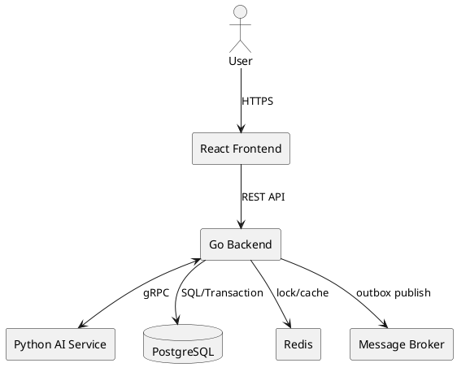
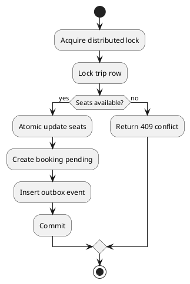
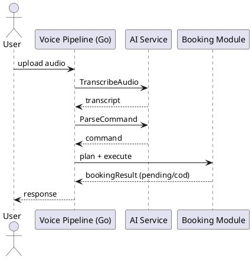

---
tags:
  - report
  - final
  - academic
  - validation
created: 2026-04-01
updated: 2026-04-01
---

# FINAL PROJECT REPORT

## HỆ THỐNG ĐẶT VÉ XE LIÊN TỈNH TÍCH HỢP AI CHAT/VOICE

---

## Acknowledgement

Nhóm xin trân trọng cảm ơn giảng viên hướng dẫn và các bên liên quan đã hỗ trợ trong toàn bộ quá trình phân tích, triển khai và kiểm thử đề tài. Các góp ý phản biện về nghiệp vụ, kiến trúc và bảo đảm chất lượng đã giúp nhóm hoàn thiện hệ thống theo hướng đồng bộ giữa tài liệu học thuật và hiện thực kỹ thuật.

---

## Definitions and Acronyms

| Term | Meaning |
|---|---|
| SRS | Software Requirement Specification |
| SDD | Software Design Description |
| UC | Use Case |
| RTM | Requirement Traceability Matrix |
| COD | Cash On Delivery |
| DFD | Data Flow Diagram |
| ERD | Entity Relationship Diagram |
| E2E | End-to-End |

---

## I. Executive Summary

Đề tài hiện thực hệ thống đặt vé xe liên tỉnh tích hợp AI theo triết lý *AI-assisted, business-deterministic*. Kết quả đạt được tập trung vào ba trục chính:

- Tăng độ tin cậy nghiệp vụ booking trong bối cảnh đồng thời.
- Cải thiện trải nghiệm tìm và đặt vé qua chat/voice.
- Duy trì truy vết từ yêu cầu học thuật đến implementation thực tế.

Mục tiêu của báo cáo tổng kết là trình bày minh chứng kỹ thuật và kiểm thử để chứng minh mức độ đáp ứng yêu cầu đã xác lập ở Report 3 [1], [2].

---

## II. Architecture and Design Realization

### 1. Implemented Architecture

### 2. Design Principles Applied

- Tách ranh giới module theo dependency một chiều.
- Domain logic tập trung ở backend Go.
- AI service chỉ thực hiện NLP/parsing, không tự quyết định transaction nghiệp vụ.
- Side effects bất đồng bộ được xử lý bằng outbox + worker.

### 3. Core Realized Flows

#### 3.1 Booking Consistency Flow

#### 3.2 Voice Execute Flow

#### 3.3 Chat Clarification Rule

Hệ thống quy định chat clarification chỉ trong booking scope với thứ tự:

1. `origin`
2. `destination`
3. `date`
4. `time`
5. `budget`

Quy tắc này giúp giảm drift hội thoại và tăng xác suất hoàn tất use case đặt vé.

---

## III. Implementation Outcomes by Module

### 1. Auth Module

- JWT login/refresh/logout.
- Middleware RBAC cho endpoint bảo vệ.

### 2. Trip Module

- Search/filter/pagination.
- Quản lý status theo state machine cho admin.

### 3. Booking Module

- Create/cancel lifecycle.
- Payment webhook handling.
- Expiry worker.
- Voice execute hỗ trợ bắt buộc `COD/pending`.

### 4. AI Agent Module

- gRPC integration cho chat/voice.
- Missing-field clarification theo policy cố định.
- Suggestion orchestration sau khi đủ trường.

### 5. Admin Master Data Modules

- CRUD cho provider, bus_type, bus, location.

---

## IV. Testing and Validation

### 1. Verification Strategy

- Unit test cho domain/usecase quan trọng.
- Integration test cho endpoint và tương tác module.
- E2E smoke test cho critical path chat/voice booking.

### 2. Representative Validation Cases

| Case | Input | Expected | Result |
|---|---|---|---|
| Voice execute booking | Audio command đầy đủ | Booking `pending/cod` được tạo | Pass |
| Chat thiếu `date` | User message thiếu ngày | Hệ thống hỏi `date` | Pass |
| Concurrent seat booking | 2 request cùng ghế | 1 success, 1 conflict | Pass |

### 3. Data Quality Hardening

Trong giai đoạn hardening, nhóm thực hiện audit và hiệu chỉnh dữ liệu lịch sử để phục hồi các bất biến nghiệp vụ (seat consistency, payment-state alignment, trip time validity). Sau xử lý, các luồng chính vận hành ổn định theo tiêu chí kiểm thử đã định nghĩa.

---

## V. Discussion

### 1. What Worked Well

- Tách AI parsing khỏi business core giúp giảm rủi ro nghiệp vụ.
- Voice-first flow tăng tốc độ tạo booking trong kịch bản thực hành.
- Outbox pattern giảm nguy cơ mất sự kiện khi broker lỗi tạm thời.

### 2. Remaining Trade-offs

- Chất lượng parse chat phụ thuộc model và prompt governance.
- Dữ liệu thử nghiệm cục bộ chưa phản ánh hoàn toàn cao điểm mùa vụ.

### 3. Threats to Validity

- Độ trễ môi trường local thấp hơn thực tế production.
- Mẫu tải kiểm thử chưa bao phủ toàn bộ hành vi người dùng dài hạn.

---

## VI. Conclusion and Future Work

### 1. Conclusion

Hệ thống đạt mục tiêu release cho nhóm chức năng cốt lõi và độ tin cậy nghiệp vụ. AI được tích hợp theo hướng có kiểm soát, đóng vai trò tăng khả năng hoàn tất tác vụ thay vì thay thế quyết định nghiệp vụ của backend.

### 2. Future Work

- Nâng cấp recommendation ranking theo dữ liệu hành vi.
- Bổ sung observability dashboard cho AI latency và booking conversion.
- Xây dựng bộ benchmark kiểm thử cho tuyến cao điểm.

---

## References

[1] ISO/IEC/IEEE 29148:2018, *Requirements engineering*.

[2] R. Pressman and B. Maxim, *Software Engineering: A Practitioner’s Approach*.

[3] A. Cockburn, *Writing Effective Use Cases*.

[4] M. Fowler, *Patterns of Enterprise Application Architecture*.
