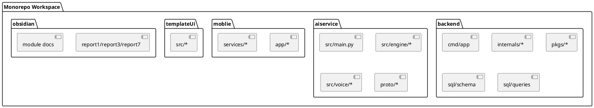
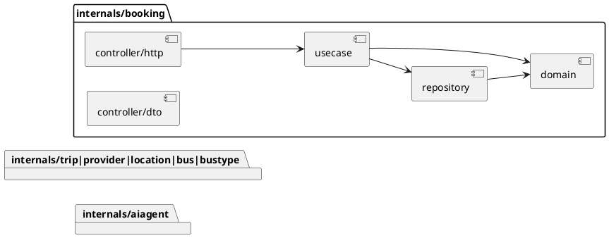
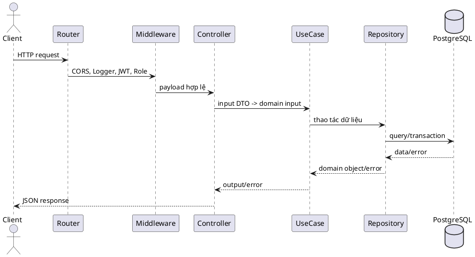
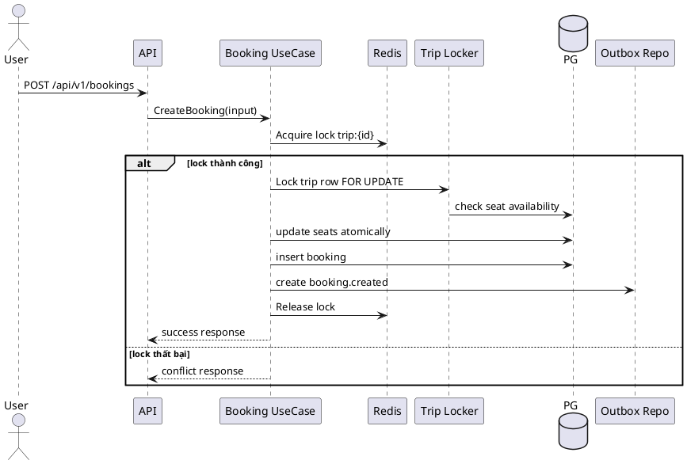
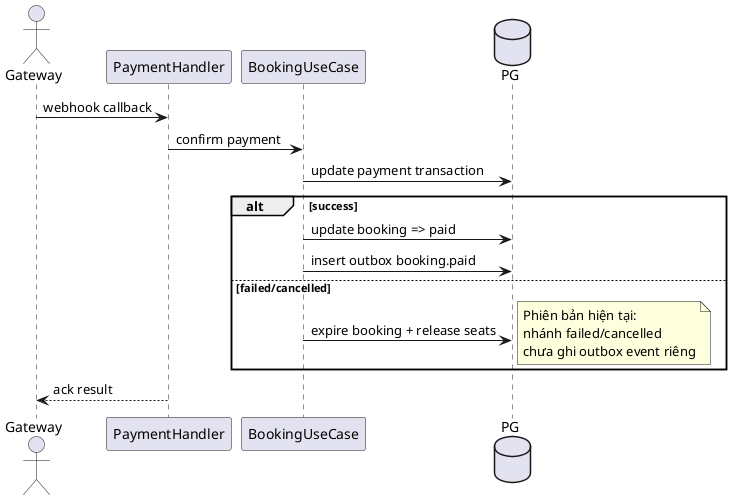
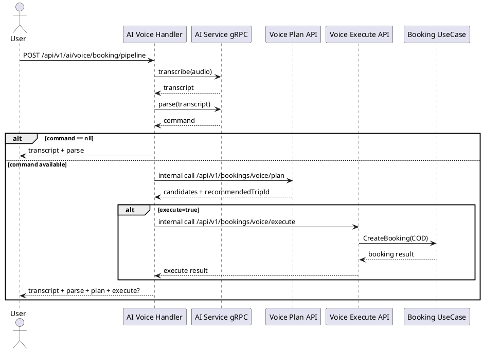
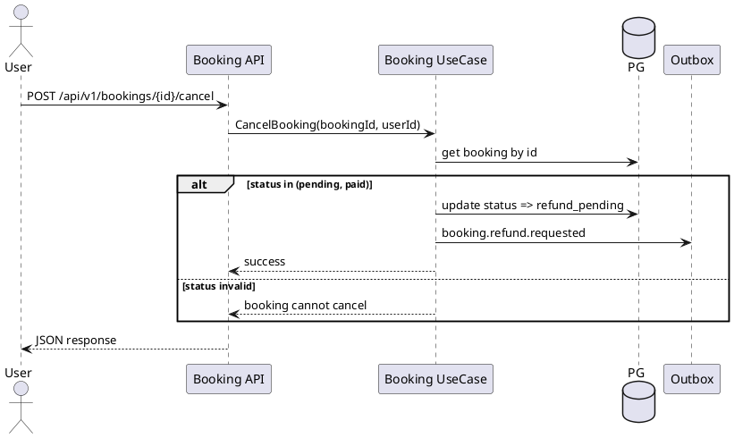
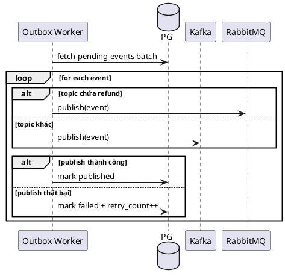
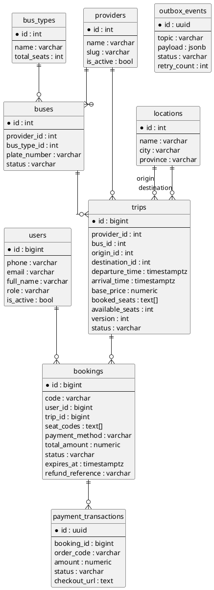
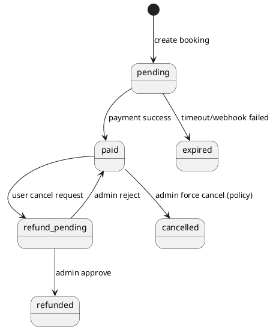

---
tags:
  - report
  - report7
  - final
  - backend
created: 2026-04-01
updated: 2026-04-01
---

# BÁO CÁO ĐỒ ÁN TỐT NGHIỆP (FINAL)

## Phiên bản Backend - Hệ thống đặt vé xe liên tỉnh tích hợp AI Chat/Voice

---

## I. Lịch sử thay đổi

| Ngày | Loại | Người thực hiện | Nội dung |
|---|---|---|---|
| 2026-04-01 | A | Nhóm dự án | Tạo báo cáo tổng kết backend |
| 2026-04-01 | M | Nhóm dự án | Bổ sung phần quản lý dự án và kiểm thử |
| 2026-04-01 | M | Nhóm dự án | Bổ sung Chương 3 cơ sở lý thuyết công nghệ |
| 2026-04-01 | M | Nhóm dự án | Bổ sung Chương 4 thiết kế, ERD, luồng monorepo + DDD |
| 2026-04-01 | M | Nhóm dự án | Chuyển toàn bộ nội dung sang tiếng Việt học thuật |

Quy ước:

- `A`: Added
- `M`: Modified
- `D`: Deleted

---

## II. Lời cảm ơn

Nhóm thực hiện xin trân trọng cảm ơn giảng viên hướng dẫn đã đồng hành xuyên suốt quá trình xác định bài toán, rà soát kiến trúc và phản biện các quyết định kỹ thuật quan trọng. Các góp ý chuyên môn đã giúp nhóm giữ được cân bằng giữa tính học thuật của đồ án và tính khả thi khi triển khai hệ thống backend thực tế.

Nhóm cũng cảm ơn các thành viên phụ trách từng mảng backend, AI service, kiểm thử và tài liệu đã phối hợp chặt chẽ để chuẩn hóa yêu cầu, triển khai đúng kiến trúc và hoàn thiện bộ báo cáo theo chuẩn đồ án.

---

## III. Thuật ngữ và chữ viết tắt

| Viết tắt | Diễn giải |
|---|---|
| API | Application Programming Interface |
| BR | Business Rule |
| COD | Cash On Delivery |
| DDD | Domain-Driven Design |
| EDA | Event-Driven Architecture |
| ERD | Entity Relationship Diagram |
| FR | Functional Requirement |
| NFR | Non-Functional Requirement |
| RBAC | Role-Based Access Control |
| RTM | Requirement Traceability Matrix |
| SRS | Software Requirement Specification |
| SSE | Server-Sent Events |
| STT | Speech-To-Text |
| UC | Use Case |
| VO | Value Object |

---

## CHƯƠNG 1. GIỚI THIỆU DỰ ÁN

### 1.1 Mục tiêu tổng thể

Xây dựng backend đặt vé xe liên tỉnh có độ tin cậy cao, hỗ trợ giao tiếp tự nhiên qua chat/voice nhưng vẫn bảo toàn luật nghiệp vụ và tính nhất quán giao dịch.

### 1.2 Mục tiêu kỹ thuật trọng tâm

1. Đảm bảo chống trùng ghế khi nhiều người dùng đặt cùng chuyến.
2. Đồng bộ trạng thái booking và payment khi callback trễ/lặp.
3. Chuẩn hóa quy trình refund có phê duyệt bởi admin/operator.
4. Tích hợp AI theo mô hình hỗ trợ (assistive) thay vì toàn quyền quyết định.
5. Tách side-effect qua outbox và worker nền để tăng khả năng phục hồi.

### 1.3 Đóng góp của bản backend

1. Đưa ra kiến trúc module hóa theo domain.
2. Mô hình hóa đầy đủ luồng booking/payment/refund/voice.
3. Chuẩn hóa API contract và kiểm thử theo rủi ro nghiệp vụ.

---

## CHƯƠNG 2. KẾ HOẠCH VÀ QUẢN LÝ DỰ ÁN

### 2.1 Cách tổ chức triển khai

Nhóm áp dụng cách làm lặp (iterative) theo mức độ rủi ro nghiệp vụ. Những luồng có nguy cơ sai lệch dữ liệu cao được triển khai và kiểm thử trước.

### 2.2 Các mốc triển khai

| Mốc | Trọng tâm | Đầu ra chính |
|---|---|---|
| M1 | Khởi tạo kiến trúc | Router, middleware, container dependency |
| M2 | Danh mục và chuyến | Provider/location/bus-type/bus/trip APIs |
| M3 | Booking core | Lock, atomic seat update, create/list/get/cancel |
| M4 | Payment/refund | Webhook, polling, approve/reject |
| M5 | AI voice/chat | Validate/transcribe/pipeline/execute |
| M6 | Reliability | Expiry worker, outbox processor |
| M7 | Test và tài liệu | Kịch bản kiểm thử + hoàn thiện báo cáo |

### 2.3 Ma trận vai trò

| Vai trò | Trách nhiệm |
|---|---|
| Product/BA | Phân rã use case, truy vết yêu cầu |
| Backend lead | Quyết định kiến trúc, bảo toàn luật domain |
| Backend developer | Triển khai controller/usecase/repository |
| AI developer | Triển khai AI service và hợp đồng gRPC |
| QA | Thiết kế và thực thi kịch bản kiểm thử |
| DevOps hỗ trợ | Cấu hình môi trường chạy và monitoring cơ bản |

### 2.4 Quản trị thay đổi

1. Mọi thay đổi ở booking/payment/refund phải có impact note.
2. Mọi endpoint mới phải có mô tả quyền truy cập.
3. Mọi thay đổi trạng thái domain phải cập nhật RTM.

---

## CHƯƠNG 3. CƠ SỞ LÝ THUYẾT VÀ CÔNG NGHỆ SỬ DỤNG

Chương này trình bày cơ sở học thuật cho từng công nghệ sử dụng trong hệ thống, gồm: khái niệm nền tảng, tiêu chí lựa chọn, cách áp dụng thực tế trong đề tài và các giới hạn cần kiểm soát.

### 3.1 Cơ sở lý thuyết kiến trúc DDD và phân lớp

#### 3.1.1 Cơ sở học thuật

Domain-Driven Design (DDD) đặt miền nghiệp vụ làm trung tâm, từ đó tổ chức mã nguồn theo bounded context và mô hình domain rõ ràng. Về lý thuyết, DDD giúp:

1. Giảm coupling giữa nghiệp vụ và hạ tầng.
2. Đồng bộ ngôn ngữ giữa đội kỹ thuật và nghiệp vụ (ubiquitous language).
3. Bảo đảm tính tiến hóa kiến trúc khi yêu cầu thay đổi theo thời gian.

#### 3.1.2 Tiêu chí lựa chọn

1. Bài toán có nhiều luật nghiệp vụ biến thiên (booking, payment, refund, voice execute).
2. Cần khả năng kiểm thử độc lập từng luồng nghiệp vụ.
3. Cần giảm rủi ro sửa một chức năng gây ảnh hưởng chéo toàn hệ thống.

#### 3.1.3 Cách áp dụng trong đề tài

1. `controller/http` xử lý biên và validation request.
2. `usecase` chứa orchestration và state transition.
3. `repository` làm việc với persistence.
4. `domain` mô tả entity, value object, domain error.

#### 3.1.4 Hạn chế và cách khắc phục

1. Hạn chế: chi phí thiết kế ban đầu cao hơn mô hình CRUD thuần.
2. Khắc phục: chuẩn hóa template module và quy tắc dependency từ đầu dự án.

### 3.2 Cơ sở lý thuyết Monorepo

#### 3.2.1 Cơ sở học thuật

Monorepo là chiến lược quản lý mã nguồn đa thành phần trong cùng repository. Lợi ích lý thuyết:

1. Tăng khả năng truy vết thay đổi xuyên dịch vụ.
2. Đồng nhất chuẩn coding, review và tài liệu.
3. Hạn chế drift giữa hợp đồng giao tiếp và phần triển khai.

#### 3.2.2 Tiêu chí lựa chọn

1. Dự án có backend Go, AI service Python, mobile/UI và tài liệu kỹ thuật.
2. Cần bảo đảm đồng bộ phiên bản tài liệu với code.
3. Cần quản lý workflow review theo feature xuyên nhiều thành phần.

#### 3.2.3 Cách áp dụng trong đề tài

1. `backend` chứa hệ thống API nghiệp vụ.
2. `aiservice` chứa pipeline chat/voice.
3. `obsidian` chứa tài liệu kỹ thuật và báo cáo.
4. Thực thi quy trình truy vết từ requirement -> endpoint -> usecase -> schema.

#### 3.2.4 Hạn chế và cách khắc phục

1. Hạn chế: repository lớn dễ tăng thời gian CI.
2. Khắc phục: chia workflow kiểm thử theo module và ưu tiên test mục tiêu.

### 3.3 Go (Golang)

#### 3.3.1 Cơ sở học thuật

Go là ngôn ngữ biên dịch tĩnh với mô hình goroutine và scheduler nhẹ, phù hợp dịch vụ mạng có tải đồng thời. Đặc điểm lý thuyết quan trọng:

1. Chi phí context switch thấp cho tác vụ IO-bound.
2. Binary độc lập, dễ đóng gói triển khai.
3. Toolchain chuẩn hóa (`go test`, `go vet`, module dependency).

#### 3.3.2 Tiêu chí lựa chọn

1. Backend cần xử lý nhiều request đồng thời.
2. Cần hiệu năng ổn định và footprint chạy dịch vụ thấp.
3. Cần tốc độ build nhanh cho vòng lặp phát triển.

#### 3.3.3 Cách áp dụng trong đề tài

1. Toàn bộ service core viết bằng Go.
2. Luồng booking/payment/refund được triển khai theo transaction-centric usecase.
3. Worker nền (expiry/outbox) chạy theo context cancellation và shutdown an toàn.

#### 3.3.4 Hạn chế và cách khắc phục

1. Hạn chế: thiếu generic rich utility như một số ngôn ngữ khác.
2. Khắc phục: tập trung thiết kế package chuẩn, tránh lạm dụng abstraction.

### 3.4 Gin Framework

#### 3.4.1 Cơ sở học thuật

Gin là framework HTTP tối ưu cho low-latency API, hỗ trợ route grouping và middleware chain. Đây là nền tảng phù hợp cho kiến trúc tách biên-request với nghiệp vụ.

#### 3.4.2 Tiêu chí lựa chọn

1. Cần pipeline middleware rõ ràng cho auth, role, logging.
2. Cần routing linh hoạt cho public/private/admin endpoints.
3. Cần hiệu năng cao với chi phí phát triển thấp.

#### 3.4.3 Cách áp dụng trong đề tài

1. Tiền tố API thống nhất là `/api/v1`.
2. Route group chia public, authenticated, admin/operator.
3. Middleware JWT và role middleware áp dụng theo phạm vi endpoint.

#### 3.4.4 Hạn chế và cách khắc phục

1. Hạn chế: nếu để business logic ở handler sẽ làm phình controller.
2. Khắc phục: quy định controller chỉ làm DTO mapping và gọi usecase.

### 3.5 PostgreSQL

#### 3.5.1 Cơ sở học thuật

PostgreSQL hỗ trợ ACID transaction, MVCC và row-level lock, phù hợp bài toán cần nhất quán cao. Với nghiệp vụ đặt vé, yếu tố lock và transaction là nền tảng chống race condition.

#### 3.5.2 Tiêu chí lựa chọn

1. Cần transaction mạnh cho booking và payment reconciliation.
2. Cần mô hình quan hệ rõ ràng cho dữ liệu giao dịch.
3. Cần khả năng mở rộng truy vấn bằng chỉ mục có chọn lọc.

#### 3.5.3 Cách áp dụng trong đề tài

1. `SELECT ... FOR UPDATE` trên bản ghi trip trong luồng booking.
2. Lưu trữ trạng thái booking/payment bằng state transition có kiểm soát.
3. Tối ưu truy vấn bằng index tuyến-ngày, pending booking, pending outbox.

#### 3.5.4 Hạn chế và cách khắc phục

1. Hạn chế: lock contention tăng khi nhiều request cùng `tripId`.
2. Khắc phục: kết hợp lock Redis theo trip và transaction DB ngắn gọn.

### 3.6 Redis

#### 3.6.1 Cơ sở học thuật

Redis là in-memory key-value store có độ trễ thấp, phù hợp cho lock phân tán và dữ liệu phiên ngắn hạn.

#### 3.6.2 Tiêu chí lựa chọn

1. Cần distributed lock ở lớp ngoài DB để giảm contention.
2. Cần thao tác key TTL cho cơ chế hết hạn tự nhiên.

#### 3.6.3 Cách áp dụng trong đề tài

1. Dùng lock theo khóa `trip:{id}` trước khi vào transaction booking.
2. Dùng cache/token management cho luồng xác thực.

#### 3.6.4 Hạn chế và cách khắc phục

1. Hạn chế: lock có thể rơi vào trạng thái hết hạn giữa chừng nếu TTL quá ngắn.
2. Khắc phục: chọn TTL theo đặc tính transaction và release lock theo finally block.

### 3.7 Kafka

#### 3.7.1 Cơ sở học thuật

Kafka phù hợp cho streaming event throughput cao, decouple producer-consumer, hỗ trợ scale consumer theo partition.

#### 3.7.2 Tiêu chí lựa chọn

1. Cần phát event booking lifecycle cho nhiều downstream độc lập.
2. Cần khả năng mở rộng xử lý bất đồng bộ.

#### 3.7.3 Cách áp dụng trong đề tài

1. Event booking tổng quát publish qua Kafka.
2. Worker outbox đảm bảo publish sau commit DB.

#### 3.7.4 Hạn chế và cách khắc phục

1. Hạn chế: cấu hình vận hành phức tạp hơn queue đơn giản.
2. Khắc phục: giới hạn topic chuẩn và chuẩn hóa payload event versioning.

### 3.8 RabbitMQ

#### 3.8.1 Cơ sở học thuật

RabbitMQ theo mô hình broker queue với exchange-routing, phù hợp các luồng cần điều phối theo hàng đợi tách biệt.

#### 3.8.2 Tiêu chí lựa chọn

1. Luồng refund cần tách riêng khỏi traffic booking phổ thông.
2. Cần mô hình queue linh hoạt cho tác vụ nghiệp vụ chuyên biệt.

#### 3.8.3 Cách áp dụng trong đề tài

1. Event liên quan refund được route qua RabbitMQ.
2. Outbox worker chọn broker theo `topic`.

#### 3.8.4 Hạn chế và cách khắc phục

1. Hạn chế: thêm một hệ broker làm tăng độ phức tạp vận hành.
2. Khắc phục: thống nhất quy tắc phân luồng topic và cấu hình retry.

### 3.9 gRPC và Protocol Buffers

#### 3.9.1 Cơ sở học thuật

gRPC dùng HTTP/2 và protobuf giúp service-to-service communication có contract rõ, payload gọn, hiệu năng tốt.

#### 3.9.2 Tiêu chí lựa chọn

1. Cần contract chặt chẽ giữa backend Go và AI service Python.
2. Cần giảm độ mơ hồ so với tích hợp JSON tự do.

#### 3.9.3 Cách áp dụng trong đề tài

1. Định nghĩa proto cho chat, transcribe, parse command.
2. Backend gọi AI service theo client stub sinh từ protobuf.

#### 3.9.4 Hạn chế và cách khắc phục

1. Hạn chế: quy trình thay đổi schema cần kỷ luật versioning.
2. Khắc phục: áp dụng backward compatibility cho field protobuf.

### 3.10 FastAPI/Python cho AI service

#### 3.10.1 Cơ sở học thuật

FastAPI dựa trên type hint và validation schema, phù hợp dịch vụ AI cần tốc độ phát triển nhanh và định nghĩa dữ liệu rõ ràng.

#### 3.10.2 Tiêu chí lựa chọn

1. Ecosystem Python thuận lợi cho NLP/STT.
2. Dễ tích hợp pipeline xử lý ngôn ngữ và logic parse.

#### 3.10.3 Cách áp dụng trong đề tài

1. AI service xử lý transcript, parse command, clarification.
2. Kết quả trả về có cấu trúc để backend kiểm soát execute booking.

#### 3.10.4 Hạn chế và cách khắc phục

1. Hạn chế: chất lượng STT phụ thuộc môi trường âm thanh.
2. Khắc phục: thêm bước validate và missing-fields clarification trước execute.

### 3.11 JWT và RBAC

#### 3.11.1 Cơ sở học thuật

JWT là cơ chế xác thực stateless dựa trên chữ ký, còn RBAC kiểm soát quyền theo vai trò. Kết hợp hai lớp này giúp cân bằng hiệu năng và bảo mật.

#### 3.11.2 Tiêu chí lựa chọn

1. Cần bảo vệ API private không phụ thuộc session server-side nặng.
2. Cần tách quyền user, admin, operator rõ ràng.

#### 3.11.3 Cách áp dụng trong đề tài

1. Public endpoint không yêu cầu JWT.
2. Endpoint người dùng yêu cầu JWT hợp lệ.
3. Endpoint quản trị yêu cầu JWT và role guard.

#### 3.11.4 Hạn chế và cách khắc phục

1. Hạn chế: token bị lộ có thể bị lạm dụng trong thời hạn còn hiệu lực.
2. Khắc phục: cấu hình TTL hợp lý, refresh flow, blacklist khi logout.

### 3.12 Outbox Pattern

#### 3.12.1 Cơ sở học thuật

Outbox pattern giải quyết bài toán dual-write giữa DB và message broker bằng cơ chế ghi sự kiện cùng transaction nghiệp vụ rồi publish bất đồng bộ.

#### 3.12.2 Tiêu chí lựa chọn

1. Cần bảo đảm event không mất khi hệ thống lỗi sau commit DB.
2. Cần tách side-effect khỏi transaction đồng bộ để giảm độ trễ API.

#### 3.12.3 Cách áp dụng trong đề tài

1. Ghi `booking.created`, `booking.paid`, `booking.expired`, `booking.refund.*` vào bảng outbox.
2. Worker poll theo batch, publish broker, đánh dấu `published` hoặc `failed`.

#### 3.12.4 Hạn chế và cách khắc phục

1. Hạn chế: có độ trễ nhỏ giữa commit và thời điểm consumer nhận event.
2. Khắc phục: tuning polling interval, retry policy và dashboard backlog.

### 3.13 SSE và quan sát vận hành

#### 3.13.1 Cơ sở học thuật

SSE (Server-Sent Events) là cơ chế push một chiều từ server đến client qua HTTP connection lâu dài, phù hợp dashboard cần cập nhật gần thời gian thực.

#### 3.13.2 Áp dụng trong đề tài

SSE được dùng cho luồng vận hành admin như theo dõi refund/booking event stream, hỗ trợ thao tác điều hành nhanh hơn mà không cần polling dày.

### 3.14 Docker Compose

#### 3.14.1 Cơ sở học thuật

Container orchestration mức local/staging bằng Docker Compose giúp chuẩn hóa môi trường chạy đa dịch vụ, giảm khác biệt giữa máy phát triển và môi trường kiểm thử.

#### 3.14.2 Áp dụng trong đề tài

Compose dùng để dựng nhanh PostgreSQL, Redis, Kafka, RabbitMQ, backend và AI service, giúp tái lập kiểm thử tích hợp ổn định.

### 3.15 Bảng tổng hợp công nghệ và vai trò trong hệ thống

| Công nghệ | Vai trò kiến trúc | Lý do chọn chính |
|---|---|---|
| Go + Gin | API backend cốt lõi | Hiệu năng, middleware rõ, dễ vận hành |
| PostgreSQL | Nguồn dữ liệu giao dịch | ACID, lock mạnh, mô hình quan hệ rõ |
| Redis | Lock/caching | Độ trễ thấp, phù hợp lock phân tán |
| Kafka | Event booking tổng quát | Streaming, scale consumer |
| RabbitMQ | Event refund chuyên biệt | Routing queue linh hoạt |
| gRPC + Protobuf | Hợp đồng backend-AI | Contract rõ, payload gọn |
| FastAPI/Python | AI chat/voice service | Ecosystem NLP/STT mạnh |
| JWT + RBAC | Xác thực và phân quyền | Cân bằng bảo mật và hiệu năng |
| Outbox | Đảm bảo dual-write an toàn | Tăng độ tin cậy tích hợp sự kiện |
| Docker Compose | Chuẩn hóa môi trường | Dễ tái lập môi trường kiểm thử |

### 3.16 Thảo luận trade-off kỹ thuật

1. DDD tăng chi phí thiết kế ban đầu nhưng giảm nợ kỹ thuật dài hạn.
2. Monorepo tăng kích thước repository nhưng tối ưu truy vết thay đổi xuyên thành phần.
3. Dùng hai broker (Kafka + RabbitMQ) tăng phức tạp vận hành nhưng linh hoạt theo loại sự kiện.
4. AI pipeline tăng trải nghiệm người dùng nhưng bắt buộc có lớp validate nghiệp vụ ở backend.
5. Outbox tăng thêm thành phần worker nhưng giảm rủi ro mất sự kiện hậu giao dịch.

---

## CHƯƠNG 4. PHÂN TÍCH, THIẾT KẾ VÀ TRIỂN KHAI HỆ THỐNG

Đây là chương trọng tâm của báo cáo, mô tả trực tiếp cấu trúc code, mô hình monorepo + DDD, sơ đồ ERD và luồng chạy code thực tế.

### 4.1 Cấu trúc monorepo của dự án



Ý nghĩa kiến trúc monorepo trong đề tài:

1. Liên kết tài liệu và code trong một không gian thống nhất.
2. Dễ truy vết từ requirement -> endpoint -> module code.
3. Dễ quản lý chuẩn coding giữa các thành phần.

#### 4.1.1 Cây thư mục triển khai thực tế (rút gọn)

```text
dadpt/
  backend/
    cmd/app/
    configs/
    di/
    internals/
      auth/
      booking/
      trip/
      provider/
      location/
      bus/
      bustype/
      aiagent/
      upload/
    pkgs/
      middlewares/
      messaging/
      logger/
      redis/
      kafka/
      rabbitmq/
    sql/
      schema/
      queries/
  aiservice/
    proto/
    src/
      main.py
      grpc_server/
      voice/
      engine/
  moblie/
  templateUi/
  obsidian/
```

#### 4.1.2 Nguyên tắc tổ chức code trong monorepo

1. Quy tắc theo miền: module nghiệp vụ không phụ thuộc trực tiếp lẫn nhau qua lớp controller.
2. Quy tắc theo tầng: controller -> usecase -> repository/domain.
3. Quy tắc theo biên tích hợp: mọi tích hợp ngoài (AI, broker, payment) đi qua abstraction rõ.
4. Quy tắc tài liệu hóa: mọi thay đổi nghiệp vụ phải cập nhật SRS/Final report đồng thời.

### 4.2 Mô hình DDD theo module backend



Quy tắc phụ thuộc:

1. Controller không được chứa luật nghiệp vụ phức tạp.
2. UseCase không phụ thuộc framework HTTP.
3. Domain không phụ thuộc hạ tầng ngoài.

#### 4.2.1 Bản đồ bounded context và trách nhiệm

| Bounded context | Trách nhiệm lõi | Thành phần chính |
|---|---|---|
| Auth | Danh tính, xác thực, phân quyền | `auth/controller`, `auth/usecase`, `middlewares/jwt` |
| Catalog | Danh mục provider/location/bus-type/bus | `provider/*`, `location/*`, `bus/*`, `bustype/*` |
| Trip | Lịch chạy, tìm chuyến, trạng thái chuyến | `trip/controller`, `trip/usecase`, `trip/repository` |
| Booking | Đặt vé, hủy, refund, payment sync | `booking/usecase`, `booking/repository`, `booking/controller/http` |
| AI Agent | Chat/voice bridge và execute booking | `aiagent/controller/http`, `aiagent/usecase` |
| Integration | Outbox, broker publish, worker nền | `pkgs/messaging/outbox`, `booking/usecase/expiry_worker` |

### 4.3 Sơ đồ luồng chạy code (runtime flow)

#### 4.3.1 Luồng request chuẩn từ API đến DB



#### 4.3.2 Luồng booking an toàn đồng thời



#### 4.3.3 Luồng payment webhook và hòa giải trạng thái



#### 4.3.4 Luồng voice pipeline đến execute booking



#### 4.3.5 Luồng hủy booking sang refund pending



#### 4.3.6 Luồng outbox publish sự kiện



### 4.4 ERD chi tiết và diễn giải

#### 4.4.1 Sơ đồ ERD



#### 4.4.2 Diễn giải quan hệ cốt lõi

1. Một `trip` thuộc một `provider` và một `bus` cụ thể.
2. Một `booking` gắn với một `user` và một `trip`.
3. Một `booking` có thể có một hoặc nhiều bản ghi `payment_transactions` theo vòng đời xử lý.
4. `outbox_events` lưu dấu toàn bộ sự kiện domain trước khi publish.

#### 4.4.3 Quy tắc nhất quán dữ liệu

1. `available_seats` trong `trips` phải khớp với dữ liệu ghế đã đặt.
2. Không cho phép trạng thái booking chuyển trái luật (state machine guard).
3. Approve refund bắt buộc booking đang ở `refund_pending`.

#### 4.4.4 Data dictionary mở rộng cho bảng trọng yếu

##### Bảng `trips`

| Cột | Kiểu dữ liệu | Quy tắc |
|---|---|---|
| `origin_id`, `destination_id` | INT | Bắt buộc khác nhau |
| `booked_seats` | TEXT[] | Chỉ thêm ghế sau khi kiểm tra availability |
| `available_seats` | INT | Luôn >= 0 |
| `version` | INT | Tăng theo mỗi lần cập nhật ghế |

##### Bảng `bookings`

| Cột | Kiểu dữ liệu | Quy tắc |
|---|---|---|
| `code` | VARCHAR | Duy nhất toàn hệ thống |
| `seat_codes` | TEXT[] | Không rỗng, không vượt quá 4 ghế |
| `status` | VARCHAR | Chuyển trạng thái theo state machine |
| `expires_at` | TIMESTAMPTZ | Chỉ dùng với booking pending |
| `refund_reference` | VARCHAR | Bắt buộc khi approve refund theo policy |

##### Bảng `payment_transactions`

| Cột | Kiểu dữ liệu | Quy tắc |
|---|---|---|
| `order_code` | VARCHAR | Duy nhất theo giao dịch gateway |
| `status` | VARCHAR | `pending/success/failed/cancelled` |
| `checkout_url` | TEXT | Tồn tại khi tạo payment link thành công |
| `webhook_data` | JSONB | Lưu payload callback cho audit |

##### Bảng `outbox_events`

| Cột | Kiểu dữ liệu | Quy tắc |
|---|---|---|
| `topic` | VARCHAR | Quyết định tuyến broker publish |
| `payload` | JSONB | Tương thích version consumer |
| `status` | VARCHAR | `pending/published/failed` |
| `retry_count` | INT | Tăng khi publish thất bại |

#### 4.4.5 Chỉ mục và hiệu năng truy vấn

1. Chỉ mục tìm chuyến theo tuyến-ngày giúp tối ưu truy vấn browse/search.
2. Chỉ mục partial trên booking pending giúp worker expire quét nhanh.
3. Chỉ mục order_code giúp đối soát thanh toán O(log n).
4. Chỉ mục outbox pending giúp giảm độ trễ phát sự kiện.

### 4.5 Mô hình trạng thái booking



### 4.6 Bảng ánh xạ yêu cầu sang triển khai

| Yêu cầu | Thành phần triển khai | Trạng thái |
|---|---|---|
| Chống trùng ghế | Booking usecase + trip locker + Redis lock | Hoàn thành |
| Hòa giải thanh toán | Payment handler + confirm payment usecase | Hoàn thành |
| Quản lý hoàn tiền | Admin refund endpoints + transition guards | Hoàn thành |
| Voice booking có kiểm soát | Validate/pipeline/execute endpoints | Hoàn thành |
| Tách side-effect bất đồng bộ | Outbox table + processor worker | Hoàn thành |

### 4.7 Đặc tả chức năng dạng bảng (UI + UC)

Mục này được chuẩn hóa theo phong cách tài liệu khóa trước: mỗi chức năng đều có 2 phần cố định.

1. `a. UI Specifications` (hoặc `Integration Specifications` với luồng hệ thống - hệ thống).
2. `b. UC Specifications` (metadata + luồng chính + luồng thay thế + ngoại lệ).

#### 4.7.1 Danh mục chức năng được đặc tả

| Mã | Chức năng | Nhóm |
|---|---|---|
| CM1 | Đăng ký tài khoản | Quản lý người dùng |
| CM2 | Đăng nhập | Quản lý người dùng |
| TR1 | Tìm chuyến | Quản lý chuyến |
| BK1 | Tạo booking | Đặt vé |
| BK2 | Xem booking của tôi | Đặt vé |
| BK3 | Hủy booking | Đặt vé |
| PM1 | Callback thanh toán | Thanh toán |
| PM2 | Duyệt hoàn tiền | Thanh toán |
| AI1 | Chat tư vấn hành trình | AI |
| AI2 | Voice booking pipeline | AI |
| BG1 | Worker hết hạn booking | Nền hệ thống |
| BG2 | Worker publish outbox | Nền hệ thống |

#### 4.7.2 CM1 - Đăng ký tài khoản

##### a. UI Specifications

Màn hình này cho phép Khách:

1. Tạo tài khoản bằng số điện thoại và mật khẩu.

Mô tả trường dữ liệu:

| Tên trường | Mô tả |
|---|---|
| Full Name | Họ tên người dùng |
| Phone | Số điện thoại đăng ký |
| Email | Email liên hệ (tùy chọn) |
| Password | Mật khẩu theo chính sách bảo mật |
| Confirm Password | Nhập lại mật khẩu |
| Register | Nút gửi đăng ký |

##### b. UC Specifications

| Thuộc tính | Giá trị | Thuộc tính | Giá trị |
|---|---|---|---|
| ID and Name | CM1 - Đăng ký tài khoản | Created By | Nhóm Backend |
| Date Created | 01/04/2026 | Primary Actor | Khách |
| Secondary Actors | Auth Service | Trigger | Người dùng nhấn `Register` |
| Description | Tạo tài khoản người dùng mới | Preconditions | Phone chưa tồn tại |
| Postconditions | Tài khoản được tạo thành công | Business Rules | BR-01 |

Luồng chính:

| Step | Step Details |
|---|---|
| 1 | Người dùng mở trang đăng ký |
| 2 | Người dùng nhập thông tin bắt buộc |
| 3 | Hệ thống validate dữ liệu |
| 4 | Hệ thống kiểm tra trùng số điện thoại |
| 5 | Hệ thống tạo tài khoản mới |
| 6 | Hệ thống hiển thị thông báo thành công |

Ngoại lệ:

| Mã lỗi | Chi tiết |
|---|---|
| CM1E1 | Số điện thoại đã tồn tại |
| CM1E2 | Payload không hợp lệ |

#### 4.7.3 CM2 - Đăng nhập

##### a. UI Specifications

Màn hình này cho phép Người dùng:

1. Đăng nhập hệ thống bằng phone/password.

Mô tả trường dữ liệu:

| Tên trường | Mô tả |
|---|---|
| Phone | Số điện thoại đăng nhập |
| Password | Mật khẩu |
| Login | Nút xác thực |

##### b. UC Specifications

| Thuộc tính | Giá trị | Thuộc tính | Giá trị |
|---|---|---|---|
| ID and Name | CM2 - Đăng nhập | Created By | Nhóm Backend |
| Date Created | 01/04/2026 | Primary Actor | Người dùng |
| Secondary Actors | Auth Service | Trigger | Người dùng nhấn `Login` |
| Description | Cấp access token và refresh token | Preconditions | Tài khoản active |
| Postconditions | Phiên đăng nhập hợp lệ được tạo | Business Rules | BR-01 |

Luồng chính:

| Step | Step Details |
|---|---|
| 1 | Người dùng nhập phone/password |
| 2 | Hệ thống xác thực thông tin |
| 3 | Hệ thống phát token |
| 4 | Người dùng được chuyển đến trang chính |

Ngoại lệ:

| Mã lỗi | Chi tiết |
|---|---|
| CM2E1 | Sai tài khoản hoặc mật khẩu |
| CM2E2 | Tài khoản không hoạt động |

#### 4.7.4 TR1 - Tìm chuyến

##### a. UI Specifications

Màn hình này cho phép Khách/Người dùng:

1. Tìm chuyến theo tuyến, ngày đi và số ghế.

Mô tả trường dữ liệu:

| Tên trường | Mô tả |
|---|---|
| Origin | Điểm đi |
| Destination | Điểm đến |
| Departure Date | Ngày đi |
| Seat Count | Số ghế mong muốn |
| Search | Nút tìm chuyến |

##### b. UC Specifications

| Thuộc tính | Giá trị | Thuộc tính | Giá trị |
|---|---|---|---|
| ID and Name | TR1 - Tìm chuyến | Created By | Nhóm Backend |
| Date Created | 01/04/2026 | Primary Actor | Khách, Người dùng |
| Secondary Actors | Trip Service | Trigger | Người dùng nhấn `Search` |
| Description | Truy vấn danh sách chuyến theo bộ lọc | Preconditions | Origin/Destination hợp lệ |
| Postconditions | Danh sách chuyến được trả về | Business Rules | BR-01 |

Luồng chính:

| Step | Step Details |
|---|---|
| 1 | Người dùng nhập điều kiện tìm kiếm |
| 2 | Hệ thống validate query |
| 3 | Hệ thống truy vấn DB theo tuyến-ngày |
| 4 | Hệ thống trả danh sách chuyến |

Ngoại lệ:

| Mã lỗi | Chi tiết |
|---|---|
| TR1E1 | Bộ lọc không hợp lệ |

#### 4.7.5 BK1 - Tạo booking

##### a. UI Specifications

Màn hình này cho phép Người dùng:

1. Chọn ghế và tạo booking.

Mô tả trường dữ liệu:

| Tên trường | Mô tả |
|---|---|
| Passenger Name | Tên hành khách |
| Passenger Phone | Số điện thoại hành khách |
| Seat Codes | Danh sách ghế |
| Pickup Point | Điểm đón |
| Dropoff Point | Điểm trả |
| Payment Method | `cod` hoặc `bank_transfer` |
| Confirm Booking | Nút xác nhận |

##### b. UC Specifications

| Thuộc tính | Giá trị | Thuộc tính | Giá trị |
|---|---|---|---|
| ID and Name | BK1 - Tạo booking | Created By | Nhóm Backend |
| Date Created | 01/04/2026 | Primary Actor | Người dùng |
| Secondary Actors | Redis, Payment Gateway | Trigger | Người dùng nhấn `Confirm Booking` |
| Description | Tạo booking an toàn đồng thời | Preconditions | JWT hợp lệ, seat hợp lệ |
| Postconditions | Booking tạo ở trạng thái `pending` | Business Rules | BR-02, BR-03, BR-04, BR-05, BR-06 |

Luồng chính:

| Step | Step Details |
|---|---|
| 1 | API nhận payload đặt vé |
| 2 | Validate luật số ghế và ghế liền kề |
| 3 | Acquire lock theo `tripId` |
| 4 | Lock trip row, kiểm tra ghế trống |
| 5 | Cập nhật ghế và tạo booking |
| 6 | Tạo payment transaction khi cần |
| 7 | Ghi outbox event |
| 8 | Trả kết quả cho người dùng |

Luồng thay thế:

| Flow | Details |
|---|---|
| AF1 | `payment_method=cod`: không tạo payment link |

Ngoại lệ:

| Mã lỗi | Chi tiết |
|---|---|
| BK1E1 | Lock timeout/conflict |
| BK1E2 | Ghế không khả dụng |
| BK1E3 | Tạo payment link thất bại |

#### 4.7.6 BK2 - Xem booking của tôi

##### a. UI Specifications

Màn hình này cho phép Người dùng:

1. Xem toàn bộ lịch sử booking theo tài khoản đăng nhập.

Mô tả trường dữ liệu:

| Tên trường | Mô tả |
|---|---|
| Booking Code | Mã booking |
| Trip Summary | Tuyến, giờ khởi hành |
| Seat Codes | Danh sách ghế |
| Status | Trạng thái booking |
| Payment Summary | Trạng thái thanh toán |
| View Detail | Nút xem chi tiết |

##### b. UC Specifications

| Thuộc tính | Giá trị | Thuộc tính | Giá trị |
|---|---|---|---|
| ID and Name | BK2 - Xem booking của tôi | Created By | Nhóm Backend |
| Date Created | 01/04/2026 | Primary Actor | Người dùng |
| Secondary Actors | Booking Service | Trigger | Người dùng mở trang `My Bookings` |
| Description | Truy vấn danh sách booking theo user hiện tại | Preconditions | Người dùng đã đăng nhập |
| Postconditions | Danh sách booking hiển thị đầy đủ | Business Rules | BR-01 |

Luồng chính:

| Step | Step Details |
|---|---|
| 1 | Người dùng truy cập trang lịch sử booking |
| 2 | Hệ thống xác thực JWT |
| 3 | Hệ thống truy vấn booking theo `user_id` |
| 4 | Hệ thống trả danh sách có phân trang |

Ngoại lệ:

| Mã lỗi | Chi tiết |
|---|---|
| BK2E1 | Token không hợp lệ hoặc hết hạn |

#### 4.7.7 BK3 - Hủy booking

##### a. UI Specifications

Màn hình này cho phép Người dùng:

1. Gửi yêu cầu hủy booking.

Mô tả trường dữ liệu:

| Tên trường | Mô tả |
|---|---|
| Booking Code | Mã booking cần hủy |
| Cancel Reason | Lý do hủy |
| Confirm Cancel | Nút xác nhận hủy |

##### b. UC Specifications

| Thuộc tính | Giá trị | Thuộc tính | Giá trị |
|---|---|---|---|
| ID and Name | BK3 - Hủy booking | Created By | Nhóm Backend |
| Date Created | 01/04/2026 | Primary Actor | Người dùng |
| Secondary Actors | Booking Service | Trigger | Người dùng nhấn `Confirm Cancel` |
| Description | Chuyển booking hợp lệ sang `refund_pending` | Preconditions | Booking thuộc user và được phép hủy |
| Postconditions | Trạng thái booking cập nhật thành công | Business Rules | BR-11 |

Luồng chính:

| Step | Step Details |
|---|---|
| 1 | Người dùng mở chi tiết booking |
| 2 | Người dùng xác nhận hủy |
| 3 | Hệ thống kiểm tra quyền và trạng thái |
| 4 | Hệ thống cập nhật `refund_pending` |
| 5 | Hệ thống ghi event `booking.refund.requested` |

Ngoại lệ:

| Mã lỗi | Chi tiết |
|---|---|
| BK3E1 | Booking không thuộc user |
| BK3E2 | Booking ở trạng thái không cho phép hủy |

#### 4.7.8 PM2 - Duyệt hoàn tiền

##### a. UI Specifications

Màn hình này cho phép Admin/Operator:

1. Duyệt hoặc từ chối yêu cầu hoàn tiền.

Mô tả trường dữ liệu:

| Tên trường | Mô tả |
|---|---|
| Booking Code | Mã booking cần xử lý |
| Refund Reference | Mã tham chiếu hoàn tiền |
| Confirm Code | Mã xác nhận nội bộ |
| Approve Refund | Nút duyệt hoàn tiền |
| Reject Refund | Nút từ chối hoàn tiền |

##### b. UC Specifications

| Thuộc tính | Giá trị | Thuộc tính | Giá trị |
|---|---|---|---|
| ID and Name | PM2 - Duyệt hoàn tiền | Created By | Nhóm Backend |
| Date Created | 01/04/2026 | Primary Actor | Admin, Operator |
| Secondary Actors | Booking Service, Outbox Worker | Trigger | Admin thao tác approve/reject |
| Description | Xử lý refund request theo quy trình kiểm soát | Preconditions | Booking đang `refund_pending` |
| Postconditions | Booking chuyển `refunded` hoặc quay lại `paid` | Business Rules | BR-12, BR-13 |

Luồng chính:

| Step | Step Details |
|---|---|
| 1 | Admin vào danh sách refund pending |
| 2 | Chọn booking cần xử lý |
| 3 | Nhập metadata và xác nhận thao tác |
| 4 | Hệ thống cập nhật trạng thái tương ứng |
| 5 | Hệ thống ghi event refund |

Ngoại lệ:

| Mã lỗi | Chi tiết |
|---|---|
| PM2E1 | Booking không đúng trạng thái xử lý |
| PM2E2 | Thiếu metadata yêu cầu |

#### 4.7.9 AI1 - Chat tư vấn hành trình

##### a. UI Specifications

Màn hình này cho phép Khách/Người dùng:

1. Đặt câu hỏi hội thoại và nhận phản hồi gợi ý tuyến/chuyến.

Mô tả trường dữ liệu:

| Tên trường | Mô tả |
|---|---|
| Message Input | Ô nhập nội dung hội thoại |
| Send | Nút gửi câu hỏi |
| Quick Suggestions | Nhóm câu hỏi gợi ý nhanh |
| Chat History | Lịch sử câu hỏi và phản hồi |

##### b. UC Specifications

| Thuộc tính | Giá trị | Thuộc tính | Giá trị |
|---|---|---|---|
| ID and Name | AI1 - Chat tư vấn hành trình | Created By | Nhóm Backend |
| Date Created | 01/04/2026 | Primary Actor | Khách, Người dùng |
| Secondary Actors | AI Service (gRPC) | Trigger | Người dùng nhấn `Send` |
| Description | Chuyển tiếp truy vấn chat tới AI service | Preconditions | Nội dung câu hỏi không rỗng |
| Postconditions | Trả phản hồi chat có cấu trúc | Business Rules | BR-14, BR-15 |

Luồng chính:

| Step | Step Details |
|---|---|
| 1 | Người dùng nhập câu hỏi |
| 2 | Backend kiểm tra nội dung đầu vào |
| 3 | Backend gọi AI service qua gRPC |
| 4 | AI service trả phản hồi |
| 5 | Backend trả kết quả về frontend |

Ngoại lệ:

| Mã lỗi | Chi tiết |
|---|---|
| AI1E1 | Nội dung câu hỏi không hợp lệ |
| AI1E2 | AI service timeout/tạm thời không sẵn sàng |

#### 4.7.10 AI2 - Voice booking pipeline

##### a. UI Specifications

Màn hình này cho phép Người dùng:

1. Đặt vé bằng giọng nói qua pipeline transcript -> parse -> plan -> execute.

Mô tả trường dữ liệu:

| Tên trường | Mô tả |
|---|---|
| Audio Input | File ghi âm |
| Execute | Cờ thực thi đặt vé |
| Transcript | Kết quả chuyển giọng nói sang văn bản |
| Parse Result | Kết quả parse command |
| Plan Candidates | Danh sách chuyến gợi ý |
| Execute Result | Kết quả tạo booking (nếu `execute=true`) |

##### b. UC Specifications

| Thuộc tính | Giá trị | Thuộc tính | Giá trị |
|---|---|---|---|
| ID and Name | AI2 - Voice booking pipeline | Created By | Nhóm Backend |
| Date Created | 01/04/2026 | Primary Actor | Người dùng |
| Secondary Actors | AI Service, Booking Service | Trigger | Người dùng gửi request pipeline |
| Description | Xử lý lệnh voice đến mức có thể tạo booking | Preconditions | Audio hợp lệ, user active |
| Postconditions | Trả transcript/parse/plan/execute | Business Rules | BR-14, BR-15 |

Luồng chính:

| Step | Step Details |
|---|---|
| 1 | Endpoint nhận file audio multipart |
| 2 | Gọi `TranscribeAudio` lấy transcript |
| 3 | Gọi `ParseVoiceCommand` lấy command |
| 4 | Nếu parse hợp lệ thì gọi `/bookings/voice/plan` |
| 5 | Nếu `execute=true` thì gọi `/bookings/voice/execute` |
| 6 | Trả đầy đủ payload kết quả |

Luồng thay thế:

| Flow | Details |
|---|---|
| AF1 | Parse rỗng: dừng ở transcript + parse |

Ngoại lệ:

| Mã lỗi | Chi tiết |
|---|---|
| AI2E1 | Audio không hợp lệ |
| AI2E2 | Parse command vi phạm rule bảo mật |

#### 4.7.11 PM1/BG1/BG2 - Nhóm UC hệ thống nội bộ

##### a. Integration Specifications

| UC | Input chính | Output chính |
|---|---|---|
| PM1 - Callback payment | `orderCode`, `status`, `signature`, `amount` | Booking/payment cập nhật trạng thái |
| BG1 - Expiry worker | Batch booking pending quá hạn | Booking `expired`, ghế được hoàn |
| BG2 - Outbox worker | Batch outbox event pending | Event `published` hoặc `failed` |

##### b. UC Specifications (rút gọn)

| UC | Primary Actor | Trigger | Business Rules |
|---|---|---|---|
| PM1 | Payment Gateway | HTTP callback | BR-09, BR-10 |
| BG1 | Worker nền | Tick scheduler | BR-07, BR-08 |
| BG2 | Worker nền | Tick scheduler | BR-16, BR-17 |

Ghi chú:

1. Bản đặc tả chi tiết từng bước của PM1/BG1/BG2 nằm trong SRS backend để tránh lặp tài liệu.

---

## CHƯƠNG 5. KIỂM THỬ VÀ ĐÁNH GIÁ

### 5.1 Chiến lược kiểm thử

1. Unit test cho logic quan trọng (voice parsing/validation, location matching, usecase).
2. Integration test cho endpoint có rủi ro cao (booking/payment/refund).
3. Kịch bản nghiệp vụ đầu cuối (end-to-end flow).

### 5.2 Danh mục kịch bản kiểm thử trọng điểm

| Mã TC | Kịch bản | Kết quả mong đợi |
|---|---|---|
| TC-BK-01 | Hai request đặt cùng ghế đồng thời | Một thành công, một conflict |
| TC-BK-02 | Đặt quá 4 ghế | Bị từ chối bởi luật nghiệp vụ |
| TC-PM-01 | Callback success | Booking chuyển paid |
| TC-PM-02 | Callback failed | Booking expire và trả ghế |
| TC-RF-01 | Approve refund đúng metadata | Booking chuyển refunded |
| TC-RF-02 | Reject refund | Booking quay về paid |
| TC-AI-01 | Voice chứa profile fields | Bị reject với reason code |
| TC-AI-02 | Voice pipeline execute=true | Tạo booking theo flow voice |
| TC-WK-01 | Pending booking quá hạn | Worker chuyển expired |
| TC-WK-02 | Outbox publish lỗi | Event mark failed và tăng retry |

### 5.3 Kết quả đánh giá tổng quan

| Nhóm | Đánh giá |
|---|---|
| Chức năng cốt lõi | Đạt mục tiêu triển khai |
| Tính đúng đắn booking | Được đảm bảo ở kịch bản tranh chấp cơ bản |
| Luồng payment/refund | Vận hành theo state transition thiết kế |
| Luồng AI voice | Có lớp kiểm soát trước execute |
| Khả năng mở rộng | Tốt ở mức module hóa và worker tách rời |

### 5.4 Rủi ro tồn đọng

1. Chưa có kiểm thử tải cực hạn ở quy mô production thật.
2. Chưa mở rộng đa vùng địa lý (multi-region).
3. Chất lượng STT còn phụ thuộc môi trường âm thanh.

---

## CHƯƠNG 6. ĐÓNG GÓI PHÁT HÀNH VÀ HƯỚNG DẪN SỬ DỤNG

### 6.1 Thành phần bàn giao

| Thành phần | Nội dung |
|---|---|
| Source backend | Toàn bộ module Go trong `backend` |
| Source AI service | Toàn bộ module Python trong `aiservice` |
| SQL | Schema và query |
| Docker artifacts | `Dockerfile`, `docker-compose.yml` |
| Documentation | Báo cáo 1, 3, 7 (phiên bản backend) |

### 6.2 Quy trình khởi động môi trường

1. Khởi tạo PostgreSQL, Redis, Kafka, RabbitMQ.
2. Chạy migration/schema.
3. Khởi động backend service.
4. Khởi động AI service.
5. Smoke test các endpoint quan trọng.

### 6.3 Hướng dẫn vận hành ngắn

| Tình huống | Thao tác đề xuất |
|---|---|
| Tăng conflict booking | Kiểm tra lock contention và chất lượng dữ liệu trip |
| Callback payment bất thường | Kiểm tra webhook log và polling endpoint |
| Backlog outbox tăng | Kiểm tra trạng thái broker và retry worker |
| Tăng reject voice | Kiểm tra transcript quality và rule validator |

---

## CHƯƠNG 7. KẾT LUẬN VÀ HƯỚNG PHÁT TRIỂN

### 7.1 Kết luận

Đồ án backend đã đạt mục tiêu trọng tâm:

1. Thiết kế và triển khai thành công hệ thống đặt vé có kiểm soát giao dịch.
2. Tích hợp AI chat/voice theo hướng hỗ trợ nhưng vẫn an toàn nghiệp vụ.
3. Hoàn thiện mô hình xử lý sự kiện và worker nền cho vận hành ổn định.
4. Chuẩn hóa tài liệu học thuật theo hướng truy vết được từ lý thuyết đến code.

### 7.2 Hướng phát triển tiếp theo

1. Bổ sung stress test quy mô lớn và chaos test cho broker/gateway.
2. Mở rộng hệ thống observability (metrics, tracing, dashboard chuyên sâu).
3. Nâng cấp pipeline AI cho đa ngôn ngữ và hội thoại đa lượt.
4. Nghiên cứu dynamic pricing và recommendation engine.

---

## Tài liệu tham khảo

[1] ISO/IEC/IEEE 29148:2018, Systems and software engineering - Requirements engineering.

[2] ISO/IEC 25010:2011, Systems and software quality model.

[3] Eric Evans, Domain-Driven Design: Tackling Complexity in the Heart of Software.

[4] Martin Fowler, Patterns of Enterprise Application Architecture.

[5] Gregor Hohpe, Bobby Woolf, Enterprise Integration Patterns.

[6] Martin Kleppmann, Designing Data-Intensive Applications.

[7] IETF RFC 7519, JSON Web Token (JWT).
